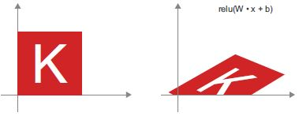
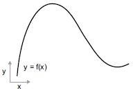

# **2. A neurális hálózatok matematikai építőkövei**

Ez a fejezet ezekkel foglalkozik:
* Első példa a neurális hálózatra
* Tenzorok és tenzorműveletek
* Hogyan tanulnak a neurális hálózatok a visszaterjesztés és a gradiens ereszkedés útján

A mélytanulás megértéséhez sok egyszerű matematikai fogalom ismerete szükséges: tenzorok, tenzorműveletek, differenciálás, gradiens ereszkedés stb. Ebben a fejezetben az lesz a célunk, hogy kiépítsük az intuíciót ezekkel a fogalmakkal kapcsolatban anélkül, hogy túlzottan technikai jellegűvé válnánk. Különösen kerüljük a matematikai jelölést, amely szükségtelen akadályokat állíthat fel azok számára, akik nem rendelkeznek matematikai háttérrel, és nem szükséges jól elmagyarázni a dolgokat. A matematikai műveletek legpontosabb, legegyértelműbb leírása a végrehajtható kód.
Ahhoz, hogy elegendő kontextust biztosítsunk a tenzorok és a gradiens ereszkedés bemutatásához, a fejezetet egy neurális hálózat gyakorlati példájával kezdjük. Ezután minden bevezetett új koncepciót pontról pontra átnézünk. Ne feledje, hogy ezek a fogalmak nélkülözhetetlenek lesznek a következő fejezetekben található gyakorlati példák megértéséhez!

{27.o:}
Miután elolvasta ezt a fejezetet, intuitív módon megérti a mélytanulás mögött meghúzódó matematikai elméletet, és készen áll arra, hogy a 3. fejezetben belemerüljön a Keras és a TensorFlow témakörbe.

## 2.1. Első pillantás egy neurális hálózatra
Nézzünk egy konkrét példát egy neurális hálózatra, amely a Python Keras könyvtárat használja a kézzel írt számjegyek osztályozásának megtanulására. Hacsak nincs már tapasztalata a Keras vagy hasonló könyvtárakkal kapcsolatban, nem fog azonnal mindent megérteni erről az első példáról. Ez rendben van így. A következő fejezetben a példa minden elemét áttekintjük, és részletesen elmagyarázzuk. Tehát ne aggódjon, ha egyes lépések önkényesnek vagy varázslatosnak tűnnek! Valahol el kell kezdenünk.

A probléma, amit itt próbálunk megoldani, az, hogy a kézzel írt számjegyek (28 × 28 pixeles) szürkeárnyalatos képeit a 10 kategóriájukba (0-tól 9-ig) besoroljuk. A gépi tanulási közösség klasszikusának számító MNIST adatkészletet fogjuk használni, amely majdnem olyan régóta létezik, mint maga a terület, és intenzíven tanulmányozták. Ez egy 60 000 képzési képből és 10 000 tesztképből álló készlet, amelyet a National Institute of Standards and Technology (a NIST az MNIST-ben) állított össze az 1980-as években. Az MNIST „megoldását” a mélytanulás „Hello Worldjének” tekintheti – ezzel ellenőrizni tudja, hogy az algoritmusok a várt módon működnek-e. Ahogy gépi tanulással foglalkozó gyakornok lesz, az MNIST újra és újra megjelenik a tudományos közleményekben, blogbejegyzésekben stb. Néhány MNIST mintát láthat a 2.1. ábrán.


**2.1. ábra:** MNIST minta számjegyek

MEGJEGYZÉS

> A gépi tanulásban egy osztályozási probléma kategóriáját osztálynak nevezzük. Az adatpontokat mintáknak nevezzük. Az adott mintához tartozó osztályt címkének nevezzük.

Ne akarja most megpróbálni reprodukálni ezt a példát a gépén. Ha szeretné, először be kell állítania egy mélytanulási munkaterületet, amelyről a 3. fejezetben olvashat.
Az MNIST-adatkészlet a Kerasba előre telepítve, négy NumPy-tömbből álló készlet formájában érkezik.

### 2.1. lista: Az MNIST adatkészlet betöltése Kerasba


```python
from tensorflow.keras.datasets import mnist
(train_images, train_labels), (test_images, test_labels) = mnist.load_data()
```

`train_images` és `train_labels` alkotják a betanítási halmazt, azokat az adatokat, amelyekből a modell tanulni fog. A modell ezután tesztelésre kerül a `test_images` és a `test_labels` tesztkészleten.
{28.o:}
A képek NumPy tömbökként vannak kódolva, a címkék pedig számjegyek 0-tól 9-ig terjedő tömbjei. A képek és a címkék egy az egyben megfelelnek.

Nézzük a képzési adatokat:
```
>>> train_images.shape
(60000, 28, 28)
>>> len(train_labels)
60000
>>> train_labels
array([5, 0, 4, ..., 5, 6, 8], dtype=uint8)
```

És itt vannak a tesztadatok:
```
>>> test_images.shape
(10000, 28, 28)
>>> len(test_labels)
10000
>>> test_labels
array([7, 2, 1, ..., 4, 5, 6], dtype=uint8)
```

A munkafolyamat a következő lesz: Először is betápláljuk a neurális hálózatba a `train_images` és `train_labels` betanítási adatokat. A hálózat ezután megtanulja társítani a képeket és a címkéket. Végül megkérjük a hálózatot, hogy készítsen előrejelzéseket a `test_images` számára, és ellenőrizzük, hogy ezek az előrejelzések egyeznek-e a `test_labels` címkéivel.

Építsük fel a hálózatot – ne feledje, hogy még nem várható el, hogy mindent megértsen ebből a példából.

### 2.2. lista: A hálózati architektúra


```python
from tensorflow import keras
from tensorflow.keras import layers
model = keras.Sequential([
    layers.Dense(512, activation="relu"),
    layers.Dense(10, activation="softmax")
])
```

A neurális hálózatok alapvető építőköve a réteg. A réteget az adatok szűrőjének tekintheti: bizonyos adatok bekerülnek, és hasznosabb formában kerülnek ki. Pontosabban, a rétegek *reprezentációkat* vonnak ki a beléjük betáplált adatokból – remélhetőleg olyan reprezentációkat, amelyek értelmesebbek az adott probléma szempontjából. A mélytanulás nagy része egyszerű rétegek összeláncolásából áll, amelyek a progresszív *adatdesztilláció* egy formáját valósítják meg. A mélytanulási modell olyan, mint az adatfeldolgozás szitája, amely egyre finomabb adatszűrőkből – a rétegekből – áll.

Itt a modellünk két sűrű réteg sorozatából áll, amelyek sűrűn összefüggő (más néven *teljesen összefüggő*) idegi rétegek. A második (és utolsó) réteg egy 10-utas *softmax osztályozási* réteg, ami azt jelenti, hogy 10 valószínűségi pontszámból álló tömböt fog visszaadni (összeadva 1-et). Minden pontszám annak a valószínűsége lesz, hogy az aktuális számjegyű kép a 10 számjegyű osztályunk valamelyikébe tartozik.
{29.o:}

Ahhoz, hogy a modell képzésre kész legyen, további három dolgot kell kiválasztanunk az *összeállítási* lépés részeként:
* *Egy optimalizálót* – Az a mechanizmus, amelyen keresztül a modell frissíti magát a látott betanítási adatok alapján, hogy javítsa a teljesítményét.
* *Egy veszteségfüggvényt* – Hogyan tudja a modell mérni a teljesítményét a betanítási adatokon, és így hogyan tudja majd a megfelelő irányba terelni magát.
* *A képzés és a tesztelés során figyelendő mutatókat* – Itt csak a pontossággal (a helyesen besorolt képek töredékével) foglalkozunk.
A veszteségfüggvény és az optimalizáló pontos célja a következő két fejezetben világossá válik.

### 2.3. lista: Az összeállítás lépése


```python
model.compile(optimizer="rmsprop",
              loss="sparse_categorical_crossentropy",
              metrics=["accuracy"])
```

A képzés előtt az adatokat a modell által elvárt alakra alakítjuk át, és úgy méretezzük, hogy minden érték a `[0, 1]` intervallumban legyen. Korábban a képzési képeinket egy `uint8` típusú alaktömbben `(60000, 28, 28)` tároltuk `[0, 255]` intervallumban. Átalakítjuk egy `float32` alakú tömbbe `(60000, 28 * 28)`, 0 és 1 közötti értékekkel.

### 2.4. lista: A képadatok előkészítése


```python
train_images = train_images.reshape((60000, 28 * 28))
train_images = train_images.astype("float32") / 255
test_images = test_images.reshape((10000, 28 * 28))
test_images = test_images.astype("float32") / 255
```

Most már készen állunk a modell betanítására, ami a Kerasban a modell `fit()` metódusának meghívásával történik – most *illesztjük* a modellt a betanítási adataihoz.

### 2.5. lista: A modell „illesztése”


```python
>>> model.fit(train_images, train_labels, epochs=5, batch_size=128)
Epoch 1/5
60000/60000 [===========================] - 5s - loss: 0.2524 - acc: 0.9273
Epoch 2/5
51328/60000 [=====================>.....] - ETA: 1s - loss: 0.1035 - acc: 0.9692
```

A betanítás során két mennyiség jelenik meg: a modell vesztesége a betanítási adatok felett, és a modell pontossága a betanítási adatok felett. A képzési adatokon gyorsan elérjük a 0,989-es (98,9%-os) pontosságot.

Most, hogy van egy betanított modellünk, felhasználhatjuk új számjegyek osztályvalószínűségének előrejelzésére – olyan képekre, amelyek nem képezték a betanítási adatok részét, például a tesztkészletből. {30.o:}

### 2.6. lista: A modell használata előrejelzések készítéséhez


```python
>>> test_digits = test_images[0:10]
>>> predictions = model.predict(test_digits)
>>> predictions[0]
array([1.0726176e-10, 1.6918376e-10, 6.1314843e-08, 8.4106023e-06,
       2.9967067e-11, 3.0331331e-09, 8.3651971e-14, 9.9999106e-01,
       2.6657624e-08, 3.8127661e-07], dtype=float32)
```

Ebben a tömbben az i indexek minden száma megfelel annak a valószínűségének, hogy a `test_digits[0]` számjegykép az i. osztályba tartozik.

Ennek az első tesztszámjegynek a legmagasabb a valószínűségi pontszáma (0,99999106, majdnem 1) a 7-es indexnél, tehát modellünk szerint 7-nek kell lennie:
```
>>> predictions[0].argmax()
7
>>> predictions[0][7]
0.99999106
```
Ellenőrizni tudjuk, hogy a tesztcímke megegyezik-e:

```
>>> test_labels[0]
7
```
Átlagosan mennyire jó a modellünk az ilyen soha nem látott számjegyek osztályozásában? Ellenőrizzük a teljes tesztkészlet átlagos pontosságának kiszámításával.

### 2.7. lista: A modell kiértékelése új adatokon


```python
>>> test_loss, test_acc = model.evaluate(test_images, test_labels)
>>> print(f"test_acc: {test_acc}")
test_acc: 0.9785
```

A tesztkészlet pontossága 97,8% - ez egy kicsit kisebb, mint a képzési készlet pontossága (98,9%). A képzési pontosság és a tesztpontosság közötti különbség a *túlillesztés* példája: az a tény, hogy a gépi tanulási modellek általában rosszabbul teljesítenek az új adatokon, mint a betanítási adatokon. A túlillesztés a 3. fejezet központi témája.

Ezzel végére is értünk az első példánknak – most láttad, hogyan tudsz felépíteni és betanítani egy neurális hálózatot, hogy a kézzel írt számjegyeket osztályozza, és mindezt kevesebb, mint 15 Python-kódsorban. Ebben és a következő fejezetben részletesen kitérünk minden alkotórészre, amelyet most előre megnéztünk, és tisztázzuk, mi történik a színfalak mögött. Megismerheti a tenzorokat, a modellbe kerülő adattároló objektumokat; tenzorműveleteket, mely rétegekből készülnek; és a gradiens ereszkedést, amely lehetővé teszi, hogy modellje tanuljon a képzési példákból. {31.o:}

## **2.2. Adatábrázolások neurális hálózatokhoz**

Az előző példában többdimenziós NumPy tömbökben, más néven *tenzorokban* tárolt adatokból indultunk ki. Általában minden jelenlegi gépi tanulási rendszer tenzorokat használ alapvető adatszerkezetként. A tenzorok alapvetőek a területen – annyira alapvetőek, hogy a TensorFlow-t róluk nevezték el. Tehát mi a tenzor?
A tenzor lényegében egy adattároló – mégpedig általában numerikus adatok. Tehát ez egy számtároló. Lehet, hogy már ismeri a mátrixokat, amelyek 2. rangú tenzorok: a tenzorok a mátrixok tetszőleges számú *dimenzióra* történő általánosítása (megjegyzendő, hogy a tenzorokkal összefüggésben egy dimenziót gyakran tengelynek neveznek).


### 2.2.1 Skalárok (nulladrendű tenzorok)

A csak egy számot tartalmazó tenzort *skalárnak* (vagy skalártenzornak, vagy nulladrendű tenzornak vagy 0D tenzornak) nevezzük. A NumPy-ban a `float32` vagy `float64` szám skalártenzor (vagy skalártömb). A NumPy tenzor tengelyeinek számát az `ndim` attribútummal tudjuk megjeleníteni; egy skaláris tenzornak 0 tengelye van (`ndim == 0`). A tenzor tengelyeinek számát *rendjének* is nevezik. Íme egy NumPy skalár:
```
>>> import numpy as np
>>> x = np.array(12)
>>> x
array(12)
>>> x.ndim
0
```


### 2.2.2 Vektorok (elsőrendű tenzorok)

A számokból álló tömböt *vektornak*, elsőrendű tenzornak vagy 1D tenzornak nevezzük. Egy elsőrendű tenzornak pontosan egy tengelye van. A következő egy NumPy vektor:
```
>>> x = np.array([12, 3, 6, 14, 7])
>>> x
array([12, 3, 6, 14, 7])
>>> x.ndim
1
```
Ennek a vektornak öt bejegyzése van, ezért *5-dimenziós vektornak* nevezik. Ne keverje össze az 5D vektort az 5D tenzorral! Egy 5D vektornak csak egy tengelye van, és a tengelye mentén öt dimenziója, míg az 5D tenzornak öt tengelye van (és tetszőleges számú dimenziója lehet minden tengely mentén). A *dimenzionalitás* jelölheti vagy egy adott tengely mentén lévő bejegyzések számát (mint az 5D vektorunk esetében), vagy egy tenzor tengelyeinek számát (például egy 5D tenzor), ami időnként zavaró lehet. Ez utóbbi esetben technikailag helyesebb *ötödrendű tenzorról* beszélni (a tenzor rangja a tengelyek száma), de ettől függetlenül gyakori az *5D tenzor* kétértelmű jelölés. {32.o:}

### 2.2.3 Mátrixok (másodrendű tenzorok)

A vektorok tömbje egy *mátrix*, vagy másodrendű tenzor vagy 2D tenzor. A mátrixnak két tengelye van (ezeket gyakran *sornak* és *oszlopnak* nevezik). A mátrixot vizuálisan értelmezheti téglalap alakú számrácsként. Ez egy NumPy mátrix:
```
>>> x = np.array([[5, 78, 2, 34, 0],
                  [6, 79, 3, 35, 1],
                  [7, 80, 4, 36, 2]])
>>> x.ndim
2
```
Az első tengely bejegyzéseit *soroknak*, a második tengely bejegyzéseit *oszlopoknak* nevezzük. Az előző példában `[5, 78, 2, 34, 0]` az x első sora, és az `[5, 6, 7]` az első oszlopa.

### 2.2.4. Harmad- és magasabb rendű tenzorok
Ha az ilyen mátrixokat egy új tömbbe csomagoljuk, akkor egy harmadrendű tenzort (vagy 3D tenzort) kapunk, amelyet vizuálisan számkockaként értelmezhetünk. A következő egy NumPy harmadrendű tenzor:
```
>>> x = np.array([[[5, 78, 2, 34, 0],
                   [6, 79, 3, 35, 1],
                   [7, 80, 4, 36, 2]],
                  [[5, 78, 2, 34, 0],
                   [6, 79, 3, 35, 1],
                   [7, 80, 4, 36, 2]],
                  [[5, 78, 2, 34, 0],
                   [6, 79, 3, 35, 1],
                   [7, 80, 4, 36, 2]]])
>>> x.ndim
3
```
Ha a harmadrendű tenzorokat egy tömbbe csomagolja, létrehozhat egy negyedrendű tenzort, és így tovább. A mélytanulás során általában a 0-tól 4-ig terjedő tenzorokat kell manipulálni, de ez akár 5-ig is felmehet, ha videoadatokat dolgoz fel.

### 2.2.5 Kulcs attribútumok

A tenzort három fő attribútum határozza meg:
* *Tengelyek száma (rend)* – Például egy harmadrendű tenzornak három tengelye van, a mátrixnak pedig két tengelye van. Ezt a Python-könyvtárak, például a NumPy vagy a TensorFlow a tenzor `ndim`-jének is nevezik.
* *Alak* – Ez egy egész szám, amely leírja, hogy a tenzornak hány dimenziója van az egyes tengelyek mentén. Például az előző mátrixpéldának az alakja `(3, 5)`, a harmadrendű tenzoros példának pedig az alakja `(3, 3, 5)`. A vektornak egyetlen elemű alakja van, például `(5,)`, míg a skalárnak az alakja üres, `()`. {33}
* *Adattípus (általában `dtype`-nak nevezik a Python könyvtárakban)* – Ez a tenzorban található adatok típusa; Például egy tenzor típusa lehet `float16, float32, float64, uint8` stb. A TensorFlow-ban valószínűleg találkozhatsz `sztring` tenzorokkal is.

Hogy ezt konkrétabbá tegyük, tekintsünk vissza az MNIST példában feldolgozott adatokra. Először betöltjük az MNIST adatkészletet:
```
from tensorflow.keras.datasets import mnist
(train_images, train_labels), (test_images, test_labels) = mnist.load_data()
```
Ezután megjelenítjük a `train_images` tenzor tengelyeinek számát, az `ndim` attribútumot:
```
>>> train_images.ndim
3
```
Íme az alakja:
```
>>> train_images.shape
(60000, 28, 28)
```
És az adattípusa, a `dtype` attribútum:
```
>>> train_images.dtype
uint8
```
Tehát itt van egy 8 bites egész számokból álló harmadrendű tenzor. Pontosabban, ez egy 60 000 darab 28 × 28 egész számból álló mátrixból felépített tömb. Mindegyik ilyen mátrix egy szürkeárnyalatos kép, 0 és 255 közötti értékű pixelekkel.

Jelenítsük meg a negyedik számjegyet ebben a harmadrendű tenzorban a Matplotlib könyvtár segítségével (ami egy jól ismert Python adatvizualizációs könyvtár, amely előre telepítve van a Colabban); lásd a 2.2 ábrát.


**2.2. ábra:** Adatkészletünk negyedik mintája

**2.8. lista: A negyedik számjegy megjelenítése**


```python
import matplotlib.pyplot as plt
digit = train_images[4]
plt.imshow(digit, cmap=plt.cm.binary)
plt.show()
```

Természetesen a megfelelő címke a 9-es egész szám:
```
>>> train_labels[4]
9
```

### 2.2.6 Tenzorok manipulálása a NumPy-ban

Az előző példában kiválasztottunk egy adott számjegyet az első tengely mellett a `train_images[i]` szintaxis használatával. A tenzorban meghatározott elemek kiválasztását *tenzorszeletelésnek* nevezzük.
Nézzük meg a tenzorszeletelési műveleteket, amelyeket a NumPy tömbökön végezhet.
A következő példa a #10-től #100-ig terjedő számjegyeket választja ki (a #100 nem szerepel), és egy `(90, 28, 28)` alakú tömbbe helyezi őket :
```
>>> my_slice = train_images[10:100]
>>> my_slice.shape
(90, 28, 28)
```
Ez egyenértékű ezzel a részletesebb jelöléssel, amely minden tenzortengely mentén meghatároz egy kezdő- és egy végindexet a szelethez. Vegye figyelembe, hogy a `:` egyenértékű a teljes tengely kiválasztásával:
```
>>> my_slice = train_images[10:100, :, :]  <--- Egyenértékű az előző példával
>>> my_slice.shape
(90, 28, 28)
>>> my_slice = train_images[10:100, 0:28, 0:28] <---Szintén egyenértékű az  
                                                    előző példával
>>> my_slice.shape
(90, 28, 28)
```
Általában az egyes tenzortengelyek mentén tetszőleges két index közül választhat szeleteket. Ha például az összes kép jobb alsó sarkában 14 × 14 képpontot szeretne kiválasztani, tegye a következőket:
```
my_slice = train_images[:, 14:, 14:]
```
Lehetőség van negatív indexek használatára is. Hasonlóan a Python-listák negatív indexeihez, az aktuális tengely végéhez viszonyított pozíciót jelzik. Ha a képeket középen 14 × 14 képpontos foltokra szeretné levágni, tegye a következőket:
```
my_slice = train_images[:, 7:-7, 7:-7]
```

### 2.2.7 Az adatkötegek fogalma

{35.o:} Általánosságban elmondható, hogy az első tengely (0-s tengely, mert az indexelés 0-tól kezdődik) a mélytanulás során használt összes adattenzorban a *mintatengely* lesz (ezt néha *minta-dimenziónak* is nevezik). Az MNIST példában a „minták” számjegyek képei.

Ezenkívül a mélytanulási modellek nem dolgoznak fel egyszerre egy teljes adatkészletet; hanem kis kötegekre bontják az adatokat. Konkrétan, íme egy köteg MNIST számjegyeinkből, 128-as kötegmérettel:
```
batch = train_images[:128]
```
És itt a következő adag:
```
batch = train_images[128:256]
```
És az *n*-edik adag:
```
n = 3
batch = train_images[128 * n:128 * (n + 1)]
```
Ha ilyen kötegtenzorra gondolunk, akkor az első tengelyt (0. tengely) *kötegtengelynek* vagy *kötegdimenziónak* nevezzük. Ez egy olyan kifejezés, amellyel gyakran találkozik a Keras és más mélytanulási könyvtárak használatakor.

### 2.2.8 Valós példák adattenzorokra

Tegyük konkrétabbá az adattenzorokat néhány példával, amelyek hasonlóak ahhoz, amivel később találkozni fog. A kezelni kívánt adatok szinte mindig a következő kategóriák valamelyikébe tartoznak:
* *Vektor adatok* – másodrendű tenzorok `(minták, jellemzők)` alakban, ahol minden minta numerikus attribútumok („jellemzők”) vektora
* *Idősor adatok vagy szekvencia adatok* – harmaddendű tenzorok `(minták, időlépések, jellemzők)` alakban, ahol minden minta jellemzővektorok (`időlépés` hosszúságú) sorozata
* *Képek* – negyedrendű tenzorok `(minták, magasság, szélesség, csatornák)` alakban, ahol minden minta pixelekből álló 2D rács, és minden pixelt egy értékvektor („csatornák”) képvisel.
* *Videó* – ötödrendű tenzorok `(minták, keretek, magasság, szélesség, csatornák)` alakban, ahol minden minta képek (képkocka periódusú) sorozata

### 2.2.9 Vektor adatok

Ez az egyik leggyakoribb eset. Egy ilyen adatkészletben minden egyes adatpont vektorként kódolható, és így egy adatköteg másodrendű tenzorként (vagyis vektortömbként) lesz kódolva, ahol az első tengely a *minta tengelye* és a második tengely a *jellemzők tengelye*. {36.o:}

Nézzünk két példát:
* Emberek biztosítás-matematikai adatkészlete, ahol figyelembe vesszük az egyes személyek korát, nemét és jövedelmét. Minden személy 3 értékből álló vektorként jellemezhető, és így egy teljes, 100 000 emberből álló adathalmaz tárolható egy másodrendű `(100000, 3)` méretű tenzorban.
* Szöveges dokumentumok adathalmaza, ahol az egyes dokumentumokat azzal ábrázoljuk, hogy az egyes szavak hányszor szerepelnek benne (egy 20 000 gyakori szót tartalmazó szótárból). Minden dokumentum 20000 értékből álló vektorként kódolható (a szótárban szavanként egy szám), és így egy 500 dokumentumból álló teljes adatkészlet tárolható egy (500, 20000) méretű tenzorban.

### 2.2.10 Idősor adatok vagy sorrendi adatok

Amikor az idő számít az adatokban (az időrendi sorrend értelmében), akkor célszerű egy explicit időtengellyel rendelkező harmadrendű tenzorban tárolni. Minden minta vektorok sorozataként (másodrendű tenzorként) kódolható, és így egy köteg adatot harmadrendű tenzorként kódolunk (lásd a 2.3. ábrát).


**2.3. ábra** Egy harmadrendű idősor adattenzor

Az időtengely megegyezés szerint mindig a második tengely (az 1-es index tengelye). Nézzünk néhány példát:
* A részvényárfolyamok adatkészlete. Percenként tároljuk a részvény aktuális árfolyamát, az elmúlt perc legnagyobb árfolyamát és az elmúlt perc legkisebb árát. Így minden perc 3D-s vektorként, egy egész kereskedési nap `(390, 3)` méretű mátrixként van kódolva (egy kereskedési napon 390 perc van), és 250 napnyi adat tárolható egy harmadrendű `(250, 390, 3)` méretű tenzorban. Itt minden minta egy nap adata lenne.
* A tweetek adatkészlete, ahol minden egyes tweetet 280 karakterből álló sorozatként kódolunk a 128 egyedi karakterből álló ábécéből. Ebben a beállításban minden karakter 128-as méretű bináris vektorként kódolható (csupa nulla vektor, kivéve a karakternek megfelelő indexnél egy 1-es bejegyzést). Ezután minden tweet kódolható másodrendű `(280, 128)` méretű tenzorként, és egy 1 millió tweetből álló adatkészlet tárolható egy `(1000000, 280, 128)` méretű tenzorban.

### 2.2.11 Képadatok

A képek általában három dimenzióval rendelkeznek: magasság, szélesség és színmélység. Bár a szürkeárnyalatos képeknek (mint az MNIST számjegyeink) csak egyetlen színcsatornájuk van, és így másodrendű tenzorokban tárolhatók, a képtenzorok a megegyezés szerint mindig harmadrendűek, a szürkeárnyalatos képekhez egydimenziós színcsatornával. Így egy 128 db 256 × 256 méretű szürkeárnyalatos képből álló köteg egy `(128, 256, 256, 1)` méretű tenzorban, egy 128 színes képből álló köteg pedig egy `(128, 256, 256, 3)` tenzorban tárolható (lásd a 2.4. ábrát).


**2.4. ábra:** Negyedrendű képadattenzor

Két konvenció létezik a képtenzorok alakjára: a *channels-last* konvenció (amely a TensorFlow-ban szabványos) és a *channels-first* konvenció (amely egyre inkább kegyvesztett).
A channels-last konvenció a színmélység tengelyt a végére helyezi: `(minták, magasság, szélesség, színmélység)`. Eközben a channels-first konvenció a színmélység tengelyét közvetlenül a kötegtengely után helyezi el: `(minták, színmélység, magasság, szélesség)`. A channels-first konvencióval az előző példák `(128, 1, 256, 256)` és `(128, 3, 256, 256)` lesznek. A Keras API mindkét formátumot támogatja.

### 2.2.12 Videó adatok

A videoadatok azon kevés valós-életbeli adattípusok egyike, amelyekhez ötödrendű tenzorokra lesz szükség. A videó felfogható képkockák sorozataként, amelyek mindegyike színes kép. Mivel minden képkocka tárolható harmadrendű tenzorban `(magasság, szélesség, színmélység)`, a képkockák sorozata egy negyedrendű tenzorban tárolható `(képkockák, magasság, szélesség, színmélység)`, és így egy köteg különböző videó ötödrendű tenzorban tárolható `(minták, képkockák, magasság, szélesség, színmélység)`.

Például egy 60 másodperces, 144 × 256 méretű YouTube-videó, amelyet másodpercenként 4 képkocka sebességgel vettek fel, 240 képkockát tartalmazna. Négy ilyen videoklipből álló köteg egy (4, 240, 144, 256, 3) méretű tenzorban kerül tárolásra. Ez összesen 106 168 320 érték! Ha a tenzor `dtype` értéke `float32`, akkor minden érték 32 biten lenne tárolva, így a tenzor 405 MB-ot jelentene. Súlyos! A valós életben talált videók sokkal könnyebbek, mert nem `float32`-ben tárolódnak, és általában nagy tényezővel tömörítik őket (például MPEG formátumban).

## 2.3 A neurális hálózatok fogaskerekei: Tenzorműveletek

Ahogyan bármely számítógépes program végső soron bináris bemeneteken végrehajtott bináris műveletek kis halmazára redukálható (ÉS, VAGY, NOR és így tovább), a mély neurális hálózatok által megtanult összes transzformáció egy maroknyi *tenzorműveletre* (vagy *tenzor függvényre*) redukálható, amiket numerikus adatok tenzoraira alkalmazunk. Például lehetőség van tenzorok összeadására, tenzorok szorzására és így tovább.

Kezdeti példánkban a modellünket úgy építettük fel, hogy `Dense` (sűrű) rétegeket raktunk egymásra. A Keras réteg példánya így néz ki:
```
keras.layers.Dense(512, activation="relu")
```
Ez a réteg függvényként értelmezhető, amely bemenetként egy mátrixot vesz, és egy másik mátrixot ad vissza – a bemeneti tenzor új reprezentációját. Pontosabban, a függvény a következő (ahol W egy mátrix és b egy vektor, mindkét réteg attribútuma):
```
output = relu(dot(input, W) + b)
```
Csomagoljuk ki ezt. Itt három tenzorműveletünk van:
* Pontszorzat (`dot`) a bemeneti tenzor és a W nevű tenzor között
* Összeadás (+) a kapott mátrix és egy b vektor között
* Egy `relu` művelet: `relu(x)` az `max(x, 0)`; A „relu” a „rektifikált lineáris egység” rövidítése.

MEGJEGYZÉS

> Bár ez a rész teljes egészében a lineáris algebrai kifejezésekkel foglalkozik, itt nem talál matematikai jelöléseket. Azt tapasztaltam, hogy a matematikai fogalmakat könnyebben el tudják sajátítani a matematikai háttérrel nem rendelkező programozók, ha matematikai egyenletek helyett rövid Python-részletként fejezik ki őket. Tehát mindvégig a NumPy és a TensorFlow kódot fogjuk használni.

### 2.3.1 Elemenkénti műveletek

A `relu` művelet és az összeadás elemenkénti műveletek: olyan műveletek, amelyek függetlenül kerülnek alkalmazásra a vizsgált tenzorok minden egyes bejegyzésére. Ez azt jelenti, hogy ezek a műveletek nagymértékben alkalmasak masszívan párhuzamos megvalósításokra (*vektorizált* implementációk, ez a kifejezés az 1970–90-es időszak *vektorprocesszoros* szuperszámítógép-architektúrájából származik). Ha naiv Python-megvalósítást szeretne írni egy elemenkénti művelethez, akkor `for` ciklust használjon, mint az elemenkénti `relu` művelet naiv megvalósításában:


```python
def naive_relu(x):
    assert len(x.shape) == 2      #<--- x egy másodrendű NumPy tenzor.
    x = x.copy()                  #<--- Kerüljük a bemeneti tenzor felülírását.
    for i in range(x.shape[0]):
        for j in range(x.shape[1]):
            x[i, j] = max(x[i, j], 0)
    return x
```

Ugyanezt megteheti az összeadáshoz:


```python
def naive_add(x, y):
    assert len(x.shape) == 2      #<--- x és y másodrendű NumPy tenzor.
    assert x.shape == y.shape
    x = x.copy()                  #<--- Kerüljük a bemeneti tenzor felülírását.
    for i in range(x.shape[0]):
        for j in range(x.shape[1]):
            x[i, j] += y[i, j]
    return x
```

Ugyanezen az elven elvégezheti az elemenkénti szorzást, kivonást és így tovább.
A gyakorlatban a NumPy tömbök kezelésekor ezek a műveletek jól optimalizált beépített NumPy függvényekként érhetők el, amelyek maguk delegálják a nehéz terheket egy Basic Linear Algebra Subprograms (BLAS) megvalósításra. A BLAS alacsony szintű, nagyon párhuzamos, hatékony tenzormanipulációs rutinok, amelyeket jellemzően Fortran vagy C nyelven valósítanak meg.
Tehát a NumPy-ben képes elvégezni a következő elemenkénti műveletet, és gyorsan fog működni:


```python
import numpy as np
z = x + y               #<--- elemszintű összeadás
z = np.maximum(z, 0.)   #<--- elemszintű relu
```

Állapítsuk meg a tényleges időkülönbséget:


```python
import time

x = np.random.random((20, 100))
y = np.random.random((20, 100))

t0 = time.time()
for _ in range(1000):
    z = x + y
    z = np.maximum(z, 0.)
print("Took: {0:.2f} s".format(time.time() - t0))
```

Ez csak 0,02 másodpercet vesz igénybe. Miközben a naiv verzió meglepő 2,45 másodpercet kíván:


```python
t0 = time.time()
for _ in range(1000):
    z = naive_add(x, y)
    z = naive_relu(z)
print("Took: {0:.2f} s".format(time.time() - t0))
```

Hasonlóképpen, ha TensorFlow kódot futtat egy GPU-n, az elemenkénti műveletek végrehajtása teljesen vektorizált CUDA-megvalósításokon keresztül történik, amelyek a legjobban tudják kihasználni a rendkívül párhuzamos GPU-chip architektúrát:

### 2.3.2 Kiterjesztés (broadcasting)

A `naive_add` korábbi naiv megvalósítása csak az azonos alakú másodrendű tenzorok összeadását támogatja. De a korábban bemutatott `Dense` rétegben összeadtunk egy másodrendű tenzort egy vektorral. Mi történik az összeadással, ha a két összeadandó tenzor alakja különbözik?

Ha lehetséges, és ha nincs kétértelműség, a kisebb tenzort kiterjesztik, hogy megfeleljen a nagyobb tenzor alakjának. A kiterjesztés két lépésből áll:
1. Tengelyek (úgynevezett *broadcast tengelyek*) adódnak hozzá a kisebb tenzorhoz, hogy megfeleljenek a nagyobb tenzor `ndim`-jének.
2. A kisebb tenzor megismétlődik ezen új tengelyek mentén, hogy megfeleljen a nagyobb tenzor teljes alakjának.

Nézzünk egy konkrét példát. Tekintsük a `(32, 10)` méretű `X`-et és a `(10,)` méretű `y`-t:


```python
import numpy as np
X = np.random.random((32, 10))  #<--- X egy (32, 10) méretű véletlenszerű mátrix.
y = np.random.random((10,))     #<--- y egy (10,) méretű véletlenszerű vektor.
```

Először egy üres első tengelyt adunk az `y`-hoz, amelynek mérete így `(1, 10)`-re változik:


```python
y = np.expand_dims(y, axis=0)   #<--- Az y mérete most (1, 10).
```

Ezután `y`-t 32-szer megismételjük az új tengely mentén, így a `(32, 10)` méretű `Y` tenzort kapjuk, ahol `Y[i, :] == y for i in range(0, 32)`:


```python
Y = np.concatenate([y] * 32, axis=0)    #<--- Megismételjük az y-t 32-szer a 0 tengely mentén,
                                        #     hogy megkapjuk Y-t, amelynek mérete (32, 10).
```

Ezen a ponton folytathatjuk az X és Y összeadását, mert azonos alakúak.

A megvalósítás szempontjából nem jön létre új másodrendű tenzor, mert az rettenetesen pazarló lenne. Az ismétlési művelet teljesen virtuális: algoritmikus szinten történik, nem pedig memória szinten. De ha azt gondoljuk, hogy a vektor 10-szer ismétlődik egy új tengely mellett, az hasznos mentális modell. Így nézne ki egy naiv megvalósítás:


```python
def naive_add_matrix_and_vector(x, y):
    assert len(x.shape) == 2            #<--- x egy másodrendű NumPy tenzor.
    assert len(y.shape) == 1            #<--- y egy NumPy vektor.
    assert x.shape[1] == y.shape[0]
    x = x.copy()                        #<--- Kerüljük a bemeneti tenzor felülírását.
    for i in range(x.shape[0]):
        for j in range(x.shape[1]):
            x[i, j] += y[j]
    return x
```

A kiterjesztéssel általában elemenkénti műveletek hajthatók végre, amelyek két bemeneti tenzort vesznek át, ha az egyik tenzor mérete `(a, b, … n, n + 1, … m)`, és a másik mérete pedig `(n, n + 1, … m)`. A kiterjesztés ezután automatikusan megtörténik az `a`-tól `n-1` tengelyeken.

A következő példa az elemenkénti `maximum` műveletet két különböző alakú/méretű tenzorra alkalmazza kiterjesztésen/sugárzáson keresztül:


```python
import numpy as np
x = np.random.random((64, 3, 32, 10))   #<--- x egy véletlenszerű tenzor, amelynek mérete (64, 3, 32, 10).
y = np.random.random((32, 10))          #<--- x egy véletlenszerű tenzor, amelynek mérete (32, 10).
z = np.maximum(x, y)                    #<--- A z kimenet mérete (64, 3, 32, 10), mint az x-é.
```

### 2.3.3 Tenzor szorzat

A *tenzorszorzat* vagy *pontszorzat* (nem tévesztendő össze az elemi szorzattal, a * operátorral) az egyik leggyakoribb, leghasznosabb tenzorművelet.

A NumPy-ban a tenzorszorzat az `np.dot` függvény segítségével történik (mivel a tenzorszorzat matematikai jelölése általában pont):


```python
x = np.random.random((32,))
y = np.random.random((32,))
z = np.dot(x, y)
```

A matematikai felírásban a műveletet egy ponttal (•) jelöljük:
```
z = x • y
```

Matematikailag mit csinál a pontművelet? Kezdjük két vektor, x és y pontszorzatával. A következőképpen kerül kiszámításra:


```python
def naive_vector_dot(x, y):
    assert len(x.shape) == 1    #<--- x és y NumPy vektor
    assert len(y.shape) == 1    #
    assert x.shape[0] == y.shape[0]
    z = 0.
    for i in range(x.shape[0]):
        z += x[i] * y[i]
    return z
```

Biztosan észrevette, hogy a két vektor közötti pontszorzat skalár, és csak az azonos elemszámú vektorok kompatibilisek a pontszorzattal.

Használhatja az x mátrix és egy y vektor közötti pontszorzatot is, amely egy olyan vektort ad vissza, ahol az együtthatók az y és az x sorai közötti pontszorzatok. A következőképpen valósíthatjuk meg: {42.o:}


```python
def naive_matrix_vector_dot(x, y):
    assert len(x.shape) == 2          #<--- x egy NumPy mátrix
    assert len(y.shape) == 1          #<--- y wgy NumPy vektor
    assert x.shape[1] == y.shape[0]   #<--- x első dimenziójának meg kell egyeznie y 0. dimenziójával!
    z = np.zeros(x.shape[0])          #<--- Ez a művelet egy nullvektort ad vissza, amelynek mérete megegyezik y-éval.
    for i in range(x.shape[0]):
        for j in range(x.shape[1]):
            z[i] += x[i, j] * y[j]
    return z
```

Használhatja megint azt a korábban írt kódot, amely kiemeli a mátrix-vektor-szorzat és a vektor-szorzat közötti kapcsolatot:


```python
def naive_matrix_vector_dot(x, y):
    z = np.zeros(x.shape[0])
    for i in range(x.shape[0]):
        z[i] = naive_vector_dot(x[i, :], y)
    return z
```

Jegyezze meg, hogy amint a két tenzor egyikének `ndim`-je nagyobb, mint 1, akkor a `dot` többé nem *szimmetrikus*, vagyis a `dot(x, y)` nem ugyanaz, mint a `dot(y, x)`.

Természetesen a pontszorzat tetszőleges számú tengellyel rendelkező tenzorokra általánosít. A leggyakoribb alkalmazás a két mátrix közötti pontszorzat lehet. Az `x` és `y` mátrix (`dot(x, y`)) pontszorzatát akkor és csak akkor képezhetjük, ha `x.shape[1] == y.shape[0]`. Az eredmény egy `(x.shape[0], y.shape[1])` alakú mátrix , ahol az együtthatók az `x` sorai és az `y` oszlopai közötti vektorszorzatok. Íme a naiv megvalósítás:


```python
def naive_matrix_dot(x, y):
    assert len(x.shape) == 2                #<--- x és y NumPy mátrixok.
    assert len(y.shape) == 2                #
    assert x.shape[1] == y.shape[0]         #<--- x első dimenziójának meg kell egyeznie y 0. dimenziójával!
    z = np.zeros((x.shape[0], y.shape[1]))  #<--- Ez a művelet egy meghatározott alakú nullmátrixot ad vissza.
    for i in range(x.shape[0]):             #<--- Az x sorai felett iterálunk...
        for j in range(y.shape[1]):         #<--- ... és y oszlopai fölött is.
            row_x = x[i, :]
            column_y = y[:, j]
            z[i, j] = naive_vector_dot(row_x, column_y)
    return z
```

A pontszorzat alak-kompatibilitásának megértésében segít a bemeneti és kimeneti tenzorok 2.5. ábrán látható módon csatlakoztatott megjelenítése.

Az ábrán x, y és z értékét téglalapként (szó szerint együttható-dobozokként) ábrázoltuk. Mivel x sorainak és y oszlopainak azonos méretűnek kell lenniük, ebből az következik, hogy x szélességének meg kell egyeznie y magasságával. Ha új gépi tanulási algoritmusokat fejleszt, valószínűleg gyakran fog ilyen diagramokat rajzolni.


**2.5. ábra:** Mátrix pontszorzat dobozdiagram

Általánosságban elmondható, hogy pontszorzatot a több-dimenziós tenzorok között kaphat, ugyanazokat az alakkompatibilitási szabályokat követve, mint a 2D esetnél korábban vázoltuk:
```
(a, b, c, d) • (d,) → (a, b, c)
(a, b, c, d) • (d, e) → (a, b, c, e)
```
És így tovább.

### 2.3.4 Tenzor átalakítás (reshape)

A tenzorműveletek harmadik típusa, amely a megértéshez elengedhetetlen, a *tenzor átalakítás*. Bár az első neurális hálózati példánkban nem használtuk a `Dense` rétegekben, akkor használtuk, amikor előfeldolgoztuk a számadatokat, mielőtt betápláltuk volna őket a modellünkbe:


```python
train_images = train_images.reshape((60000, 28 * 28))
```

A tenzor átformálása azt jelenti, hogy sorait és oszlopait átrendezzük, hogy megfeleljenek a célalakzatnak. Természetesen az átformált tenzornak ugyanannyi együtthatója van, mint a kezdeti tenzornak. Az átformálást legjobban egyszerű példákon keresztül érthetjük meg:
```
>>> x = np.array([[0., 1.],
                  [2., 3.],
                  [4., 5.]])
>>> x.shape
(3, 2)
>>> x = x.reshape((6, 1))
>>> x
array([[ 0.],
       [ 1.],
       [ 2.],
       [ 3.],
       [ 4.],
       [ 5.]])
>>> x = x.reshape((2, 3))
>>> x
array([[ 0., 1., 2.],
       [ 3., 4., 5.]])
```

Az átalakítás speciális esete, amellyel gyakran találkozunk, a *transzponálás*. Egy mátrix transzponálása azt jelenti, hogy felcseréljük sorait és oszlopait, így `x[i, :]`-ből `x[:, i]` lesz:
```
>>> x = np.zeros((300, 20))   #<--- Létrehoz egy (300, 20) alakú nullmátrixot.
>>> x = np.transpose(x)
>>> x.shape
(20, 300)
```

### 2.3.5 Tenzorműveletek geometriai értelmezése

Mivel a tenzorműveletekkel manipulált tenzorok tartalma valamilyen geometriai térben lévő pontok koordinátáiként értelmezhető, minden tenzorműveletnek van geometriai értelmezése. Vegyük például az összeadást. Kezdjük a következő vektorral:
```
A = [0.5, 1]
```
Ez egy pont egy 2D-s térben (lásd a 2.6. ábrát). Gyakori, hogy egy vektort nyílként ábrázolnak, amely összeköti az origót a ponttal, amint az a 2.7. ábrán látható.


**2.6. ábra:** Egy pont a 2D-s térben


**2.7. ábra:** Egy pont a 2D-s térben nyílként ábrázolva

Tekintsünk egy új pontot, `B = [1, 0.25]`, amelyet hozzáadunk az előzőhöz. Ez geometriailag a vektornyilak láncolásával történik, ahol a kapott hely az előző két vektor összegét reprezentáló vektor (lásd a 2.8. ábrát). Amint látható, a B vektor hozzáadása az A vektorhoz azt jelenti, hogy az A pont egy új helyre másolódik, amelynek távolságát és irányát az eredeti A ponttól a B vektor határozza meg. Ha ugyanazt a vektorösszeadást alkalmazzuk egy pontcsoportra (egy „objektum”-ra) a síkban, akkor a teljes objektum másolatát készítenénk el egy új helyen (lásd a 2.9. ábrát). A tenzorösszeadás tehát azt a műveletet jelenti, amikor egy *objektumot* egy bizonyos mértékben egy bizonyos irányba *eltolnak* (az objektumot torzítás nélkül mozgatják).


**2.8. ábra:** Két vektor összegének geometriai értelmezése


**2.9. ábra:** 2D eltolás vektorösszeadásként

Általánosságban elmondható, hogy az olyan elemi geometriai műveletek, mint az eltolás, elforgatás, átméretezés, döntés stb., tenzorműveletekként fejezhetők ki. Íme néhány példa:
* *Eltolás:* Ahogy az imént látta, egy vektor hozzáadása egy ponthoz fix mértékben elmozdítja a pontot egy rögzített irányba. Egy ponthalmazra (például egy 2D objektumra) alkalmazva ezt „transzlációnak” nevezik (lásd a 2.9. ábrát).
* *Elfordítás:* Egy 2D vektor óramutató járásával ellentétes irányú elforgatása théta szöggel (lásd a 2.10. ábrát) 2 × 2 mátrixú pontszorzattal érhető el `R = [[cos(theta), -sin(theta)], [sin (theta), cos(theta)]]`. {46.o:}


**2.10. ábra:** 2D forgatás (az óramutató járásával ellentétes irányba) pontszorzatként

* *Átméretezés:* A kép függőleges és vízszintes méretezése (lásd a 2.11. ábrát) 2 × 2 mátrixú pontszorzattal érhető el `S = [[horizontal_factor, 0], [0, vertical_factor]]` (megjegyezzük, hogy az ilyen mátrixot „átlós mátrixnak / diagonális mátrixnak" nevezik, mert csak nem nulla együtthatókat tartalmaz a „főátlójában”, a bal felsőtől a jobb alsó felé haladva).


**2.11. ábra:** 2D átméretezés pontszorzatként

* *Lineáris transzformáció:* Egy tetszőleges mátrixú pontszorzat lineáris transzformációt valósít meg. Vegye figyelembe, hogy a korábban felsorolt méretezés és elforgatás is definíció szerint lineáris transzformáció.
* *Affin transzformáció:* Az affin transzformáció (lásd a 2.12. ábrát) a lineáris transzformáció (amely egy mátrixos pontszorzattal érhető el) és az eltolás (vektorösszeadással érhető el) kombinációja. Amint azt valószínűleg felismerte, pontosan ez az `y = W • x + b` számítás, amelyet a `Dense` réteg valósított meg! Az aktiválási függvény nélküli sűrű réteg affin réteg.


**2.12 ábra:** Affin transzformáció a síkban

* *`Dense` (sűrű) réteg `relu` aktiválással:* Egy fontos megfigyelés az affin transzformációkkal kapcsolatban, hogy ha sokat alkalmazunk közülük ismételten, akkor is affin transzformációhoz jutunk (tehát eleve ezt az egy affin transzformációt alkalmazhattuk volna). Próbáljuk meg kettővel: `affin2(affin1(x)) = W2 • (W1 • x + b1) + b2 = (W2 • W1) • x + (W2 • b1 + b2)`. Ez egy affin transzformáció, ahol a lineáris rész a `W2 • W1` mátrix, a transzlációs rész pedig a `W2 • b1 + b2` vektor. Következésképpen egy többrétegű neurális hálózat, amely teljes egészében `Dense` rétegekből épül fel, aktiválások nélkül, egyenértékű egyetlen `Dense` réteggel. Ez a „mély” neurális hálózat csak egy álcázott lineáris modell lenne! Ezért van szükségünk olyan aktiváló függvényekre, mint a `relu` (működésben látható a 2.13. ábrán). Az aktiválási függvényeknek köszönhetően a `Dense` rétegek láncolata nagyon összetett, nem lineáris geometriai transzformációk megvalósítására késztethető, ami nagyon gazdag hipotézisteret eredményez a mély neurális hálózatok számára. Ezzel az ötlettel a következő fejezetben részletesebben foglalkozunk.



**2.13 ábra:** Affin transzformáció, majd `relu` aktiválás

### 2.3.6 A mélytanulás geometriai értelmezése

Most tanulta meg, hogy a neurális hálózatok teljes egészében tenzorműveletek láncaiból állnak, és hogy ezek a tenzorműveletek a bemeneti adatok egyszerű geometriai transzformációi. Ebből az következik, hogy a neurális hálózatot egy nagyon összetett geometriai transzformációként értelmezheti egy nagy dimenziós térben, amelyet egyszerű lépések sorozatával valósítanak meg.

3D-ben a következő mentális kép hasznos lehet. Képzeljen el két színes papírlapot: egy pirosat és egy kéket. Tegye egyiket a másikra. Most gyűrje össze őket egy kis golyóvá. Ez a gyűrött papírgolyó a bemeneti adat, és minden papírlap egy osztályozási probléma adatosztálya. Egy neurális hálózatnak az a célja, hogy kitalálja a papírgömb transzformációját, amely szétszedi, így a két osztály ismét tisztán elválaszthatóvá válik (lásd a 2.14. ábrát). A mélytanulással ez a 3D-s tér egyszerű átalakításainak sorozataként valósulna meg, például azokkal, amelyeket ujjaival, egy-egy mozdulattal tudna alkalmazni a papírgolyóra.


**2.14. ábra:** Bonyolult adathalmaz kibontása

A papírgolyók kibontása a gépi tanulás lényege: az összetett, erősen hajtogatott *adatelosztók* ügyes reprezentációinak megtalálása nagy dimenziójú terekben (az elosztó egy folytonos felület, akárcsak a mi gyűrött papírlapunk). Ezen a ponton elég jó intuícióval kell rendelkezned, hogy miért jeleskedik ebben a mélytanulás: ez azt a megközelítést követi, hogy egy bonyolult geometriai transzformációt fokozatosan lebontanak elemiek hosszú láncára, ami nagyjából az a stratégia, amelyet az ember követne a papírgolyó kibontására. A mélyhálózat minden rétege olyan transzformációt alkalmaz, amely egy kicsit szétválasztja az adatokat, és a rétegek mély verme rendkívül bonyolult szétválasztási folyamatot tesz lehetővé. {48.o:}

## 2.4 A neurális hálózatok motorja: Gradiens alapú optimalizálás

Ahogy az előző részben láthatta, az első modellpéldánkból származó minden egyes neurális réteg a következőképpen alakítja át bemeneti adatait:
```
output = relu(dot(input, W) + b)
```
Ebben a kifejezésben W és b tenzorok, amelyek a réteg attribútumai. Ezeket a réteg *súlyainak* vagy *betanítható paramétereinek* (a `kernel` és a `bias` 'torzítás' attribútumainak) nevezik. Ezek a súlyok azokat az információkat tartalmazzák, amelyeket a modell a képzési adatok expozíciójából tanul meg.

Kezdetben ezek a súlymátrixok kis véletlenszerű értékekkel vannak feltöltve (ezt a lépést *véletlenszerű inicializálásnak* nevezik). Természetesen nincs okunk arra számítani, hogy a `relu(dot(input, W) + b)`, amikor `W` és `b` véletlenszerű, bármilyen hasznos reprezentációt ad. Az eredményül kapott reprezentációk értelmetlenek – de kiindulópontot jelentenek. A következő lépés a súlyok fokozatos, visszacsatolási jel alapján történő módosítása. Ez a fokozatos alkalmazkodás, amelyet *képzésnek* is neveznek, az a tanulás, amelyről az egész gépi tanulás szól.

Ez az úgynevezett *képzési hurkon* belül történik, amely a következőképpen működik. Ismételje meg ezeket a lépéseket egy hurokban, amíg a veszteség kellően kevésnek tűnik:

1. Rajzoljon egy köteget tanítási mintákból, x és a megfelelő célokból, `y_true`.
2. Futtassa a modellt x-en (ez a lépés, amelyet *előrelépésnek* neveznek), hogy megkapja az `y_pred` előrejelzéseket.
3. Számítsa ki a modell veszteségét a kötegben, az `y_pred` és az `y_true` közötti eltérés mértékét.
4. Frissítse a modell összes súlyát oly módon, hogy kissé csökkentse a tétel veszteségét.

Végül egy olyan modellt kap, amely nagyon alacsony veszteséggel rendelkezik a képzési adatokban: alacsony az eltérés az előrejelzések (`y_pred`) és a várható célok (`y_true`) között. A modell „megtanulta” bemeneteit a helyes célokra leképezni. Messziről varázslatnak tűnhet, de ha elemi lépésekre redukáljuk, egyszerűnek bizonyul.

Az 1. lépés elég egyszerűnek hangzik – csak I/O kód. A 2. és 3. lépés csupán néhány tenzorművelet alkalmazása, így ezeket a lépéseket pusztán az előző részben tanultak alapján hajthatja végre. A nehéz rész a 4. lépés: a modell súlyainak frissítése. A modellben szereplő egyéni súlyegyüttható alapján hogyan lehet kiszámítani, hogy az együtthatót növelni vagy csökkenteni kell-e, és mennyivel?

Az egyik naiv megoldás az lenne, ha a modellben az összes súlyt rögzítenénk, kivéve az egy skaláris együtthatót, és ennek az együtthatónak különböző értékekkel próbálkoznánk. Tegyük fel, hogy az együttható kezdeti értéke 0,3. Egy adatköteg továbbadása után a köteg modelljének vesztesége 0,5. Ha az együttható értékét 0,35-re változtatja, és megismétli az előrelépést, a veszteség 0,6-ra nő. De ha az együtthatót 0,25-re csökkenti, a veszteség 0,4-re csökken. Ebben az esetben úgy tűnik, hogy az együttható –0,05-tel történő frissítése hozzájárulna a veszteség minimalizálásához. Ezt meg kell ismételni a modell összes együtthatójára.

De egy ilyen megközelítés rettenetesen hatástalan lenne, mert minden egyes együtthatóhoz (amelyből sok van, általában több ezer, néha akár millió is) két előrepasszt (amelyek költségesek) kellene kiszámítani. Szerencsére van egy sokkal jobb megközelítés: a *gradiens ereszkedés*.

A gradiens ereszkedés az az optimalizálási technika, amely a modern neurális hálózatokat működteti. Íme a lényeg. A modelljeinkben használt összes függvény (mint például a `dot` vagy a `+`) simán és folytonosan átalakítja a bemenetét: ha például `z = x + y`-t nézzük, y-ben egy kis változás csak kis változást eredményez z-ben, és ha ismeri y változásának irányát, akkor következtetni tud z változásának irányára. Matematikailag azt mondanád, hogy ezek a függvények *differenciálhatók*. Ha összeláncolja az ilyen függvényeket, a kapott nagyobb függvény továbbra is differenciálható. Ez különösen vonatkozik arra a függvényre, amely a modell együtthatóit leképezi a modell veszteségére egy adatkötegben: a modell együtthatóinak kis változása kis, előre látható változást eredményez a veszteség értékében. Ez lehetővé teszi, hogy a *gradiensnek* nevezett matematikai operátort leírja, hogyan változik a veszteség, amikor a modell együtthatóit különböző irányokba mozgatja. Ha kiszámítja ezt a gradienst, akkor használhatja az együtthatók mozgatására (egy frissítésben egyszerre, nem pedig egyenként) a veszteséget csökkentő irányba.

Ha már tudja, mit jelent a *differenciálhatóság* és mi a *gradiens*, akkor ugorjon a 2.4.3. szakaszra. Ellenkező esetben a következő két rész segít megérteni ezeket a fogalmakat.

### 2.4.1 Mi az a derivált?

Tekintsünk egy `f(x) = y` folytonos, sima függvényt, amely egy x számot képez le egy új y számra. Példaként használhatjuk a 2.15. ábra függvényét.



**2.15. ábra:** Folyamatos, sima függvény

Mivel a függvény *folytonos*, az x kis változása csak kis változást eredményezhet y-ban – ez a *folytonosság* mögött meghúzódó intuíció. Tegyük fel, hogy növeli `x`-et egy kis tényezővel, `epszilon_x`-szel: ez egy kis `epsilon_y` változást eredményez y-ban, amint azt a 2.16. ábra mutatja.


**2.16. ábra:** Folyamatos függvény esetén az `x` kis változása `y` kis változását eredményezi.

Továbbá, mivel a függvény *sima* (a görbéjének nincsenek hirtelen szögletei), amikor az `epsilon_x` elég kicsi, egy bizonyos *p* pont körül, akkor közelíthető az *f* függvény az *a* meredekség lineáris függvényeként, így az `epsilon_y` egy `a * epszilon_x` érték lesz:
```
f(x + epsilon_x) = y + a * epsilon_x
```
Nyilvánvaló, hogy ez a lineáris közelítés csak akkor érvényes, ha *x* elég közel van *p*-hez.
Az `a` meredekséget nevezzük `f` *p* pontban vett *deriváltjának*. Ha `a` negatív, az azt jelenti, hogy az x kismértékű növekedése p körül az `f(x)` csökkenését eredményezi (ahogyan a 2.17. ábrán látható), és ha *a* pozitív, akkor x kis növekedése f(x) növekedését eredményezi. Továbbá az *a* abszolút értéke (a derivált *nagysága*) megmutatja, hogy ez a növekedés vagy csökkenés milyen gyorsan fog bekövetkezni.


**2.17. ábra:** Az `f` deriváltja `p`-ben

Minden `f(x)` differenciálható függvényre (a *differenciálható* azt jelenti, hogy „lehet deriválni”: például a sima, folytonos függvényeket lehet deriválni) létezik egy `f'(x)` derivált függvény, amely leképezi `x` értékeit az `f` helyi lineáris közelítésének ezen pontokban vett meredekségére. Például `cos(x)` deriváltja `-sin(x)`, `f(x) = a * x` deriváltja `f'(x) = a`, és így tovább.

A függvények deriválása nagyon hatékony eszköz az *optimalizáláshoz*, az olyan `x` értékek megtalálásához, amelyek minimalizálják `f(x)` értékét. Ha megpróbáljuk az x-et egy `epszilon_x` tényezővel módosítani azért, hogy minimalizáljuk `f(x)` értékét, és ismerjük f deriváltját, akkor a munka kész: a derivált tökéletesen leírja, hogyan alakul `f(x)` az x megváltoztatásakor. Ha `f(x)` értékét szeretnénk csökkenteni, akkor x-et csak egy kicsit kell a deriválttal ellentétes irányba elmozdítanunk. {51.o:}

### 2.4.2 Tenzorművelet deriváltja: A gradiens

A függvény, amit fentebb néztünk, egy x skalárértéket egy másik y skalárértékké alakított át: ezt görbeként 2D síkban tudtuk ábrázolni. Most képzeljünk el egy függvényt, amely a skalárok sorát `(x, y)` z skalárértékké alakítja: ez egy vektorművelet lenne. 2D felületként tudnánk ábrázolni a 3D térben (x, y, z koordinátákkal indexelve). Hasonlóképpen elképzelhetünk olyan függvényeket, amelyek mátrixokat fogadnak bemenetként; olyan függvényeket, amelyek bemenetként harmadrendű tenzorokat vesznek át, stb.

A deriválás fogalma bármely ilyen függvényre alkalmazható, amennyiben az általuk leírt felületek folytonosak és simák. A tenzorművelet (vagy tenzorfüggvény) deriváltját *gradiensnek* nevezzük. A gradiens csak a derivált fogalmának általánosítása olyan függvényekre, amelyek tenzorokat fogadnak bemenetként. Emlékszel, hogy skalárfüggvény esetén a derivált a függvény görbéjének *lokális meredekségét* reprezentálja? Ugyanígy a tenzorfüggvény gradiense a függvény által leírt többdimenziós felület *görbületét* reprezentálja. Ez írja le, hogy a függvény kimenete hogyan változik, ha a bemeneti paraméterei változnak.

Nézzünk egy gépi tanuláson alapuló példát. Gondoljunk ezekre:
* Egy x bemeneti vektor (minta egy adatkészletben)
* Egy W mátrix (egy modell súlyai)
* Egy `y_true` cél (amit a modellnek meg kell tanulnia az x-hez társítani)
* Egy `loss` veszteségfüggvény (amely a modell jelenlegi előrejelzései és az `y_true` közötti különbség mérésére szolgál)

A W segítségével tudjuk kiszámítani az `y_pred` kijelölt célt, majd kiszámítani az `y_pred` kijelölt cél és az `y_true` cél közötti veszteséget vagy eltérést:
```
y_pred = dot(W, x)                  #<--- A modellsúlyokat (W) használjuk az x előrejelzésére.
loss_value = loss(y_pred, y_true)   #<--- Megbecsüljük, milyen messze volt az előrejelzés.
```

Most gradienseket szeretnénk használni, hogy kitaláljuk, hogyan lehet úgy frissíteni W-t, hogy a `loss_value` kisebb legyen. Hogyan csináljuk?

A rögzített `x` és `y_true` bemenetek mellett az előző műveletek értelmezhetők a W értékeinek (a modell súlyainak) a veszteségértékekre való leképezéseként:
```
loss_value = f(W)       #<--- f írja le azt a görbét (vagy többdimenziós felületet), amelyet a veszteségértékek alkotnak, ha W változik.
```
Tegyük fel, hogy `W` jelenlegi értéke `W0`. Ekkor `f` deriváltja a `W0` pontban egy tenzor `grad(loss_value, W0)`, ugyanolyan alakú, mint `W`, ahol minden együttható `grad(loss_value, W0)[i, j]` jelzi a `loss_value` változásának irányát és nagyságát, amely a `W0[i, j]` módosításakor figyelhető meg. Ez a tenzor `grad(loss_value, W0)` az `f(W) = loss_value` függvény gradiense `W0`-ban, más néven „a `loss_value` `W`-re vonatkozó gradiense `W0` körül”. {52.o:}

**Parciális deriváltak**
> A `grad(f(W), W)` tenzorművelet (amely bemenetként egy W mátrixot fogad) skaláris függvények kombinációjaként fejezhető ki, `grad_ij(f(W), w_ij)`, amelyek mindegyike a `loss_value = f(W)` deriváltját adja vissza a `W` `W[i, j]` együtthatójára vonatkozóan, feltételezve, hogy az összes többi együttható állandó. A `grad_ij`-t `f` `W[i, j]`-re vonatkozó parciális deriváltjának nevezzük.

Konkrétan mit jelent a `grad(los_value, W0)`? Korábban láttad, hogy egyetlen együttható `f(x)` függvényének deriváltja az f görbéjének meredekségeként értelmezhető. Hasonlóképpen, a `grad(loss_value, W0)` úgy értelmezhető, mint a tenzor, amely leírja a `loss_value = f(W)` *legmeredekebb emelkedési irányát* `W0` körül, valamint az emelkedés meredekségét. Mindegyik parciális derivált `f` meredekségét írja le egy adott irányban.

Emiatt nagyjából ugyanúgy, mint az `f(x)` függvénynél, csökkenteni tudjuk az `f(x)` értékét, ha x-et a deriválttal ellentétes irányban egy kicsit elmozdítjuk egy `f(W)` tenzorfüggvény segítségével csökkenthetjük a `loss_value = f(W)` értékét, ha `W`-t a gradienssel ellentétes irányba mozdítjuk: például `W1 = W0 - step * grad(f(W0), W0)` (ahol a `step` egy kis méretező tényező). Ez azt jelenti, hogy az f legmeredekebb emelkedési irányával ellentétes irányba haladunk, ami intuitív módon lejjebb visz a görbén. Vegyük észre, hogy a `step` skálázási tényezőre azért van szükség, mert a `grad(loss_value, W0)` csak akkor közelíti meg a görbületet, ha közel vagyunk a `W0`-hoz, tehát nem szeretnénk túl messzire kerülni a `W0`-tól.

### 2.4.3 Sztochasztikus gradiens ereszkedés (SGD)

Adott egy differenciálható függvény; elméletileg lehetséges analitikusan megtalálni a minimumát: köztudott, hogy egy függvény minimuma az a pont, ahol a derivált értéke 0, tehát mindössze annyit kell tenni, hogy meg kell találni azokat a pontokat, ahol a derivált 0-vá válik, és ellenőrizni kell, hogy ezek közül a pontok közül a függvénynek hol van a legkisebb értéke.

Neurális hálózatra alkalmazva ez azt jelenti, hogy analitikusan megtaláljuk a súlyértékek azon kombinációját, amely a lehető legkisebb veszteségfüggvényt eredményezi. Ez a `grad(f(W), W) = 0` egyenlet `W`-re történő megoldásával tehető meg. Ez egy N változóból álló polinomiális egyenlet, ahol N a modellben szereplő együtthatók száma. Bár lehetséges lenne egy ilyen egyenletet megoldani `N = 2` vagy `N = 3` esetén, ez megoldhatatlan valódi neurális hálózatok esetében, ahol a paraméterek száma soha nem kevesebb néhány ezernél, és gyakran több tízmillió is lehet.

Ehelyett használhatjuk a szakasz elején felvázolt négylépéses algoritmust: apránként módosítsa a paramétereket egy véletlenszerű adatköteg aktuális veszteségi értéke alapján. Mivel differenciálható függvénnyel van dolgunk, ki tudjuk számítani annak gradiensét, ami hatékony módot ad a 4. lépés végrehajtására. Ha a súlyokat a gradienssel ellentétes irányba frissítjük, a veszteség minden alkalommal valamivel kisebb lesz:
1. Húzzunk ki egy köteget a tanítási mintákból, x-et, és a megfelelő célokat, `y_true`-t.
2. Futtassuk a modellt x-en, hogy előrejelzéseket kapjunk, `y_pred`-et (ezt hívják *előrelépésnek*).
3. Számítsuk ki a modell veszteségét a kötegben, az `y_pred` és az `y_true` közötti eltérés mértékét.
4. Számítsuk ki a veszteség gradiensét a modell paraméterei alapján (ezt nevezzük *visszafelé haladásnak*).
5. Mozgassuk a paramétereket egy kicsit a gradienssel ellentétes irányba – például `W -= learning_rate * gradient` –, így egy kicsit csökkentjük a köteg veszteségét. A *tanulási sebesség* (itt a `learning rate`) a gradiens ereszkedési folyamat „sebességét” módosító skaláris tényező lenne.

Elég könnyű! Amit az imént leírtunk, az úgynevezett *mini-köteg sztochasztikus gradiens ereszkedés* (mini-batch SGD). A *sztochasztikus* kifejezés arra a tényre utal, hogy minden adatköteget véletlenszerűen "húzunk ki" (a *sztochasztikus* a *véletlen* tudományos szinonimája). A 2.18. ábra szemlélteti, hogy mi történik 1D-ben, amikor a modellnek csak egy paramétere van, és csak egy betanítási mintája van.


**2.18 ábra:** SGD lefelé egy 1D veszteségi görbén (egy tanulható paraméter)

Amint látja, intuitív módon fontos ésszerű értéket választani a tanulási arány (`learning_rate`) tényezőhöz. Ha túl kicsi, a görbén lefelé ereszkedés sok iterációt igényel, és megrekedhet a helyi minimumban. Ha a `learning_rate` túl nagy, a frissítések végül teljesen véletlenszerű helyekre juttathatnak el minket a görbén.

Vegye észre, hogy a mini kötegelt SGD-algoritmus egyik változata egyetlen mintát húz és céloz mindegyik iterációnál ahelyett, hogy egy köteg adatot húzna. Ez *valódi* SGD lenne (szemben a *mini-batch* SGD-vel). Alternatív megoldásként, ha az ellenkező végletbe csapnánk át, minden lépést lefuttatnánk az *összes* elérhető adaton, amit *kötegelt gradiens ereszkedésnek* neveznek. Minden frissítés pontosabb, de sokkal drágább lenne. A két véglet közötti hatékony kompromisszum az észszerű méretű mini-kötegek használata.

Bár a 2.18. ábra a gradiens ereszkedést egy 1D paramétertérben szemlélteti, a gyakorlatban a gradiens ereszkedést sok dimenziójú terekben fogjuk használni: egy neurális hálózatban minden súlyegyüttható szabad dimenzió a térben, és lehet több tízezer vagy akár millió is belőlük. A veszteségfelületekkel kapcsolatos intuíció kialakítása érdekében a 2D veszteségfelület mentén történő gradiens ereszkedést is megjeleníthetjük, amint az a 2.19. ábrán látható. De nem lehet elképzelni, hogyan néz ki egy neurális hálózat képzésének tényleges folyamata – nem tudunk ábrázolni egy 1 000 000 dimenziós teret úgy, hogy az az emberek számára is értelmes legyen. Emiatt jó észben tartani, hogy a kevés dimenziós ábrázolásokon keresztül kifejlesztett intuíciók nem mindig pontosak a gyakorlatban. Ez történelmileg problémák forrása volt a mélytanulási kutatás világában. {54.o:}


**2.19. ábra:** Gradiens ereszkedés egy 2D veszteségfelületen (két tanulható paraméternél)

Ezenkívül az SGD-nek több változata is létezik, amelyek abban különböznek, hogy a következő súlyfrissítés kiszámításakor figyelembe veszik a korábbi súlyfrissítéseket, ahelyett, hogy csak a gradiensek aktuális értékét néznék. Ott van például az SGD with momentum, valamint az Adagrad, az RMSprop és még sokan mások. Az ilyen változatokat *optimalizálási módszereknek* vagy *optimalizálóknak* nevezzük. Különösen a *momentum* (lendület) fogalma érdemel figyelmet, amelyet sok ilyen változatban használnak. A momentum két SGD-vel kapcsolatos gonddal foglalkozik: a konvergencia sebességével és a helyi minimumokkal. Tekintsük a 2.20 ábrát, amely a veszteség görbéjét mutatja egy modellparaméter függvényében.


**2.20. ábra:** Egy lokális minimum és egy globális minimum

Mint látható, egy bizonyos paraméterérték körül van egy *lokális minimum*: ezen a ponton balra mozgatva a veszteség növekedne, de a jobbra mozgásnál is. Ha a vizsgált paramétert SGD-n keresztül optimalizálnák kis tanulási sebességgel, akkor az optimalizálási folyamat megakadhat a lokális minimumnál, ahelyett, hogy a globális minimum felé haladna.
Az ilyen problémákat elkerülheti, ha lendületet használ, amely a fizikából merít ihletet. Hasznos mentális kép, ha az optimalizálási folyamatot úgy tekintjük, mint egy kis golyót, amely a veszteséggörbén gördül lefelé. Ha van elég lendülete, akkor a labda nem akad el egy mélyedésben, és a globális minimumra kerül. A lendületet úgy valósítják meg, hogy a golyómozgást mindegyik lépésben módosítják, nem csak az aktuális meredekség értéke (aktuális gyorsulás), hanem az aktuális sebesség (a múltbeli gyorsulás eredménye) alapján is. Ez a gyakorlatban azt jelenti, hogy a `w` paramétert nem csak az aktuális gradiensérték alapján kell frissíteni, hanem az előző paraméterfrissítés alapján is, mint például ebben a naiv megvalósításban:


```python
past_velocity = 0.
momentum = 0.1        #<--- Állandó lendülettényező
while loss > 0.01:    #<--- Optimalizálási hurok
    w, loss, gradient = get_current_parameters()
    velocity = past_velocity * momentum - learning_rate * gradient
    w = w + momentum * velocity - learning_rate * gradient
    past_velocity = velocity
    update_parameter(w)
```

### 2.4.4 Deriváltak láncolása: A Backpropagation algoritmus

Az előző algoritmusban véletlenül azt feltételeztük, hogy mivel egy függvény differenciálható, könnyen ki tudjuk számítani a gradiensét. De igaz ez? Hogyan számíthatjuk ki a gyakorlatban az összetett kifejezések gradiensét? A kétrétegű modellben azzal kezdtük a fejezetet, hogy hogyan kaphatjuk meg a veszteség gradiensét a súlyok tekintetében. Itt jön be a *Backpropagation algoritmus*.

**A LÁNCSZABÁLY**

A (hiba)visszaterjesztés egy módja annak, hogy egyszerű műveletek deriváltjait (például összeadás, relu vagy tenzorszorzat) használjuk ezen atomi műveletek tetszőlegesen összetett kombinációinak gradiensének egyszerű kiszámításához. Lényeges, hogy egy neurális hálózat sok, egymáshoz láncolt tenzorműveletből áll, amelyek mindegyikének van egy egyszerű, ismert származéka. Például a 2.2-es listában definiált modell kifejezhető a `W1, b1, W2` és `b2` változókkal paraméterezett függvényként (amelyek az első és a második `Dense` réteghez tartoznak), és amely magában foglalja a `dot, relu, softmax` és `+` atomi műveleteket, valamint a `loss` veszteségfüggvényünket, amelyek mindegyike könnyen differenciálható:
```
loss_value = loss(y_true, softmax(dot(relu(dot(inputs, W1) + b1), W2) + b2))
```
A calculus azt mondja, hogy egy ilyen függvénylánc származtatható a következő azonosság, az úgynevezett *láncszabály* segítségével.
Tekintsünk két `f` és `g` függvényt, valamint az összeállított `fg` függvényt úgy, hogy `fg(x) == f(g(x))`:


```python
def fg(x):
    x1 = g(x)
    y = f(x1)
    return y
```

Ekkor a láncszabály kimondja, hogy `grad(y, x) == grad(y, x1) * grad(x1, x)`. Ez lehetővé teszi az `fg` deriváltjának kiszámítását mindaddig, amíg ismeri `f` és `g` deriváltjait. A láncszabály elnevezése azért van így, mert ha további köztes függvényeket ad hozzá, láncnak kezd kinézni:


```python
def fghj(x):
    x1 = j(x)
    x2 = h(x1)
    x3 = g(x2)
    y = f(x3)
    return y

grad(y, x) == (grad(y, x3) * grad(x3, x2) *
               grad(x2, x1) * grad(x1, x))
```

A láncszabály alkalmazása a neurális hálózat gradiensértékeinek kiszámítására egy *visszaterjesztésnek* nevezett algoritmust eredményez. Lássuk, hogyan működik ez konkrétan.


**2.21. ábra:** A kétrétegű modellünk számítási gráfja

**AUTOMATIKUS DIFFERENCIÁLÁS SZÁMÍTÁSI GRÁFOKKAL**

A visszaterjesztés hasznos módja a *számítási gráfok* használata. A számítási gráf a TensorFlow és általában a mélytanulási forradalom középpontjában álló adatstruktúra. Ez a műveletek irányított aciklikus gráfja – esetünkben tenzorműveletek. Például a 2.21. ábra az első modellünk gráfos ábrázolását mutatja.

A számítási gráfok rendkívül sikeres absztrakciót jelentenek a számítástechnikában, mert lehetővé teszik számunkra, hogy a *számítást adatként kezeljük*: egy kiszámítható kifejezést géppel olvasható adatstruktúraként kódolnak, amely egy másik program bemeneteként vagy kimeneteként használható. Például elképzelhetünk egy programot, amely számítási gráfot kap, és egy új számítási gráfot ad vissza, amely ugyanazon számítás nagy léptékű elosztott változatát valósítja meg – ez azt jelentené, hogy bármilyen számítást eloszthat anélkül, hogy magának kellene megírnia az elosztási logikát. Vagy képzeljünk el egy programot, amely egy számítási gráfot kap, és automatikusan generálja az általa reprezentált kifejezés deriváltját. Sokkal egyszerűbb ezeket a dolgokat megtenni, ha a számításokat explicit gráf adatstruktúraként fejezik ki, nem pedig mondjuk ASCII-karakterek soraiban egy .py fájlban.

A visszaterjesztés egyértelmű magyarázata érdekében nézzünk meg egy igazán alapvető példát egy számítási gráfra (lásd a 2.22. ábrát). A 2.21. ábra egyszerűsített változatát tekintjük, ahol csak egy lineáris rétegünk van, és ahol minden változó skaláris. Vegyünk két `w` és `b` skalárváltozót, egy `x` skaláris bemenetet, és alkalmazunk rájuk néhány műveletet, hogy `y` kimenetté egyesítsük őket. Végül egy abszolút érték-hibaveszteség függvényt alkalmazunk: `loss_val = abs(y_true - y)`. Mivel a `w`-t és a `b`-t úgy szeretnénk frissíteni, hogy az minimalizálja a `loss_val` értékét, a `grad(loss_val, b)` és a `grad(loss_val, w)` kiszámítása érdekel.


**2.22. ábra:** A számítási gráf alapvető példája

Adjunk meg konkrét értékeket a gráf „bemeneti csomópontjaihoz”, azaz az x bemenethez, a cél y_true, w és b pontokhoz. Ezeket az értékeket a gráf összes csomópontjára továbbítjuk, felülről lefelé, amíg el nem érjük a `loss_val` pontot. Ez az *előre passz* (lásd a 2.23. ábrát).

Most „fordítsuk meg” a gráfot: a gráf minden éléhez, amely A-ból B-be megy, létrehozunk egy ellentétes élt B-től A-ig, és megkérdezzük, mennyiben változik B, amikor A változik? Vagyis mi az a `grad(B, A)`? Ezzel az értékkel minden fordított élt megjelölünk. Ez a visszafelé gráf ábrázolja a *vissza passz* (lásd a 2.24. ábrát).
​


**2.23. ábra:** Az előrepassz futása


**2.24. ábra:** A hátrapassz futása

A következőket kaptuk:
* `grad(loss_val, x2) = 1`, mivel `x2` egy epszilonnal változik, a `loss_val = abs(4 - x2)` is ugyanennyivel változik.
* `grad(x2, x1) = 1`, mivel `x1` egy epszilonnal változik, `x2 = x1 + b = x1 + 1` is ugyanennyivel változik.
* `grad(x2, b) = 1`, mivel `b` egy epszilonnal változik, `x2 = x1 + b = 6 + b` is ugyanennyivel változik.
* `grad(x1, w) = 2`, mivel `w` egy epszilonnal változik, `x1 = x * w = 2 * w` ekkor `2 * epszilon`-nal változik.

A láncszabály azt mondja erről a visszafelé mutató gráfról, hogy úgy tudjuk megkapni egy csomópont deriváltját egy másik csomóponthoz képest, ha *megszorozzuk a deriváltakat a két csomópontot összekötő útvonal minden élére*. Például `grad(loss_val, w) = grad(loss_val, x2) * grad(x2, x1) * grad(x1, w)` (lásd a 2.25. ábrát).


**2.25. ábra:** Útvonal a `loss_val` és `w` között a visszafelé mutató gráfon

A láncszabályt a gráfunkra alkalmazva megkapjuk, amit kerestünk:
```
 grad(loss_val, w) = 1 * 1 * 2 = 2
 grad(loss_val, b) = 1 * 1 = 1
```
MEGJEGYZÉS
> Ha több útvonal köti össze a két érdekes csomópontot, `a`-t és `b`-t, a visszafelé mutató gráfban, akkor a `grad(b, a)` értéket az összes útvonal hozzájárulásának összegzésével kapjuk meg.

És ezzel éppen a visszaterjesztést láttad működés közben! A visszaterjesztés egyszerűen a láncszabály alkalmazása egy számítási gráfra. Nincs benne több. A visszaterjesztés a végső veszteségértékkel kezdődik, és visszafelé halad a felső rétegektől az alsó rétegekig, kiszámítva az egyes paraméterek hozzájárulását a veszteségértékhez. Innen származik a „backpropagation” elnevezés: „visszaterjesztjük” a különböző csomópontok veszteség-hozzájárulását egy számítási gráfban.

Manapság az emberek a neurális hálózatokat olyan modern keretrendszerekben valósítják meg, amelyek képesek az *automatikus differenciálásra*, mint például a TensorFlow. Az automatikus differenciálás az imént látott számítási gráffal valósul meg. Az automatikus differenciálás lehetővé teszi a differenciálható tenzorműveletek tetszőleges kompozícióinak gradienseinek lekérését anélkül, hogy az előrelépés lejegyzésén túl további munkát végeznénk. Amikor a 2000-es években megírtam az első neurális hálózataimat C nyelven, kézzel kellett megírnom a gradienseimet. Most, a modern automatikus differenciáló eszközöknek köszönhetően soha nem kell saját magadnak megírnod a visszaterjesztést. Tekintsd magad szerencsésnek!

**A GRADIENS SZALAG TENSORFLOW-BAN**

Az API, amelyen keresztül ki tudjuk használni a TensorFlow erőteljes automatikus differenciálási képességeit, a `GradientTape`. Ez egy Python hatókör, amely „rögzíti” a benne futó tenzorműveleteket számítási gráf formájában (ezt néha „szalagnak” is nevezik). Ez a gráf ezután felhasználható bármely kimenet gradiensének lekérésére bármely változóhoz vagy változóhalmazhoz (a `tf.Variable` osztály példányaihoz). A `tf.Variable` egy speciális tenzorfajta, amely változtatható állapot tárolására szolgál – például egy neurális hálózat súlyai mindig `tf.Variable` példányok.


```python
import tensorflow as tf
x = tf.Variable(0.)               #<--- Példányosítunk egy skalárváltozót, amelynek kezdeti értéke 0.
with tf.GradientTape() as tape:   #<--- Megnyitunk egy GradientTape hatókört.
    y = 2 * x + 3                 #<--- A hatókörön belül alkalmazunk néhány tenzorműveletet a változónkra.
grad_of_y_wrt_x = tape.gradient(y, x)   #<--- A szalagot használjuk az y kimenet
                                        #     gradiensének lekéréséhez az x változó függvényében.
```

A `GradientTape` működik tenzorműveletekkel:


```python
x = tf.Variable(tf.random.uniform((2, 2)))  #<--- Példányosít egy olyan változót, amelynek alakja (2, 2) és kezdőértéke csupa nulla.
with tf.GradientTape() as tape:
    y = 2 * x + 3
grad_of_y_wrt_x = tape.gradient(y, x)   #<--- A grad_of_y_wrt_x egy (2, 2) alakú tenzor (mint az x),
                                        #     amely leírja az y = 2 * a + 3 görbületét x = [[0, 0], [0, 0]] körül.
```

Változólistákkal is működik:


```python
W = tf.Variable(tf.random.uniform((2, 2)))
b = tf.Variable(tf.zeros((2,)))
x = tf.random.uniform((2, 2))
with tf.GradientTape() as tape:
    y = tf.matmul(x, W) + b                       #<--- matmul az, ahogyan a „dot product”-ot mondjuk TensorFlow-ban.
grad_of_y_wrt_W_and_b = tape.gradient(y, [W, b])  #<--- A grad_of_y_wrt_W_and_b két olyan tenzor listája,
                                                  #     amelyek ugyanolyan alakúak, mint W és b, rendre.
```

A következő fejezetben fogjuk megtanulni a gradiens szalagot. {61.o:}

## 2.5 Visszatekintés az első példánkra

Ennek a fejezetnek a végéhez közeledünk, és most már általánosan meg kellett értenie, mi történik a neurális hálózat színfalai mögött. Ami a fejezet elején egy varázslatos fekete doboz volt, az tisztább kép lett, amint azt a 2.26. ábra szemlélteti: a modell, amely egymáshoz láncolt rétegekből áll, a bemeneti adatokat előrejelzésekre képezi le. A veszteségfüggvény ezután összehasonlítja ezeket az előrejelzéseket a célokkal, és veszteségi értéket állít elő: azt méri, hogy a modell előrejelzései mennyire egyeznek a várttal. Az optimalizáló ezt a veszteségi értéket használja fel a modell súlyainak frissítéséhez.


**2.26. ábra:** A hálózat, a rétegek, a veszteségfüggvény és az optimalizáló közötti kapcsolat

Térjünk vissza a fejezet első példájához, és tekintsük át annak minden egyes részét az azóta tanultak fényében.

Ez volt a bemeneti adat:


```python
(train_images, train_labels), (test_images, test_labels) = mnist.load_data()
train_images = train_images.reshape((60000, 28 * 28))
train_images = train_images.astype("float32") / 255
test_images = test_images.reshape((10000, 28 * 28))
test_images = test_images.astype("float32") / 255
```

Most már megérti, hogy a bemeneti képek NumPy tenzorokban vannak tárolva, amelyek itt `float32` tenzorok, melyek alakja `(60000, 784)` (a képzési adatok) és `(10000, 784)` (a tesztadatok).

Ez volt a mi modellünk:


```python
model = keras.Sequential([
    layers.Dense(512, activation="relu"),
    layers.Dense(10, activation="softmax")
])
```

Most már megérti, hogy ez a modell két `Dense`  rétegből álló láncból áll, hogy mindegyik réteg néhány egyszerű tenzorműveletet alkalmaz a bemeneti adatokra, és ezek a műveletek súlytenzorokat tartalmaznak. Súlytenzorok, amelyek a rétegek attribútumai, ott vannak, ahol a modell *ismerete* megmarad.

Ez volt a modell-összeállítás lépése:


```python
model.compile(optimizer="rmsprop",
              loss="sparse_categorical_crossentropy",
              metrics=["accuracy"])
```

Most már megértette, hogy a `sparse_categorical_crossentropy` az a veszteségfüggvény, amelyet visszacsatolási jelként használnak a súlytenzorok megtanulásához, és amelyet a képzési szakasz megpróbál minimalizálni. Azt is tudja, hogy ez a veszteségcsökkentés mini-batch sztochasztikus gradiens ereszkedés révén történik. A gradiens ereszkedés konkrét használatát szabályozó pontos szabályokat az első argumentumként átadott `rmsprop` optimalizáló határozza meg.

Végül ez volt a képzési ciklus:


```python
model.fit(train_images, train_labels, epochs=5, batch_size=128)
```

Most már érti, mi történik, ha meghívjuk a `fit`-et: a modell 128 mintából álló mini kötegekben kezdi el iterálni a betanítási adatokat, ötször (az összes betanítási adat minden egyes iterációját *epoch*-nak/betanítási szakasznak nevezzük). A modell minden kötegnél kiszámítja a veszteség gradiensét a súlyok figyelembevételével (a Backpropagation algoritmus használatával, amely a számítási láncszabályból származik), és a súlyokat abba az irányba mozgatja, amely csökkenti a veszteség értékét erre a kötegre.

Ezen 5 szakasz után a modell 2345 gradiens-frissítést hajtott végre (szakaszonként 469-et), és a modell vesztesége kellően kicsi lett ahhoz, hogy a modell képes legyen nagy pontossággal osztályozni a kézzel írt számjegyeket.

Ezen a ponton már tudjuk a legtöbbet, amit a neurális hálózatokról tudni lehet. Bizonyítsuk be ezt az első példa egyszerűsített változatának újbóli, lépésről lépésre „a semmiből” való megvalósításával a TensorFlow-ban. {63.o:}

### 2.5.1 Az első példánk újbóli megvalósítása a semmiből TensorFlow-ban

Mi bizonyítja jobban a teljes, egyértelmű megértést, mint mindent a semmiből valósítani meg? Természetesen az, hogy itt mit jelent a „semmiből/nulláról”, relatív: nem fogjuk újra megvalósítani az alapvető tenzorműveleteket, és nem implementáljuk a visszaterjesztést. De olyan alacsony szintre fogunk menni, hogy szinte egyáltalán nem fogjuk használni a Keras függvényeit.

Ne aggódjon, ha még nem érti ennek a példának minden apró részletét. A következő fejezet részletesebben foglalkozik a TensorFlow API-val. Egyelőre csak próbálja meg követni a folyamat lényegét – ennek a példának az a célja, hogy segítsen kikristályosítani a mélytanulás matematikájának megértését egy konkrét megvalósítás segítségével. Gyerünk!

**EGY EGYSZERŰ Dense OSZTÁLY**

Korábban már megtanulta, hogy a `Dense` réteg az alábbi bemeneti transzformációt valósítja meg, ahol `W` és `b` modellparaméterek, az `activation` pedig elemenkénti függvény (általában `relu`, de ez a `softmax` lenne az utolsó réteghez):


```python
output = activation(dot(W, input) + b)
```

Valósítsunk meg egy egyszerű Python osztályt, a `NaiveDense`-t, amely két TensorFlow változót, `W`-t és `b`-t hoz létre, és nyújt egy `__call__()` metódust, amely alkalmazza az előző transzformációt.


```python
import tensorflow as tf

class NaiveDense:
    def __init__(self, input_size, output_size, activation):
        self.activation = activation

        w_shape = (input_size, output_size)     #<--- Létrehozunk egy W mátrixot (input_size, output_size)
                                                #     méretben, véletlenszerű értékekkel inicializálva.
        w_initial_value = tf.random.uniform(w_shape, minval=0, maxval=1e-1)
        self.W = tf.Variable(w_initial_value)

        b_shape = (output_size,                 #<--- Létrehozunk egy b vektort (output_size,) méretben,
                                                #     nullákkal inicializálva.
        b_initial_value = tf.zeros(b_shape)
        self.b = tf.Variable(b_initial_value)

    def __call__(self, inputs)::                #<--- Alkalmazza az előre passzt.
        return self.activation(tf.matmul(inputs, self.W) + self.b)

    @property
    def weights(self):            #<--- Kényelmes módszer a réteg súlyainak lekéréséhez​
        return [self.W, self.b]
```

**EGY EGYSZERŰ Sequential OSZTÁLY**

Most hozzunk létre egy `NaiveSequential` osztályt ezeknek a rétegeknek a láncolásához. Becsomagolja a fóliák listáját, és megjelenít egy `__call__()` metódust, amely egyszerűen meghívja az alatta lévő rétegeket a bemeneteken, sorrendben. Ezenkívül tartalmaz egy `weights` tulajdonságot is, hogy könnyen nyomon követhessük a rétegek paramétereit. {64.o:}


```python
class NaiveSequential:
    def __init__(self, layers):
        self.layers = layers

    def __call__(self, inputs):
        x = inputs
        for layer in self.layers:
            x = layer(x)
        return x

    @property
    def weights(self):
        weights = []
        for layer in self.layers:
            weights += layer.weights
        return weights
```

Ennek a `NaiveDense` osztálynak és a `NaiveSequential` osztálynak a használatával létre tudunk hozni egy ál Keras modellt:


```python
model = NaiveSequential([
    NaiveDense(input_size=28 * 28, output_size=512, activation=tf.nn.relu),
    NaiveDense(input_size=512, output_size=10, activation=tf.nn.softmax)
])
assert len(model.weights) == 4
```

**KÖTEG GENERÁTOR**

Ezután szükségünk van egy módszerre az MNIST adatok mini kötegekben történő iterálására. Ez könnyű:


```python
import math

class BatchGenerator:
    def __init__(self, images, labels, batch_size=128):
        assert len(images) == len(labels)
        self.index = 0
        self.images = images
        self.labels = labels
        self.batch_size = batch_size
        self.num_batches = math.ceil(len(images) / batch_size)

    def next(self):
        images = self.images[self.index : self.index + self.batch_size]
        labels = self.labels[self.index : self.index + self.batch_size]
        self.index += self.batch_size
        return images, labels
```

### 2.5.2 Egy tréning lépés lefutása

A folyamat legnehezebb része a „képzési lépés”: a modell súlyozásának frissítése egy adatkötegen való futtatás után. Ehhez muszáj
1. kiszámítani a modell előrejelzéseit a kötegben lévő képekhez;
2. kiszámítani ezeknek az előrejelzéseknek a veszteségértékét a tényleges címkék alapján;
3. kiszámítani a veszteség gradiensét a modell súlyai alapján;
4. mozgatni a súlyokat egy kis mértékben a gradienssel ellentétes irányba.

A gradiens kiszámításához a TensorFlow `GradientTape` objektumot használjuk, amelyet a 2.4.4 szakaszban mutattunk be:


```python
def one_training_step(model, images_batch, labels_batch):
    #--- Futtassa az „előrelépést” (számítsa ki a modell előrejelzéseit a GradientTape hatókörben):
    with tf.GradientTape() as tape:
        predictions = model(images_batch)
        per_sample_losses = tf.keras.losses.sparse_categorical_crossentropy(
            labels_batch, predictions)
        average_loss = tf.reduce_mean(per_sample_losses)
    gradients = tape.gradient(average_loss, model.weights)    #<--- Számítsuk ki a veszteség gradiensét
                                                              #     a súlyok figyelembevételével!
                                                              #     A kimeneti gradients egy lista, ahol minden bejegyzés
                                                              #     egy súlynak felel meg a model.weights listából.
    update_weights(gradients, model.weights)    #<--- Frissítsük a súlyokat a gradients segítségével
                                                #     (ezt a függvényt hamarosan meghatározzuk).
    return average_loss
```

Mint már tudja, a „súlyfrissítés” lépés célja (amelyet az előző `update_weights` függvény képvisel) az, hogy a súlyokat „egy kicsit” olyan irányba mozgassa, amely csökkenti a veszteséget ebben a kötegben. A mozgás nagyságát a „tanulási ráta” határozza meg, ami jellemzően kis érték. Az `update_weights` függvény megvalósításának legegyszerűbb módja, ha mindegyik súlyozásból kivonjuk a `gradient * learning_rate` értéket:


```python
learning_rate = 1e-3

def update_weights(gradients, weights):
    for g, w in zip(gradients, weights):
        w.assign_sub(g * learning_rate)   #<--- Az assign_sub a TensorFlow változók esetén a -= megfelelője.
```

A gyakorlatban szinte soha nem hajtanánk végre egy ilyen súlyfrissítési lépést kézzel. Ehelyett egy Keras `Optimizer` példányt használnánk, például:


```python
from tensorflow.keras import optimizers

optimizer = optimizers.SGD(learning_rate=1e-3)

def update_weights(gradients, weights):
    optimizer.apply_gradients(zip(gradients, weights))
```

Most, hogy a kötegenkénti képzési lépésünk kész, továbbléphetünk a képzés teljes korszakának megvalósítására.

### 2.5.3 A teljes képzési ciklus

A képzés egy korszaka egyszerűen abból áll, hogy megismételjük a betanítási lépést a betanítási adatok mindegyik kötegére, és a teljes képzési ciklus egyszerűen egy korszak ismétlése:


```python
def fit(model, images, labels, epochs, batch_size=128):
    for epoch_counter in range(epochs):
        print(f"Epoch {epoch_counter}")
        batch_generator = BatchGenerator(images, labels)
        for batch_counter in range(batch_generator.num_batches):
            images_batch, labels_batch = batch_generator.next()
            loss = one_training_step(model, images_batch, labels_batch)
            if batch_counter % 100 == 0:
                print(f"loss at batch {batch_counter}: {loss:.2f}")
```

Teszteljük:


```python
from tensorflow.keras.datasets import mnist
(train_images, train_labels), (test_images, test_labels) = mnist.load_data()

train_images = train_images.reshape((60000, 28 * 28))
train_images = train_images.astype("float32") / 255
test_images = test_images.reshape((10000, 28 * 28))
test_images = test_images.astype("float32") / 255

fit(model, train_images, train_labels, epochs=10, batch_size=128)
```

### 2.5.4 A modell kiértékelése

A modellt úgy tudjuk értékelni, hogy a tesztképekre átvesszük az előrejelzéseinek `argmax`-át, és összehasonlítjuk a várt címkékkel:


```python
predictions = model(test_images)
predictions = predictions.numpy()     #<--- A .numpy() meghívása egy TensorFlow tenzorra
                                      #     átalakítja azt NumPy tenzorrá.
predicted_labels = np.argmax(predictions, axis=1)
matches = predicted_labels == test_labels
print(f"accuracy: {matches.mean():.2f}")
```

Minden kész! Amint látjuk, elég sok munka "kézzel" elvégezni, amit néhány sor Keras kóddal meg tudunk tenni. De mivel ezeken a lépéseken keresztül ment, most kristálytisztán meg kell értenie, mi történik a neurális hálózaton belül, amikor a `fit()`-et hívja. Ha rendelkezik ezzel az alacsony szintű mentális modellel arról, amit a kód a színfalak mögött csinál, akkor jobban ki tudja majd használni a Keras API magas szintű szolgáltatásait.

## **Összegzés**
* A *tenzorok* képezik a modern gépi tanulási rendszerek alapját. Különböző jellemzőkkel bírnak: `dtype`, rend és alak/méret.
* A numerikus tenzorokat *tenzorműveletekkel* manipulálhatjuk (például összeadás, tenzorszorzat vagy elemenkénti szorzás), amelyek geometriai transzformációk kódolásaként értelmezhetők. A mélytanulásban általában minden geometriai értelmezésre alkalmas.
* A mélytanulási modellek egyszerű tenzorműveletek láncaiból állnak, amelyeket *súlyokkal* paramétereznek, amik maguk is tenzorok. Egy modell súlya az, ahol a „tudása” tárolódik.
* A *tanulás* egy olyan értékkészlet megtalálását jelenti a modell súlyaihoz, amely minimálisra csökkenti a *veszteségfüggvényt* az adott tanítási adatminták és a hozzájuk tartozó célok esetére.
* A tanulás azáltal történik, hogy az adatminták és céljaik véletlenszerű kötegeit kihúzzuk, valamint a modellparaméterek gradiensét kiszámítjuk a köteg veszteségéhez képest. A modell paramétereit ezután egy kicsit elmozdítjuk a gradienssel ellentétes irányba (a mozgás nagyságát a tanulási sebesség határozza meg). Ezt *mini-batch sztochasztikus gradiens ereszkedésnek* nevezik.
* A teljes tanulási folyamatot az teszi lehetővé, hogy a neurális hálózatokban minden tenzorművelet differenciálható, így lehetséges a deriválás láncszabályának segítségével megtalálni azt a gradiens függvényt, amely az aktuális paramétereket és az aktuális adatköteget egy gradiens értékre képezi le. Ezt *visszaterjesztésnek* hívják.
* Két kulcsfontosságú fogalom van, amelyet gyakran fogunk látni a következő fejezetekben: a *veszteség* és az *optimalizálók*. Ezt a két dolgot definiálnia kell, mielőtt elkezdi az adatok betáplálását egy modellbe.
 * A *veszteség* az a mennyiség, amelyet a képzés során minimalizálni próbálunk, tehát a megoldani kívánt feladat sikerének mércéje.
 * Az *optimalizáló* határozza meg pontosan, hogy a veszteség gradiense milyen módon kerül felhasználásra a paraméterek frissítésére: lehet például az RMSProp optimalizáló, SGD lendülettel stb.
