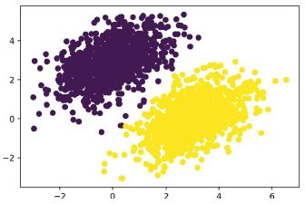

# **3. A Keras és a TensorFlow bemutatása**

Ez a fejezet ezekkel foglalkozik:
* A TensorFlow, a Keras és kapcsolatuk közelebbi áttekintése
* Mély tanulási munkaterület kialakítása
* Áttekintés arról, hogy az alapvető mély tanulási koncepciók hogyan fordíthatók Kerasra és TensorFlow-ra

Ez a fejezet mindent megad, amire szüksége van ahhoz, hogy a gyakorlatban mély tanulást végezzen. Gyorsan bemutatom a Keras-t (https://keras.io) és a Tensor-Flow-t (https://tensorflow.org), a Python-alapú mély tanulási eszközöket, amelyeket a könyvben végig használni fogunk. Megtudhatja, hogyan állíthat be mély tanulási munkaterületet TensorFlow, Keras és GPU támogatással. Végül a 2. fejezetben a Kerasszal és a TensorFlow-val felvett első kapcsolatra építve áttekintjük a neurális hálózatok alapvető összetevőit, és azt, hogy ezek hogyan fordíthatók át a Keras és TensorFlow API-kra.
A fejezet végére készen áll arra, hogy áttérjen a gyakorlati, valós alkalmazásokra, amelyek a 4. fejezettel kezdődnek.

## 3.1 Mi az a TensorFlow?

A TensorFlow egy Python-alapú, ingyenes, nyílt forráskódú gépi tanulási platform, amelyet elsősorban a Google fejlesztett ki. A NumPy-hoz hasonlóan a TensorFlow elsődleges célja, hogy lehetővé tegye a mérnököknek és kutatóknak a matematikai kifejezések manipulálását numerikus tenzorokon keresztül. De a TensorFlow a következő módokon messze túlmutat a NumPy hatókörén:
* Bármilyen differenciálható kifejezés gradiensét automatikusan ki tudja számítani (amint azt a 2. fejezetben láthatta), így kiválóan alkalmas gépi tanulásra.
* Nemcsak CPU-kon, hanem GPU-kon és TPU-kon, erősen párhuzamos hardveres gyorsítókon is képes futni.
* A TensorFlow-ban definiált számítások könnyen eloszthatók számos gép között.
* A TensorFlow programok exportálhatók más futtatókörnyezetbe, például C++-ba, Java-Script-be (böngésző alapú alkalmazásokhoz) vagy TensorFlow Lite-ba (mobileszközökön vagy beágyazott eszközökön futó alkalmazásokhoz), stb. Ez megkönnyíti a TensorFlow alkalmazások hadrendbe állítását praktikus beállításokkal.

Fontos szem előtt tartani, hogy a TensorFlow sokkal több, mint egyetlen könyvtár. Valójában ez egy platform, amely összetevők hatalmas ökoszisztémájának ad otthont, amelyek egy részét a Google, másokat pedig harmadik felek fejlesztettek ki. Például ott van a TF-Agents a megerősítő tanulási kutatáshoz, a TFX az iparágilag erős gépi tanulási munkafolyamat-kezeléshez, a TensorFlow Serving az éles üzembe helyezéshez, és ott van a TensorFlow Hub előképzett modellek tárháza. Ezek az alkatrészek együttesen a felhasználási esetek nagyon széles körét fedik le, a legmodernebb kutatástól a nagyszabású gyártási alkalmazásokig.

A TensorFlow meglehetősen jól skálázható: például az Oak Ridge National Lab tudósai egy 1.1-es exaFLOPS extrém időjárás-előrejelző modellt készítettek vele az IBM Summit szuperszámítógép 27 000 GPU-ján. Hasonlóképpen, a Google a TensorFlow-t használta nagyon számításigényes mélytanulási alkalmazások fejlesztésére, mint például az AlphaZero sakkjáték és Go-playing ügynök. A saját modelljeinél, ha megvan a költségkerete, reálisan reménykedhet, hogy körülbelül 10 petaFLOPS-ra méretezheti a méretet egy kis TPU-n, vagy a Google Cloudon vagy AWS-en bérelt GPU-k nagy csoportján. Ez még mindig a 2019-ben legjobb szuperszámítógép számítási csúcsteljesítményének körülbelül 1%-a!

## 3.2 Mi az a Keras?

A Keras egy mély tanulási API a Pythonhoz, amely a TensorFlow-ra épül, és kényelmes módot biztosít bármilyen mély tanulási modell meghatározására és betanítására. A Keras-t eredetileg kutatási célokra fejlesztették ki, azzal a céllal, hogy lehetővé tegyék a gyors mélytanulási kísérletezést.

A TensorFlow révén a Keras különféle típusú hardvereken (lásd a 3.1 ábrát) – GPU-n, TPU-n vagy sima CPU-n – futhat, és zökkenőmentesen méretezhető több ezer gépre.

A Keras arról ismert, hogy előnyben részesíti a fejlesztői élményt. Ez egy API embereknek, nem pedig gépeknek. Követi a kognitív terhelés csökkentésére vonatkozó legjobb gyakorlatokat: konzisztens és egyszerű munkafolyamatokat kínál, minimálisra csökkenti a gyakori használati esetekhez szükséges műveletek számát, és egyértelmű és használható visszajelzést ad a felhasználói hibáról. Ezáltal a Keras könnyen megtanulható a kezdők számára, és rendkívül produktív a szakértők számára.


**3.1. ábra:** Keras és TensorFlow: A TensorFlow egy alacsony szintű tenzoros számítási platform, a Keras pedig egy magas szintű mélytanulási API

A Kerasnak 2021 végén jóval több mint egymillió felhasználója van, az akadémiai kutatóktól, mérnököktől és adattudósoktól kezdve a startupoknál és a nagyvállalatoknál a végzős hallgatókig és a hobbiig. A Keras-t a Google, a Netflix, az Uber, a CERN, a NASA, a Yelp, az Instacart, a Square és több száz startup használja, amelyek minden iparágban a problémák széles skáláján dolgoznak. A YouTube-javaslatai a Keras modellekből származnak. A Waymo önvezető autókat Keras modellekkel fejlesztették ki. A Keras népszerű keretrendszer a Kaggle-n, a gépi tanulási verseny webhelyén, ahol a legtöbb mély tanulási versenyt a Keras segítségével nyerték meg.

Mivel a Keras nagy és változatos felhasználói bázissal rendelkezik, nem kényszeríti arra, hogy egyetlen „igazi” módszert kövessen a modellek felépítésében és képzésében. Inkább különféle munkafolyamatok széles skáláját teszi lehetővé, a nagyon magas szinttől a nagyon alacsony szintig, a különböző felhasználói profiloknak megfelelően. Például számos módja van a modellek létrehozásának és a képzésüknek, amelyek mindegyike bizonyos kompromisszumot jelent a használhatóság és a rugalmasság között. Az 5. fejezetben részletesen áttekintjük a munkafolyamatok ezen spektrumának egy jó részét. Használhatja a Keras-t úgy, mint a Scikit-learnt – csak hívja a `fit()`-et, és hagyja, hogy a keretrendszer végezze a dolgát – vagy használhatja úgy, mint a NumPy-t – minden apró részlet felett teljes mértékben átveszi az irányítást.

Ez azt jelenti, hogy mindaz, amit most tanul, akkor is releváns lesz, ha már szakértővé vált. Könnyen elkezdheti, majd fokozatosan belemerülhet a munkafolyamatokba, ahol egyre több logikát ír a semmiből. Nem kell teljesen más keretrendszerre váltania, amikor diákból kutató lesz, vagy adattudósból mély tanulási mérnök lesz.

Ez a filozófia nem különbözik magától a Python filozófiájától! Egyes nyelvek csak egyetlen módot kínálnak a programok írására – például az objektumorientált programozást vagy a funkcionális programozást. Eközben a Python egy többparadigmás nyelv: egy sor lehetséges használati mintát kínál, amelyek mindegyike szépen működik együtt. Ez teszi a Python-t nagyon különböző felhasználási esetek széles körére alkalmassá: rendszeradminisztráció, adattudomány, gépi tanulási tervezés, webfejlesztés. . . vagy csak megtanulni a programozást. Hasonlóképpen a Keras a mély tanulás Pythonjaként is elképzelhető: egy felhasználóbarát mélytanulási nyelv, amely különféle munkafolyamatokat kínál a különböző felhasználói profilokhoz.

## 3.3 Keras és TensorFlow: A rövid történet

A Keras nyolc hónappal megelőzi a TensorFlow-t. 2015 márciusában adták ki, a TensorFlowt pedig 2015 novemberében. Felmerülhet a kérdés, ha a Keras a TensorFlow-ra épül, hogyan létezhetett a TensorFlow megjelenése előtt? A Keras eredetileg a Theano-ra épült, egy másik tenzormanipulációs könyvtárra, amely automatikus differenciálást és GPU-támogatást biztosított – a legkorábbi ilyen jellegű. A Theano, amelyet a Montréal Institute for Learning Algorithms (MILA) fejlesztett ki a Montreali Egyetemen, sok tekintetben a TensorFlow előfutára volt. Úttörője volt annak az ötletnek, hogy statikus számítási gráfokat használjon az automatikus differenciáláshoz és a kódok CPU-ra és GPU-ra történő fordításához.

2015 végén, a TensorFlow megjelenése után a Keras-t multibackend architektúrára alakították át: lehetővé vált a Keras Theano vagy TensorFlow használata, és a kettő közötti váltás ugyanolyan egyszerű volt, mint egy környezeti változó megváltoztatása. 2016 szeptemberére a TensorFlow elérte azt a technikai érettségi szintet, amely lehetővé tette, hogy a Keras alapértelmezett háttérfeldolgozója (back-end) legyen. 2017-ben a Keras két új háttérfeldolgozóval bővült: a CNTK (a Microsoft által fejlesztett) és az MXNet (amit az Amazon fejlesztett). Manapság sem a Theano sem a CNTK nem áll fejlesztés alatt, és az MXNet-et nem használják széles körben az Amazonon kívül. A Keras visszatért az egyháttérrendszerű API formához – a TensorFlow tetején.

A Keras és a TensorFlow hosszú évek óta szimbiotikus kapcsolatban áll egymással. 2016-ban és 2017-ben a Keras a TensorFlow alkalmazások fejlesztésének felhasználóbarát módjaként vált közismertté, és új felhasználókat juttat a TensorFlow ökoszisztémába. 2017 végére a TensorFlow-felhasználók többsége a Kerason keresztül vagy a Kerassal kombinálva használta. 2018-ban a TensorFlow vezetése a Kerast választotta a TensorFlow hivatalos magas szintű API-jaként. Ennek eredményeként a Keras API a 2019 szeptemberében kiadott TensorFlow 2.0 elő- és középfokozata – ez a TensorFlow és a Keras átfogó újratervezése, amely figyelembe veszi a több mint négy évnyi felhasználói visszajelzést és a műszaki fejlődést.

Ezen a ponton már készen kell állnia a Keras és a TensorFlow kód gyakorlati futtatására. Kezdjük.

## 3.4 Mély tanulási munkaterület létrehozása

Mielőtt elkezdené a mély tanulási alkalmazások fejlesztését, be kell állítania a fejlesztői környezetet. Erősen ajánlott, bár nem feltétlenül szükséges, hogy a számítógép CPU helyett modern NVIDIA GPU-n futtasson mély tanulási kódot. Egyes alkalmazások – különösen a képfeldolgozás konvolúciós hálózatokkal – elviselhetetlenül lassúak lesznek a CPU-n, még egy gyors többmagos CPU esetében is. És még azoknál az alkalmazásoknál is, amelyek reálisan futtathatók CPU-n, általában 5-10-szeresére nő a sebesség egy friss GPU használatával. {72.o.köv.}

A GPU-n való mély tanuláshoz három lehetőség közül választhat:
* Vásároljon és telepítsen egy fizikai NVIDIA GPU-t a munkaállomásába.
* Használjon GPU-példányokat a Google Cloud vagy az AWS EC2 szolgáltatásban.
* Használja a Colaboratory ingyenes GPU-futási idejét, amely egy, a Google által kínált notebook szolgáltatás (a „notebook” fogalmával kapcsolatos részletekért lásd a következő részt).

A Colaboratory a legegyszerűbb módja az indulásnak, mivel nincs szükség hardvervásárlásra és szoftver telepítésére – csak nyisson meg egy lapot a böngészőben, és kezdje el a kódolást. Ezt a lehetőséget ajánljuk a könyvben található kódpéldák futtatásához. A Colaboratory ingyenes verziója azonban csak kis terhelésekre alkalmas. Ha növelni szeretné a méretet, akkor fentebbi első vagy a második lehetőséget kell használnia.

Ha még nem rendelkezik mélytanuláshoz használható GPU-val (új, csúcskategóriás NVIDIA GPU), akkor a mélytanulási kísérletek felhőben történő futtatása egyszerű és olcsó módja annak, hogy nagyobb munkaterhelésre váltson anélkül, hogy szükség lenne bármilyen további hardver vásárlására. Ha Jupyter notebookot használ, a felhőben való futás élménye nem különbözik a helyi futtatástól.

Ha azonban komolyan alkalmazza a mély tanulást, akkor ez a beállítás hosszú távon – vagy akár néhány hónapnál tovább – nem fenntartható. A felhőpéldányok nem olcsók: 2021 közepén óránként 2,48 dollárt kell fizetni egy V100 GPU-ért a Google Cloudon. Eközben egy valódi/fizikai fogyasztói osztályú GPU valahol 1500 és 2500 dollár közötti árú – ez az ár az idők során meglehetősen stabil volt, még akkor is, ha ezeknek a GPU-knak a specifikációi folyamatosan javulnak. Ha erősen alkalmazza a mély tanulást, fontolja meg egy vagy több GPU-val rendelkező helyi munkaállomás létrehozását.

Ezenkívül, akár helyben, akár felhőben futtatja, jobb, ha Unix munkaállomást használ. Bár technikailag lehetséges a Keras közvetlen futtatása Windows rendszeren, nem javasoljuk. Ha Ön Windows-felhasználó, és saját munkaállomásán szeretne mély tanulást végezni, akkor a legegyszerűbb megoldás, (ha szeretné, hogy minden fusson,) ha beállít egy Ubuntu kettős rendszerindítást a gépén, vagy kihasználja a Windows Subsystem for Linux (WSL) kompatibilitási réteget, amely lehetővé teszi Linux alkalmazások futtatását Windows rendszerből. Lehet, hogy gondnak tűnik, de hosszú távon sok időt és fáradságot takarít meg.

### 3.4.1 Jupyter notebooks: A mélytanulási kísérletek futtatásának előnyben részesített módja

A Jupyter Notebook nagyszerű lehetőséget kínál a mély tanulási kísérletek futtatására – különösen a könyvben található számos kódpéldára. Széles körben használják az adattudományi és gépi tanulási közösségekben. A "jegyzetfüzet" a Jupyter Notebook alkalmazás (https://jupyter.org) által generált fájl, amelyet a böngészőben szerkeszthet. Egyesíti a Python-kód végrehajtásának képességét a gazdag szövegszerkesztési lehetőségekkel, hogy megjegyzéseket fűzzön ahhoz, amit csinál. A notebook lehetővé teszi a hosszú kísérletek kisebb darabokra bontását is, amelyek önállóan is végrehajthatók, ami interaktívvá teszi a fejlesztést, és azt jelenti, hogy nem kell újra futtatnia az összes korábbi kódot, ha valami hiba történik a kísérlet végén.

Azt javaslom, hogy Jupyter Notebookot használjon a Keras alkalmazásának megkezdéséhez, bár ez nem feltétel: önálló Python-szkripteket is futtathat, vagy tud kódot futtatni egy IDE-ből, például a PyCharmból. A könyvben található összes kódpélda elérhető nyílt forráskódú jegyzetfüzetként; letöltheti őket a GitHubról a https://github.com/fchollet/deep-learning-with-python-notebooks címről.

### 3.4.2 A Colaboratory használata

A Colaboratory (vagy röviden a Colab) egy ingyenes Jupyter notebook szolgáltatás, amely nem igényel telepítést, és teljes mértékben a felhőben fut. Valójában ez egy olyan weboldal, amely lehetővé teszi a Keras-szkriptek azonnali írását és végrehajtását. Hozzáférést biztosít ingyenes (de korlátozott) GPU-futási időhöz, sőt TPU-futási időhöz is, így nem kell saját GPU-t vásárolnia. A könyvben szereplő kódpéldák futtatásához a Colaboratory programot ajánljuk.

**ELSŐ LÉPÉSEK A COLABORATORY-VAL**

A Colab használatának megkezdéséhez keresse fel a https://colab.research.google.com webhelyet, és kattintson az Új jegyzetfüzet gombra. Ekkor feltűnik a 3.2. ábrán látható szabványos Notebook interfész.


**3.2. ábra:** Egy Colab notebook

Két gombot fog látni az eszköztáron: + Kód és + Szöveg. Futtatható Python-kódcellák és magyarázó szövegcellák létrehozására szolgálnak. Miután beírta a kódot egy kódcellába, a Shift-Enter lenyomása végrehajtja azt (lásd a 3.3 ábrát).

Szövegcellában használhatja a Markdown szintaxist (lásd a 3.4. ábrát). A Shift-Enter lenyomása egy szövegcellán megjeleníti azt.

A szövegcellák hasznosak a jegyzetfüzetek olvasható szerkezetének kialakításához: használja őket a kód megjegyzéseihez szakaszcímekkel és hosszú magyarázó bekezdésekkel, vagy ábrák beágyazásához. A notebookok célja, hogy multimédiás élményt nyújtson!


**3.3. ábra:** Kódcella létrehozása


**3.4. ábra:** Szövegcella létrehozása

**CSOMAGOK TELEPÍTÉSE PIP-pel**

Az alapértelmezett Colab-környezetben már telepítve van a TensorFlow és a Keras, így azonnal használatba veheti, minden telepítési lépés nélkül. De ha valaha is telepítenie kell valamit a pip használatával, akkor ezt a következő szintaxis használatával teheti meg egy kódcellában (vegye észre, hogy a sor ! karakterrel kezdődik, jelezve, hogy ez egy shell parancs, nem pedig Python kód):


```python
!pip install package_name
```

**A GPU FUTÁSIDŐ HASZNÁLATA**

Ha a GPU-futásidőt a Colab-al szeretné használni, válassza a Futtatási idő > Futási idő típusának módosítása lehetőséget a menüben, és válassza a GPU-t a Hardvergyorsítóhoz (lásd a 3.5. ábrát).


**3.5. ábra:** A GPU futtatókörnyezet használata a Colab segítségével

A TensorFlow és a Keras automatikusan a GPU-n fut, ha rendelkezésre áll GPU, így nincs több teendője a GPU futási környezetének kiválasztása után.

Észre fogja venni, hogy a Hardvergyorsító legördülő menüjében van egy TPU futásidejű opció is. Ellentétben a GPU futási idővel, a TPU futtatókörnyezet TensorFlow és Keras használatával való használata némi manuális beállítást igényel a kódban. Ezzel a 13. fejezetben foglalkozunk. Egyelőre azt javasoljuk, hogy ragaszkodjon a GPU futási környezetéhez, és kövesse a könyvben található kódpéldákat.

Most már lehetősége van a Keras-kód gyakorlati futtatására. Ezután nézzük meg, hogy a 2. fejezetben megismert kulcsfontosságú ötletek hogyan fordíthatók Keras és TensorFlow kódra.

## 3.5 Az első lépések a TensorFlow-val

Ahogy az előző fejezetekben láthatta, a neurális hálózat képzése a következő fogalmak köré épül:
* Először is, alacsony szintű tenzormanipuláció – az infrastruktúra, amely minden modern gépi tanulás alapját képezi. Ez TensorFlow API-kat jelent:
 * *Tenzorok*, beleértve a speciális tenzorokat, amelyek a hálózat állapotát tárolják (*változók*)
 * *Tenzorműveletek*, például összeadás, `relu`, `matmul`
 * *Backpropagation*, a matematikai kifejezések gradiensének kiszámítási módja (a TensorFlow-ban a `GradientTape` objektumon keresztül)
* Második, magas szintű mély tanulási koncepciók. Ez fordítja Keras API-kra:
 * *Rétegek*, amelyek egy *modellbe* vannak kombinálva
 * *Veszteségfüggvény*, amely a tanuláshoz használt visszacsatoló jelet határozza meg
 * Egy *optimalizáló*, amely meghatározza a tanulás menetét
 * *Mérőszámok* a modell teljesítményének értékelésére, például a pontossága
 * *Kiképzési hurok*, amely mini-batch sztochasztikus gradiens süllyedést hajt végre

Az előző fejezetben már volt első könnyű kapcsolata a megfelelő TensorFlow és Keras API-kkal: röviden használta a TensorFlow `Variable` osztályát, a `matmul` műveletet és a `GradientTape`-et. Példányosította a Keras `Dense` rétegeket, becsomagolta őket egy `Sequential` modellbe, és betanította a modellt a `fit()` metódussal.

Most merüljünk mélyebbre abba, hogy mindezek a különböző koncepciók hogyan közelíthetők meg a gyakorlatban a TensorFlow és a Keras használatával.

### 3.5.1 Konstans tenzorok és változók

Ahhoz, hogy bármit is tegyünk a TensorFlow-ban, szükségünk lesz néhány tenzorra. A tenzorokat valamilyen kezdeti értékkel kell létrehozni. Létrehozhatunk például csupa egyes vagy nulla tenzorokat (lásd a 3.1-es listát), vagy véletlenszerű eloszlásból kihúzott értékek tenzorait (lásd a 3.2-es listát).

**3.1 lista: Csupa egyes vagy csupa nulla tenzorok**


```python
>>> import tensorflow as tf
>>> x = tf.ones(shape=(2, 1))         #<--- Egyenértékű az np.ones(shape=(2, 1)) alakkal
>>> print(x)
tf.Tensor(
[[1.]
 [1.]], shape=(2, 1), dtype=float32)
>>> x = tf.zeros(shape=(2, 1))        #<--- Egyenértékű az np.zeros(shape=(2, 1)) alakkal
>>> print(x)
tf.Tensor(
[[0.]
 [0.]], shape=(2, 1), dtype=float32)
```

**3.2 lista: Véletlenszerű tenzorok**


```python
>>> x = tf.random.normal(shape=(3, 1), mean=0., stddev=1.)    #<--- Normál eloszlásból húzott véletlen értékek tenzora 0 átlaggal és 1 szórással.
                                                              #     Egyenértékű az np.random.normal(size=(3, 1), loc=0., scale=1.) alakkal.
>>> print(x)
tf.Tensor(
[[-0.14208166]
[-0.95319825]
[ 1.1096532 ]], shape=(3, 1), dtype=float32)
>>> x = tf.random.uniform(shape=(3, 1), minval=0., maxval=1.) #<--- 0 és 1 közötti egyenletes eloszlásból húzott véletlen értékek tenzora.
                                                              #     Egyenértékű az np.random.uniform(size=(3, 1), low=0., high=1.) alakkal.
>>> print(x)
tf.Tensor(
[[0.33779848]
 [0.06692922]
 [0.7749394 ]], shape=(3, 1), dtype=float32)
```

A NumPy tömbök és a TensorFlow tenzorok közötti jelentős különbség az, hogy a TensorFlow tenzorok tartalma nem módosítható: ezek állandóak. Például a NumPy esetében megtehetjük a következőket.

**3.3 lista: A NumPy tömbök módosíthatók értékadással**


```python
import numpy as np
x = np.ones(shape=(2, 2))
x[0, 0] = 0.
```

Próbálja meg ugyanezt tenni a TensorFlow-ban, ezt a hibaüzenetet kapja: „Az EagerTensor objektum nem támogatja az elem értékadást.”

**3.4 lista: A TensorFlow tenzorok nem módosíthatók értékadással**


```python
x = tf.ones(shape=(2, 2))
x[0, 0] = 0.              #<--- Ez meghiúsul, mivel a tenzor nem módosítható.
```

Egy modell betanításához frissítenünk kell az állapotát, amely tenzorok halmaza. Ha a tenzorok nem módosíthatók, akkor hogyan tegyük ezt meg? Itt jönnek be a *változók*. A `tf.Variable` az az osztály, amely a TensorFlow módosítható állapotának kezelésére szolgál. Röviden már láthatta működés közben a 2. fejezet végén található képzési ciklus megvalósításában.

Változó létrehozásához meg kell adnia valamilyen kezdeti értéket, például egy véletlen tenzort.

**3.5 lista: TensorFlow változó létrehozása**


```python
>>> v = tf.Variable(initial_value=tf.random.normal(shape=(3, 1)))
>>> print(v)
array([[-0.75133973],
       [-0.4872893 ],
       [ 1.6626885 ]], dtype=float32)>
```

Egy változó állapota az `assign` metódusával módosítható az alábbiak szerint.

**3.6 lista: Érték hozzárendelése egy TensorFlow változóhoz**


```python
>>> v.assign(tf.ones((3, 1)))
array([[1.],
       [1.],
       [1.]], dtype=float32)>
```

Ez az együtthatók egy részhalmazára is működik.

**3.7 lista: Érték hozzárendelése egy TensorFlow változó egy részhalmazához**


```python
>>> v[0, 0].assign(3.)
array([[3.],
       [1.],
       [1.]], dtype=float32)>
```

Hasonlóképpen, az `assign_add()` és az `assign_sub()` a `+=` és a `-=` hatékony megfelelői, amint az alábbiakban látható.

**3.8 lista: Az `assign_add()` használata**


```python
>>> v.assign_add(tf.ones((3, 1)))
array([[2.],
       [2.],
       [2.]], dtype=float32)>
```

### 3.5.2 Tenzorműveletek: Matematika a TensorFlow-ban

Csakúgy, mint a NumPy, a TensorFlow is tenzorműveletek nagy gyűjteményét kínálja matematikai képletek kifejezésére. Íme néhány példa.

**3.9 lista: Néhány alapvető matematikai művelet**


```python
a = tf.ones((2, 2))
b = tf.square(a)      #<--- Vegyük a négyzetét
c = tf.sqrt(a)        #<--- Vegyük a négyzetgyökét
d = b + c             #<--- Adjunk össze két tenzort (elemenként).
e = tf.matmul(a, b)   #<--- Vegyük két tenzor szorzatát (a 2. fejezetben leírtak szerint).
e *= d                #<--- Szorozzunk össze két tenzort (elemenként).
```

Fontos, hogy az előző műveletek mindegyike menet közben végrehajtódik: bármikor kinyomtathatja az aktuális eredményt, akárcsak a NumPy-ban. Ezt hívjuk *buzgó végrehajtásnak*.

### 3.5.3 Második pillantás a GradientTape API-ra

Eddig úgy tűnik, hogy a TensorFlow nagyon hasonlít a NumPy-ra. De van valami, amit a NumPy nem tud: lekérni bármely differenciálható kifejezés gradiensét bármely bemenetéhez képest. Csak nyisson meg egy `GradientTape` hatókört, alkalmazzon számítást egy vagy több bemeneti tenzorra, és kérje le az eredmény gradiensét a bemenetekhez képest.

**3.10 lista: A `GradientTape` használata**


```python
input_var = tf.Variable(initial_value=3.)
with tf.GradientTape() as tape:
    result = tf.square(input_var)
gradient = tape.gradient(result, input_var)
```

Leggyakrabban ezt használják a modell veszteség gradienseinek lekérésére a súlyok függvényében: `gradiens = tape.gradient(loss, weights)`. Ezt láthatta működés közben a 2. fejezetben.

Eddig csak azt az esetet láthatta, amikor a `tape.gradient()` bemeneti tenzorai TensorFlow változók voltak. Valójában ezek a bemenetek tetszőleges tenzorok lehetnek. Alapértelmezés szerint azonban csak a *betanítható változókat* követi nyomon a rendszer. Állandó tenzor esetén manuálisan meg kell jelölnie nyomon követettként a `tape.watch()` meghívásával.

**3.11 lista: A `GradientTape` használata állandó tenzor bemenetekkel**


```python
input_const = tf.constant(3.)
with tf.GradientTape() as tape:
    tape.watch(input_const)
    result = tf.square(input_const)
gradient = tape.gradient(result, input_const)
```

Miért van erre szükség? Mert túl drága lenne előzetesen tárolni azokat az információkat, amelyek ahhoz szükségesek, hogy bárminek a gradiensét bármihez képest kiszámítsák. Az erőforrások pazarlásának elkerülése érdekében a szalagnak tudnia kell, mit kell néznie. A betanítható változókat alapértelmezés szerint figyeli, mivel a gradiens szalag legáltalánosabb használata a veszteség gradiensének kiszámítása a betanítható változók listájához képest.

A gradiens szalag egy hatékony segédprogram, amely még *másodrendű gradiensek*, vagyis egy gradiens gradiensének kiszámítására is képes. Például egy objektum időbeli helyzetének gradiense az objektum sebessége, a másodrendű gradiens pedig a gyorsulása.

Ha megméri egy lezuhanó alma helyzetét a függőleges tengely mentén az idő függvényében, és azt találja, hogy az `position(time) = 4,9 * time ** 2`, akkor mekkora a gyorsulása? Használjunk két egymásba ágyazott `GradientTape`-et, hogy megtudjuk.

**3.12 lista: Beágyazott gradiens szalagok használata másodrendű gradiensek kiszámításához**


```python
time = tf.Variable(0.)
with tf.GradientTape() as outer_tape:
    with tf.GradientTape() as inner_tape:
        position = 4.9 * time ** 2
    speed = inner_tape.gradient(position, time)
acceleration = outer_tape.gradient(speed, time) #<--- A külső szalagot használjuk a gradiens gradiensének
                                                #     a belső szalagból történő kiszámításához.
                                                #     A válasz természetesen 4,9 * 2 = 9,8.
```

### 3.5.4 Egy átfogó példa: Lineáris osztályozó tisztán TensorFlow-ban

Ismeri a tenzorokat, a változókat és a tenzorműveleteket, és tudja, hogyan kell gradienseket kiszámítani. Ez elég ahhoz, hogy bármilyen gépi tanulási modellt felépítsünk a gradiens süllyedés alapján. És még csak a 3. fejezetnél tartunk!

Egy gépi tanulási állásinterjún előfordulhat, hogy a TensorFlow-ban a nulláról kell megvalósítani egy lineáris osztályozót: ez egy nagyon egyszerű feladat, amely szűrőként szolgál a minimális gépi tanulási háttérrel rendelkező jelöltek és azok között, akiknek annyi sincs. Lépjünk hát túl ezen a szűrőn, és használjuk fel a TensorFlow újdonságait egy ilyen lineáris osztályozó megvalósításához.

Először álljunk elő néhány szépen lineárisan elválasztható szintetikus adattal, amelyekkel dolgozhatunk: két pontosztály egy 2D-s síkban. Minden egyes pontosztályt úgy generálunk, hogy koordinátáikat egy véletlen eloszlásból, egy adott kovarianciamátrixszal és egy meghatározott átlaggal rajzoljuk meg. Intuitív módon a kovarianciamátrix írja le a pontfelhő alakját, az átlag pedig a síkban elfoglalt helyzetét (lásd 3.6. ábra). Mindkét pontfelhőre ugyanazt a kovariancia mátrixot használjuk, de két különböző átlagértéket használunk – a pontfelhők alakja azonos lesz, de helyzetük eltérő.

**3.13 lista: Véletlenszerű pontok két osztályának generálása 2D síkban**


```python
num_samples_per_class = 1000                        #<--- Az első pontosztály létrehozása: 1000 véletlenszerű 2D pontot.
negative_samples = np.random.multivariate_normal(   #
    mean=[0, 3],
    cov=[[1, 0.5],[0.5, 1]],                        #     egy ovális pontfelhőnek felel meg,
                                                    #     amely balra lentről jobbra fel irányul.
    size=num_samples_per_class)
positive_samples = np.random.multivariate_normal(   #<--- Állítsa elő a másik pontosztályt eltérő átlaggal
                                                    #     és azonos kovarianciamátrixszal.
    mean=[3, 0],
    cov=[[1, 0.5],[0.5, 1]],
    size=num_samples_per_class)
```

Az előző kódban a `negative_samples` és a `positive_samples` egyaránt `(1000, 2)` alakú tömbök. Tegyük őket egyetlen `(2000, 2)` alakú tömbbe.

**3.14 lista: A két osztály halmozása egy (2000, 2) alakú tömbbe**


```python
inputs = np.vstack((negative_samples, positive_samples)).astype(np.float32)
```

Hozzuk létre a megfelelő célcímkéket, egy nullákat és egyeseket tartalmazó (2000, 1) alakú tömböt, ahol a `targets[i, 0]` értéke 0, ha az `inputs[i]` a 0 osztályba tartoznak (és fordítva).

**3.15 lista: A megfelelő célok (0 és 1) generálása**


```python
targets = np.vstack((np.zeros((num_samples_per_class, 1), dtype="float32"),
                     np.ones((num_samples_per_class, 1), dtype="float32")))
```

Ezután ábrázoljuk adatainkat a Matplotlib segítségével.

**3.16 lista: A két pontosztály ábrázolása (lásd a 3.6. ábrát)**


```python
import matplotlib.pyplot as plt
plt.scatter(inputs[:, 0], inputs[:, 1], c=targets[:, 0])
plt.show()
```


**3.6. ábra:** Szintetikus adataink: véletlenszerű pontok két osztálya 2D síkban

Most hozzunk létre egy lineáris osztályozót, amely megtanulja elválasztani ezt a két foltot. A lineáris osztályozó egy affin transzformáció (`prediction = W • input + b`), amelyet arra tanítanak, hogy minimalizálja az előrejelzések és a célok közötti különbség négyzetét.

Amint látni fogja, ez valójában egy sokkal egyszerűbb példa, mint egy játék kétrétegű neurális hálózat átfogó példája, amelyet a 2. fejezet végén láttál. Ezúttal azonban mindent meg kell értened a kódból, sorról sorra.

Hozzuk létre a `W` és `b` változóinkat, amelyeket véletlenszerű értékekkel, illetve nullákkal inicializálunk rendre.

**3.17 lista: A lineáris osztályozó változók létrehozása**


```python
input_dim = 2     #<--- A bemenetek 2D pontok lesznek.
output_dim = 1    #<--- A kimeneti előrejelzések mintánként egyetlen pontszám lesz
                  #     (közel 0, ha a minta előrejelzése szerint a 0. osztályba tartozik,
                  #     és közel 1, ha a minta előrejelzése szerint az 1. osztályba tartozik).
W = tf.Variable(initial_value=tf.random.uniform(shape=(input_dim, output_dim)))
b = tf.Variable(initial_value=tf.zeros(shape=(output_dim,)))
```

Íme az előrepassz függvényünk.

**3.18 lista: Az előrepassz függvény**


```python
def model(inputs):
    return tf.matmul(inputs, W) + b
```

Mivel lineáris osztályozónk 2D bemeneteken működik, W valójában csak két skaláris együttható, w1 és w2: `W = [[w1], [w2]]`. Eközben `b` egyetlen skaláris együttható. Mint ilyen, egy adott `[x, y]` bemeneti ponthoz az előrejelzés értéke `prediction = [[w1], [w2]] • [x, y] + b = w1 * x + w2 * y + b`.

Az alábbi lista a veszteségfüggvényünket mutatja be. {82.o:}

**3.19 lista: A négyzetes középérték hiba veszteség függvény**


```python
def square_loss(targets, predictions):
    per_sample_losses = tf.square(targets - predictions)  #<--- A per_sample_losses egy tenzor, amelynek alakja
                                                          #     megegyezik a célokkal és az előrejelzésekkel,
                                                          #     és mintánkénti veszteségpontszámokat tartalmaz.
    return tf.reduce_mean(per_sample_losses)    #<--- Ezeket a mintánkénti veszteségpontszámokat egyetlen skaláris
                                                #     veszteségértékre kell átlagolnunk: ezt teszi a reduce_mean.
```

Következő az edzési lépés, amely fogad néhány edzési adatot, és frissíti a `W` és `b` súlyokat, hogy minimalizálja az adatvesztést.

**3.20 lista: A képzési lépés függvénye**


```python
learning_rate = 0.1

def training_step(inputs, targets):
    with tf.GradientTape() as tape:                 #<--- Előrelépés, gradiens szalagos hatókör belsejében
        predictions = model(inputs)                 #
        loss = square_loss(predictions, targets)    #
    grad_loss_wrt_W, grad_loss_wrt_b = tape.gradient(loss, [W, b])  #<--- A veszteség gradiensének lekérése a súlyok függvényében.
    W.assign_sub(grad_loss_wrt_W * learning_rate)   #<--- A súlyok frissítése
    b.assign_sub(grad_loss_wrt_b * learning_rate)   #
    return loss
```

Az egyszerűség kedvéért a *mini-batch képzés* helyett *kötegelt képzést* végzünk: minden egyes képzési lépést (gradiensszámítás és súlyfrissítés) lefuttatunk az összes adatra, ahelyett, hogy kis kötegekben iterálnánk az adatokat. Ez egyrészt azt jelenti, hogy minden edzési lépés lefutása sokkal tovább tart, mivel egyszerre 2000 mintához számítjuk ki az előrelépést és a gradienseket. Másrészt minden gradiens frissítés sokkal hatékonyabban csökkenti a betanítási adatok veszteségét, mivel az összes betanítási mintából származó információt tartalmazni fogja, mondjuk csak 128 véletlenszerű minta helyett. Ennek eredményeként sokkal kevesebb képzési lépésre lesz szükségünk, és nagyobb tanulási sebességet kell használnunk, mint általában a mini-batch képzésnél (a `learning_rate = 0,1` értéket használjuk, a 3.20-as lista szerint).

**3.21 lista: A kötegelt képzési hurok**


```python
for step in range(40):
    loss = training_step(inputs, targets)
    print(f"Loss at step {step}: {loss:.4f}")
```

40 lépés után úgy tűnik, hogy a képzési veszteség 0,025 körül stabilizálódott. Ábrázoljuk, hogyan osztályozza lineáris modellünk a képzési adatpontokat. Mivel a célpontok nullák és egyesek, egy adott bemeneti pontot „0”-nak sorol be, ha az előrejelzési értéke 0,5 alatt van, és „1”-nek, ha 0,5 felett van (lásd a 3.7 ábrát):


```python
predictions = model(inputs)
plt.scatter(inputs[:, 0], inputs[:, 1], c=predictions[:, 0] > 0.5)
plt.show()
```



**3.7. ábra:** Modellünk előrejelzései a képzési bemenetekre vonatkozóan: nagyon hasonlóak az edzési célokhoz

Emlékezzünk vissza, hogy egy adott `[x, y]` pont előrejelzett értéke egyszerűen `prediction == [[w1], [w2]] • [x, y] + b == w1 * x + w2 * y + b`. Így a 0. osztály definíciója: `w1 * x + w2 * y + b < 0,5`, az 1. osztályé pedig `w1 * x + w2 * y + b > 0,5`. Észre fogja venni, hogy amit lát, az valójában egy egyenes egyenlete a 2D síkban: `w1 * x + w2 * y + b = 0,5`. A vonal felett az 1. osztály, a vonal alatt pedig a 0. osztály található. Megszokhatta, hogy az egyenesek egyenletét `y = a * x + b` formátumban látja; ugyanebben a formátumban az egyenesünk `y = - w1 / w2 * x + (0,5 - b) / w2` lesz.

Ábrázoljuk ezt az egyenes vonalat (a 3.8. ábrán látható):


```python
x = np.linspace(-1, 4, 100)               #<--- Generálunk 100 szabályosan elhelyezett számot –1 és 4 között,
                                          #     amelyeket a vonal ábrázolásához fogunk használni.
y = - W[0] / W[1] * x + (0.5 - b) / W[1]  #<--- Ez a mi egyenesünk egyenlete.
plt.plot(x, y, "-r")                      #<--- Ábrázoljuk a vonalunkat ("-r" azt jelenti, hogy piros vonalként rajzolja).
plt.scatter(inputs[:, 0], inputs[:, 1], c=predictions[:, 0] > 0.5)    #<--- Rajzoljuk fel a modellünk előrejelzéseit
                                                                      #     ugyanazon a diagramon.
```


**3.8. ábra:** A modellünk, vonalként ábrázolva

Valójában erről szól a lineáris osztályozó: egy vonal (vagy több dimenziós terekben egy hipersík) paramétereinek megtalálása, amelyek szépen elválasztják a két adatosztályt.

## 3.6 Neurális hálózat anatómiája: Az alapvető Keras API-k megértése

Ezen a ponton már ismeri a TensorFlow alapjait, és felhasználhatja a játékmodell semmiből való megvalósításához, mint például az előző szakaszban található kötegelt lineáris osztályozó, vagy a 2. fejezet végén található játék neurális hálózathoz. Ez egy szilárd alap, amire építeni lehet. Itt az ideje, hogy továbblépjünk a mély tanulás hatékonyabb, robusztusabb útjára: a Keras API-ra.

### 3.6.1 Rétegek: A mély tanulás építőkövei

A neurális hálózatok alapvető adatszerkezete az a réteg, amelyet a 2. fejezetben mutattunk be. A réteg egy adatfeldolgozó modul, amely bemenetként egy vagy több tenzort vesz fel, és egy vagy több tenzort ad ki. Egyes rétegek állapot nélküliek, de gyakrabban a rétegeknek van állapotuk: a réteg _súlyai_, egy vagy több sztochasztikus gradiens süllyedéssel tanult tenzor, amelyek együtt tartalmazzák a hálózat _tudását_.

Különböző típusú rétegek a megfelelőek a különböző tenzorformátumokhoz és különböző típusú adatfeldolgozásokhoz. Például a `(samples, features)` alakú másodrendű tenzorokban tárolt egyszerű vektoradatokat gyakran _sűrűn összefüggő_ rétegek dolgozzák fel, amelyeket _teljesen összefüggő_ vagy _sűrű_ rétegeknek is neveznek (a Kerasban a `Dense` osztály). A `(samples, timesteps, features)` alakú harmadrendű tenzorokban tárolt szekvenciaadatokat jellemzően _ismétlődő_ rétegek dolgozzák fel, például egy `LSTM`-réteg vagy 1D konvolúciós rétegek (`Conv1D`). A negyedrendű tenzorokban tárolt képadatokat általában 2D konvolúciós rétegek (`Conv2D`) dolgozzák fel.

A rétegekre úgy tekinthetsz, mint a mély tanulás LEGO kockáira, egy metaforára, amelyet a Keras tett egyértelművé. A Kerasban a mélytanulási modellek felépítése kompatibilis rétegek összevágásával történik, így hasznos adatátalakítási folyamatokat (pipelines) hoznak létre.

**AZ ALAP Layer OSZTÁLY A KERASBAN**

Egy egyszerű API-nak egyetlen absztrakcióval kell rendelkeznie, amely köré minden összpontosul. Kerasban ez a `Layer` osztály. A Kerasban minden vagy egy `Layer`, vagy valami, ami szorosan kölcsönhatásba lép egy `Layer`-rel.

A `Layer` egy olyan objektum, amely bizonyos állapotokat (súlyokat) és számításokat (előrelépés) tartalmaz. A súlyok általában egy `build()`-ben vannak megadva (bár létrehozhatók az `__init__()` konstruktorban is), és a számítás a `call()` metódusban van definiálva.

Az előző fejezetben egy `NaiveDense` osztályt valósítottunk meg, amely két (`W` és `b`) súlyt tartalmazott, és az `output = activation(pont(input, W) + b)` számítást alkalmazta. Ugyanez a réteg így nézne ki a Kerasban.

**3.22 lista: Egy `Dense` réteg `Layer` alosztályként implementálva**


```python
from tensorflow import keras

class SimpleDense(keras.layers.Layer):          #<--- Minden Keras-réteg az alap Layer osztályból öröklődik.
    def __init__(self, units, activation=None):
        super().__init__()
        self.units = units
        self.activation = activation

    def build(self, input_shape):               #<--- A súly létrehozása a build() metódussal történik
        input_dim = input_shape[-1]
        self.W = self.add_weight(shape=(input_dim, self.units), #<--- Az add_weight() a súlyok létrehozásának gyors metódusa.
                                                                #     Lehetőség van önálló változók létrehozására és
                                                                #     rétegattribútumokként való hozzárendelésére is,
                                                                #     például self.W = tf.Variable(tf.random.uniform(w_shape)).
                                 initializer="random_normal")
        self.b = self.add_weight(shape=(self.units,),
                                 initializer="zeros")

    def call(self, inputs):                     #<--- Az előrelépés számítását a call() metódusban definiáljuk.
        y = tf.matmul(inputs, self.W) + self.b
        if self.activation is not None:
            y = self.activation(y)
        return y
```

A következő részben részletesen bemutatjuk a `build()` és `call()` metódusok célját. Ne aggódj, ha még nem értesz mindent!

A példányosítás után egy ilyen réteg függvényként használható, ami bemenetként egy TensorFlow tenzort vesz át:
```
>>> my_dense = SimpleDense(units=32, activation=tf.nn.relu)   #<--- Példányosítsa a korábban meghatározott rétegünket.
>>> input_tensor = tf.ones(shape=(2, 784))    #<--- Hozzon létre néhány tesztbemenetet.
>>> output_tensor = my_dense(input_tensor)    #<--- Hívja meg a réteget a bemenetekkel, akárcsak egy függvényt.
>>> print(output_tensor.shape)
(2, 32))
```

Valószínűleg azon tűnődsz, hogy miért kellett megvalósítanunk a `call()`-t és a `build()`-et, mert végül a rétegünket úgy használtuk, hogy egyszerűen meghívtuk, úgymond a `__call__()` metódus meghívásával. Ez azért van, mert azt akarjuk, hogy képesek legyünk éppen időben létrehozni az állapotot. Lássuk, hogyan működik ez.

**AUTOMATIKUS ALAK MEGÁLLAPÍTÁS: RÉTEGEK ÉPÍTÉSE MENET KÖZBEN**

Csakúgy, mint a LEGO kockáknál, itt is csak kompatibilis rétegeket lehet összekapcsolni. A _rétegkompatibilitás_ fogalma itt kifejezetten arra vonatkozik, hogy minden réteg csak egy bizonyos alakú bemeneti tenzort fogad el, és egy bizonyos alakú kimeneti tenzort ad vissza. Tekintsük a következő példát:


```python
from tensorflow.keras import layers
layer = layers.Dense(32, activation="relu")   #<--- Sűrű réteg 32 kimeneti egységgel
```

Ez a réteg egy tenzort ad vissza, ahol az első dimenziót 32-re alakítottuk át. Csak egy lefelé irányuló réteghez csatlakoztatható, amely 32 dimenziós vektorokat vár bemenetként.

A Keras használatakor legtöbbször nem kell aggódni a méretkompatibilitás miatt, mert a modellekhez hozzáadott rétegek dinamikusan úgy épülnek fel, hogy illeszkedjenek a bejövő réteg alakjához. Tegyük fel például, hogy a következőket írja:


```python
from tensorflow.keras import models
from tensorflow.keras import layers
model = models.Sequential([
    layers.Dense(32, activation="relu"),
    layers.Dense(32)
])
```

A rétegek nem kaptak semmilyen információt a bemeneteik alakjáról – ehelyett automatikusan úgy következtetnek bemeneti alakjukra, mint az elsőként látott bemenetek alakjára.

A `Dense` réteg játékváltozatában, amelyet a 2. fejezetben implementáltunk (amit `NaiveDense`-nek neveztünk el), a réteg bemeneti méretét kifejezetten át kellett adnunk a konstruktornak, hogy létre tudjuk hozni a súlyait. Ez nem ideális, mert az ehhez hasonló modellekhez vezetne, ahol minden új réteg előtt tudatosítani kell a réteg alakját:


```python
model = NaiveSequential([
    NaiveDense(input_size=784, output_size=32, activation="relu"),
    NaiveDense(input_size=32, output_size=64, activation="relu"),
    NaiveDense(input_size=64, output_size=32, activation="relu"),
    NaiveDense(input_size=32, output_size=10, activation="softmax")
])
```

Még rosszabb eset lenne, ha egy réteg által a kimeneti alakzat létrehozásához használt szabályok összetettek. Például mi van akkor, ha a rétegünk alakzat kimeneteket ad vissza `(batch, input_size * 2 if input_size % 2 == 0 else input_size * 3)`?

Ha a `NaiveDense` rétegünket újraimplementálnánk Keras rétegként, amely képes automatikus alakmegállapításra, akkor úgy nézne ki, mint az előző `SimpleDense` réteg (lásd a 3.22-es listát), a `build()` és `call()` metódusaival.

A `SimpleDense`-ben már nem hozunk létre súlyokat a konstruktorban, mint a `NaiveDense` példában; ehelyett egy dedikált állapot-létrehozó metódussal, a `build()`-del hozzuk létre őket, amely argumentumként a réteg által látott első bemeneti alakzatot kapja meg. A `build()` metódus automatikusan meghívásra kerül a réteg első meghívásakor (a `__call__()` metódusán keresztül). Valójában ezért határoztuk meg a számítást egy külön `call()` metódusban, nem pedig közvetlenül a `__call__()` metódusban. Az alapréteg `__call__()` metódusa sematikusan így néz ki:


```python
def __call__(self, inputs):
    if not self.built:
        self.build(inputs.shape)
        self.built = True
    return self.call(inputs)
```

Az automatikus alakmegállapítással az előző példánk egyszerűvé és elegánssá válik:


```python
model = keras.Sequential([
    SimpleDense(32, activation="relu"),
    SimpleDense(64, activation="relu"),
    SimpleDense(32, activation="relu"),
    SimpleDense(10, activation="softmax")
])
```

Figyeljük meg, hogy a `Layer` osztály `__call__()` metódusa nem csak az automatikus alakkövetkeztetést kezeli. Sokkal több dologról gondoskodik, különösen az *eager* és a *graph* végrehajtás közötti útválasztásról (erről a fogalomról a 7. fejezetben fogunk tanulni), valamint a bemeneti maszkolásról (amivel a 11. fejezetben foglalkozunk). Egyelőre ne feledje: a saját rétegek implementálásakor a `call()` metódusba helyezze el a forward pass-t.

### 3.6.2 A rétegektől a modellekig

A mély tanulási modell a rétegek grafikonja. Kerasban ez a `Model` osztály. Eddig csak `Sequential` modelleket (a `Model` egyik alosztálya) láttunk, amelyek egyszerű réteghalmazok, amelyek egyetlen bemenetet egyetlen kimenethez rendelnek hozzá. De ahogy halad előre, a hálózati topológiák sokkal szélesebb körének lesz kitéve. Íme néhány gyakori:
* Kétágú hálózatok
* Többfejű hálózatok
* Megmaradó csatlakozások

A hálózati topológia eléggé kuszává válhat. Például a 3.9. ábra a Transformer rétegeinek gráf topológiáját mutatja, ami egy általános architektúra, amelyet szöveges adatok feldolgozására terveztek.

Általában kétféleképpen készíthet ilyen modelleket a Kerasban: közvetlen alosztállyal láthatja el a `Model` osztályt, vagy használhatja a Functional API-t, amely lehetővé teszi, hogy kevesebb kóddal többet végezzen. Mindkét megközelítéssel foglalkozunk a 7. fejezetben.

A modell topológiája egy *hipotézisteret* definiál. Emlékezhet, hogy az 1. fejezetben a gépi tanulást úgy írtuk le, mint bizonyos bemeneti adatok hasznos reprezentációinak keresését az előre meghatározott *lehetőségek területén* belül, visszacsatolójelből származó útmutatás segítségével. A hálózati topológia kiválasztásával a lehetőségek terét (hipotézisteret) a tenzorműveletek meghatározott sorozatára korlátozza, és a bemeneti adatokat leképezi a kimeneti adatokra. Amit ezután keresni fog, az egy jó értékkészlet a tenzorműveletekben részt vevő súlytenzorokhoz.

Ahhoz, hogy tanuljunk az adatokból, feltételezéseket kell tenni velük kapcsolatban. Ezek a feltételezések határozzák meg, hogy mit tud tanulni. Mint ilyen, a hipotézistér szerkezete – a modell architektúrája – rendkívül fontos. Kódolja a problémájával kapcsolatos feltételezéseit, az előzetes tudást, amellyel a modell indul. Például, ha egy kétosztályos besorolási problémán dolgozik egy olyan modellel, amely egyetlen `Dense` rétegből áll, aktiválás nélkül (tiszta affin transzformáció), akkor azt feltételezi, hogy a két osztály lineárisan elválasztható.


**3.9. ábra:** A Transformer architektúra (lásd a 11. fejezetet). Sok minden történik itt. A következő néhány fejezetben egyre jobban meg fogod érteni.

A megfelelő hálózati architektúra kiválasztása inkább művészet, mint tudomány, és bár vannak bevált gyakorlatok és alapelvek, amelyekre támaszkodhat az ember, csak a gyakorlat segíthet abban, hogy megfelelő neurális hálózattervezővé váljon. A következő néhány fejezet explicit elveket tanít a neurális hálózatok felépítéséhez, és segít az intuíció fejlesztésében, hogy konkrét problémák esetén mi működik és mi nem. Szilárd intuíciót építhet ki arról, hogy milyen típusú modellarchitektúrák működnek a különféle problémák esetén, hogyan építsd fel ezeket a hálózatokat a gyakorlatban, hogyan válassz megfelelő tanulási konfigurációt, és hogyan módosíts egy modellt, amíg az meg nem hozza a kívánt eredményeket.

### 3.6.3 A „fordítás” lépés: A tanulási folyamat konfigurálása

A modell architektúra meghatározása után még három dolgot kell választania:
* *Veszteség függvény (objektív függvény)* – A betanítás során minimálisra csökkentendő mennyiség. Ez az adott feladatmegoldás sikerének mércéje.
* *Optimalizáló* – Meghatározza, hogy a hálózat hogyan frissüljön a veszteségi függvény alapján. A sztochasztikus gradiens süllyedés (SGD) egy speciális változatát valósítja meg.
* *Mérőszámok* – A betanítás és az érvényesítés során figyelemmel kísérni kívánt siker mértékei, például az osztályozás pontossága. A veszteséggel ellentétben a képzés nem közvetlenül ezekre a mutatókra optimalizálódik. Mint ilyeneknek, a minősítőknek nem kell differenciálhatónak lenniük.

Miután kiválasztotta a veszteséget, az optimalizálót és a mérőszámokat, használhatja a beépített `compile()` és `fit()` metódusokat a modell betanításához. Alternatív megoldásként saját egyéni képzési ciklusokat is megírhat – ennek módját a 7. fejezetben tárgyaljuk. Ez sokkal több munka! Egyelőre vessünk egy pillantást a `compile()` és a `fit()` metódusokra.

A `compile()` metódus konfigurálja a betanítási folyamatot – már a 2. fejezetben bemutatott legelső neurális hálózati példában megismertük. Ez az `optimizer, loss` és `metrics` argumentumokat várja (egy listában):


```python
model = keras.Sequential([keras.layers.Dense(1)])   #<--- Definiálunk egy lineáris osztályozót.
model.compile(optimizer="rmsprop",        #<--- Adja meg az optimalizálót név szerint: RMSprop
                                          #     (nem érzékeny a kis- és nagybetűkre).
              loss="mean_squared_error",  #<--- Adja meg a veszteséget név szerint: átlagos négyzetes hiba.
              metrics=["accuracy"])       #<--- Adja meg a mérőszámok listáját: ebben az esetben csak a pontosság.
```

Az előző `compile()` hívásban az optimalizálót, a veszteséget és a mérőszámokat karakterláncként (például `"rmsprop"`) adtuk át. Ezek a karakterláncok valójában parancs rövidítések, amelyek Python objektumokká konvertálódnak. Például az `"rmsprop"` a `keras.optimizers.RMSprop()` lesz. Fontos, hogy ezek az argumentumok objektumpéldányként is megadhatók, például:


```python
model.compile(optimizer=keras.optimizers.RMSprop(),
              loss=keras.losses.MeanSquaredError(),
              metrics=[keras.metrics.BinaryAccuracy()])
```

Ez akkor hasznos, ha a saját egyéni veszteségeit vagy mérőszámait szeretné átadni, vagy ha tovább szeretné konfigurálni a használt objektumokat – például a `learning_rate` argumentumot átadva az optimalizálónak:


```python
model.compile(optimizer=keras.optimizers.RMSprop(learning_rate=1e-4),
              loss=my_custom_loss,
              metrics=[my_custom_metric_1, my_custom_metric_2])
```

A 7. fejezetben bemutatjuk, hogyan hozhat létre egyéni veszteségeket és mérőszámokat. Általánosságban elmondható, hogy nem kell saját veszteségeket, mérőszámokat vagy optimalizálókat a semmiből létrehoznia, mert a Keras a beépített opciók széles skáláját kínálja, amelyek valószínűleg magukban foglalják azt, amire szüksége van:

Optimalizálók:
* `SGD` (lendülettel vagy anélkül)
* `RMSprop`
* `Adam`
* `Adagrad`
* stb.

Veszteségek:
* `CategoricalCrossentropy`
* `SparseCategoricalCrossentropy`
* `BinaryCrossentropy`
* `MeanSquaredError`
* `KLDivergence`
* `CosineSimilarity`
* stb.

Mérőszámok:
* `CategoricalAccuracy`
* `SparseCategoricalAccuracy`
* `BinaryAccuracy`
* `AUC`
* `Precision`
* `Recall`
* stb.

Ebben a könyvben számos lehetőség konkrét alkalmazását láthatja majd.

###3.6.4 Veszteségfüggvény kiválasztása

Rendkívül fontos a megfelelő veszteségfüggvény kiválasztása a megfelelő problémához: a hálózat minden parancsot sorravesz a veszteség minimalizálása érdekében, így ha a cél nem korrelál teljes mértékben az adott feladat sikerével, akkor a hálózat a végén elvégzi ezeket a dolgokat, pedig lehet, hogy nem akartad. Képzeljünk el egy ostoba, mindenható MI-t, akit SGD-n keresztül képeznek ki ezzel a rosszul megválasztott célfüggvénnyel: „az összes élő ember átlagos jólétének maximalizálása”. Munkája megkönnyítése érdekében ez a mesterséges intelligencia dönthet úgy, hogy néhány ember kivételével az összes embert megöli, és a többiek jólétére összpontosít – mivel az átlagos jólétet nem befolyásolja az, hogy hány ember maradt. Lehet, hogy nem ezt akartad!? Ne feledje, hogy az összes felépített neurális hálózat ugyanolyan könyörtelen lesz a veszteségi függvényének csökkentésében – ezért bölcsen válassza ki a célt, különben nem kívánt mellékhatásokkal kell szembenéznie.

Szerencsére, amikor olyan gyakori problémákról van szó, mint az osztályozás, a regresszió és a szekvencia előrejelzése, vannak egyszerű irányelvek, amelyek alapján kiválaszthatja a megfelelő veszteséget. Például bináris keresztentrópiát fog használni egy kétosztályos osztályozási problémához, kategorikus keresztentrópiát egy többosztályos osztályozási problémához, és így tovább. Csak amikor valóban új kutatási problémákon dolgozik, akkor kell saját veszteségfüggvényeket kidolgoznia. A következő néhány fejezetben kifejezetten részletezzük, hogy mely veszteségfüggvényeket válasszuk a gyakori feladatok széles körében.

###3.6.5 A fit() metódus megértése

A `compile()` után jön a `fit()`. A `fit()` metódus magát a képzési ciklust valósítja meg. Ezek a legfontosabb argumentumai:
* A betanításhoz szükséges *adatok* (bemenetek és célok). Általában NumPy tömb vagy TensorFlow `Dataset` objektum formájában kerül átadásra. A következő fejezetekben többet megtudhat a `Dataset` API-ról.
* A tanulási szakaszok (*epoch*) száma: hányszor kell a képzési ciklusnak megismétlődnie az átadott adatokon.
* A mini-batch gradiens ereszkedés egyes szakaszaihoz használandó kötegméret: az egy súlyfrissítési lépés gradienseinek kiszámításához figyelembe vett képzési minták száma.

**3.23 lista: A `Fit()` hívása NumPy adatokkal**


```python
history = model.fit(
    inputs,           #<--- A bemeneti példák NumPy tömbként
    targets,          #<--- A megfelelő képzési célok NumPy tömbként
    epochs=5,         #<--- A képzési ciklus 5-ször ismétli az adatokat.
    batch_size=128    #<--- A képzési ciklus 128 példából álló kötegekben iterálja az adatokat.
)
```

A `fit()` hívás egy `History` objektumot ad vissza. Ez az objektum tartalmaz egy `history` mezőt, amely egy szótár leképezési kulcs, például `"loss"` vagy meghatározott mutatónév a tanulási szakaszonkénti értékek listájához.
```
>>> history.history
{"binary_accuracy": [0.855, 0.9565, 0.9555, 0.95, 0.951],
 "loss": [0.6573270302042366,
          0.07434618508815766,
          0.07687718723714351,
          0.07412414988875389,
          0.07617757616937161]}
```

###3.6.6 Az ellenőrzési adatok veszteségének és mérőszámainak figyelése

A gépi tanulás célja nem az, hogy olyan modelleket kapjunk, amelyek jól teljesítenek a betanítási adatokon, ami egyszerű – csak követni kell a gradienst. A cél olyan modellek megkapása, amelyek általában jól teljesítenek, és különösen olyan adatpontokon, amelyekkel a modell még soha nem találkozott. Csak azért, mert egy modell jól teljesít a betanítási adatain, még nem jelenti azt, hogy még soha nem látott adatokon is jól teljesít! Lehetséges például, hogy a modellje egyszerűen *megjegyzi* a képzési minták és a célpontjaik közötti leképezést, ami haszontalan lenne a modell által még soha nem látott adatok célpontjainak előrejelzéséhez. Erről a pontról részletesebben az 5. fejezetben fogunk beszélni.

Annak érdekében, hogy figyelemmel tudjuk kísérni a modell teljesítményét az új adatokon, bevett gyakorlat a betanítási adatok egy részhalmazának lefoglalása *érvényesítési (teszt) adatként*: a modellt nem fogjuk betanítani ezeken az adatokon, hanem veszteségérték és mérőszámok értékének kiszámítására használjuk. Ezt a `validation_data` argumentum használatával tehetjük meg a `fit()`-ben. A betanítási adatokhoz hasonlóan az érvényesítési adatok NumPy tömbként vagy TensorFlow `Dataset` objektumként is átadhatók.

**3.24 lista: A `validation_data` argumentum használata**


```python
model = keras.Sequential([keras.layers.Dense(1)])
model.compile(optimizer=keras.optimizers.RMSprop(learning_rate=0.1),
              loss=keras.losses.MeanSquaredError(),
              metrics=[keras.metrics.BinaryAccuracy()])

indices_permutation = np.random.permutation(len(inputs))    #<--- Annak elkerülése érdekében, hogy csak egy
shuffled_inputs = inputs[indices_permutation]               #     osztályból legyenek minták az érvényesítési adatokban,
shuffled_targets = targets[indices_permutation]             #     keverje össze a bemeneteket és a célokat
                                                            #     véletlenszerű indexek permutációjával.
num_validation_samples = int(0.3 * len(inputs))             #<--- Tartsa fenn a képzési bemenetek és célok 30%-át
val_inputs = shuffled_inputs[:num_validation_samples]       #     az érvényesítésre (ezeket a mintákat kizárjuk a képzésből,
val_targets = shuffled_targets[:num_validation_samples]     #     és fenntartjuk őket az érvényesítéskori veszteség
training_inputs = shuffled_inputs[num_validation_samples:]  #     és mérőszámok kiszámításához).
training_targets = shuffled_targets[num_validation_samples:]#
model.fit(
    training_inputs,    #<--- Képzési adatok, a modell súlyainak frissítéséhez
    training_targets,   #
    epochs=5,
    batch_size=16,
    validation_data=(val_inputs, val_targets)   #<--- Érvényesítési adatok, csak az érvényesítéskori veszteség
                                                #     és mérőszámok figyelésére szolgálnak
)
```

Az érvényesítési adatokon kapott veszteség értékét „érvényesítési veszteségnek” nevezzük, hogy megkülönböztessük a „képzési veszteségtől”. Fontos megjegyezni, hogy a betanítási adatokat és a validációs adatokat szigorúan elkülönítve kell tartani: az érvényesítés célja annak nyomon követése, hogy a modell által tanult dolgok valóban hasznosak-e az új adatokon. Ha az érvényesítési adatok bármelyikét a modell látta a képzés során, akkor az érvényesítési veszteség és a mérőszámok hibásak lesznek.

Jegyezze meg, hogy ha a képzés befejezése után ki szeretné számítani az érvényesítési veszteséget és a mérőszámokat, akkor az `evaluate()` metódust tudja/kell meghívni:


```python
loss_and_metrics = model.evaluate(val_inputs, val_targets, batch_size=128)
```

Az `evaluate()` (`batch_size` méretű) kötegekben iterálja az átadott adatokat, és skalárok listáját adja vissza, ahol az első bejegyzés az érvényesítési veszteség, a következő bejegyzések pedig az érvényesítési mérőszámok. Ha a modellnek nincsenek mérőszámai, akkor csak az érvényesítési veszteség jelenik meg (nem pedig egy lista). {93.o:}

###3.6.7 Előhívás (következtetés): A modell használata betanítás után

Miután betanította a modelljét, használni is fogja azt az új adatokkal kapcsolatos előrejelzések készítéséhez. Ezt nevezzük *előhívásnak*. Ehhez egy naiv megközelítés lenne egyszerűen meghívni a modell `__call__()` metódusát:


```python
predictions = model(new_inputs)   #<--- Átvesz egy NumPy tömböt vagy TensorFlow tenzort, és egy TensorFlow tenzort ad vissza
```

Ez azonban a `new_inputs` összes bemenetét egyszerre dolgozza fel, ami nem biztos, hogy megvalósítható, ha sok adatot hív elő (különösen, ha több memóriát igényel, mint amennyivel a GPU-ja rendelkezik).

Az előhívásnak (következtetések levonásának) jobb módja a `predict()` metódus használata. Kis kötegekben iterálja az adatokat, és visszaadja az előrejelzések NumPy tömbjét. És a `__call__()`-tól eltérően TensorFlow `Dataset` objektumokat is képes feldolgozni.


```python
predictions = model.predict(new_inputs, batch_size=128)   #<--- Átvesz egy NumPy tömböt vagy egy Dataset-et,
                                                          #     és egy NumPy tömböt ad vissza
```

Például, ha az általunk korábban betanított lineáris modellel néhány validációs adatunkra a `predict()` függvényt használjuk, akkor mindegyik bemeneti mintánál skaláris pontszámokat kapunk, amelyek megfelelnek a modell előrejelzésének:
```
>>> predictions = model.predict(val_inputs, batch_size=128)
>>> print(predictions[:10])
[[0.3590725 ]
 [0.82706255]
 [0.74428225]
 [0.682058  ]
 [0.7312616 ]
 [0.6059811 ]
 [0.78046083]
 [0.025846  ]
 [0.16594526]
 [0.72068727]]
```
Egyelőre ennyit kell tudni a Keras modellekről. A következő fejezetben már készen áll a valós gépi tanulási problémák megoldására a Keras segítségével.

#**Összegzés**

* A TensorFlow egy iparági-erősségű numerikus számítástechnikai keretrendszer, amely CPU-n, GPU-n vagy TPU-n is képes futni. Bármilyen differenciálható kifejezés gradiensét képes automatikusan kiszámítani, sok eszközre kiterjeszthető, és programokat tud exportálni különféle külső futtatási környezetekre – akár JavaScriptre is.
* A Keras a szabványos API a TensorFlow-val végzett mély tanuláshoz. Ezt fogjuk használni ebben a könyvben.
* A legfontosabb TensorFlow objektumok tartalmaznak tenzorokat, változókat, tenzorműveleteket és a gradiens szalagot.
* A Keras központi osztálya a `Layer`. Egy *réteg* bizonyos súlyokat és számításokat tartalmaz. A rétegek *modellekbe* vannak összeállítva.
* Mielőtt elkezdené a modell betanítását, ki kell választania egy *optimalizálót*, egy *veszteséget* és néhány *mérőszámot*, amelyeket a `model.compile()` metódussal ad meg.
* A modell betanításához használhatja a `fit()` metódust, amely mini-batch gradiens süllyedést futtat önnek. Használhatja a veszteség és a mérőszámok ellenőrzésére is az *érvényesítési adatokon*, amelyek olyan bemeneti adatok, amelyeket a modell nem lát a betanítása során.
* Miután betanította a modellt, használja a `model.predict()` metódust az új bemenetekre vonatkozó előrejelzések generálásához.


```python

```
