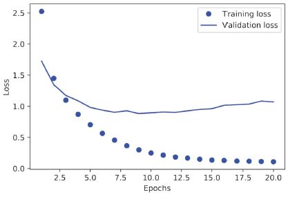
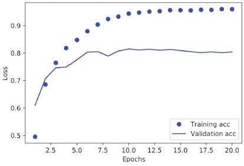
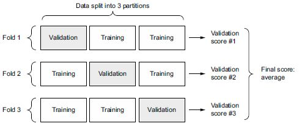
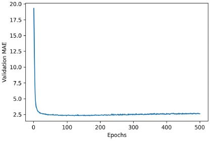
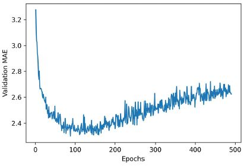

# **4. Ismerkedés a neurális hálózatokkal: Osztályozás és regresszió**

Ez a fejezet ezekkel foglalkozik:
* Az első példák a valós gépi tanulási munkafolyamatokra
* Osztályozási problémák kezelése vektoradatokon
* Folyamatos regressziós problémák kezelése vektoradatokon

Ez a fejezet arra szolgál, hogy elkezdje használni a neurális hálózatokat valódi problémák megoldására. A 2. és 3. fejezetben megszerzett ismereteit megszilárdítja, és a tanultakat három új feladatban alkalmazza, amelyek lefedik a neurális hálózatok három leggyakoribb használati esetét – a bináris osztályozást, a többosztályos osztályozást és a skaláris regressziót:
* Egy filmkritika pozitív vagy negatív besorolása (bináris osztályozás)
* Híradók osztályozása téma szerint (többosztályos osztályozás)
* Egy ház árának becslése ingatlanadatok alapján (skaláris regresszió)

Ezek a példák jelentik az első kapcsolatfelvételt a teljes körű gépi tanulási munkafolyamatokkal: megismerkedhet az adatok előfeldolgozásával, az alapvető modellarchitektúra elveivel és a modellértékeléssel. {96.o:}

**Osztályozási és regressziós szószedet**

Az osztályozás és a regresszió számos speciális kifejezést foglal magában. Néhányukkal már találkoztunk a korábbi példákban, és még többet fogunk látni belőlük a következő fejezetekben. Pontos, gépi tanulás-specifikus definícióik vannak, és ezeket ismernie kell:
* _Minta_ vagy _bemenet_ – Egy adatpont, amely bemegy a modellbe.
* _Előrejelzés_ vagy _kimenet_ – Ami kijön a modellből.
* _Cél_ – az igazság. Amit ideális esetben meg kellene jósolnia a modelljének egy külső adatforrás alapján.
* _Előrejelzési hiba_ vagy _veszteség érték_ – A modell előrejelzése és a cél közötti távolság mértéke.
* _Osztályok_ – Az osztályozási feladatban választható lehetséges címkék halmaza. Például a macska- és kutyaképek osztályozásakor a „kutya” és a „macska” a két osztály.
* _Címke_ – Az osztály megnevezése egy adott példányra az osztályozási problémában. Például, ha az 1234-es kép a „kutya” osztályba tartozik, akkor az  1234-es kép címkéje „kutya”.
* _Alapvető igazság_ vagy _magyarázatok_ – Egy adatkészlet összes cél értéke, amelyeket jellemzően emberek gyűjtenek össze.
* _Bináris osztályozás_ – Osztályozási feladat, ahol minden bemeneti mintát kizárólag két kategóriába kell besorolni.
* _Többosztályos osztályozás_ – Osztályozási feladat, ahol minden bemeneti mintát kettőnél több kategóriába kell besorolni: például kézzel írt számjegyek osztályozása.
* _Többcímkés osztályozás_ – Osztályozási feladat, ahol minden bemeneti mintához több címke is hozzárendelhető. Például egy adott kép macskát és kutyát is tartalmazhat, és a „macska” és a „kutya” címkével is meg kell jelölni. A képenkénti címkék száma általában változó.
* _Skalár regresszió_ – Olyan feladat, ahol a cél egy folytonos skalárérték. Jó példa erre a lakásárak előrejelzése: a különböző célárak egy folytonos teret alkotnak.
* _Vektor regresszió_ – Olyan feladat, ahol a cél folytonos értékek halmaza: például egy folytonos vektor. Ha több értékhez (például egy képen lévő határolókeret koordinátáihoz) képest végez regressziót, akkor vektoros regressziót hajt végre.
* _Mini-batch_ vagy _köteg_ – Minták egy kis halmaza (általában 8 és 128 között), amelyeket a modell egyidejűleg dolgoz fel. A minták száma gyakran 2 hatványa, hogy megkönnyítse a memóriakiosztást a GPU-n. A betanítás során egy mini köteggel számítanak ki egyetlen gradiens-süllyedés frissítést, amelyet a modell súlyaira alkalmaznak.

A fejezet végére képes lesz a neurális hálózatok segítségével egyszerű osztályozási és regressziós feladatokat kezelni vektoradatokon. Ezután készen áll arra, hogy az 5. fejezetben elkezdje a gépi tanulás elvibb, elméleti alapú megértését.

## 4.1 Filmkritikák osztályozása: Példa bináris osztályozásra

A kétosztályos osztályozás vagy bináris osztályozás a gépi tanulási problémák egyik leggyakoribb fajtája. Ebben a példában meg fogjuk tanulni, hogy a filmértékeléseket hogyan lehet pozitív vagy negatív kategóriába sorolni a vélemények szöveges tartalma alapján.

### 4.1.1 Az IMDB adathalmaz

Az IMDB adatkészlettel fogunk dolgozni: ez 50 000 erősen polarizált véleményből álló halmaz az Internet Movie Database-ból. Ezek 25 000 képzési és 25 000 tesztelési véleményre vannak felosztva, amelyek mindegyike 50%-ban negatív és 50%-ban pozitív értékelésből áll.

Csakúgy, mint az MNIST adatkészlet, az IMDB adatkészlet is a Keras csomaggal érkezik. Már előfeldolgozásra került: a kritikák (szósorok) egész számokból álló sorozatokká alakultak, ahol minden egész egy adott szót jelöl a szótárban. Ez lehetővé teszi számunkra, hogy a modellépítésre, a képzésre és az értékelésre összpontosítsunk. A 11. fejezetben megtudhatjuk, hogyan kell a semmiből feldolgozni a nyers szövegbevitelt.

A következő kód betölti az adatkészletet (első futtatásakor körülbelül 80 MB adat töltődik le a gépére).

**4.1 lista: Az IMDB adathalmaz betöltése**


```python
from tensorflow.keras.datasets import imdb
(train_data, train_labels), (test_data, test_labels) = imdb.load_data(
    num_words=10000)
```

A `num_words=10000` argumentum azt jelenti, hogy csak a 10 000 leggyakrabban előforduló szót fogja megtartani a képzési adatokban. A ritka szavakat elvetik. Ez lehetővé teszi, hogy kezelhető méretű vektoradatokkal dolgozzunk. Ha nem állítanánk be ezt a határt, akkor 88 585 egyedi szóval dolgoznánk a képzési adatokban, ami szükségtelenül nagy. E szavak közül sok csak egyetlen mintában fordul elő, ezért nem használhatók értelmesen osztályozáshoz.

A `train_data` és a `test_data` változók az értékelések listái; minden áttekintés szóindexek listája (szósorozatot kódol). A `train_labels` és a `test_labels` 0-kat és 1-eket tartalmazó listák, ahol a 0 a _negatívat_, az 1 pedig a _pozitívat_ jelöli:

```
>>> train_data[0]
[1, 14, 22, 16, ... 178, 32]
>>> train_labels[0]
1
```
Mivel a 10 000 leggyakoribb szóra szorítkozunk, egyetlen szóindex sem haladja meg a 10 000-et:

```
>>> max([max(sequence) for sequence in train_data])
9999
```
Az alábbiakban bemutatjuk, hogyan lehet gyorsan visszafejteni az egyik véleményt angol szavakra. {98.o:->}

**4.2 lista: Vélemények visszakódolása szöveggé**


```python
word_index = imdb.get_word_index()    #<--- A word_index egy szótár, amely a szavakat egész indexre képezi le.
reverse_word_index = dict(
    [(value, key) for (key, value) in word_index.items()])        #<--- Megfordítja, az egész indexeket szavakhoz rendeli
decoded_review = " ".join(
    [reverse_word_index.get(i - 3, "?") for i in train_data[0]])  #<--- Dekódolja a véleményt. Vegye észre,
                                                                  #     hogy az indexek 3-mal el vannak tolva,
                                                                  #     mivel a 0, 1 és 2 a „kitöltés”, a „sorozat kezdete”
                                                                  #     és az „ismeretlen” számára fenntartott indexek.
```

### 4.1.2 Az adatok előkészítése

Az egész számok listáit nem lehet közvetlenül betáplálni egy neurális hálózatba. Mindegyik különböző hosszúságú, de a neurális hálózatok összefüggő adatkötegek feldolgozását várják. A listákat tenzorokká kell alakítania. Ennek két módja van:
* Töltsük fel a listákat úgy, hogy mindegyik egyforma hosszúságú legyen, alakítsuk át őket `(samples, max_length)` alakú egész tenzorokká, és indítsuk el a modellt egy olyan réteggel, amely képes kezelni az ilyen egész tenzorokat (az `Embedding` réteggel, amelyet részletesen a könyv későbbi részében érintünk).
* _Multi-hot kódoljuk_ a listákat, hogy 0-s és 1-es vektorokká alakítsuk azokat. Ez azt jelentené, hogy például a [8, 5] szekvenciát egy 10 000 dimenziós vektorrá alakítjuk, amely 0-t jelent, kivéve a 8-as és 5-ös indexeket, amelyek 1-ek. Ezután használhatunk egy `Dense` réteget, amely a modell első rétegeként képes lebegőpontos vektoradatok kezelésére.

Induljunk az utóbbi megoldással az adatok vektorizálásához, amelyet manuálisan kell megtenni a maximális átláthatóság érdekében.

**4.3 lista: Egész sorozatok kódolása multi-hot kódolással**


```python
import numpy as np
def vectorize_sequences(sequences, dimension=10000):
    results = np.zeros((len(sequences), dimension))   #<--- Létrehoz egy teljesen nulla, (len(sequences), dimension) alakú mátrixot
    for i, sequence in enumerate(sequences):
        for j in sequence:
            results[i, j] = 1.    #<--- A results[i] meghatározott indexeit 1-re állítja
    return results
x_train = vectorize_sequences(train_data)   #<--- Vektorizált betanítási adatok
x_test = vectorize_sequences(test_data)     #<--- Vektorizált tesztadatok
```

Így néznek ki most a minták:

```
>>> x_train[0]
array([ 0., 1., 1., ..., 0., 0., 0.])
```
Ezenkívül vektorizálni kell a címkéket, ami egyszerű:

```
y_train = np.asarray(train_labels).astype("float32")
y_test = np.asarray(test_labels).astype("float32")
```
Most az adatok készen állnak a neurális hálózatba való betáplálásra.

### 4.1.3 A modell elkészítése

A bemeneti adatok vektorok, a címkék pedig skalárok (1-ek és 0-k): ez az egyik legegyszerűbb problémabeállítás, amellyel valaha találkozhat. Egy ilyen probléma esetén jól teljesítő modell a sűrűn összekapcsolt (`Dense`) rétegek sima kötege `relu` aktiválással.

Két kulcsfontosságú felépítési döntést kell meghozni egy ilyen `Dense` réteghalommal kapcsolatban:
* Hány réteget kell használni
* Hány egységet válasszunk az egyes rétegekhez

Az 5. fejezetben olyan formai alapelveket fogunk megtanulni, amelyek segítik ezeket a döntéseket. Egyelőre rám kell bíznia a következő architektúraválasztásokat:
* Két köztes réteg, egyenként 16 egységgel
* Egy harmadik réteg, amely az aktuális áttekintés hangulatára vonatkozó skaláris előrejelzést adja ki

A 4.1. ábra mutatja, hogyan néz ki a modell. A következő lista a Keras megvalósítását mutatja, hasonlóan a korábban látott MNIST példához.


**4.1. ábra:** A háromrétegű modell

**4.4 lista: Modell definiálása**


```python
from tensorflow import keras
from tensorflow.keras import layers

model = keras.Sequential([
    layers.Dense(16, activation="relu"),
    layers.Dense(16, activation="relu"),
    layers.Dense(1, activation="sigmoid")
])
```

Az egyes `Dense` rétegeknek átadott első argumentum a rétegben lévő egységek _száma_: a réteg reprezentációs terének dimenziója. Emlékszünk a 2. és 3. fejezetből, hogy minden ilyen `Dense` réteg `relu` aktiválással a következő tenzorműveleti láncot valósítja meg:

```
output = relu(dot(input, W) + b)
```
A 16 elem azt jelenti, hogy a `W` súlymátrix alakja `(input_dimension, 16)` lesz: a `W`-vel való pontszorzat a bemeneti adatokat egy 16-dimenziós reprezentációs térre vetíti (majd hozzá kell adni a `b` torzítási vektort, és erre kell alkalmazni a `relu` műveletet). A reprezentációs tér dimenzióit intuitív módon úgy értelmezhetjük, hogy „ekkora szabadságot engedünk meg a modellnek a belső reprezentációk tanulása során”. A több egység (több/nagyobb dimenziójú reprezentációs tér) lehetővé teszi, hogy a modell bonyolultabb reprezentációkat tanuljon meg, de ez költségesebbé teszi a modellt, és nemkívánatos minták megtanulásához vezethet (olyan minták, amelyek javítják ugyan a betanítási adatok teljesítményét, de a teszt adatokét nem).

A közbülső rétegek a `relu`-t használják aktiválási függvényként, a végső réteg pedig szigmoid aktiválást használ, hogy egy valószínűséget adjon ki (a 0 és 1 közötti pontszám azt jelzi, hogy a mintára mennyire valószínű, hogy a cél „1” lesz: mennyire valószínű, hogy a kritika pozitív lesz). A `relu` (rektifikált lineáris egység) egy olyan függvény, amely a negatív értékeket kinullázza (lásd 4.2. ábra), míg a szigmoid tetszőleges értékeket „összenyom” a `[0, 1]` intervallumba (lásd 4.3. ábra), ami valószínűségként értelmezhető.


**4.2 ábra:** Az egyenirányított lineáris egységfüggvény

Végül ki kell választani egy veszteségfüggvényt és egy optimalizálót. Mivel bináris osztályozási problémával kell szembenéznünk, és a modell kimenete egy valószínűség (a modellt egy egyelemű réteggel zárjuk le, szigmoid aktiválással), a legjobb a `binary_crossentropy` veszteség használata. Nem ez az egyetlen életképes választás: például használhatnánk a `mean_squared_error`-t is. De a keresztentrópia általában a legjobb választás, ha olyan modellekkel van dolgunk, amelyek valószínűségeket adnak ki. A _keresztentropia_ az információelmélet területéből származó mennyiség, amely a valószínűségi eloszlások közötti távolságot méri, vagy ebben az esetben az alap-igazság eloszlás és az előrejelzésed közötti távolságot.

Ami az optimalizálót illeti, az `rmsprop`-ot választjuk, amely általában jó alapértelmezett választás gyakorlatilag bármilyen probléma esetén.


**4.3. ábra:** A szigmoid függvény

---

**Mik azok az aktiváló függvények, és miért szükségesek?**

Olyan aktiváló függvény nélkül, mint a `relu` (más néven _nemlinearitás_), a `Dense` réteg két lineáris műveletből állna – egy pontszorzatból és egy összeadásból:

```
output = dot(input, W) + b
```
A réteg csak a bemeneti adatok _lineáris transzformációit_ (affin transzformációit) tudta megtanulni: a réteg _hipotézisetere_ a bemeneti adatok összes lehetséges 16 dimenziós térré való lineáris transzformációjának halmaza lenne. Egy ilyen hipotézistér túl szűk, és nem használná a többrétegű reprezentációt, mivel a lineáris rétegek mély halmaza továbbra is lineáris műveletet valósít meg: több réteg hozzáadása nem bővíti ki a hipotézisteret (amint azt a 2. fejezetben láthattuk).

Ahhoz, hogy hozzáférjünk egy sokkal gazdagabb hipotézistérhez, amely a mély reprezentációk előnyeit élvezi, szükség van egy nemlinearitási vagy aktiválási függvényre. A `relu` a legnépszerűbb aktiváló függvény a mélytanulásban, de sok más jelölt is van, amelyek mindegyike hasonlóan furcsa névvel érkezik: `prelu`, `elu` stb.

---

Itt van az a lépés, ahol beállítjuk a modellt az `rmsprop` optimalizálóval és a `binary_crossentropy` veszteségfüggvénnyel. Ne feledje, hogy a betanítás során is figyelni fogjuk a pontosságot.

**4.5 lista: A modell összeállítása**


```python
model.compile(optimizer="rmsprop",
              loss="binary_crossentropy",
              metrics=["accuracy"])
```

### 4.1.4 A megközelítés kiértékelése

Amint azt a 3. fejezetben megtanultuk, a mélytanulási modellt soha nem szabad a betanítási adatai alapján értékelni – bevett gyakorlat, hogy egy kiértékelési készletet használunk a modell pontosságának ellenőrzésére a képzés során. Itt létrehozunk egy kiértékelő készletet úgy, hogy 10 000 mintát elkülönítünk az eredeti képzési adatokból.

**4.6 lista: Kiértékelő készlet félretétele**


```python
x_val = x_train[:10000]
partial_x_train = x_train[10000:]
y_val = y_train[:10000]
partial_y_train = y_train[10000:]
```

A modellt most 20 epochban (20 iteráció a betanítási adatokban szereplő összes mintán) 512 mintát tartalmazó mini kötegekben fogjuk betanítani. Ugyanakkor figyelni fogjuk a veszteséget és a pontosságot az általunk elkülönített 10 000 mintán. Ehhez a kiértékelő adatokat `validation_data` argumentumként adjuk át.

**4.7 lista: A modell betanítása**


```python
history = model.fit(partial_x_train,
                    partial_y_train,
                    epochs=20,
                    batch_size=512,
                    validation_data=(x_val, y_val))
```

CPU-n ez kevesebb mint 2 másodpercet vesz igénybe korszakonként – a betanítás 20 másodpercen belül véget ér. Minden korszak végén van egy kis szünet, amikor a modell a 10 000 kiértékelő adatmintán kiszámítja a veszteségét és a pontosságát.

Ne feledje, hogy a `model.fit()` függvény hívása egy `History` objektumot ad vissza, amint azt a 3. fejezetben láthattuk. Ennek az objektumnak van egy `history` tagja, amely egy szótár, amely adatokat tartalmaz mindarról, ami a képzés során történt. Nézzük meg:

```
>>> history_dict = history.history
>>> history_dict.keys()
[u"accuracy", u"loss", u"val_accuracy", u"val_loss"]
```
A szótár négy bejegyzést tartalmaz: egyet mérőszámonként, amelyet a képzés és az kiértékelés során figyelt. A következő két listában a Matplotlib segítségével ábrázoljuk egymás mellett a betanítási és kiértékelési veszteséget (lásd 4.4. ábra), valamint a betanítási és kiértékelési pontosságot (lásd a 4.5. ábrát). Vegye figyelembe, hogy a saját eredményei kissé eltérhetnek a modell eltérő véletlenszerű inicializálása miatt.


**4.4. ábra:** Képzési és kiértékelési veszteség


**4.5. ábra:** A képzés és a kiértékelés pontossága

**4.8 lista: A képzési és kiértékelési veszteség ábrázolása**


```python
import matplotlib.pyplot as plt
history_dict = history.history
loss_values = history_dict["loss"]
val_loss_values = history_dict["val_loss"]
epochs = range(1, len(loss_values) + 1)
plt.plot(epochs, loss_values, "bo", label="Training loss")      #<--- A „bo” a „kék pont”-ot jelenti.
plt.plot(epochs, val_loss_values, "b", label="Validation loss") #<--- A "b" jelentése "folytonos kék vonal".
plt.title("Training and validation loss")
plt.xlabel("Epochs")
plt.ylabel("Loss")
plt.legend()
plt.show()
```

**4.9 lista: A képzés és az kiértékelés pontosságának ábrázolása**


```python
plt.clf()           #<--- Törli az ábrát
acc = history_dict["accuracy"]
val_acc = history_dict["val_accuracy"]
plt.plot(epochs, acc, "bo", label="Training acc")
plt.plot(epochs, val_acc, "b", label="Validation acc")
plt.title("Training and validation accuracy")
plt.xlabel("Epochs")
plt.ylabel("Accuracy")
plt.legend()
plt.show()
```

Mint látható, a betanítási veszteség minden korszakban csökken, és a betanítás pontossága minden korszakban nő. Ez az, amit elvárhat a gradiens-descent optimalizálás futtatásakor – a minimálisra csökkenteni kívánt mennyiségnek minden iterációval kisebbnek kell lennie. De nem ez a helyzet a kiértékelési veszteség és a pontosság esetében: úgy tűnik, hogy a negyedik korszakban érik el a csúcsot. Ez egy példa arra, amire korábban figyelmeztettünk: az a modell, amely jobban teljesít a képzési adatokon, nem feltétlenül olyan modell, amely jobban teljesít olyan adatokon, amelyeket korábban soha nem látott. Pontosabban fogalmazva, amit látunk ez a _túltanulás_: a negyedik korszak után túloptimalizálja a betanítási adatokat, és olyan reprezentációkat tanul meg, amelyek a képzési adatokra jellemzőek, és nem általánosítanak a képzési készleten kívüli adatokra.

Ebben az esetben, hogy elkerüljük a túltanulást, négy korszak után abbahagyhatjuk az betanítást. Általában számos technikát használhatunk a túltanulás csökkentésére, amelyekről az 5. fejezetben fogunk beszélni.

Tanítsunk meg egy új modellt a nulláról négy korszakon keresztül, majd értékeljük ki a tesztadatok alapján.

**4.10 lista: Modell kiképzése a semmiről kezdve**


```python
model = keras.Sequential([
    layers.Dense(16, activation="relu"),
    layers.Dense(16, activation="relu"),
    layers.Dense(1, activation="sigmoid")
])
model.compile(optimizer="rmsprop",
              loss="binary_crossentropy",
              metrics=["accuracy"])
model.fit(x_train, y_train, epochs=4, batch_size=512)
results = model.evaluate(x_test, y_test)
```

A végeredmény a következő:

```
>>> results
[0.2929924130630493, 0.88327999999999995]   #<--- Az első szám, 0.29, a teszt vesztesége, a második szám, 0.88, a teszt pontossága.
```
Ez a meglehetősen naiv megközelítés 88%-os pontosságot ér el. A legmodernebb megközelítésekkel közel 95%-ot érhetünk el.

### 4.1.5 Betanított modell használata az új adatokra vonatkozó előrejelzések generálásához

A modell betanítása után gyakorlati környezetben szeretnénk azt használni. A 3. fejezetben megtanult `predict` metódussal a pozitív értékelések valószínűségét tudjuk generálni:

```
>>> model.predict(x_test)
array([[ 0.98006207]
       [ 0.99758697]
       [ 0.99975556]
       ...,
       [ 0.82167041]
       [ 0.02885115]
       [ 0.65371346]], dtype=float32)
```
Amint látható, a modell bizonyos minták esetében magabiztos (0,99 vagy több, illetve 0,01 vagy kevesebb), míg mások esetében kevésbé magabiztos (0,6, 0,4).

### 4.1.6 További kísérletek

A következő kísérletek segítenek meggyőzni arról, hogy az architektúra által hozott döntések meglehetősen ésszerűek, bár van még hova fejlődni:
* Két reprezentációs réteget használtunk a végső osztályozási réteg előtt. Próbáljunk meg egy vagy három ábrázolási réteget használni, és nézzük meg, hogy ez hogyan befolyásolja a kiértékelést és a teszt pontosságát.
* Próbáljunk több vagy kevesebb egységet tartalmazó rétegeket használni: 32 egység, 64 egység stb.
* Próbáljuk meg az `mse` veszteségfüggvényt használni a `binary_crossentropy` helyett.
* Próbáljuk meg a `tanh` aktiválást (ez a neurális hálózatok korai időszakában volt népszerű) a `relu` helyett.

### 4.1.7 Összefoglalás

A következőket érdemes levonni ebből a példából:
* Általában elég sok előfeldolgozást kell végeznie a nyers adatokon, hogy azokat – tenzorként – be tudja tölteni egy neurális hálózatba. A szavak sorozatai kódolhatók bináris vektorokként, de vannak más kódolási lehetőségek is.
* A halmozott `Dense` rétegek `relu` aktiválással számos problémát képes megoldani (beleértve a hangulatbesorolást is), és valószínűleg gyakran fogja használni ezeket.
* Egy bináris osztályozási feladatnál (két kimeneti osztály) a modellnek egy elemmel rendelkező `Dense` réteggel és egy `sigmoid` aktiválással kell végződnie: a modell kimenetének egy 0 és 1 közötti skalárnak kell lennie, amely egy valószínűséget kódol.
* Az ilyen skaláris szigmoid kimenetben bináris osztályozási feladat esetén a veszteségfüggvény a `binary_crossentropy` kell legyen.
* Az `rmsprop` optimalizáló általában elég jó választás, bármilyen probléma is legyen. Így egy dologgal kevesebb, ami miatt aggódnia kell.
* Ahogy javulnak a képzési adataikon, a neurális hálózatok végül túltanulásnak indulnak, és egyre rosszabb eredményeket érnek el olyan adatokon, amelyeket korábban soha nem láttak. Ügyeljen arra, hogy mindig figyelje a teljesítményt azokon az adatokon, amelyek kívül esnek az betanítási halmazon.

## 4.2 Híradók osztályozása: Többosztályos osztályozási példa

Az előző részben láthattuk, hogyan lehet a vektorbemeneteket két egymást kizáró osztályba sorolni sűrűn összekapcsolt neurális hálózat segítségével. De mi történik, ha kettőnél több osztályunk van?

Ebben a részben felépítünk egy modellt a Reuters hírszolgálatokat 46 egymást kizáró témába történő besorolására. Mivel sok osztályunk van, ez a probléma a _többosztályos osztályozás_ egy példánya, és mivel minden adatpontot csak egy kategóriába kell besorolni, a probléma pontosabban az _egycímkés többosztályos osztályozás_ egy példánya. Ha minden adatpont több kategóriába is tartozhatna (jelen esetben témakörökhöz), akkor _többcímkés, több osztályú osztályozási_ problémával kell szembenéznünk.

### 4.2.1 A Reuters adatkészlet

A Reuters által 1986-ban közzétett _Reuters adatkészlettel_ fogunk dolgozni, amelyet rövid híradások és azok témája alkot. Ez egy egyszerű, széles körben használt játékadatkészlet szövegosztályozáshoz. 46 különböző téma van; egyes témakörök jobban képviseltetik magukat, mint mások, de minden témából van legalább 10 példa a képzési készletben.

Az IMDB-hez és az MNIST-hez hasonlóan a Reuters adatkészlet is a Keras részeként érkezik. Lássuk.

**4.11 lista: A Reuters adatkészlet betöltése**


```python
from tensorflow.keras.datasets import reuters
(train_data, train_labels), (test_data, test_labels) = reuters.load_data(
    num_words=10000)
```

Az IMDB adatkészlethez hasonlóan a `num_words=10000` argumentum az adatokban található 10 000 leggyakrabban előforduló szóra korlátozza az adatokat.

8982 képzési példánk és 2246 tesztpéldánk lesz:

```
>>> len(train_data)
8982
>>> len(test_data)
2246
```
Az IMDB áttekintésekhez hasonlóan minden példa egész számok (szóindexek) listája:

```
>>> train_data[10]
[1, 245, 273, 207, 156, 53, 74, 160, 26, 14, 46, 296, 26, 39, 74, 2979,
3554, 14, 46, 4689, 4329, 86, 61, 3499, 4795, 14, 61, 451, 4329, 17, 12]
```
Így dekódolhatod vissza szavakra, ha kíváncsi vagy rá.

**4.12 lista: Híradók visszakódolása szöveggé**


```python
word_index = reuters.get_word_index()
reverse_word_index = dict(
    [(value, key) for (key, value) in word_index.items()])
decoded_newswire = " ".join(
    [reverse_word_index.get(i - 3, "?") for i in train_data[0]])  #<--- Vegye észre, hogy az indexek 3-mal el vannak tolva,
                                                                  #     mivel a 0, 1 és 2 a „kitöltés”, a „sorozat kezdete”
                                                                  #     és az „ismeretlen” számára fenntartott indexek.
```

A példához tartozó címke egy 0 és 45 közötti egész szám – a témaindex:

```
>>> train_labels[10]
3
```

### 4.2.2 Az adatok előkészítése

Az adatokat pontosan ugyanazzal a kóddal vektorizálhatjuk, mint az előző példában.

**4.13 lista: A bemeneti adatok kódolása**


```python
x_train = vectorize_sequences(train_data)   #<--- Vektorizált betanítási adatok
x_test = vectorize_sequences(test_data)     #<--- Vektorizált tesztadatok
```

A címkék vektorizálására két lehetőség van: a címkelistát egész tenzor formába foglalhatjuk, vagy használhatunk _One-hot kódolást_. A One-hot kódolás a kategorikus adatok széles körben használt formátuma, más néven _kategorikus kódolás_. Ebben az esetben a címkék one-hot kódolása abból áll, hogy minden címkét nullvektorként ágyazunk be, és a címkeindex helyére 1-et állítunk be. A következő lista mutat egy példát.

**4.14 lista: A címkék kódolása**


```python
def to_one_hot(labels, dimension=46):
    results = np.zeros((len(labels), dimension))
    for i, label in enumerate(labels):
        results[i, label] = 1.
    return results
y_train = to_one_hot(train_labels)    #<--- Vektorizált képzési címkék
y_test = to_one_hot(test_labels)      #<--- Vektorizált teszt címkék
```

Jegyezze meg, hogy a Kerasban van erre egy beépített módszer:


```python
from tensorflow.keras.utils import to_categorical
y_train = to_categorical(train_labels)
y_test = to_categorical(test_labels)
```

###4.2.3 A modell elkészítése

Ez a témabesorolási probléma hasonlít az előző filmkritika besorolási problémájához: mindkét esetben rövid szövegrészleteket próbálunk besorolni. De itt van egy új megszorítás: a kimeneti osztályok száma 2-ről 46-ra nőtt. A kimeneti tér dimenziója/mérete sokkal nagyobb.

Az általunk használt `Dense` rétegek kötegében mindegyik réteg csak az előző réteg kimenetében lévő információkhoz képes hozzáférni. Ha az egyik réteg eldob néhány, az osztályozási probléma szempontjából fontos információt, ezt az információt a későbbi rétegek soha nem tudják visszanyerni: minden réteg információs szűk keresztmetszetté válhat. Az előző példában 16 dimenziós közbenső rétegeket használtunk, de egy 16 dimenziós tér túl szűk lehet ahhoz, hogy megtanítsuk 46 különböző osztályt elkülöníteni: az ilyen kis rétegek információs szűk keresztmetszetként működhetnek, és végleg kidobják a releváns információkat.

Emiatt nagyobb rétegeket fogunk használni. Induljunk 64 egységgel.

**4.15 lista: Modell definíció**


```python
model = keras.Sequential([
    layers.Dense(64, activation="relu"),
    layers.Dense(64, activation="relu"),
    layers.Dense(46, activation="softmax")
])
```

Van még két dolog, amit érdemes megjegyezni ezzel az architektúrával kapcsolatban.

Először is, egy 46-os `Dense` réteggel zárjuk le a modellt. Ez azt jelenti, hogy mindegyik bemeneti mintához a hálózat egy 46 dimenziós vektort ad ki. Ebben a vektorban (mindegyik dimenziójában) mindegyik bejegyzés más kimeneti osztályt kódol.

Másodszor, az utolsó réteg `softmax` aktiválást használ. Láttuk már ezt a mintát az MNIST példában. Ez azt jelenti, hogy a modell egy _valószínűségi eloszlást_ fog kiadni a 46 különböző kimeneti osztályra – minden bemeneti mintához a modell egy 46 dimenziós kimeneti vektort állít elő, ahol a `output[i]` annak a valószínűsége, hogy a minta az `i`. osztályba tartozik. A 46 pontszám összege 1.

Ebben az esetben a legjobb veszteségfüggvény a `categorical_crossentropy`. Két valószínűségi eloszlás közötti távolságot mér: itt a modell valószínűségi eloszlási kimenete és a címkék valódi eloszlása között. A két eloszlás közötti távolság minimalizálásával tanítjuk meg a modellt, hogy a valódi címkéhez lehető legközelebb állót adja ki.

**4.16 lista: A modell összeállítása**


```python
model.compile(optimizer="rmsprop",
              loss="categorical_crossentropy",
              metrics=["accuracy"])
```

###4.2.4 A megközelítés kiértékelése

Válasszunk ki 1000 mintát a betanítási adatokból, amelyeket kiértékelési halmazként használunk.

**4.17 lista: Kiértékelési készlet félretétele**


```python
x_val = x_train[:1000]
partial_x_train = x_train[1000:]
y_val = y_train[:1000]
partial_y_train = y_train[1000:]
```

Most pedig tanítsuk a modellt 20 szakaszban.

**4.18 lista: A modell betanítása**


```python
history = model.fit(partial_x_train,
                    partial_y_train,
                    epochs=20,
                    batch_size=512,
                    validation_data=(x_val, y_val))
```

Végül pedig jelenítsük meg a veszteségi és pontossági görbéit (lásd a 4.6. és 4.7. ábrát).



**4.6. ábra:** Betanítási és kiértékelési veszteség



**4.7. ábra:** A betanítás és a kiértékelés pontossága

**4.19 lista: A betanítási és kiértékelési veszteség ábrázolása**


```python
loss = history.history["loss"]
val_loss = history.history["val_loss"]
epochs = range(1, len(loss) + 1)
plt.plot(epochs, loss, "bo", label="Training loss")
plt.plot(epochs, val_loss, "b", label="Validation loss")
plt.title("Training and validation loss")
plt.xlabel("Epochs")
plt.ylabel("Loss")
plt.legend()
plt.show()
```

**4.20 lista: A betanítás és a kiértékelés pontosságának ábrázolása**


```python
plt.clf()     #<--- Törli az ábrát
acc = history.history["accuracy"]
val_acc = history.history["val_accuracy"]
plt.plot(epochs, acc, "bo", label="Training accuracy")
plt.plot(epochs, val_acc, "b", label="Validation accuracy")
plt.title("Training and validation accuracy")
plt.xlabel("Epochs")
plt.ylabel("Accuracy")
plt.legend()
plt.show()
```

A modell kilenc korszak után kezd túltanulni. Tanítsunk meg egy új modellt a nulláról kilenc korszakon keresztül, majd értékeljük ki a tesztkészleten.

**4.21 lista: Modell újbóli tanítása a semmiből**


```python
model = keras.Sequential([
    layers.Dense(64, activation="relu"),
    layers.Dense(64, activation="relu"),
    layers.Dense(46, activation="softmax")
])
model.compile(optimizer="rmsprop",
              loss="categorical_crossentropy",
              metrics=["accuracy"])
model.fit(x_train,
          y_train,
          epochs=9,
          batch_size=512)
results = model.evaluate(x_test, y_test)
```

Íme a végső eredmények:

```
>>> results
[0.9565213431445807, 0.79697239536954589]
```
Ez a megközelítés eléri a ~80%-os pontosságot. Egy kiegyensúlyozott bináris osztályozási probléma esetén a tisztán véletlenszerű osztályozó által elért pontosság 50%. De ebben az esetben 46 osztályunk van, és előfordulhat, hogy nem egyformán képviseltetik magukat. Mi lenne a véletlenszerű alapvonal pontossága? Megpróbálhatnánk egyet gyorsan megvalósítani, hogy ezt empirikusan ellenőrizzük:

```
>>> import copy
>>> test_labels_copy = copy.copy(test_labels)
>>> np.random.shuffle(test_labels_copy)
>>> hits_array = np.array(test_labels) == np.array(test_labels_copy)
>>> hits_array.mean()
0.18655387355298308
```
Amint látható, egy véletlenszerű osztályozó 19% körüli osztályozási pontosságot érne el, így a modellünk eredményei ebben a megvilágításban elég jónak tűnnek.

###4.2.5 Előrejelzések generálása új adatokra

A modell `predict` metódusának meghívása új mintákra osztályvalószínűségi eloszlást ad vissza mind a 46 témára mindegyik mintánál. Készítsünk téma előrejelzéseket az összes tesztadathoz:

```
predictions = model.predict(x_test)
```
A „predictions” mindegyik bejegyzése egy 46 hosszúságú vektor:

```
>>> predictions[0].shape
(46,)
```

Ebben a vektorban az együtthatók összege 1, mivel valószínűségi eloszlást alkotnak:

```
>>> np.sum(predictions[0])
1.0
```

A legnagyobb bejegyzés az előrejelzett osztály – a legnagyobb valószínűségű osztály:

```
>>> np.argmax(predictions[0])
4
```

###4.2.6 A címkék és a veszteség kezelésének másik módja

Korábban említettük, hogy a címkék kódolásának másik módja az lenne, ha egész tenzorként öntnénk őket, például:

```
y_train = np.array(train_labels)
y_test = np.array(test_labels)
```

Ez a megközelítés csak a veszteségfüggvény megválasztásán változtatna. A 4.21-es listában használt veszteségfüggvény (`categorical_crossentropy`) elvárja, hogy a címkék kategorikus kódolást kövessenek. Integer címkék esetén használjuk a `sparse_categorical_crossentropy`-t:

```
model.compile(optimizer="rmsprop",
              loss="sparse_categorical_crossentropy",
              metrics=["accuracy"])
```
Ez az új veszteségfüggvény matematikailag továbbra is ugyanaz, mint a `categorical_crossentropy`; csak más a felülete.

###4.2.7 A kellően nagy köztes rétegek fontossága

Korábban említettük, hogy mivel a végső kimenet 46 dimenziós, kerüljük a 46-nál kevesebb egységet tartalmazó köztes rétegeket. Most pedig nézzük meg, mi történik, ha bevezetünk egy információs szűk keresztmetszetet azáltal, hogy olyan közbenső rétegeket alkalmazunk, amelyek lényegesen kisebbek, mint 46 dimenziós: például 4 dimenziós.

**4.22. lista: Szűk információs keresztmetszetű modell**


```python
model = keras.Sequential([
    layers.Dense(64, activation="relu"),
    layers.Dense(4, activation="relu"),
    layers.Dense(46, activation="softmax")
])
model.compile(optimizer="rmsprop",
              loss="categorical_crossentropy",
              metrics=["accuracy"])
model.fit(partial_x_train,
          partial_y_train,
          epochs=20,
          batch_size=128,
          validation_data=(x_val, y_val))
```

A modell most ~71%-os kiértékelési pontossággal tetőzik, ami 8%-os abszolút csökkenést jelent. Ez a visszaesés leginkább annak tudható be, hogy sok információt (elegendő információt a 46 osztály elválasztási hipersíkjainak helyreállításához) próbálunk egy túl kevés dimenziójú köztes térbe tömöríteni. A modell a legtöbb szükséges információt be tudja zsúfolni ezekbe a négydimenziós reprezentációkba, de nem az összeset.

###4.2.8 További kísérletek

Az előző példához hasonlóan arra bátorítom önt, hogy próbálja ki a következő kísérleteket, hogy fejlessze a megérzését azzal kapcsolatban, hogy milyen konfigurációs döntéseket kell meghoznia az ilyen modelleknél:
* Próbáljon meg nagyobb vagy kisebb rétegeket használni: 32 egység, 128 egység stb.
* Az előbb két köztes réteget használt a végső softmax osztályozási réteg előtt. Most próbáljon meg egyetlen köztes réteget vagy három köztes réteget használni.

###4.2.9 Összefoglalás

A következőket érdemes levonni ebből a példából:
* Ha az adatpontokat _N_ osztályba próbálja besorolni, a modellnek egy _N_ méretű `Dense` réteggel kell végződnie.
* Egycímkés, többosztályú osztályozási probléma esetén a modellnek egy `softmax` aktiválással kell végződnie, hogy _N_ kimeneti osztályra kiterjedő valószínűségi eloszlást adjon ki.
* A kategorikus keresztentrópia szinte mindig az a veszteségfüggvény, amelyet ilyen problémák esetén használni kell. Ez minimalizálja a távolságot a modell által kiadott valószínűségi eloszlások és a célok valódi eloszlása között.
* A címkék többosztályos osztályozásban történő kezelésének két módja van:
    * – A címkék kódolása kategorikus kódolással (más néven one-hot kódolás), és veszteségfüggvényként a `categorical_crossentropy` használatával
    * – A címkék egész számként történő kódolása és a `sparse_categorical_crossentropy` loss függvény használata
* Ha az adatokat nagyszámú kategóriába kell besorolni, akkor kerülje el, hogy a túl kicsi köztes rétegek miatt információs szűk keresztmetszetek jöjjenek létre a modellben.

##4.3 Lakásárak előrejelzése: egy regressziós példa

Az előző két példát osztályozási problémának tekintettük, ahol a cél egy bemeneti adatpont egyetlen diszkrét címkéjének előrejelzése volt. A gépi tanulási probléma másik gyakori típusa a regresszió, amely egy folytonos érték előrejelzéséből áll a diszkrét címke helyett: például a holnapi hőmérséklet előrejelzése, meteorológiai adatok vagy egy szoftverprojekt befejezési idejének előrejelzése a specifikációi alapján.

MEGJEGYZÉS
>Ne keverje össze a _regressziót_ és a _logisztikus regressziós_ algoritmust. Zavarba ejtő az, hogy a logisztikus regresszió nem egy regressziós algoritmus, hanem egy osztályozási algoritmus.

###4.3.1 A bostoni lakásárak adathalmaza

Ebben a részben megpróbáljuk megjósolni a lakások medián árát egy adott Boston külvárosban az 1970-es évek közepén, a külvárosra vonatkozó akkori adatpontok alapján, mint például a bűnözési ráta, a helyi ingatlanadó kulcsa és így tovább. Az általunk használt adatkészlet érdekes eltérést mutat az előző két példához képest. Viszonylag kevés adatponttal rendelkezik: csak 506, elosztva 404 tanítási minta és 102 tesztminta között. És a bemeneti adatok minden jellemzője (például a bűnözési ráta) más-más léptékű. Például egyes értékek arányok, amelyek 0 és 1 közötti értékeket vesznek fel, mások 1 és 12 közötti értékeket, mások 0 és 100 közötti értékeket és így tovább.

**4.23 lista: A bostoni lakás adatkészlet betöltése**


```python
from tensorflow.keras.datasets import boston_housing
(train_data, train_targets), (test_data, test_targets) = (
    boston_housing.load_data())
```

Nézzük az adatokat:

```
>>> train_data.shape
(404, 13)
>>> test_data.shape
(102, 13)
```

Amint látható, 404 képzési mintánk és 102 tesztmintánk van, amelyek mindegyike 13 numerikus jellemzővel rendelkezik, mint például az egy főre eső bűnözési ráta, az átlagos szobák száma egy lakásban, az autópályák megközelíthetősége és így tovább.

A célok a saját tulajdonú házak mediánértékei, több ezer dollárban:

```
>>> train_targets
[ 15.2, 42.3, 50. ... 19.4, 19.4, 29.1]
```

Az árak általában 10 000 és 50 000 dollár között mozognak. Ha ez olcsónak hangzik, ne feledje, hogy ez az 1970-es évek közepe volt, és ezek az árak nincsenek az inflációhoz igazítva.

###4.3.2 Az adatok előkészítése

Problémás lenne olyan értékeket betáplálni egy neurális hálózatba, amelyek mindegyike vadul eltérő tartományt vesz fel. A modell képes lehet automatikusan alkalmazkodni az ilyen heterogén adatokhoz, de mindenképpen megnehezítené a tanulást. Az ilyen adatok kezelésére általánosan elterjedt bevált gyakorlat a jellemzők szerinti normalizálás: a bemeneti adatok minden egyes jellemzőjéhez (a bemeneti adatmátrix egy oszlopához) kivonjuk a jellemző átlagát, és elosztjuk a szórással, így a jellemző 0 körül van, és egységnyi szórása van. Ez egyszerűen megtehető a NumPy-ban.

**4.24 lista: Az adatok normalizálása**


```python
mean = train_data.mean(axis=0)
train_data -= mean
std = train_data.std(axis=0)
train_data /= std
test_data -= mean
test_data /= std
```

Jegyezze meg, hogy a tesztadatok normalizálására használt mennyiségek a betanítási adatok felhasználásával kerülnek kiszámításra. Soha ne használjon a munkafolyamatban a tesztadatokon kiszámított mennyiséget, még olyan egyszerű műveleteknél sem, mint az adatok normalizálása.

###4.3.3 A modell felépítése

Mivel nagyon kevés minta áll rendelkezésre, egy nagyon kicsi modellt fogunk használni, két köztes réteggel, mindegyikben 64 elemmel. Általánosságban elmondható, hogy minél kevesebb betanítási adatunk van, annál erősebb lesz a túltanulás, és egy kis modell használata az egyik módja a túltanulás csökkentésének.

**4.25 lista: Modell definiálása**


```python
def build_model():
    model = keras.Sequential([                #<--- Mivel ugyanazt a modellt többször kell példányosítani,
                                              #     egy függvényt használunk a létrehozásához.
        layers.Dense(64, activation="relu"),
        layers.Dense(64, activation="relu"),
        layers.Dense(1)
    ])
    model.compile(optimizer="rmsprop", loss="mse", metrics=["mae"])
    return model
```

A modell egyetlen elemmel végződik, és nincs aktiválás (ez egy lineáris réteg lesz). Ez a skaláris regresszió tipikus beállítása (olyan regresszió, ahol egyetlen folytonos értéket próbálunk megjósolni). Az aktiválási függvény alkalmazása korlátozná a kimenet hatótávolságát; Például, ha szigmoid aktiválási függvényt alkalmazott az utolsó rétegre, a modell csak 0 és 1 közötti értékeket tudna megjósolni. Itt, mivel az utolsó réteg tisztán lineáris, a modell szabadon megtanulhatja megjósolni az értékeket bármilyen tartományban.

Vegye észre, hogy a modellt az `mse` veszteségfüggvénnyel állítjuk össze – ami az átlagos négyzetes hiba; az előrejelzések és a célok közötti különbség négyzete. Ez a széles körben használt veszteségfüggvény regressziós problémák esetén.

A betanítás során egy új mérőszámot is figyelünk: az átlagos abszolút hibát (MAE). Ez az előrejelzések és a célok közötti különbség abszolút értéke. Például a 0,5 MAE ennél a problémánál azt jelenti, hogy az előrejelzései átlagosan 500 dollárral kisebbek.

###4.3.4 A megközelítés kiértékelése K-szoros kiértékeléssel

Modellünk értékeléséhez, miközben folyamatosan módosítjuk a paramétereit (például a betanításhoz használt korszakok számát), feloszthatjuk az adatokat egy betanítási halmazra és egy kiértékelési halmazra, ahogy az előző példákban tettük. De mivel olyan kevés adatpontunk van, az érvényesítési halmaz végül nagyon kicsi lesz (például körülbelül 100 példa). Ennek következtében a validálási pontszámok nagymértékben változhatnak attól függően, hogy melyik adatpontot választottuk kiértékeléshez, és melyiket választottuk a képzéshez: a validációs pontszámok nagy eltérést mutathatnak a validációs felosztás tekintetében. Ez megakadályozná, hogy megbízhatóan értékeljük modellünket.

Ilyen helyzetekben a legjobb gyakorlat a _K-szoros_ keresztellenőrzés alkalmazása (lásd a 4.8. ábrát).



**4.8. ábra:** K-szoros keresztellenőrzés K=3-mal

Ez abból áll, hogy a rendelkezésre álló adatokat K partícióra bontja (jellemzően K = 4 vagy 5), K azonos modellt példányosít, és mindegyiket K – 1 partíción tanítja, miközben kiértékeli a fennmaradó partíciót. A használt modell validációs pontszáma ekkor a kapott K validációs pontszámok átlaga. A kód szempontjából ez egyértelmű.

**4.26 lista: K-szoros kiértékelés**


```python
k = 4
num_val_samples = len(train_data) // k
num_epochs = 100
all_scores = []
for i in range(k):
    print(f"Processing fold #{i}")
    val_data = train_data[i * num_val_samples: (i + 1) * num_val_samples]   #<--- Előkészíti a kiértékelési adatokat:
                                                                            #     adatok a #k partícióból
    val_targets = train_targets[i * num_val_samples: (i + 1) * num_val_samples]
    partial_train_data = np.concatenate(              #<--- Előkészíti a betanítási adatokat: az összes többi partíció adatait
        [train_data[:i * num_val_samples],
         train_data[(i + 1) * num_val_samples:]],
        axis=0)
    partial_train_targets = np.concatenate(
        [train_targets[:i * num_val_samples],
         train_targets[(i + 1) * num_val_samples:]],
        axis=0)
    model = build_model()                                   #<--- Felépíti a Keras modellt (már összeállítva)
    model.fit(partial_train_data, partial_train_targets,    #<--- Betanítja a modellt (néma módban, verbose = 0)
              epochs=num_epochs, batch_size=16, verbose=0)
    val_mse, val_mae = model.evaluate(val_data, val_targets, verbose=0) #<--- Kiértékeli a modellt a kiértékelési adatokon
    all_scores.append(val_mae)
```

Ennek futtatása `num_epochs = 100` értékkel a következő eredményeket adja:

```
>>> all_scores
[2.112449, 3.0801501, 2.6483836, 2.4275346]
>>> np.mean(all_scores)
2.5671294
```
A különböző futtatások valóban meglehetősen eltérő értékelési pontszámot mutatnak, 2,1-től 3,1-ig. Az átlag (2,6) sokkal megbízhatóbb mérőszám, mint bármely egyedi pontszám – ez a K-szoros keresztellenőrzés lényege. Ebben az esetben átlagosan 2600 dollárral vagyunk eltérésben, ami jelentős, tekintve, hogy az árak 10 000 és 50 000 dollár között mozognak.

Próbáljuk meg egy kicsit tovább képezni a modellt: 500 korszakkal. Annak érdekében, hogy rögzítsük a modell teljesítményét az egyes korszakokban, módosítani fogjuk a betanítási hurkot, hogy minden fordulóban elmentsük a korszakonkénti érvényesítési pontszám naplózását.

**4.27. lista: A kiértékelési naplók mentése minden fordulóban**


```python
num_epochs = 500
all_mae_histories = []
for i in range(k):
    print(f"Processing fold #{i}")
    val_data = train_data[i * num_val_samples: (i + 1) * num_val_samples]   #<--- Előkészíti az érvényesítési adatokat:
                                                                            #     adatok a #k partícióból
    val_targets = train_targets[i * num_val_samples: (i + 1) * num_val_samples]
    partial_train_data = np.concatenate(              #<--- Előkészíti a betanítási adatokat: az összes többi partíció adatait
        [train_data[:i * num_val_samples],
         train_data[(i + 1) * num_val_samples:]],
        axis=0)
    partial_train_targets = np.concatenate(
        [train_targets[:i * num_val_samples],
         train_targets[(i + 1) * num_val_samples:]],
        axis=0)
    model = build_model()                             #<--- Felépíti a Keras modellt (már összeállítva)
    history = model.fit(partial_train_data, partial_train_targets,    #<--- Betanítja a modellt (néma módban, verbose=0)
                        validation_data=(val_data, val_targets),
                        epochs=num_epochs, batch_size=16, verbose=0)
    mae_history = history.history["val_mae"]
    all_mae_histories.append(mae_history)
```

Ezután kiszámíthatjuk a korszakonkénti MAE pontszámok átlagát az összes fordulóra.

**4.28. lista: Az egymást követő átlag K-szoros validációs pontszámok történetének felépítése**


```python
average_mae_history = [
    np.mean([x[i] for x in all_mae_histories]) for i in range(num_epochs)]
```

Rajzoljuk fel ezt; lásd a 4.9 ábrát.

**4.29 lista: A kiértékelési pontszámok ábrázolása**


```python
plt.plot(range(1, len(average_mae_history) + 1), average_mae_history)
plt.xlabel("Epochs")
plt.ylabel("Validation MAE")
plt.show()
```



**4.9. ábra:** A kiértékelési MAE korszakonként

A skála olvasása kissé nehézkes lehet méretezési hiba miatt: az első néhány korszak érvényesítési MAE-je drámaian nagyobb, mint a következő értékek.
Hagyjuk ki az első 10 adatpontot, amelyek más léptékűek, mint a görbe többi része.

**4.30 lista: A kiértékelési pontszámok ábrázolása, az első 10 adatpont kivételével**


```python
truncated_mae_history = average_mae_history[10:]
plt.plot(range(1, len(truncated_mae_history) + 1), truncated_mae_history)
plt.xlabel("Epochs")
plt.ylabel("Validation MAE")
plt.show()
```

Amint a 4.10. ábrán látható, a kiértékelési MAE 120–140 korszak után nem javul jelentősen (ez a szám tartalmazza azt a 10 időszakot, amelyet kihagytunk). Ezen a ponton túl elkezdődik a túltanulás.

Miután befejezte a modell egyéb paramétereinek hangolását (az epochok számán kívül a közbenső rétegek méretét is módosíthatja), betaníthatja a végső gyártási modellt az összes betanítási adatra, a legjobb paraméterek mellett, majd nézze meg a teljesítményét a tesztadatok alapján.

**4.31 lista: A végleges modell betanítása**


```python
model = build_model()                             #<--- Friss, összeállított modellt kapunk
model.fit(train_data, train_targets,              #<--- Az adatok összességére tanítjuk
          epochs=130, batch_size=16, verbose=0)
test_mse_score, test_mae_score = model.evaluate(test_data, test_targets)
```



**4.10. ábra:** A kiértékelési MAE korszakonként, az első 10 adatpont kivételével

Íme a végeredmény:

```
>>> test_mae_score
2.4642276763916016
```
Még mindig 2500 dollár alatt vagyunk. Ez javulás! Csakúgy, mint az előző két feladatnál, itt is megpróbálhatjuk megváltoztatni a modellben lévő rétegek számát vagy a rétegenkénti elemek számát, hogy lássuk, ki tudunk-e szorítani kisebb teszthibát.

###4.3.5 Előrejelzések generálása új adatokra

Amikor a bináris osztályozási modellünkön a `predict()` függvényt meghívtuk, minden bemeneti mintára 0 és 1 közötti skaláris pontszámot kaptunk. A többosztályos osztályozási modellünkkel minden egyes mintához lekértük az összes osztályra vonatkozó valószínűségi eloszlást. Most ezzel a skaláris regressziós modellel a `predict()` visszaadja a modell által a minta árára vonatkozó tippet ezer dollárban mérve:

```
>>> predictions = model.predict(test_data)
>>> predictions[0]
array([9.990133], dtype=float32)
```
A tesztkészlet első házának ára az előrejelzések szerint körülbelül 10 000 dollár lesz.

###4.3.6 Összefoglalás

A következőket érdemes levonni ebből a skaláris regressziós példából:
* A regresszió más veszteségfüggvényekkel történik, mint amit az osztályozásnál használtunk. Az átlagos négyzetes hiba (MSE) egy olyan veszteségfüggvény, amelyet gyakran használnak a regresszióhoz.
* Hasonlóképpen, a regresszióhoz használandó értékelési mérőszámok eltérnek az osztályozáshoz használtaktól; természetesen a pontosság fogalma nem vonatkozik a regresszióra. Az általános regressziós mérőszám az átlagos abszolút hiba (MAE).
* Ha a bemeneti adatok jellemzőinek értékei különböző tartományban vannak, minden jellemzőt egymástól függetlenül kell skálázni előfeldolgozási lépésként.
* Ha kevés adat áll rendelkezésre, a K-szoros validálás nagyszerű módja a modell megbízható értékelésének.
* Ha kevés betanítási adat áll rendelkezésre, a súlyos túltanulás elkerülése érdekében célszerű egy kis modellt használni kevés köztes réteggel (általában csak eggyel vagy kettővel).

## **Összegzés**
* A vektoradatokon végzett gépi tanulási feladatok három leggyakoribb típusa a bináris osztályozás, a többosztályos osztályozás és a skaláris regresszió.
    * – A fejezet korábbi „Összefoglaló” részei összefoglalják azokat a fontos tudnivalókat, amelyeket az egyes feladatok kapcsán tanult meg.
    * – A regresszió más veszteségfüggvényeket és más értékelési mérőszámokat használ, mint az osztályozás.
* Általában előfeldolgoznia kell a nyers adatokat, mielőtt betáplálja azokat egy neurális hálózatba.
* Ha az adatok különböző tartományú jellemzőkkel rendelkeznek, az előfeldolgozás részeként az egyes jellemzőket egymástól függetlenül skálázni kell.
* A képzés előrehaladtával a neurális hálózatok végül elkezdenek túltanulni, és rosszabb eredményeket érnek el soha nem látott adatokon.
* Ha nem rendelkezik sok betanítási adattal, használjon kis modellt csak egy vagy két köztes réteggel, hogy elkerülje a súlyos túltanulást.
* Ha adatai több kategóriába vannak felosztva, információs szűk keresztmetszeteket okozhat, ha túl kicsivé teszi a köztes rétegeket.
* Ha kevés adattal dolgozik, a K-szoros validálás segíthet a modell megbízható értékelésében.
