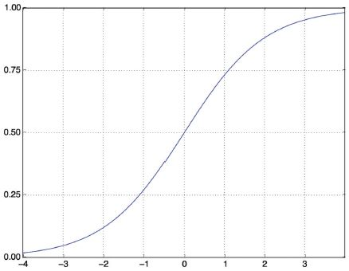

# **4. Ismerkedés a neurális hálózatokkal: Osztályozás és regresszió**

Ez a fejezet ezekkel foglalkozik:
* Az első példák a valós gépi tanulási munkafolyamatokra
* Osztályozási problémák kezelése vektoradatokon
* Folyamatos regressziós problémák kezelése vektoradatokon

Ez a fejezet arra szolgál, hogy elkezdje használni a neurális hálózatokat valódi problémák megoldására. A 2. és 3. fejezetben megszerzett ismereteit megszilárdítja, és a tanultakat három új feladatban alkalmazza, amelyek lefedik a neurális hálózatok három leggyakoribb használati esetét – a bináris osztályozást, a többosztályos osztályozást és a skaláris regressziót:
* Egy filmkritika pozitív vagy negatív besorolása (bináris osztályozás)
* Híradók osztályozása téma szerint (többosztályos osztályozás)
* Egy ház árának becslése ingatlanadatok alapján (skaláris regresszió)

Ezek a példák jelentik az első kapcsolatfelvételt a teljes körű gépi tanulási munkafolyamatokkal: megismerkedhet az adatok előfeldolgozásával, az alapvető modellarchitektúra elveivel és a modellértékeléssel. {96.o:}

**Osztályozási és regressziós szószedet**

Az osztályozás és a regresszió számos speciális kifejezést foglal magában. Néhányukkal már találkoztunk a korábbi példákban, és még többet fogunk látni belőlük a következő fejezetekben. Pontos, gépi tanulás-specifikus definícióik vannak, és ezeket ismernie kell:
* _Minta_ vagy _bemenet_ – Egy adatpont, amely bemegy a modellbe.
* _Előrejelzés_ vagy _kimenet_ – Ami kijön a modellből.
* _Cél_ – az igazság. Amit ideális esetben meg kellene jósolnia a modelljének egy külső adatforrás alapján.
* _Előrejelzési hiba_ vagy _veszteség érték_ – A modell előrejelzése és a cél közötti távolság mértéke.
* _Osztályok_ – Az osztályozási feladatban választható lehetséges címkék halmaza. Például a macska- és kutyaképek osztályozásakor a „kutya” és a „macska” a két osztály.
* _Címke_ – Az osztály megnevezése egy adott példányra az osztályozási problémában. Például, ha az 1234-es kép a „kutya” osztályba tartozik, akkor az  1234-es kép címkéje „kutya”.
* _Alapvető igazság_ vagy _magyarázatok_ – Egy adatkészlet összes cél értéke, amelyeket jellemzően emberek gyűjtenek össze.
* _Bináris osztályozás_ – Osztályozási feladat, ahol minden bemeneti mintát kizárólag két kategóriába kell besorolni.
* _Többosztályos osztályozás_ – Osztályozási feladat, ahol minden bemeneti mintát kettőnél több kategóriába kell besorolni: például kézzel írt számjegyek osztályozása.
* _Többcímkés osztályozás_ – Osztályozási feladat, ahol minden bemeneti mintához több címke is hozzárendelhető. Például egy adott kép macskát és kutyát is tartalmazhat, és a „macska” és a „kutya” címkével is meg kell jelölni. A képenkénti címkék száma általában változó.
* _Skalár regresszió_ – Olyan feladat, ahol a cél egy folytonos skalárérték. Jó példa erre a lakásárak előrejelzése: a különböző célárak egy folytonos teret alkotnak.
* _Vektor regresszió_ – Olyan feladat, ahol a cél folytonos értékek halmaza: például egy folytonos vektor. Ha több értékhez (például egy képen lévő határolókeret koordinátáihoz) képest végez regressziót, akkor vektoros regressziót hajt végre.
* _Mini-batch_ vagy _köteg_ – Minták egy kis halmaza (általában 8 és 128 között), amelyeket a modell egyidejűleg dolgoz fel. A minták száma gyakran 2 hatványa, hogy megkönnyítse a memóriakiosztást a GPU-n. A betanítás során egy mini köteggel számítanak ki egyetlen gradiens-süllyedés frissítést, amelyet a modell súlyaira alkalmaznak.

A fejezet végére képes lesz a neurális hálózatok segítségével egyszerű osztályozási és regressziós feladatokat kezelni vektoradatokon. Ezután készen áll arra, hogy az 5. fejezetben elkezdje a gépi tanulás elvibb, elméleti alapú megértését.

##4.1 Filmkritikák osztályozása: Példa bináris osztályozásra

A kétosztályos osztályozás vagy bináris osztályozás a gépi tanulási problémák egyik leggyakoribb fajtája. Ebben a példában meg fogjuk tanulni, hogy a filmértékeléseket hogyan lehet pozitív vagy negatív kategóriába sorolni a vélemények szöveges tartalma alapján.

###4.1.1 Az IMDB adathalmaz

Az IMDB adatkészlettel fogunk dolgozni: ez 50 000 erősen polarizált véleményből álló halmaz az Internet Movie Database-ból. Ezek 25 000 képzési és 25 000 tesztelési véleményre vannak felosztva, amelyek mindegyike 50%-ban negatív és 50%-ban pozitív értékelésből áll.

Csakúgy, mint az MNIST adatkészlet, az IMDB adatkészlet is a Keras csomaggal érkezik. Már előfeldolgozásra került: a kritikák (szósorok) egész számokból álló sorozatokká alakultak, ahol minden egész egy adott szót jelöl a szótárban. Ez lehetővé teszi számunkra, hogy a modellépítésre, a képzésre és az értékelésre összpontosítsunk. A 11. fejezetben megtudhatjuk, hogyan kell a semmiből feldolgozni a nyers szövegbevitelt.

A következő kód betölti az adatkészletet (első futtatásakor körülbelül 80 MB adat töltődik le a gépére).

**4.1 lista: Az IMDB adathalmaz betöltése**


```python
from tensorflow.keras.datasets import imdb
(train_data, train_labels), (test_data, test_labels) = imdb.load_data(
    num_words=10000)
```

A `num_words=10000` argumentum azt jelenti, hogy csak a 10 000 leggyakrabban előforduló szót fogja megtartani a képzési adatokban. A ritka szavakat elvetik. Ez lehetővé teszi, hogy kezelhető méretű vektoradatokkal dolgozzunk. Ha nem állítanánk be ezt a határt, akkor 88 585 egyedi szóval dolgoznánk a képzési adatokban, ami szükségtelenül nagy. E szavak közül sok csak egyetlen mintában fordul elő, ezért nem használhatók értelmesen osztályozáshoz.

A `train_data` és a `test_data` változók az értékelések listái; minden áttekintés szóindexek listája (szósorozatot kódol). A `train_labels` és a `test_labels` 0-kat és 1-eket tartalmazó listák, ahol a 0 a _negatívat_, az 1 pedig a _pozitívat_ jelöli:

```
>>> train_data[0]
[1, 14, 22, 16, ... 178, 32]
>>> train_labels[0]
1
```
Mivel a 10 000 leggyakoribb szóra szorítkozunk, egyetlen szóindex sem haladja meg a 10 000-et:

```
>>> max([max(sequence) for sequence in train_data])
9999
```
Az alábbiakban bemutatjuk, hogyan lehet gyorsan visszafejteni az egyik véleményt angol szavakra. {98.o:->}

**4.2 lista: Vélemények visszakódolása szöveggé**


```python
word_index = imdb.get_word_index()    #<--- A word_index egy szótár, amely a szavakat egész indexre képezi le.
reverse_word_index = dict(
    [(value, key) for (key, value) in word_index.items()])        #<--- Megfordítja, az egész indexeket szavakhoz rendeli
decoded_review = " ".join(
    [reverse_word_index.get(i - 3, "?") for i in train_data[0]])  #<--- Dekódolja a véleményt. Vegye észre,
                                                                  #     hogy az indexek 3-mal el vannak tolva,
                                                                  #     mivel a 0, 1 és 2 a „kitöltés”, a „sorozat kezdete”
                                                                  #     és az „ismeretlen” számára fenntartott indexek.
```

###4.1.2 Az adatok előkészítése

Az egész számok listáit nem lehet közvetlenül betáplálni egy neurális hálózatba. Mindegyik különböző hosszúságú, de a neurális hálózatok összefüggő adatkötegek feldolgozását várják. A listákat tenzorokká kell alakítania. Ennek két módja van:
* Töltsük fel a listákat úgy, hogy mindegyik egyforma hosszúságú legyen, alakítsuk át őket `(samples, max_length)` alakú egész tenzorokká, és indítsuk el a modellt egy olyan réteggel, amely képes kezelni az ilyen egész tenzorokat (az `Embedding` réteggel, amelyet részletesen a könyv későbbi részében érintünk).
* _Multi-hot kódoljuk_ a listákat, hogy 0-s és 1-es vektorokká alakítsuk azokat. Ez azt jelentené, hogy például a [8, 5] szekvenciát egy 10 000 dimenziós vektorrá alakítjuk, amely 0-t jelent, kivéve a 8-as és 5-ös indexeket, amelyek 1-ek. Ezután használhatunk egy `Dense` réteget, amely a modell első rétegeként képes lebegőpontos vektoradatok kezelésére.

Induljunk az utóbbi megoldással az adatok vektorizálásához, amelyet manuálisan kell megtenni a maximális átláthatóság érdekében.

**4.3 lista: Egész sorozatok kódolása multi-hot kódolással**


```python
import numpy as np
def vectorize_sequences(sequences, dimension=10000):
    results = np.zeros((len(sequences), dimension))   #<--- Létrehoz egy teljesen nulla, (len(sequences), dimension) alakú mátrixot
    for i, sequence in enumerate(sequences):
        for j in sequence:
            results[i, j] = 1.    #<--- A results[i] meghatározott indexeit 1-re állítja
    return results
x_train = vectorize_sequences(train_data)   #<--- Vektorizált betanítási adatok
x_test = vectorize_sequences(test_data)     #<--- Vektorizált tesztadatok
```

Így néznek ki most a minták:

```
>>> x_train[0]
array([ 0., 1., 1., ..., 0., 0., 0.])
```
Ezenkívül vektorizálni kell a címkéket, ami egyszerű:

```
y_train = np.asarray(train_labels).astype("float32")
y_test = np.asarray(test_labels).astype("float32")
```
Most az adatok készen állnak a neurális hálózatba való betáplálásra.

###4.1.3 A modell elkészítése

A bemeneti adatok vektorok, a címkék pedig skalárok (1-ek és 0-k): ez az egyik legegyszerűbb problémabeállítás, amellyel valaha találkozhat. Egy ilyen probléma esetén jól teljesítő modell a sűrűn összekapcsolt (`Dense`) rétegek sima kötege `relu` aktiválással.

Két kulcsfontosságú felépítési döntést kell meghozni egy ilyen `Dense` réteghalommal kapcsolatban:
* Hány réteget kell használni
* Hány egységet válasszunk az egyes rétegekhez

Az 5. fejezetben olyan formai alapelveket fogunk megtanulni, amelyek segítik ezeket a döntéseket. Egyelőre rám kell bíznia a következő architektúraválasztásokat:
* Két köztes réteg, egyenként 16 egységgel
* Egy harmadik réteg, amely az aktuális áttekintés hangulatára vonatkozó skaláris előrejelzést adja ki

A 4.1. ábra mutatja, hogyan néz ki a modell. A következő lista a Keras megvalósítását mutatja, hasonlóan a korábban látott MNIST példához.


**4.1. ábra:** A háromrétegű modell

**4.4 lista: Modell definiálása**


```python
from tensorflow import keras
from tensorflow.keras import layers

model = keras.Sequential([
    layers.Dense(16, activation="relu"),
    layers.Dense(16, activation="relu"),
    layers.Dense(1, activation="sigmoid")
])
```

Az egyes `Dense` rétegeknek átadott első argumentum a rétegben lévő egységek _száma_: a réteg reprezentációs terének dimenziója. Emlékszünk a 2. és 3. fejezetből, hogy minden ilyen `Dense` réteg `relu` aktiválással a következő tenzorműveleti láncot valósítja meg:

```
output = relu(dot(input, W) + b)
```
A 16 elem azt jelenti, hogy a `W` súlymátrix alakja `(input_dimension, 16)` lesz: a `W`-vel való pontszorzat a bemeneti adatokat egy 16-dimenziós reprezentációs térre vetíti (majd hozzá kell adni a `b` torzítási vektort, és erre kell alkalmazni a `relu` műveletet). A reprezentációs tér dimenzióit intuitív módon úgy értelmezhetjük, hogy „ekkora szabadságot engedünk meg a modellnek a belső reprezentációk tanulása során”. A több egység (több/nagyobb dimenziójú reprezentációs tér) lehetővé teszi, hogy a modell bonyolultabb reprezentációkat tanuljon meg, de ez költségesebbé teszi a modellt, és nemkívánatos minták megtanulásához vezethet (olyan minták, amelyek javítják ugyan a betanítási adatok teljesítményét, de a teszt adatokét nem).

A közbülső rétegek a `relu`-t használják aktiválási függvényként, a végső réteg pedig szigmoid aktiválást használ, hogy egy valószínűséget adjon ki (a 0 és 1 közötti pontszám azt jelzi, hogy a mintára mennyire valószínű, hogy a cél „1” lesz: mennyire valószínű, hogy a kritika pozitív lesz). A `relu` (rektifikált lineáris egység) egy olyan függvény, amely a negatív értékeket kinullázza (lásd 4.2. ábra), míg a szigmoid tetszőleges értékeket „összenyom” a `[0, 1]` intervallumba (lásd 4.3. ábra), ami valószínűségként értelmezhető.


**4.2 ábra:** Az egyenirányított lineáris egységfüggvény

Végül ki kell választani egy veszteségfüggvényt és egy optimalizálót. Mivel bináris osztályozási problémával kell szembenéznünk, és a modell kimenete egy valószínűség (a modellt egy egyelemű réteggel zárjuk le, szigmoid aktiválással), a legjobb a `binary_crossentropy` veszteség használata. Nem ez az egyetlen életképes választás: például használhatnánk a `mean_squared_error`-t is. De a keresztentrópia általában a legjobb választás, ha olyan modellekkel van dolgunk, amelyek valószínűségeket adnak ki. A _keresztentropia_ az információelmélet területéből származó mennyiség, amely a valószínűségi eloszlások közötti távolságot méri, vagy ebben az esetben az alap-igazság eloszlás és az előrejelzésed közötti távolságot.

Ami az optimalizálót illeti, az `rmsprop`-ot választjuk, amely általában jó alapértelmezett választás gyakorlatilag bármilyen probléma esetén.



**4.3. ábra:** A szigmoid függvény

---

**Mik azok az aktiváló függvények, és miért szükségesek?**

Olyan aktiváló függvény nélkül, mint a `relu` (más néven _nemlinearitás_), a `Dense` réteg két lineáris műveletből állna – egy pontszorzatból és egy összeadásból:

```
output = dot(input, W) + b
```
A réteg csak a bemeneti adatok _lineáris transzformációit_ (affin transzformációit) tudta megtanulni: a réteg _hipotézisetere_ a bemeneti adatok összes lehetséges 16 dimenziós térré való lineáris transzformációjának halmaza lenne. Egy ilyen hipotézistér túl szűk, és nem használná a többrétegű reprezentációt, mivel a lineáris rétegek mély halmaza továbbra is lineáris műveletet valósít meg: több réteg hozzáadása nem bővíti ki a hipotézisteret (amint azt a 2. fejezetben láthattuk).

Ahhoz, hogy hozzáférjünk egy sokkal gazdagabb hipotézistérhez, amely a mély reprezentációk előnyeit élvezi, szükség van egy nemlinearitási vagy aktiválási függvényre. A `relu` a legnépszerűbb aktiváló függvény a mélytanulásban, de sok más jelölt is van, amelyek mindegyike hasonlóan furcsa névvel érkezik: `prelu`, `elu` stb.

---

Itt van az a lépés, ahol beállítjuk a modellt az `rmsprop` optimalizálóval és a `binary_crossentropy` veszteségfüggvénnyel. Ne feledje, hogy a betanítás során is figyelni fogjuk a pontosságot.

**4.5 lista: A modell összeállítása**


```python
model.compile(optimizer="rmsprop",
              loss="binary_crossentropy",
              metrics=["accuracy"])
```

###4.1.4 A megközelítés kiértékelése

Amint azt a 3. fejezetben megtanultuk, a mélytanulási modellt soha nem szabad a betanítási adatai alapján értékelni – bevett gyakorlat, hogy egy kiértékelési készletet használunk a modell pontosságának ellenőrzésére a képzés során. Itt létrehozunk egy kiértékelő készletet úgy, hogy 10 000 mintát elkülönítünk az eredeti képzési adatokból.

**4.6 lista: Kiértékelő készlet félretétele**


```python
x_val = x_train[:10000]
partial_x_train = x_train[10000:]
y_val = y_train[:10000]
partial_y_train = y_train[10000:]
```

A modellt most 20 epochban (20 iteráció a betanítási adatokban szereplő összes mintán) 512 mintát tartalmazó mini kötegekben fogjuk betanítani. Ugyanakkor figyelni fogjuk a veszteséget és a pontosságot az általunk elkülönített 10 000 mintán. Ehhez a kiértékelő adatokat `validation_data` argumentumként adjuk át.

**4.7 lista: A modell betanítása**


```python
history = model.fit(partial_x_train,
                    partial_y_train,
                    epochs=20,
                    batch_size=512,
                    validation_data=(x_val, y_val))
```

CPU-n ez kevesebb mint 2 másodpercet vesz igénybe korszakonként – a betanítás 20 másodpercen belül véget ér. Minden korszak végén van egy kis szünet, amikor a modell a 10 000 kiértékelő adatmintán kiszámítja a veszteségét és a pontosságát.

Ne feledje, hogy a `model.fit()` függvény hívása egy `History` objektumot ad vissza, amint azt a 3. fejezetben láthattuk. Ennek az objektumnak van egy `history` tagja, amely egy szótár, amely adatokat tartalmaz mindarról, ami a képzés során történt. Nézzük meg:

```
>>> history_dict = history.history
>>> history_dict.keys()
[u"accuracy", u"loss", u"val_accuracy", u"val_loss"]
```
A szótár négy bejegyzést tartalmaz: egyet mérőszámonként, amelyet a képzés és az kiértékelés során figyelt. A következő két listában a Matplotlib segítségével ábrázoljuk egymás mellett a betanítási és kiértékelési veszteséget (lásd 4.4. ábra), valamint a betanítási és kiértékelési pontosságot (lásd a 4.5. ábrát). Vegye figyelembe, hogy a saját eredményei kissé eltérhetnek a modell eltérő véletlenszerű inicializálása miatt.


**4.4. ábra:** Képzési és kiértékelési veszteség


**4.5. ábra:** A képzés és a kiértékelés pontossága

**4.8 lista: A képzési és kiértékelési veszteség ábrázolása**


```python
import matplotlib.pyplot as plt
history_dict = history.history
loss_values = history_dict["loss"]
val_loss_values = history_dict["val_loss"]
epochs = range(1, len(loss_values) + 1)
plt.plot(epochs, loss_values, "bo", label="Training loss")      #<--- A „bo” a „kék pont”-ot jelenti.
plt.plot(epochs, val_loss_values, "b", label="Validation loss") #<--- A "b" jelentése "folytonos kék vonal".
plt.title("Training and validation loss")
plt.xlabel("Epochs")
plt.ylabel("Loss")
plt.legend()
plt.show()
```

**4.9 lista: A képzés és az kiértékelés pontosságának ábrázolása**


```python
plt.clf()           #<--- Törli az ábrát
acc = history_dict["accuracy"]
val_acc = history_dict["val_accuracy"]
plt.plot(epochs, acc, "bo", label="Training acc")
plt.plot(epochs, val_acc, "b", label="Validation acc")
plt.title("Training and validation accuracy")
plt.xlabel("Epochs")
plt.ylabel("Accuracy")
plt.legend()
plt.show()
```

Mint látható, a betanítási veszteség minden korszakban csökken, és a betanítás pontossága minden korszakban nő. Ez az, amit elvárhat a gradiens-descent optimalizálás futtatásakor – a minimálisra csökkenteni kívánt mennyiségnek minden iterációval kisebbnek kell lennie. De nem ez a helyzet a kiértékelési veszteség és a pontosság esetében: úgy tűnik, hogy a negyedik korszakban érik el a csúcsot. Ez egy példa arra, amire korábban figyelmeztettünk: az a modell, amely jobban teljesít a képzési adatokon, nem feltétlenül olyan modell, amely jobban teljesít olyan adatokon, amelyeket korábban soha nem látott. Pontosabban fogalmazva, amit látunk ez a _túltanulás_: a negyedik korszak után túloptimalizálja a betanítási adatokat, és olyan reprezentációkat tanul meg, amelyek a képzési adatokra jellemzőek, és nem általánosítanak a képzési készleten kívüli adatokra.

Ebben az esetben, hogy elkerüljük a túltanulást, négy korszak után abbahagyhatjuk az betanítást. Általában számos technikát használhatunk a túltanulás csökkentésére, amelyekről az 5. fejezetben fogunk beszélni.

Tanítsunk meg egy új modellt a nulláról négy korszakon keresztül, majd értékeljük ki a tesztadatok alapján.

**4.10 lista: Modell kiképzése a semmiről kezdve**


```python
model = keras.Sequential([
    layers.Dense(16, activation="relu"),
    layers.Dense(16, activation="relu"),
    layers.Dense(1, activation="sigmoid")
])
model.compile(optimizer="rmsprop",
              loss="binary_crossentropy",
              metrics=["accuracy"])
model.fit(x_train, y_train, epochs=4, batch_size=512)
results = model.evaluate(x_test, y_test)
```

A végeredmény a következő:

```
>>> results
[0.2929924130630493, 0.88327999999999995]   #<--- Az első szám, 0.29, a teszt vesztesége, a második szám, 0.88, a teszt pontossága.
```
Ez a meglehetősen naiv megközelítés 88%-os pontosságot ér el. A legmodernebb megközelítésekkel közel 95%-ot érhetünk el.

###4.1.5 Betanított modell használata az új adatokra vonatkozó előrejelzések generálásához

A modell betanítása után gyakorlati környezetben szeretnénk azt használni. A 3. fejezetben megtanult `predict` metódussal a pozitív értékelések valószínűségét tudjuk generálni:

```
>>> model.predict(x_test)
array([[ 0.98006207]
       [ 0.99758697]
       [ 0.99975556]
       ...,
       [ 0.82167041]
       [ 0.02885115]
       [ 0.65371346]], dtype=float32)
```
Amint látható, a modell bizonyos minták esetében magabiztos (0,99 vagy több, illetve 0,01 vagy kevesebb), míg mások esetében kevésbé magabiztos (0,6, 0,4).

###4.1.6 További kísérletek

A következő kísérletek segítenek meggyőzni arról, hogy az architektúra által hozott döntések meglehetősen ésszerűek, bár van még hova fejlődni:
* Két reprezentációs réteget használtunk a végső osztályozási réteg előtt. Próbáljunk meg egy vagy három ábrázolási réteget használni, és nézzük meg, hogy ez hogyan befolyásolja a kiértékelést és a teszt pontosságát.
* Próbáljunk több vagy kevesebb egységet tartalmazó rétegeket használni: 32 egység, 64 egység stb.
* Próbáljuk meg az `mse` veszteségfüggvényt használni a `binary_crossentropy` helyett.
* Próbáljuk meg a `tanh` aktiválást (ez a neurális hálózatok korai időszakában volt népszerű) a `relu` helyett.

###4.1.7 Összefoglalás

A következőket érdemes levonni ebből a példából:
* Általában elég sok előfeldolgozást kell végeznie a nyers adatokon, hogy azokat – tenzorként – be tudja tölteni egy neurális hálózatba. A szavak sorozatai kódolhatók bináris vektorokként, de vannak más kódolási lehetőségek is.
* A halmozott `Dense` rétegek `relu` aktiválással számos problémát képes megoldani (beleértve a hangulatbesorolást is), és valószínűleg gyakran fogja használni ezeket.
* Egy bináris osztályozási feladatnál (két kimeneti osztály) a modellnek egy elemmel rendelkező `Dense` réteggel és egy `sigmoid` aktiválással kell végződnie: a modell kimenetének egy 0 és 1 közötti skalárnak kell lennie, amely egy valószínűséget kódol.
* Az ilyen skaláris szigmoid kimenetben bináris osztályozási feladat esetén a veszteségfüggvény a `binary_crossentropy` kell legyen.
* Az `rmsprop` optimalizáló általában elég jó választás, bármilyen probléma is legyen. Így egy dologgal kevesebb, ami miatt aggódnia kell.
* Ahogy javulnak a képzési adataikon, a neurális hálózatok végül túltanulásnak indulnak, és egyre rosszabb eredményeket érnek el olyan adatokon, amelyeket korábban soha nem láttak. Ügyeljen arra, hogy mindig figyelje a teljesítményt azokon az adatokon, amelyek kívül esnek az betanítási halmazon.

##4.2 Híradók osztályozása: Többosztályos osztályozási példa

Az előző részben láthattuk, hogyan lehet a vektorbemeneteket két egymást kizáró osztályba sorolni sűrűn összekapcsolt neurális hálózat segítségével. De mi történik, ha kettőnél több osztályunk van?

Ebben a részben felépítünk egy modellt a Reuters hírszolgálatokat 46 egymást kizáró témába történő besorolására. Mivel sok osztályunk van, ez a probléma a _többosztályos osztályozás_ egy példánya, és mivel minden adatpontot csak egy kategóriába kell besorolni, a probléma pontosabban az _egycímkés többosztályos osztályozás_ egy példánya. Ha minden adatpont több kategóriába is tartozhatna (jelen esetben témakörökhöz), akkor _többcímkés, több osztályú osztályozási_ problémával kell szembenéznünk.


