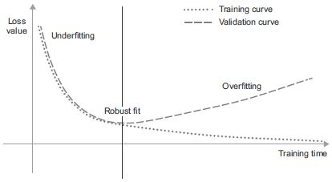

# **5. A gépi tanulás alapjai**

Ez a fejezet ezekkel foglalkozik:

* Az általánosítás és az optimalizálás közötti feszültség megértése, a gépi tanulás alapvető kérdése
* Értékelési módszerek a gépi tanulási modellekhez
* Legjobb gyakorlati fogások a modellillesztés javításához
* Legjobb gyakorlatok a jobb általánosítás eléréséhez

A 4. fejezetben található három gyakorlati példa után már kezd megismerkedni az osztályozási és regressziós problémák neurális hálózatok segítségével történő megoldásával, és tanúja volt a gépi tanulás központi problémájának: a túltanulásnak. Ez a fejezet szilárd fogalmi keretbe foglalja a gépi tanulással kapcsolatos új megérzéseit, kiemelve a pontos modellértékelés valamint a betanítás és az általánosítás közötti egyensúly fontosságát.

## 5.1 Általánosítás: A gépi tanulás célja

A 4. fejezetben bemutatott három példában – a filmkritikák előrejelzése, a témabesorolás és a lakásár regressziója – az adatokat felosztottuk egy tanítási halmazra, egy kiértékelő halmazra és egy teszthalmazra. Hamar nyilvánvalóvá vált, hogy miért ne ugyanazokon az adatokon értékeljük a modelleket, amelyekkel betanították őket: néhány tanulási szakasz (korszak) elteltével a soha nem látott adatok teljesítménye elkezdett eltérni a képzési adatok teljesítményétől, amelyek pedig mindig javulnak a tanulás előrehaladtával. A modellek kezdtek túlzottan illeszkedni az adateloszláshoz. A túltanulás (túlillesztés) minden gépi tanulási problémában előfordul.

A gépi tanulás alapvető kérdése az optimalizálás és az általánosítás közötti feszültség. Az _optimalizálás_ azt a folyamatot jelenti, amelynek során egy modellt úgy állítanak be, hogy a lehető legjobb teljesítményt érjék el a betanítási adatokon (a _tanulás_ a _gépi tanulásban_), míg az _általánosítás_ arra utal, hogy a betanított modell milyen jól teljesít azokon az adatokon, amelyeket korábban soha nem látott. A játék célja természetesen a jó általánosítás, de nem te irányítod az általánosítást; a modellt csak a betanítási adataihoz tudod illeszteni. Ha ezt _túl jól_ csinálod, beindul a túltanulás, amit aztán az általánosítás szenved meg.

De mi okozza a túltanulást? Hogyan érhetünk el jó általánosítást?

### 5.1.1 Alul- és túlillesztés

Az előző fejezetben látott modellek esetében a visszatartott kiértékelő adatok teljesítménye javulni kezdett a képzés előrehaladtával, majd egy idő után elkerülhetetlenül elérte a csúcsot. Ez a minta univerzális (az 5.1. ábrán látható). Bármilyen modelltípusnál és adatkészletnél látható.

**5.1. ábra:** Mintaszerű túlillesztési viselkedés

A betanítás elején az optimalizálás és az általánosítás korrelál: minél kisebb a betanítási adatok vesztesége, annál kisebb a tesztadatok vesztesége. Amíg ez megtörténik, a modelled úgymond alulillesztett: van még tennivaló; a hálózat még nem modellezte le az összes releváns mintát a képzési adatokban. A betanítási adatok bizonyos számú iterációja után azonban az általánosítás nem javul, a kiértékelési mérőszámok megállnak, majd hanyatlásnak indulnak: a modell kezd túltanulni. Ez azt jelenti, hogy olyan mintákat kezd megtanulni, amelyek a képzési adatokra jellemzőek, de félrevezetőek vagy irrelevánsak, amikor új adatokról van szó.
