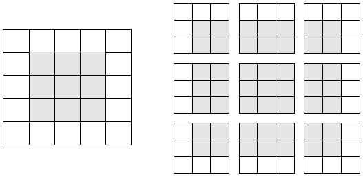
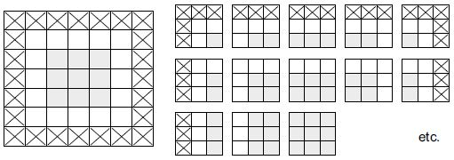
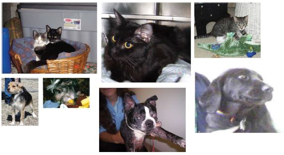

# **8. Bevezetés a gépi látás mélytanulásába**

Ez a fejezet ezekkel foglalkozik:
* A konvolúciós neurális hálózatok (convnet - CNN) megértése
* Adatbővítés használata a túlillesztés csökkentésére
* Előképzett convnet használata a jellemzők kinyeréséhez
* Előképzett convnet finomhangolása

A gépi látás (CV = Computer Vision) a mély tanulás legkorábbi és legnagyobb sikertörténete. Minden nap kapcsolatba kerülünk a mély-látó modellekkel – a Google Fotókon, a Google képkeresőn, a YouTube-on, a kameraalkalmazások videószűrőin, az OCR-szoftveren és még sok máson keresztül. Ezek a modellek az önvezetés, a robotika, a mesterséges intelligencia által támogatott orvosi diagnosztika, az autonóm kiskereskedelmi pénztárrendszerek és még az önálló mezőgazdálkodás terén folyó kutatások középpontjában is ott állnak.

A gépi látás az a problémakör, amely a mély tanulás kezdeti térnyeréséhez vezetett 2011 és 2015 között. A *konvolúciós neurális hálózatoknak* (CNN) nevezett mélytanulási modell ekkortájt kezdett figyelemreméltóan jó eredményeket elérni a képosztályozási versenyeken, először Dan Ciresan nyert két rétegversenyen (az ICDAR 2011 kínai karakterfelismerő verseny és az IJCNN 2011 német közlekedési táblák felismerési versenye), majd különösen 2012 őszén, amikor Hinton csoportja megnyerte a nagy horderejű ImageNet nagyszabású vizuális felismerési kihívását. Gyorsan sok ígéretesebb eredmény kezdett felbukkanni más gépi látási feladatokban is.

Érdekes módon ezek a korai sikerek nem voltak elégségesek ahhoz, hogy a mély tanulást akkoriban általánossá tegyék – ez néhány évbe telt. A gépi látást kutató közösség már sok évet eltöltött azzal, hogy neurális hálózatokon kívüli más módszerekbe fektessen be, és nem volt egészen készen arra, hogy lemondjon róluk, csak azért, mert egy új gyerek jött a háztömbbe. 2013-ban és 2014-ben sok vezető gépi látást kutató még mindig heves szkepticizmussal viseltetett a mély tanulással kapcsolatban. Csak 2016-ban vált végül dominánssá. Emlékszem, 2014 februárjában buzdítottam egy volt professzoromat, hogy forduljon a mély tanulás felé. – "Ez a következő nagy dolog!" - ezt mondtam. „Nos, talán ez csak egy hóbort” – válaszolta. 2016-ra az egész laborja mélytanulást végzett. Nem lehet megállítani egy ötletet, amelynek eljött az ideje.

Ez a fejezet bemutatja a konvolúciós neurális hálózatokat, más néven *convnet*-eket, a mély tanulási modell azon típusát, amelyet ma már szinte általánosan használnak a gépi látási alkalmazásokban. Megtanulhatja a convnet alkalmazását képbesorolási problémákra – különösen azokra, amelyekkel kis betanítási adatkészlet jár, és amelyek a leggyakoribb felhasználási esetek, ha ön nem egy nagy technológiai vállalat.

## 8.1 Bevezetés a convnetbe

Hamarosan belemerülünk abba az elméletbe, hogy mik azok a convnet-ek, és miért olyan sikeresek a gépi látási feladatokban. Először azonban vessünk egy gyakorlati pillantást egy egyszerű convnet példára, amely az MNIST számjegyeket osztályozza. Ezt a feladatot a 2. fejezetben egy sűrűn összekötött hálózat segítségével végeztük el (a teszt pontossága akkor 97,8% volt). Annak ellenére, hogy a convnet alapszintű lesz, a pontossága teljesen legyőzi a 2. fejezetből származó, sűrűn összekötött modellünket.

A következő lista bemutatja, hogyan néz ki egy alapvető convnet. Ez egy halom `Conv2D` és `MaxPooling2D` réteg. Egy percen belül látni fogja, hogy pontosan mit csinálnak. A modellt az előző fejezetben bemutatott Funkcionális API segítségével készítjük el.

**8.1 lista: Egy kis convnet példányosítása**


```python
from tensorflow import keras
from tensorflow.keras import layers
inputs = keras.Input(shape=(28, 28, 1))
x = layers.Conv2D(filters=32, kernel_size=3, activation="relu")(inputs)
x = layers.MaxPooling2D(pool_size=2)(x)
x = layers.Conv2D(filters=64, kernel_size=3, activation="relu")(x)
x = layers.MaxPooling2D(pool_size=2)(x)
x = layers.Conv2D(filters=128, kernel_size=3, activation="relu")(x)
x = layers.Flatten()(x)
outputs = layers.Dense(10, activation="softmax")(x)
model = keras.Model(inputs=inputs, outputs=outputs)
```

Fontos, hogy a convnet az alakzat bemeneti tenzorait veszi fel `(image_height, image_width, image_channels)`, a kötegdimenzió nélkül. Ebben az esetben a convnet-et úgy állítjuk be, hogy a `(28, 28, 1)` méretű bemeneteket dolgozza fel, ami az MNIST képek formátuma.

Mutassuk meg a convnetünk architektúráját.

**8.2 lista: A modell összegzésének megjelenítése**

```
>>> model.summary()
Model: "model"
_________________________________________________________________
Layer (type)                 Output Shape              Param #
=================================================================
input_1 (InputLayer)         [(None, 28, 28, 1)]       0
_________________________________________________________________
conv2d (Conv2D)              (None, 26, 26, 32)        320
_________________________________________________________________
max_pooling2d (MaxPooling2D) (None, 13, 13, 32)        0
_________________________________________________________________
conv2d_1 (Conv2D)            (None, 11, 11, 64)        18496
_________________________________________________________________
max_pooling2d_1 (MaxPooling2 (None, 5, 5, 64)          0
_________________________________________________________________
conv2d_2 (Conv2D)            (None, 3, 3, 128)         73856
_________________________________________________________________
flatten (Flatten)            (None, 1152)              0
_________________________________________________________________
dense (Dense)                (None, 10)                11530
=================================================================
Total params: 104,202
Trainable params: 104,202
Non-trainable params: 0
_________________________________________________________________
```

Látható, hogy minden `Conv2D` és `MaxPooling2D` réteg kimenete egy `(height, width, channels)` alakú harmadrendű tenzor. A szélesség és magasság méretek általában csökkennek, ahogy mélyebbre megyünk a modellben. A csatornák számát a `Conv2D` rétegeknek átadott első argumentum (32, 64 vagy 128) szabályozza.

Az utolsó `Conv2D` réteg után a (3, 3, 128) alakú kimenetet kapjuk – egy 128 csatornából álló 3 × 3-as jellemzőtérképet. A következő lépés ennek a kimenetnek a betáplálása egy sűrűn összekapcsolt osztályozóba, mint amilyeneket már ismerünk: egy halom `Dense` réteget. Ezek az osztályozók vektorokat dolgoznak fel, amelyek 1D-sek, míg az aktuális kimenet egy harmadrendű tenzor. A rés áthidalása érdekében a 3D kimeneteket 1D-re simítjuk egy `Flatten` réteggel, mielőtt hozzáadnánk a `Dense` rétegeket.

Végül 10 utas osztályozást végzünk, így az utolsó rétegünk 10 kimenettel és softmax aktiválással rendelkezik.

Most pedig tanítsuk be a convnetet az MNIST számjegyekre. A 2. fejezetben található MNIST-példa kódjának nagy részét újra felhasználjuk. Mivel 10-utas osztályozást végzünk softmax kimenettel, a kategorikus keresztentrópia veszteséget fogjuk alkalmazni, és mivel a címkéink egész számok, a ritka változatát fogjuk használni, a `sparse_categorical_crossentropy`-t.

**8.3 lista: A convnet betanítása MNIST képeken**


```python
from tensorflow.keras.datasets import mnist

(train_images, train_labels), (test_images, test_labels) = mnist.load_data()
train_images = train_images.reshape((60000, 28, 28, 1))
train_images = train_images.astype("float32") / 255
test_images = test_images.reshape((10000, 28, 28, 1))
test_images = test_images.astype("float32") / 255
model.compile(optimizer="rmsprop",
              loss="sparse_categorical_crossentropy",
              metrics=["accuracy"])
model.fit(train_images, train_labels, epochs=5, batch_size=64)
```

Értékeljük a modellt a tesztadatok alapján.

**8.4 lista: A convnet kiértékelése**


```python
>>> test_loss, test_acc = model.evaluate(test_images, test_labels)
>>> print(f"Test accuracy: {test_acc:.3f}")
Test accuracy: 0.991
```

Míg a 2. fejezetben található sűrűn összekapcsolt modell tesztpontossága 97,8%, addig az alap convnet tesztpontossága 99,1%: a hibaarányt körülbelül 60%-kal csökkentettük (relatív). Nem rossz!

De miért működik olyan jól ez az egyszerű convnet egy sűrűn összekapcsolt modellhez képest? Ennek megválaszolásához nézzük meg, mit csinál a `Conv2D` és a `MaxPooling2D` réteg.

###8.1.1 A konvolúció művelet

Az alapvető különbség a sűrűn összefüggő réteg és a konvolúciós réteg között a következő: a `Dense` rétegek globális mintákat tanulnak meg bemeneti jellemzőterükben (például egy MNIST számjegy esetén az összes képpontot magában foglaló mintákat), míg a konvolúciós rétegek helyi mintákat tanulnak meg – ebben az esetben a bemenetek kis 2D-s ablakaiban található képeket, mintákat (lásd 8.1. ábra). Az előző példában ezek az ablakok mind 3 × 3 méretűek voltak.


**8.1. ábra:** A képek helyi mintákra bonthatók, például élekre, textúrákra stb.

Ez a fő jellemző két érdekes tulajdonságot biztosít a convneteknek:
* *Az általuk tanult minták eltolás-invariánsak.* Miután megtanult egy bizonyos mintát a kép jobb alsó sarkában, a convnet bárhol képes felismerni: például a bal felső sarokban. Egy sűrűn összekapcsolt modellnek újra meg kell tanulnia a mintát, ha új helyen jelenik meg. Ez teszi a convneteket hatékonnyá képek feldolgozásakor (mivel _a vizuális világ alapvetően áthelyezés-invariáns_): kevesebb betanítási mintára van szükségük ahhoz, hogy megtanulják az általánosító erővel bíró reprezentációkat.
* *Képesek megtanulni a minták térbeli hierarchiáját.* Az első konvolúciós réteg kis helyi mintákat, például éleket, a második konvolúciós réteg az első réteg jellemzőiből készült nagyobb mintákat, és így tovább (lásd a 8.2. ábrát). Ez teszi lehetővé a convnet számára, hogy hatékonyan tanuljon meg egyre összetettebb és absztraktabb vizuális fogalmakat, mivel _a vizuális világ alapvetően térben hierarchikus_.


**8.2. ábra:** A vizuális világot a vizuális modulok térbeli hierarchiája alkotja:
az elemi vonalak vagy textúrák egyszerű tárgyakká, például szemekké vagy fülekké egyesülnek, amelyekből olyan magas szintű fogalmak születnek, mint a „macska”.

A konvolúciók harmadrendű tenzorokon, úgynevezett _jellemzőtérképeken_ működnek, két térbeli tengellyel (_magasság_ és _szélesség_), valamint egy _mélységi_ tengellyel (más néven _csatornatengely_). RGB kép esetén a mélységi tengely mérete 3, mivel a képnek három színcsatornája van: piros, zöld és kék. Fekete-fehér képnél, mint az MNIST számjegyek, a mélység 1 (szürke szintek). A konvolúciós művelet foltokat von ki a bemenet jellemzőtérképéből, és ugyanazt a transzformációt alkalmazza erre az összes foltra, így egy _kimeneti jellemzőtérképet_ hoz létre. Ez a kimeneti jellemzőtérkép még mindig harmadrendű tenzor: van szélessége és magassága. Mélysége tetszőleges lehet, mert a kimeneti mélység a réteg paramétere, és a különböző csatornák ezen a mélységtengelyen már nem jelölik az adott színt, mint az RGB bemenetnél; inkább _szűrőket_ jelentenek. A szűrők a bemeneti adatok meghatározott szempontjait kódolják: magas szinten egyetlen szűrő kódolni képes például az „arc jelenléte a bemenetben” fogalmat.

Az MNIST példában az első konvolúciós réteg egy (28, 28, 1) méretű jellemzőtérképet vesz át, és egy (26, 26, 32) méretű jellemzőtérképet ad ki: 32 szűrőt számít ki a bemenetére. Mind a 32 kimeneti csatorna egy 26 × 26-os értékrácsot tartalmaz, amely a szűrő _választérképe_ a bemenetre, jelezve a szűrőmintázat válaszát a bemenet különböző helyein (lásd a 8.3. ábrát).


**8.3. ábra:** A választérkép fogalma: egy minta 2D-s térképe a bemenet különböző helyein

Ezt jelenti a _jellemzőtérkép_ kifejezés: a mélységi tengely minden dimenziója egy jellemző (vagy egy szűrő), és az `output[:, :, n]` másodrendű tenzor a szűrő bemenetre adott válaszának 2D-s térbeli _térképe_.

A konvolúciókat két fő paraméter határozza meg:
* _A bemenetekből kinyert foltok mérete_ – ezek általában 3 × 3 vagy 5 × 5 méretűek. A példában 3 × 3 méretűek voltak, ami gyakori választás.
* _A kimeneti jellemzőtérkép mélysége_ – Ez a konvolúció által kiszámított szűrők száma. A példa 32-es mélységgel kezdődött és 64-es mélységgel ért véget.

A Keras `Conv2D` rétegekben ezek a paraméterek a rétegnek átadott első argumentumok: `Conv2D(output_depth, (window_height, window_width))`.

A konvolúció úgy működik, hogy ezeket a 3 × 3 vagy 5 × 5 méretű ablakokat _elcsúsztatja_ a 3D beviteli jellemzőtérképen, megáll minden lehetséges helyen, és kivonja a környező elemek 3D foltját (`(window_height, window_width, input_depth)` alakú). Minden egyes ilyen 3D foltot ezután egy `(output_depth,)` alkú 1D vektorrá alakít át, ami egy megtanult súlymátrixszal való tenzorszorzaton keresztül történik, amelyet _konvolúciós kernelnek_ neveznek – ugyanazt a kernelt használjuk fel újra minden folton. Mindezek a vektorok (foltonként egy) azután térben újból összeállnak egy `(height, width, output_
depth)` alakú 3D kimeneti térképbe. A kimeneti jellemzőtérkép minden térbeli helye megegyezik a bemeneti jellemzőtérkép azonos helyével (például a kimenet jobb alsó sarka a bemenet jobb alsó sarkáról tartalmaz információkat). Például 3 × 3 ablaknál az `output[i, j, :]` vektor az `input[i-1:i+1, j-1:j+1, :]` 3D foltból származik. A teljes folyamatot a 8.4. ábra részletezi.


**8.4. ábra:** A konvolúció működése

Vegye figyelembe, hogy a kimeneti szélesség és magasság két okból is eltérhet a bemeneti szélességtől és magasságtól:
* Szegélyhatások, amelyek ellensúlyozhatók a bemeneti jellemzőtérkép kitömésével
* A _lépések_ használata, amit egy pillanat múlva definiálok

Nézzük meg mélyebben ezeket a fogalmakat.

**A SZEGÉLYHATÁSOK ÉS A KITÖMÉS MEGÉRTÉSE**

Vegyünk egy 5 × 5 méretű jellemzőtérképet (összesen 25 kocka). Csak 9 kocka van, amelyek köré egy 3 × 3-as ablakot középre tudunk helyezni, és ez egy 3 × 3-as rácsot alkot (lásd a 8.5. ábrát). Ezért a kimeneti jellemzőtérkép 3 × 3 lesz. Kicsit zsugorodik: ebben az esetben pontosan két kockával mindegyik dimenzió irányában. Ezt a szegélyeffektust láthatja működés közben a korábbi példában: 28 × 28 bemenettel kezdi, amely az első konvolúciós réteg után 26 × 26 lesz.



**8.5. ábra:** 3 × 3-as foltok érvényes helyei egy 5 × 5-ös bemeneti jellemzőtérképen

Ha olyan kimeneti jellemzőtérképet szeretnénk kapni, amelynek térbeli méretei megegyeznek a bemenettel, használhatunk kitömést. A kitömés abból áll, hogy megfelelő számú sort és oszlopot adunk hozzá a beviteli jellemzőtérkép mindkét oldalához, úgy hogy minden beviteli csempe köré központosan konvolúciós ablakot lehessen illeszteni. Egy 3 × 3-as ablakhoz egy oszlopot adunk hozzá a jobb oldalon, egy oszlopot a bal oldalon, egy sort a tetején és egy sort alul. Egy 5 × 5-ös ablakhoz két sort kell hozzáadni (lásd a 8.6. ábrát).



**8.6 ábra:** 5 × 5-ös bemenet kitömése úgy, hogy 25 darab 3 × 3-as foltot tudjunk kiválasztani

A `Conv2D` rétegekben a kitömés a `padding` argumentummal konfigurálható, amely két értéket vesz fel: `"valid"`, ami azt jelenti, hogy nincs kitöltés (csak az érvényes ablakhelyek kerülnek felhasználásra), és `"same"`, ami azt jelenti, hogy "kitöltés oly módon, hogy ugyanolyan szélességű és magasságú kimenettel rendelkezzen, mint a bemenet." A padding argumentum alapértelmezés szerint `"valid"`.

**A KONVOLUCIÓS LÉPÉSEK MEGÉRTÉSE**

A másik tényező, amely befolyásolhatja a kimenet méretét, a _lépések_ fogalma. A konvolúció eddigi leírása abból indult ki, hogy a konvolúciós ablakok középső kockái mind határosak egymással. De a két egymást követő ablak közötti távolság a konvolúció egyik paramétere, amelyet `strides`-nek neveznek, és amely alapértelmezés szerint 1. Lehetnek _lépcsőzetes konvolúciók_ is: olyan konvolúciók, amelyek lépésszáma nagyobb, mint 1. A 8.7. ábrán láthatók az olyan foltok, amelyeket egy 3 × 3 konvolúció választ ki 2 lépéssel 5 × 5 bemeneten (kitömés nélkül).


**8.7. ábra:** 3 × 3 konvolúciós foltok 2 × 2 lépéssel

A 2 lépés használata azt jelenti, hogy a jellemzőtérkép szélességét és magasságát 2-szeres mintavételezéssel csökkentjük (a szegélyeffektusok által kiváltott változásokon kívül). A lépcsőzetes konvolúciót ritkán alkalmazzák az osztályozási modellekben, de bizonyos típusú modelleknél jól jönnek, amint azt a következő fejezetben látni fogjuk.
Az osztályozási modellekben a lépések helyett inkább a _max-pooling_ műveletet használjuk a jellemzőtérképek mintavételezésére, amit az első convnet példánkban már láthattunk. Nézzük meg alaposabban.

### 8.1.2 A max-pooling (max-összevonó) művelet

A convnet példában észrevehette, hogy a jellemzőtérképek mérete felére csökken minden `MaxPooling2D` réteg után. Például az első `MaxPooling2D` rétegek előtt a jellemzőtérkép 26 × 26 méretű, de a max-pooling művelet felezi azt 13 × 13-ra. Ez a max-pooling szerepe: a jellemzőtérképek agresszív alulmintavételezése, hasonlóan a lépcsős konvolúcióhoz.

A max pooling abból áll, hogy kiválasztja az ablakokat a bemeneti jellemzőtérképekből, és kiadja az egyes csatornák maximális értékét. Elvileg hasonló a konvolúcióhoz, azzal a különbséggel, hogy ahelyett, hogy a helyi foltokat egy tanult lineáris transzformációval (a konvolúciós kernel) transzformálnák, egy keménykódolt `max` tenzorművelettel alakítják át őket. Nagy különbség a konvolúcióhoz képest, hogy a max pooling általában 2 × 2 ablakkal és 2 lépéssel történik, hogy a jellemzőtérképeket felére csökkentsék. Másrészt a konvolúciót általában 3 × 3 ablakkal végzik, és lépés nélkül (a lépés 1). {210.o:}

Miért kell így alulmintavételezni a jellemzőtérképeket? Miért ne távolítsa el a max-pooling rétegeket, és tartsa fenn inkább a meglehetősen nagy jellemzőtérképeket mindvégig? Nézzük meg ezt a lehetőséget. A modellünk így nézne ki, mint az alábbi listán.

**8.5. lista: Egy helytelenül strukturált convnet, amelyből hiányoznak a max-pooling rétegei**


```python
inputs = keras.Input(shape=(28, 28, 1))
x = layers.Conv2D(filters=32, kernel_size=3, activation="relu")(inputs)
x = layers.Conv2D(filters=64, kernel_size=3, activation="relu")(x)
x = layers.Conv2D(filters=128, kernel_size=3, activation="relu")(x)
x = layers.Flatten()(x)
outputs = layers.Dense(10, activation="softmax")(x)
model_no_max_pool = keras.Model(inputs=inputs, outputs=outputs)
```

Íme egy összefoglaló a modellről:

```
>>> model_no_max_pool.summary()
Model: "model_1"
_________________________________________________________________
Layer (type)                 Output Shape              Param #
=================================================================
input_2 (InputLayer)         [(None, 28, 28, 1)]       0
_________________________________________________________________
conv2d_3 (Conv2D)            (None, 26, 26, 32)        320
_________________________________________________________________
conv2d_4 (Conv2D)            (None, 24, 24, 64)        18496
_________________________________________________________________
conv2d_5 (Conv2D)            (None, 22, 22, 128)       73856
_________________________________________________________________
flatten_1 (Flatten)          (None, 61952)             0
_________________________________________________________________
dense_1 (Dense)              (None, 10)                619530
=================================================================
Total params: 712,202
Trainable params: 712,202
Non-trainable params: 0
_________________________________________________________________
```

Mi a baj ezzel a beállítással? Két dolog:
* Nem segíti a jellemzők térbeli hierarchiájának elsajátítását. A harmadik réteg 3 × 3-as ablakai csak a kezdeti bemenet 7 × 7-es ablakaiból származó információkat tartalmaznak. A convnet által megtanult magas szintű minták még mindig nagyon kicsik a kezdeti bevitelhez képest, ami nem biztos, hogy elég ahhoz, hogy megtanulja a számjegyek osztályozását (próbáljon meg egy számjegyet úgy felismerni, hogy csak 7 × 7 pixeles ablakon keresztül nézi meg! ). Szükségünk van az utolsó konvolúciós réteg jellemzőire, hogy információkat kapjunk a bemenet teljességéről.
* A végső jellemzőtérkép mintánként 22 × 22 × 128 = 61 952 teljes együtthatót tartalmaz. Ez óriási mennyiség. Ha lelapítod, hogy egy 10-es méretű sűrű réteget ragassz a tetejére, annak a rétegnek több mint félmillió paramétere lenne. Ez túl nagy egy ilyen kis modellhez, és intenzív túlillesztést eredményezne. {211.o->}

Röviden, az alulmintavételezés oka a feldolgozandó jellemzőtérkép-együtthatók számának csökkentése, valamint a térszűrő-hierarchiák létrehozása azáltal, hogy az egymást követő konvolúciós rétegek egyre nagyobb ablakokat néznek (az eredetiteg lefedett bemenet töredékét tekintve).

Jegyezzük meg, hogy nem a max pooling az egyetlen módja annak, hogy ilyen alulmintavételezést érjünk el. Amint azt már tudja, az előző konvolúciós rétegben is használhatja a lépéseket (strides). És használhatja az átlag pooling-ot a max pooling helyett, ahol minden helyi bemeneti folt úgy alakul át, hogy az egyes csatornák átlagértékét veszi át a foltról, nem pedig a maximumát. De a max pooling általában jobban működik, mint ezek az alternatív megoldások. Ennek az az oka, hogy a jellemzők hajlamosak valamilyen minta vagy fogalom térbeli jelenlétét kódolni a jellemzőtérkép különböző csempéin (innen ered a _jellemzőtérkép_ kifejezés), és sokkal informatívabb a különböző jellemzők _maximális jelenlétét_ nézni, mint az _átlagos jelenlétüket_. A legészszerűbb almintavételezési stratégia az, ha először sűrű térképeket készítünk a jellemzőkről (lépés nélküli konvolúciókkal), majd a jellemzők maximális aktiválását kis foltokon nézzük, ahelyett, hogy a bemenetek ritkább ablakait néznénk (lépéses konvolúción keresztül) vagy átlagolnánk a bemeneti foltokat, ami miatt meg elveszíthetjük vagy felhígíthatjuk a jellemzők jelenlétére vonatkozó információkat.

Ezen a ponton már értenie kell a convnet alapjait – a jellemzőtérképeket, a konvolúciót és a maximális összevonást –, és tudnia kell, hogyan lehet kis convneteket felépíteni egy olyan játékprobléma megoldására, mint például az MNIST számjegyek osztályozása. Most térjünk át hasznosabb, praktikusabb alkalmazásokra.

## 8.2 Convnet betanítása a semmiből egy kis adathalmazon

A képosztályozási modell nagyon kevés adat felhasználásával történő betanítása gyakran előforduló helyzet, amellyel a gyakorlatban valószínűleg találkozni fog, ha valaha is professzionális környezetben fejleszt gépi látást. A „néhány” minta néhány száztól néhány tízezer képig terjedhet. Gyakorlati példaként képek kutyáknak vagy macskáknak való besorolására összpontosítunk egy 5000 macskáról és kutyáról (2500 macska, 2500 kutya) készült képet tartalmazó adatkészletben. 2000 képet fogunk használni a képzéshez, 1000-et az érvényesítéshez és 2000-et a teszteléshez.

Ebben a részben áttekintjük az alapvető stratégiát ennek a problémának a megoldására: egy új modell oktatását a semmiből kevés adat felhasználásával. Kezdjük azzal, hogy naivan betanítunk egy kis convnetet a 2000 képzési mintán, mindenféle rendszerezés nélkül, hogy meghatározzuk az elérhető alapértéket. Ezzel körülbelül 70%-os besorolási pontosságot érünk el. Ekkor a fő probléma a túltanulás lesz. Ezután bemutatjuk az _adatbővítést_, egy hatékony technikát a gépi látás túltanulásának csökkentésére. Az adatbővítés használatával a modellt úgy javítjuk, hogy 80–85%-os pontosságot érjünk el.

A következő részben áttekintünk még két alapvető technikát a mélytanulás kis adathalmazokra való alkalmazására: _a jellemzők kinyerését egy előre betanított modellel_ (amely 97,5%-os pontosságot biztosít) és _az előképzett modell finomhangolását_ (amely így 98,5%-os végső pontosságot biztosít). Ez a három stratégia együtt – egy kis modell betanítása a semmiből, a jellemzők kinyerése egy előképzett modell segítségével és az előképzett modell finomhangolása – alkotja majd a jövő eszköztárát a kis adatkészletekkel végzett képosztályozási probléma megoldásához.

### 8.2.1 A mély tanulás jelentősége kis-adat problémák esetén

Az, hogy mi minősül „elég mintának” egy modell betanításához, az relatív – kezdetnek relatív a betanítani kívánt modell méretéhez és mélységéhez viszonyítva. Nem lehet egy convnet-et betanítani arra, hogy néhány tíz mintával megoldjon egy összetett problémát, de néhány száz is elegendő lehet, ha a modell kicsi és jól szabályozott, és a feladat egyszerű. Mivel a convnetek megtanulják a helyi, fordítási változatlan funkciókat, rendkívül adathatékonyak az észlelési problémák esetén. Ha egy nagyon kis képadatkészleten a nulláról tanítja a convnet-et, az a viszonylagos adathiány ellenére is elfogadható eredményt fog hozni, anélkül, hogy bármilyen egyedi tulajdonság-tervezésre lenne szükség. Ezt működés közben láthatja ebben a részben.

Ráadásul a mélytanulási modellek természetüknél fogva nagymértékben újrahasznosíthatók: vehetünk mondjuk egy nagyméretű adathalmazra betanított képosztályozási vagy beszéd-szöveg modellt, és kisebb változtatásokkal újra felhasználhatjuk egy lényegesen eltérő problémára. Pontosabban, a gépi látás esetében sok előre betanított modell (amelyeket általában az ImageNet adatkészleten tanítanak) most már nyilvánosan letölthető, és felhasználható a nagy teljesítményű látásmodellek nagyon kevés adatból történő elindítására. Ez a mély tanulás egyik legnagyobb erőssége: a jellemzők újrafelhasználása. Ezt a következő részben fogjuk megvizsgálni.

Kezdjük azzal, hogy a kézbe vesszük az adatokat.

### 8.2.2 Az adatok letöltése

Az általunk használt Dogs vs. Cats adatkészlet nincs a Keras csomagban. A Kaggle egy gépi látás verseny részeként tette elérhetővé 2013 végén, még akkor, amikor a convnet még nem volt általános. Az eredeti adathalmazt le tudja tölteni a www.kaggle.com/c/dogs-vs-cats/data webhelyről (létre kell hoznia egy Kaggle-fiókot, ha még nem rendelkezik vele – ne aggódjon, a folyamat fájdalommentes). A Kaggle API segítségével is letöltheti az adatkészletet a Colabban (lásd a „Kaggle-adatkészlet letöltése a Google Colaboratory-ban” című kiemelést).

---

**Kaggle-adatkészlet letöltése a Google Colaboratory-ban**

A Kaggle egy könnyen használható API-t tesz elérhetővé a Kaggle-hosted adatkészletek programozott letöltéséhez. Használhatja például a Dogs vs. Cats adatkészlet Colab-jegyzetfüzetbe való letöltéséhez. Ez az API `kaggle` csomagként érhető el, amely előre telepítve van a Colab rendszeren. Az adatkészlet letöltése olyan egyszerű, mint a következő parancs futtatása egy Colab-cellában:
```
!kaggle versenyek letöltése -c dogs-vs-cats
```
Az API-hoz való hozzáférés azonban a Kaggle-felhasználókra korlátozódik, ezért az előző parancs futtatásához először hitelesítenie kell magát. A `kaggle` csomag a ~/.kaggle/kaggle.json címen található JSON-fájlban keresi a bejelentkezési hitelesítő adatait. Hozzuk létre ezt a fájlt.

Először is létre kell hoznia egy Kaggle API kulcsot, és le kell töltenie a helyi gépére. Csak navigáljon a Kaggle webhelyre egy webböngészőben, jelentkezzen be, és lépjen a Saját fiók oldalra. Fiókbeállításai között talál egy API részt. Az Új API token létrehozása gombra kattintva egy kaggle.json kulcsfájl jön létre, és letöltődik a gépére.

Másodszor nyissa meg a Colab-jegyzetfüzetet, és töltse fel az API kulcs JSON-fájlját a Colab-munkamenetbe a következő kód futtatásával a jegyzetfüzet cellájában:
```
google.colab importfájlokból
files.upload()
```
Amikor ezt a cellát futtatja, megjelenik a Fájlok kiválasztása gomb. Kattintson rá, és válassza ki az imént letöltött kaggle.json fájlt. Ez feltölti a fájlt a helyi Colab futási környezetbe.

Végül hozzon létre egy ~/.kaggle mappát (`mkdir ~/.kaggle`), és másolja oda a kulcsfájlt (`cp kaggle.json ~/.kaggle/`). Biztonsági bevált gyakorlatként arról is gondoskodnia kell, hogy a fájlt csak az aktuális felhasználó tudja elolvasni (`chmod 600`):
```
!mkdir ~/.kaggle
!cp kaggle.json ~/.kaggle/
!chmod 600 ~/.kaggle/kaggle.json
```
Most letöltheti a felhasználni kívánt adatokat:
```
!kaggle competitions download -c dogs-vs-cats
```
Amikor először próbálja meg letölteni az adatokat, „403 Forbidden” hibaüzenetet kaphat. Ennek az az oka, hogy a letöltés előtt el kell fogadnia az adatkészlethez tartozó feltételeket – fel kell lépnie a www.kaggle.com/c/dogs-vs-cats/rules oldalra (miközben bejelentkezett Kaggle-fiókjába), és kattintson a Megértem és elfogadom gombot. Ezt csak egyszer kell megtennie.

Végül a képzési adatok egy train.zip nevű tömörített fájl. Ügyeljen arra, hogy csendesen (`-qq`) csomagolja ki (`unzip`):
```
!unzip -qq train.zip
```

---

Az adatkészletünkben található képek közepes felbontású színes JPEG-fájlok. A 8.8. ábra bemutat néhány példát.

Nem meglepő, hogy az eredeti kutyák-és-macskák Kaggle versenyt, egészen 2013-óta, a convnetet használó jelentkezők nyerték meg. A legjobb nevezések akár 95%-os pontosságot is elértek. Ebben a példában elég közel fogunk jutni ehhez a pontossághoz (a következő részben), még akkor is, ha modelljeinket a versenytársak rendelkezésére állt adatok kevesebb mint 10%-án oktatjuk.



**8.8. ábra:** Minták a Dogs vs. Cats adatkészletből. A méreteket nem változtattuk: a minták különböző méretűek, színűek, hátterűek stb.

Ez az adatkészlet 25 000 kutyáról és macskáról készült képet tartalmaz (12 500-at minden osztályból), és 543 MB (tömörítve). Az adatok letöltése és kicsomagolása után egy új adatkészletet hozunk létre, amely három részhalmazt tartalmaz: egy tanítókészletet minden osztályból 1000 mintával, egy érvényesítő készletet minden osztályból 500 mintával és egy tesztkészletet, amely minden osztályból 1000 mintát tartalmaz. Miért tesszük ezt? Mert számos képadatkészlet, amellyel karrierje során találkozni fog, csak néhány ezer mintát tartalmaz, nem pedig tízezreket. Ha több adat áll rendelkezésre, az megkönnyítené a feladatot, ezért célszerű kis adatkészletből tanulni.

Az almintavételezett adatkészlet, amellyel dolgozni fogunk, a következő könyvtárszerkezettel rendelkezik:
```
cats_vs_dogs_small/
...train/
......cat/          #<--- 1000 macskaképet tartalmaz
......dog/          #<--- 1000 kutyaképet tartalmaz
...validation/
......cat/          #<--- 500 macskaképet tartalmaz
......dog/          #<--- 500 kutyaképet tartalmaz
...test/
......cat/          #<--- 1000 macskaképet tartalmaz
......dog/          #<--- 1000 kutyaképet tartalmaz
```
Valósítsuk meg az `shutil` néhányszori meghívásával.

**8.6 lista: Képek másolása a betanítási, érvényesítési és teszt könyvtárakba**


```python
import os, shutil, pathlib

original_dir = pathlib.Path("train")              #<--- Annak a könyvtárnak az elérési útja,
                                                  #     ahová az eredeti adatkészletet kitömörítették
new_base_dir = pathlib.Path("cats_vs_dogs_small") #<--- Könyvtár, ahol a kisebb adatkészletünket tároljuk

def make_subset(subset_name, start_index, end_index): #<--- Segédprogram a macska (és kutya) képeinek másolásához
                                                      #     a start_index indextől az end_indexig a
                                                      #     new_base_dir/{subset_name}/cat (and /dog) alkönyvtárba.
                                                      #     A „subset_name” vagy „train”, vagy „validation” vagy „test”.
    for category in ("cat", "dog"):
        dir = new_base_dir / subset_name / category
        os.makedirs(dir)
        fnames = [f"{category}.{i}.jpg"
                  for i in range(start_index, end_index)]
        for fname in fnames:
            shutil.copyfile(src=original_dir / fname,
                            dst=dir / fname)

make_subset("train", start_index=0, end_index=1000)         #<--- Létrehozza a képzési részhalmazt
                                                            #     az egyes kategóriák első 1000 képével.
make_subset("validation", start_index=1000, end_index=1500) #<--- Létrehozza az érvényesítési részhalmazt
                                                            #     az egyes kategóriák következő 500 képével.
make_subset("test", start_index=1500, end_index=2500)       #<--- Létrehozza a teszt részhalmazt
                                                            #     az egyes kategóriák következő 1000 képével.
```

Van jelenleg 2000 képzési képünk, 1000 érvényesítő képünk és 2000 tesztképünk. Minden felosztás ugyanannyi mintát tartalmaz minden osztályból: ez egy kiegyensúlyozott bináris osztályozási probléma, ami azt jelenti, hogy az osztályozás pontossága megfelelő mércéje lesz a sikernek.

### 8.2.3 A modell felépítése

Ugyanazt az általános modellstruktúrát fogjuk újra használni, amelyet az első példában láttunk: a convnet váltakozó `Conv2D` (`relu` aktiválással) és `MaxPooling2D` rétegek sora lesz.

De mivel nagyobb képekkel és összetettebb problémával van dolgunk, ennek megfelelően nagyobbra vesszük a modellünket: lesz még két `Conv2D` és `MaxPooling2D` szakasza. Ez egyrészt a modell kapacitásának növelését, másrészt a jellemzőtérképek méretének további csökkentését szolgálja, hogy ne legyenek túl nagyok, amikor elérjük a `Flatten` réteget. Itt, mivel a 180 pixel × 180 pixel méretű bemenetekből indulunk ki (ez némileg önkényes választás), végül 7 × 7 méretű jellemzőtérképeket kapjuk közvetlenül a `Flatten` réteg előtt.

MEGJEGYZÉS
>A jellemzőtérképek mélysége fokozatosan növekszik a modellben (32-ről 256-ra), míg a jellemzőtérképek mérete csökken (180 × 180-ról 7 × 7-re). Ez egy olyan minta, amelyet szinte minden convnetben látni fogunk.

Mivel egy bináris osztályozási problémát vizsgálunk, a modellt egyetlen egységgel (egy 1-es méretű `Dense` réteggel) és szigmoid aktiválással fejezzük be. Ez az egység kódolja annak valószínűségét, hogy a modell az egyik vagy a másik osztályt nézi éppen.

Még egy utolsó apró különbség: a modellt egy `Rescaling` réteggel kezdjük, amely átméretezi a képbemeneteket (amelyek értékei eredetileg a [0, 255] tartományba esnek) a [0, 1] tartományba.

**8.7 lista: Kis convnet példányosítása kutyák-és-macskák osztályozás számára**


```python
from tensorflow import keras
from tensorflow.keras import layers

inputs = keras.Input(shape=(180, 180, 3))   #<--- A modell 180 × 180 méretű RGB képeket vár.
x = layers.Rescaling(1./255)(inputs)        #<--- A bemeneteket 255-tel osztva átskálázza a [0, 1] tartományba.
x = layers.Conv2D(filters=32, kernel_size=3, activation="relu")(x)
x = layers.MaxPooling2D(pool_size=2)(x)
x = layers.Conv2D(filters=64, kernel_size=3, activation="relu")(x)
x = layers.MaxPooling2D(pool_size=2)(x)
x = layers.Conv2D(filters=128, kernel_size=3, activation="relu")(x)
x = layers.MaxPooling2D(pool_size=2)(x)
x = layers.Conv2D(filters=256, kernel_size=3, activation="relu")(x)
x = layers.MaxPooling2D(pool_size=2)(x)
x = layers.Conv2D(filters=256, kernel_size=3, activation="relu")(x)
x = layers.Flatten()(x)
outputs = layers.Dense(1, activation="sigmoid")(x)
model = keras.Model(inputs=inputs, outputs=outputs)
```

Nézzük meg, hogyan változnak a tereptérképek méretei minden egymást követő réteggel:

```
>>> model.summary()
Model: "model_2"
_________________________________________________________________
Layer (type)                 Output Shape              Param #
=================================================================
input_3 (InputLayer)         [(None, 180, 180, 3)]     0
_________________________________________________________________
rescaling (Rescaling)        (None, 180, 180, 3)       0
_________________________________________________________________
conv2d_6 (Conv2D)            (None, 178, 178, 32)      896
_________________________________________________________________
max_pooling2d_2 (MaxPooling2 (None, 89, 89, 32)        0
_________________________________________________________________
conv2d_7 (Conv2D)            (None, 87, 87, 64)        18496
_________________________________________________________________
max_pooling2d_3 (MaxPooling2 (None, 43, 43, 64)        0
_________________________________________________________________
conv2d_8 (Conv2D)            (None, 41, 41, 128)       73856
_________________________________________________________________
max_pooling2d_4 (MaxPooling2 (None, 20, 20, 128)       0
_________________________________________________________________
conv2d_9 (Conv2D)            (None, 18, 18, 256)       295168
_________________________________________________________________
max_pooling2d_5 (MaxPooling2 (None, 9, 9, 256)         0
_________________________________________________________________
conv2d_10 (Conv2D)           (None, 7, 7, 256)         590080
_________________________________________________________________
flatten_2 (Flatten)          (None, 12544)             0
_________________________________________________________________
dense_2 (Dense)              (None, 1)                 12545
=================================================================
Total params: 991,041
Trainable params: 991,041
Non-trainable params: 0
_________________________________________________________________
```
Az összeállítási lépéshez a szokásos módon az `RMSprop` optimalizálót használjuk. Mivel a modellt egyetlen szigmoid egységgel fejeztük be, veszteségként a bináris keresztentrópiát fogjuk használni (emlékeztetőül, pukaként nézze meg a 6. fejezet 6.1 táblázatát, amelyen a veszteségfüggvényt különböző helyzetekben kellett használni).

**8.8 lista: A modell konfigurálása a betanításhoz**


```python
model.compile(loss="binary_crossentropy",
              optimizer="rmsprop",
              metrics=["accuracy"])
```

### 8.2.4 Adatok előfeldolgozása

Amint azt már tudja, az adatokat megfelelően előre feldolgozott lebegőpontos tenzorokba kell formázni, mielőtt betáplálnák őket a modellbe. Jelenleg az adatok JPEG-fájlokként vannak a meghajtón, így a modellbe való bejuttatás lépései nagyjából a következők:
1. Beolvassa a képfájlokat.
2. Dekódolja a JPEG tartalmat RGB pixelrácsokká.
3. Átalakítja ezeket lebegőpontos tenzorokká.
4. Átméretezi őket megosztott méretre (180 × 180-at használunk).
5. Becsomagolja őket kötegekbe (32 képből álló kötegeket használunk).

Ez kicsit ijesztőnek tűnhet, de szerencsére a Keras rendelkezik olyan segédprogramokkal, amelyek automatikusan elvégzik ezeket a lépéseket. A Keras kiemelten az `image_dataset_from_directory()` segédfüggvénnyel rendelkezik, amely lehetővé teszi egy olyan adatfolyam gyors beállítását, amely a lemezen lévő képfájlokat automatikusan előre feldolgozott tenzorok kötegeivé alakítja. Ezt fogjuk itt használni.

Az `image_dataset_from_directory(directory)` meghívása először kilistázza a könyvtár alkönyvtárait, és feltételezi, hogy mindegyik tartalmaz képeket valamelyik osztályunkból. Ezután indexeli az egyes alkönyvtárak képfájljait. Végül létrehoz és visszaad egy `tf.data.Dataset` objektumot, amely úgy van beállítva, hogy olvassa el ezeket a fájlokat, keverje össze őket, dekódolja tenzorokra, méretezze át őket a megosztott méretre, és csomagolja őket kötegekbe.

**8.9 lista: Az `image_dataset_from_directory` használata képek olvasásához**


```python
from tensorflow.keras.utils import image_dataset_from_directory

train_dataset = image_dataset_from_directory(
    new_base_dir / "train",
    image_size=(180, 180),
    batch_size=32)
validation_dataset = image_dataset_from_directory(
    new_base_dir / "validation",
    image_size=(180, 180),
    batch_size=32)
test_dataset = image_dataset_from_directory(
    new_base_dir / "test",
    image_size=(180, 180),
    batch_size=32)
```

---

**TensorFlow Dataset objektumok megértése**

A TensorFlow elérhetővé teszi a `tf.data` API-t, amellyel hatékony beviteli folyamatokat hozhatunk létre a gépi tanulási modellekhez. Alaposztálya a `tf.data.Dataset`.

A `Dataset` objektum egy iterátor: használhatjuk `for` ciklusban. Általában a bemeneti adatok és címkék kötegeit adja vissza. Egy `Dataset` objektumot közvetlenül átadhatunk a Keras modell `fit()` metódusának.

A `Dataset` osztály számos olyan kulcsfontosságú funkciót kezel, amelyeket egyébként nehézkes lenne megvalósítani – különösen az aszinkron adatok előzetes letöltését (a következő adatköteg előfeldolgozása, miközben az előzőt a modell még épp kezeli, ezáltal fenntartja a megszakítás nélküli végrehajtást).

A `Dataset` osztály egy funkcionális stílusú API-t is elérhetővé tesz az adathalmazok módosításához. Íme egy gyors példa: hozzunk létre egy `Dataset` példányt véletlen számok NumPy tömbjéből. 1000 mintát veszünk figyelembe, ahol mindegyik minta egy 16-os méretű vektor:


```python
import numpy as np
import tensorflow as tf
random_numbers = np.random.normal(size=(1000, 16))
dataset = tf.data.Dataset.from_tensor_slices(random_numbers)  #<--- A from_tensor_slices() osztálymetódus
                                                              #     használható adatkészlet létrehozására NumPy tömbből
                                                              #     vagy NumPy tömbök sorából (tuple) vagy szótárából.
```

Az adatkészletünk először csak egyetlen mintát ad:
```
>>> for i, element in enumerate(dataset):
>>>     print(element.shape)
>>>     if i >= 2:
>>>         break
(16,)
(16,)
(16,)
```
Használhatjuk a `.batch()` metódust az adatok kötegelésére:
```
>>> batched_dataset = dataset.batch(32)
>>> for i, element in enumerate(batched_dataset):
>>>     print(element.shape)
>>>     if i >= 2:
>>>         break
(32, 16)
(32, 16)
(32, 16)
```
Tágabb értelemben számos hasznos adatkészlet-metódushoz férünk hozzá, mint pl
* `.shuffle(buffer_size)` – Megkeveri a pufferen belüli elemeket
* `.prefetch(buffer_size)` – Előzetesen letölti a GPU-memóriában lévő elemek pufferét az eszköz jobb kihasználása érdekében.
* `.map(callable)` – Tetszőleges transzformációt alkalmaz az adatkészlet mindegyik elemére (egy `callable` függvény, amely arra számít, hogy bemenetként az adatkészletből származó egyetlen elemet vesz át).

Különösen a `.map()` metódus az, amelyet gyakran használunk. Íme egy példa. Használjuk fel a játék-adatkészletünk elemeinek (16,) alakról (4, 4) alakra történő átalakítására:
```
>>> reshaped_dataset = dataset.map(lambda x: tf.reshape(x, (4, 4)))
>>> for i, element in enumerate(reshaped_dataset):
>>>     print(element.shape)
>>>     if i >= 2:
>>>         break
(4, 4)
(4, 4)
(4, 4)
```
Ebben a fejezetben további `map()` műveleteket fogunk látni.

---

Nézzük meg az egyik `Dataset` objektum kimenetét: 180 × 180 méretű RGB képeket (`(32, 180, 180, 3)` alakú) és egész címkéket (`(32,)` alakú) eredményez. Minden kötegben 32 minta található (a köteg mérete).

**8.10 lista: A `Dataset` által létrehozott adatok és címkék alakjának megjelenítése**


```python
>>> for data_batch, labels_batch in train_dataset:
>>>     print("data batch shape:", data_batch.shape)
>>>     print("labels batch shape:", labels_batch.shape)
>>>     break
data batch shape: (32, 180, 180, 3)
labels batch shape: (32,)
```

Illesszük a modellt az adatkészletünkre. A `fit()`-ben a `validation_data` argumentumot fogjuk használni egy külön `Dataset` objektum érvényességi mérőszámainak figyelésére.

Vegye észre, hogy egy `ModelCheckpoint` visszahívást (callback) is használunk a modell mentéséhez mindegyik tanulási szakasz után. Beállítjuk a fájl mentési útvonalát, valamint a `save_best_only=True` és a `monitor="val_loss"` argumentumokat: ezek azt mondják a callback-nek, hogy csak akkor mentse el az új fájlt (a korábbit felülírva), ha a `val_loss` mérőszám aktuális értéke kisebb, mint a betanítás során bármikor. Ez garantálja, hogy a mentett fájl mindig azt a modell állapotot tartalmazza, ami megfelel a legjobban teljesítő betanítási szakasznak (epoch), az érvényesítési adatokon nyújtott teljesítménye szempontjából. Ennek eredményeként nem kell újratanítanunk egy új modellt kevesebb tanulási szakaszra, ha kezdünk túltanulni: újratölthetjük a mentett fájlunkat.

**8.11 lista: A modell illesztése/tanítása `Dataset` használatával**


```python
callbacks = [
    keras.callbacks.ModelCheckpoint(
        filepath="convnet_from_scratch.keras",
        save_best_only=True,
        monitor="val_loss")
]
history = model.fit(
    train_dataset,
    epochs=30,
    validation_data=validation_dataset,
    callbacks=callbacks)
```

Rajzoljuk fel a modell veszteségét és pontosságát a betanítási és érvényesítési adatokon a betanítás során (lásd a 8.9. ábrát).

**8.12 lista: Veszteséggörbék és pontosság megjelenítése betanítás közben**


```python
import matplotlib.pyplot as plt
accuracy = history.history["accuracy"]
val_accuracy = history.history["val_accuracy"]
loss = history.history["loss"]
val_loss = history.history["val_loss"]
epochs = range(1, len(accuracy) + 1)
plt.plot(epochs, accuracy, "bo", label="Training accuracy")
plt.plot(epochs, val_accuracy, "b", label="Validation accuracy")
plt.title("Training and validation accuracy")
plt.legend()
plt.figure()
plt.plot(epochs, loss, "bo", label="Training loss")
plt.plot(epochs, val_loss, "b", label="Validation loss")
plt.title("Training and validation loss")
plt.legend()
plt.show()
```


**8.9. ábra:** Képzési és érvényesítési mérőszámok egy egyszerű convnethez

Ezek a rajzolatok jellemzőek a túltanulásra. A tanulás pontossága lineárisan növekszik az idő múlásával, amíg el nem éri a közel 100%-ot, míg az érvényesítési pontosság 75%-nál tetőzik. Az érvényesítési veszteség már tíz tanulási szakasz után eléri a minimumát, majd leáll, míg a képzési veszteség a képzés előrehaladtával lineárisan csökken.

Ellenőrizzük a teszt pontosságát. Újratöltjük a modellt a mentett fájlból, hogy kiértékeljük úgy, ahogyan a túltanulás megkezdődése előtt volt.

**8.13 lista: A modell értékelése a teszthalmazon**


```python
test_model = keras.models.load_model("convnet_from_scratch.keras")
test_loss, test_acc = test_model.evaluate(test_dataset)
print(f"Test accuracy: {test_acc:.3f}")
```

69,5%-os tesztpontosságot kapunk. (A neurális hálózat inicializálásának véletlenszerűsége miatt előfordulhat, hogy ettől egy százalékponton belüli számokat kapunk.)

Mivel viszonylag kevés betanítási mintánk van (2000), a túltanulás lesz az első számú gondunk. Számos olyan technikát ismerünk már, amelyek segíthetnek csökkenteni a túltanulást, mint például a lemorzsolódás és a súlycsökkenés (L2-szabályozás). Most egy újjal fogunk dolgozni, amely kifejezetten a számítógépes látásra vonatkozik, és szinte univerzálisan használják a képek mély tanulási modellekkel történő feldolgozásakor: az _adatbővítés_ (data augmentation).

### 8.2.5 Adatkiegészítés használata

A túltanulást az okozza, hogy túl kevés minta van a tanuláshoz, így nem tud olyan modellt betanítani, amely általánosítható új adatokra. Ha végtelen számú adat van, akkor a modellje az adateloszlás minden lehetséges aspektusának ki van téve: soha nem tanulna túl. Az adatkiegészítés azt a megközelítést alkalmazza, hogy több betanítási adatot generál a meglévő betanítási mintákból úgy, hogy a mintákat számos véletlenszerű transzformációval kiegészíti, amelyek hihető megjelenésű képeket eredményeznek. A cél az, hogy betanítás közben a modellje soha ne lássa kétszer pontosan ugyanazt a képet. Ez segít a modellben az adatok több aspektusát megismerni, így jobban tud általánosítani.

A Kerasban ez úgy tehető meg, hogy a modell elején több _adatkiegészítő réteget_ adunk hozzá. Kezdjük egy példával: a következő szekvenciális modell több véletlenszerű képtranszformációt láncol. Modellünkben közvetlenül az `Rescaling` réteg elé helyezzük.

**8.14 lista: Definiáljuk a képmodellhez adandó adatbővítő szakaszt**


```python
data_augmentation = keras.Sequential(
    [
        layers.RandomFlip("horizontal"),
        layers.RandomRotation(0.1),
        layers.RandomZoom(0.2),
    ]
)
```

Ez csak néhány a rendelkezésre álló rétegek közül (további információért lásd a Keras dokumentációját). Fussuk át gyorsan ezt a kódot:
* `RandomFlip("horizontal")` – A vízszintes átfordítást az átmenő képek véletlenszerű 50%-ára alkalmazza
* `RandomRotation(0.1)` – A bemeneti képeket véletlenszerű értékkel forgatja el a [–10%, +10%] tartományban (ezek a teljes kör töredékei – fokban a tartomány [–36 fok, +36 fok) ]) {222.o->:}
* `RandomZoom(0,2)` – A [-20%, +20%] tartományba eső véletlenszerű tényezővel nagyítja vagy kicsinyíti a képet

Nézzük a kibővített képeket (lásd a 8.10. ábrát).

**8.15 lista: Néhány véletlenszerűen hozzáadott betanítókép megjelenítése**


```python
plt.figure(figsize=(10, 10))
for images, _ in train_dataset.take(1):   #<--- A take(N) segítségével csak N kötegnyi mintát vehetünk az adatkészletből.
                                          #     Ez egyenértékű azzal, mintha egy break-et szúrnánk be a ciklusba az N-edik köteg után.
    for i in range(9):
        augmented_images = data_augmentation(images)  #<--- Alkalmazza a bővítési szakaszt a képek kötegére.
        ax = plt.subplot(3, 3, i + 1)
        plt.imshow(augmented_images[0].numpy().astype("uint8")) #<--- Jelenítse meg a kimeneti köteg első képét. Mind a kilenc
                                                                #     iteráció esetében ez ugyanannak a képnek más-más változata.
        plt.axis("off")
```


**8.10. ábra:** Egy nagyon jó fiú variációinak generálása véletlenszerű adatkiegészítéssel

Ha egy új modellt betanítunk ezzel az adatbővítő konfigurációval, a modell soha nem fogja látni kétszer ugyanazt a bemenetet. De az általa látott bemenetek továbbra is erősen korrelálnak egymással, mivel kisszámú eredeti képből származnak – nem tudunk új információt előállítani; csak a meglévő információkat tudjuk remixelni. Mint ilyen, ez nem biztos, hogy elég ahhoz, hogy teljesen megszabaduljunk a túltanulástól. A túltanulás elleni küzdelem érdekében egy `Dropout` réteget is hozzáadunk a modellünkhöz közvetlenül a sűrűn összekapcsolt osztályozó előtt.

Egy utolsó dolog, amit tudnia kell a véletlenszerű képkibővítési rétegekről: csakúgy, mint a `Dropout`-ról, inaktívak a következtetés során (amikor a `predict()` vagy `evaluate()` függvényt hívjuk). A kiértékelés során a modellünk ugyanúgy fog viselkedni, mint amikor nem tartalmazta az adatbővítést és a kimaradást (dropout).

**8.16 lista: Új convnet definiálása, amely magában foglalja a képbővítést és a -kihagyást is**


```python
inputs = keras.Input(shape=(180, 180, 3))
x = data_augmentation(inputs)
x = layers.Rescaling(1./255)(x)
x = layers.Conv2D(filters=32, kernel_size=3, activation="relu")(x)
x = layers.MaxPooling2D(pool_size=2)(x)
x = layers.Conv2D(filters=64, kernel_size=3, activation="relu")(x)
x = layers.MaxPooling2D(pool_size=2)(x)
x = layers.Conv2D(filters=128, kernel_size=3, activation="relu")(x)
x = layers.MaxPooling2D(pool_size=2)(x)
x = layers.Conv2D(filters=256, kernel_size=3, activation="relu")(x)
x = layers.MaxPooling2D(pool_size=2)(x)
x = layers.Conv2D(filters=256, kernel_size=3, activation="relu")(x)
x = layers.Flatten()(x)
x = layers.Dropout(0.5)(x)
outputs = layers.Dense(1, activation="sigmoid")(x)
model = keras.Model(inputs=inputs, outputs=outputs)

model.compile(loss="binary_crossentropy",
              optimizer="rmsprop",
              metrics=["accuracy"])
```

Tanítsuk be a modellt adatkiegészítés és -kimaradás segítségével. Mivel arra számítunk, hogy a túltanulás sokkal később következik be a betanítás során, ezért háromszor annyi tanítási szakaszt fogunk képezni – százat.

**8.17 lista: A szabályozott convnet betanítása**


```python
callbacks = [
    keras.callbacks.ModelCheckpoint(
        filepath="convnet_from_scratch_with_augmentation.keras",
        save_best_only=True,
        monitor="val_loss")
]
history = model.fit(
    train_dataset,
    epochs=100,
    validation_data=validation_dataset,
    callbacks=callbacks)
```


**8.11. ábra:** Képzési és érvényesítési mérőszámok adatbővítéssel

Ábrázoljuk újból az eredményeket: lásd a 8.11. ábrát. Az adatbővítésnek és a kihagyásnak köszönhetően a túltanulást jóval később, a 60–70. tanulási szakasz környékén kezdjük (szemben az eredeti modell 10. szakaszával). Az érvényesítési pontosság következetesen a 80–85%-os tartományba esik – ez nagy előrelépés az első próbálkozásunkhoz képest.
Ellenőrizzük a teszt pontosságát.

**8.18 lista: A modell értékelése a teszthalmazon**


```python
test_model = keras.models.load_model(
    "convnet_from_scratch_with_augmentation.keras")
test_loss, test_acc = test_model.evaluate(test_dataset)
print(f"Test accuracy: {test_acc:.3f}")
```

83,5%-os tesztpontosságot kapunk. Kezd jól kinézni! Ha Colabot használ, feltétlenül töltse le a mentett fájlt (convnet_from_scratch_with_augmentation.keras), mivel a következő fejezetben néhány kísérlethez felhasználjuk.

A modell konfigurációjának további hangolásával (például a szűrők száma konvolúciós rétegenként vagy a rétegek száma a modellben) még jobb, valószínűleg akár 90%-os pontosságot is elérhetünk. De nehéznek bizonyulna feljebb jutni, ha csak a semmiből oktatjuk a saját convnetünket, mert olyan kevés adatunk van, amivel dolgozhatunk. A megoldás pontosabbá tételének következő lépéseként egy előre betanított modellt kell használnunk, amely a következő két rész középpontjában áll.

## 8.3 Egy előképzett modell kihasználása

A kis képadatkészleteken végzett mély tanulás általános és rendkívül hatékony megközelítése egy előre betanított modell használata. Az _előképzett modell_ olyan modell, amelyet korábban egy nagy adathalmazra tanítottak, jellemzően egy nagyméretű képosztályozási feladatra. Ha ez az eredeti adatkészlet elég nagy és elég általános, akkor az előképzett modell által megismert jellemzők térbeli hierarchiája hatékonyan a vizuális világ általános modelljeként működhet, így jellemzői számos különböző gépi látási problémára hasznosak lehetnek, még akkor is, ha ezek az új problémák teljesen más osztályokat érinthetnek, mint az eredeti feladaté. Például megtaníthat egy modellt az ImageNet-en (ahol az osztályok többnyire állatokból és mindennapi tárgyakból állnak), majd ezt a betanított modellt újrahasznosíthatja valami olyan távoli feladatra, mint a bútorelemek azonosítása képeken. A tanult tulajdonságok ilyen hordozhatósága a különböző problémák között a mély tanulás kulcsfontosságú előnye sok régebbi, "sekély" tanulási megközelítéshez képest, és a mély tanulást nagyon hatékonnyá teszi kis-adatokkal kapcsolatos problémák esetén.

Ebben az esetben vegyünk fontolóra egy olyan nagy convnetet, amely az ImageNet adathalmazán van kiképezve (1,4 millió címkézett kép és 1000 különböző osztály). Az ImageNet számos állatosztályt tartalmaz, beleértve a macska- és kutyafajtákat, így várhatóan jól teljesít a kutyák kontra macskák osztályozási problémájában.

A Karen Simonyan és Andrew Zisserman által 2014-ben kifejlesztett VGG16 architektúrát fogjuk használni.[1] Bár ez egy régebbi modell, távol áll a technika jelenlegi állásától, és valamivel nehezebb, mint sok más közelmúltbeli modell, azért választottam, mert az architektúrája hasonló a már általunk ismerthez, és könnyen megérthető anélkül, hogy új fogalmakat vezetne be. Ez lehet az első találkozásod ezen aranyos modellnevek egyikével – VGG, ResNet, Inception, Xception és így tovább; meg fogod szokni őket, mert gyakran előkerülnek, ha folytatod a gépi látás mélytanulását.

Az előképzett modell kétféleképpen használható: _jellemzők kinyerése_ és _finomhangolása_. Mindkettővel foglalkozunk. Kezdjük a jellemzők kinyerésével.

---

[1] Karen Simonyan and Andrew Zisserman, “Very Deep Convolutional Networks for Large-Scale Image Recognition,” arXiv (2014), https://arxiv.org/abs/1409.1556 .

### 8.3.1 Jellemzők kinyerése előképzett modellből

A jellemzők kinyerése abból áll, hogy egy korábban betanított modell által tanult reprezentációkat használunk érdekes jellemzők kinyerésére új mintákból. Ezek a jellemzők ezután egy olyan új osztályozón futnak keresztül, amelyet a semmiből képezünk ki.

Amint azt korábban láttuk, a képosztályozáshoz használt convnet két részből áll: összevonó- és konvolúciós rétegekkel kezdődik, és egy sűrűn összekapcsolt osztályozóval végződik. Az első részt a modell _konvolúciós alapjának_ nevezzük. A convnet esetében a jellemzők kinyerése abból áll, hogy vesszük egy korábban betanított hálózat konvolúciós bázisát, átfuttatjuk rajta az új adatokat, és a kimenetre egy új osztályozót tanítunk be (lásd a 8.12. ábrát).


**8.12. ábra:** Osztályozók cseréje ugyanazon konvolúciós alap megtartása mellett

Miért csak a konvolúciós alapot használjuk újra? Felhasználhatnánk-e újra a sűrűn összekapcsolt osztályozót is? Általában ezt kerülni kell. Ennek az az oka, hogy a konvolúciós alap által megtanult reprezentációk valószínűleg általánosabbak, és ezért jobban újrahasználhatók: a convnet jellemzőtérképei általános fogalmak jelenléti térképei egy képen, amelyek valószínűleg hasznosak lehetnek, függetlenül a kézben lévő gépi látási problémától. De az osztályozó által megtanult reprezentációk szükségszerűen arra az osztályhalmazra vonatkoznak, amelyre a modellt betanították – csak az adott osztály jelenléti valószínűségéről tartalmaznak információt a teljes képen. Ezenkívül a sűrűn összekapcsolt rétegekben található ábrázolások már nem tartalmaznak információt arról, hogy az objektumok hol helyezkednek el a bemeneti képen; ezek a rétegek megszabadulnak a tér fogalmától, míg az objektumok elhelyezkedését továbbra is konvolúciós jellemzőtérképek írják le. Olyan problémák esetén, ahol az objektumok elhelyezkedése számít, a sűrűn összekapcsolt jellemzők nagyrészt használhatatlanok.

Megjegyzendő, hogy az adott konvolúciós rétegekkel kinyert reprezentációk általánosságának (és így újrafelhasználhatóságának) szintje a modellben lévő réteg mélységétől függ. A modellben korábban megjelenő rétegek helyi, rendkívül általános jellemzőtérképeket (például vizuális éleket, színeket és textúrákat) vonnak ki, míg a magasabb rétegek absztraktabb fogalmakat (például „macskafül” vagy „kutyaszem”) vonnak ki. Tehát ha az új adatkészlet nagymértékben eltér attól az adatkészlettől, amelyre az eredeti modellt betanították, jobb lehet, ha csak a modell első néhány rétegét használjuk a jellemzők kinyeréséhez, nem pedig a teljes konvolúciós bázist.

Ebben az esetben, mivel az ImageNet osztálykészlet több kutya- és macskaosztályt tartalmaz, valószínűleg hasznos újrafelhasználni az eredeti modell sűrűn összekapcsolt rétegeiben található információkat. De úgy döntünk, hogy nem, hogy lefedjük azt az általánosabb esetet, amikor az új probléma osztálykészlete nem fedi át az eredeti modell osztálykészletét. Tegyük ezt át a gyakorlatba úgy, hogy az ImageNeten betanított VGG16 hálózat konvolúciós alapját használva az érdekes jellemzőket nyerjük ki a macska- és kutyaképekből, majd e jellemzők felett tanítsunk be egy kutyák versus macskák osztályozót.

Többek között a VGG16 modell is a Keras-szal előre csomagolva érkezik. A `keras.applications` modulból tudjuk importálni. A `keras.applications` részeként számos más képbesorolási modell is elérhető (mindegyik az ImageNet adatkészleten lett előtanítva):
* Xception
* ResNet
* MobileNet
* EfficientNet
* DenseNet
* stb.

Példányosítsuk a VGG16 modellt.

**8.19 lista: A VGG16 konvolúciós bázis példányosítása**


```python
conv_base = keras.applications.vgg16.VGG16(
    weights="imagenet",
    include_top=False,
    input_shape=(180, 180, 3))
```

Három argumentumot adunk át a konstruktornak:
* `weights` azt a súly-ellenőrzőpontot adja meg, ahonnan inicializálni kell a modellt.
* `include_top` arra utal, hogy a sűrűn összekapcsolt osztályozót fel kell venni (vagy nem) a hálózat tetejére. Alapértelmezés szerint ez a sűrűn összekapcsolt osztályozó az ImageNet 1000 osztályának felel meg. Mivel saját, sűrűn összekapcsolt osztályozónkat szándékozunk használni (csak két osztállyal: `cat` és `dog`), ezt nem kell feltüntetnünk.
* `input_shape` a képtenzorok alakja, amelyeket be fogunk táplálni a hálózatba. Ez az argumentum csupán opcionális: ha nem adjuk át, a hálózat bármilyen méretű bemenetet képes feldolgozni. Itt átadjuk azért, hogy megtudjuk jeleníteni (a következő összefoglalóban), hogyan csökken a jellemzőtérképek mérete minden egyes új konvolúcióval és összevonási réteggel.

Íme a VGG16 konvolúciós alap felépítésének részletezése. Hasonló az egyszerű convnetekhez, amelyeket már ismerünk:

```
>>> conv_base.summary()
Model: "vgg16"
_________________________________________________________________
Layer (type)                 Output Shape              Param #
=================================================================
input_19 (InputLayer)        [(None, 180, 180, 3)]     0
_________________________________________________________________
block1_conv1 (Conv2D)        (None, 180, 180, 64)      1792
_________________________________________________________________
block1_conv2 (Conv2D)        (None, 180, 180, 64)      36928
_________________________________________________________________
block1_pool (MaxPooling2D)   (None, 90, 90, 64)        0
_________________________________________________________________
block2_conv1 (Conv2D)        (None, 90, 90, 128)       73856
_________________________________________________________________
block2_conv2 (Conv2D)        (None, 90, 90, 128)       147584
_________________________________________________________________
block2_pool (MaxPooling2D)   (None, 45, 45, 128)       0
_________________________________________________________________
block3_conv1 (Conv2D)        (None, 45, 45, 256)       295168
_________________________________________________________________
block3_conv2 (Conv2D)        (None, 45, 45, 256)       590080
_________________________________________________________________
block3_conv3 (Conv2D)        (None, 45, 45, 256)       590080
_________________________________________________________________
block3_pool (MaxPooling2D)   (None, 22, 22, 256)       0
_________________________________________________________________
block4_conv1 (Conv2D)        (None, 22, 22, 512)       1180160
_________________________________________________________________
block4_conv2 (Conv2D)        (None, 22, 22, 512)       2359808
_________________________________________________________________
block4_conv3 (Conv2D)        (None, 22, 22, 512)       2359808
_________________________________________________________________
block4_pool (MaxPooling2D)   (None, 11, 11, 512)       0
_________________________________________________________________
block5_conv1 (Conv2D)        (None, 11, 11, 512)       2359808
_________________________________________________________________
block5_conv2 (Conv2D)        (None, 11, 11, 512)       2359808
_________________________________________________________________
block5_conv3 (Conv2D)        (None, 11, 11, 512)       2359808
_________________________________________________________________
block5_pool (MaxPooling2D)   (None, 5, 5, 512)         0
=================================================================
Total params: 14,714,688
Trainable params: 14,714,688
Non-trainable params: 0
_________________________________________________________________
```

A végső jellemzőtérkép alakja `(5, 5, 512)`. Ez az a jellemzőtérkép, amelyre egy sűrűn összefüggő osztályozót ragasztunk.

Ezen a ponton két út lehet tovább:
* Futtassuk a konvolúciós bázist az adatkészletünkön, rögzítsük a kimenetét a lemezen egy NumPy tömbben, majd használjuk ezeket az adatokat egy önálló, sűrűn összekapcsolt osztályozó bemeneteként, hasonlóan ahhoz, amelyet a könyv 4. fejezetében láthattunk. Ez a megoldás gyorsan és olcsón futtatható, mert minden bemeneti képhez csak egyszer kell futtatni a konvolúciós bázist, és a konvolúciós bázis messze a legdrágább része a folyamatnak. De ugyanezen okból ez a technika nem teszi lehetővé számunkra az adatbővítés használatát.
* Bővítsük ki a rendelkezésünkre álló modellt (`conv_base`) a tetejéhez `Dense` rétegeket adva, és futtassuk végig az egészet a bemeneti adatokon az elejétől a végéig. Ez lehetővé teszi számunkra az adatbővítés használatát, mivel minden bemeneti kép átmegy a konvolúciós bázison minden alkalommal, amikor a modell meglátja. De ugyanezen okból ez a technika sokkal drágább, mint az első.

Mindkét technikával foglalkozunk majd. Nézzük meg az első beállításához szükséges kódot: rögzítsük a `conv_base` kimenetét az adatainkra, és ezeket a kimeneteket használjuk bemenetként egy új modellhez.

**GYORS JELLEMZŐKINYERÉS ADATBŐVÍTÉS NÉLKÜL**

Kezdjük azzal, hogy NumPy tömbként kibontjuk a jellemzőket a `conv_base` modell `predict()` metódusának meghívásával a betanítási, érvényesítési és tesztelési adatkészleteinken.

Ismételjük meg az adatkészleteinken a VGG16 jellemzők kinyeréséhez.

**8.20 lista: A VGG16 jellemzőinek és a megfelelő címkéknek a kinyerése**


```python
import numpy as np

def get_features_and_labels(dataset):
    all_features = []
    all_labels = []
    for images, labels in dataset:
        preprocessed_images = keras.applications.vgg16.preprocess_input(images)
        features = conv_base.predict(preprocessed_images)
        all_features.append(features)
        all_labels.append(labels)
    return np.concatenate(all_features), np.concatenate(all_labels)

train_features, train_labels = get_features_and_labels(train_dataset)
val_features, val_labels = get_features_and_labels(validation_dataset)
test_features, test_labels = get_features_and_labels(test_dataset)
```

Fontos, hogy a `predict()` csak képeket vár, címkéket nem, de a jelenlegi adatkészletünk olyan kötegeket eredményez, amelyek képeket és címkéket is tartalmaznak. Ezenkívül a `VGG16` modell olyan bemeneteket vár, amelyeket a `keras.applications.vgg16.preprocess_input` függvénnyel előfeldolgoztak, ami a pixelértékeket a megfelelő tartományba skálázza.

A kinyert jellemzők jelenleg `(samples, 5, 5, 512)` alakúak:
```
>>> train_features.shape
(2000, 5, 5, 512)
```
Ezen a ponton definiálhatjuk a sűrűn összekapcsolt osztályozónkat (figyeljük meg a lemorzsolódás használatát a szabályozáshoz), és betaníthatjuk az éppen rögzített adatokra és címkékre.

**8.21 lista: A sűrűn összefüggő osztályozó definiálása és betanítása**


```python
inputs = keras.Input(shape=(5, 5, 512))
x = layers.Flatten()(inputs)            #<--- Jegyezze meg a Flatten réteg használatát, mielőtt átadná a jellemzőket egy sűrű rétegnek.
x = layers.Dense(256)(x)
x = layers.Dropout(0.5)(x)
outputs = layers.Dense(1, activation="sigmoid")(x)
model = keras.Model(inputs, outputs)
model.compile(loss="binary_crossentropy",
              optimizer="rmsprop",
              metrics=["accuracy"])
callbacks = [
    keras.callbacks.ModelCheckpoint(
        filepath="feature_extraction.keras",
        save_best_only=True,
        monitor="val_loss")
]
history = model.fit(
    train_features, train_labels,
    epochs=20,
    validation_data=(val_features, val_labels),
    callbacks=callbacks)
```

A betanítás nagyon gyors, mert csak két sűrű réteggel kell megbirkóznunk – egy tanítási szakasz kevesebb mint egy másodpercet vesz igénybe még CPU-n is.

Nézzük meg a veszteség- és pontossági görbéket betanítás közben (lásd 8.13. ábra).


**8.13. ábra:** Képzési és érvényesítési mérőszámok az egyszerű jellemzők kinyeréséhez

**8.22 lista: Az eredmények ábrázolása**


```python
import matplotlib.pyplot as plt
acc = history.history["accuracy"]
val_acc = history.history["val_accuracy"]
loss = history.history["loss"]
val_loss = history.history["val_loss"]
epochs = range(1, len(acc) + 1)
plt.plot(epochs, acc, "bo", label="Training accuracy")
plt.plot(epochs, val_acc, "b", label="Validation accuracy")
plt.title("Training and validation accuracy")
plt.legend()
plt.figure()
plt.plot(epochs, loss, "bo", label="Training loss")
plt.plot(epochs, val_loss, "b", label="Validation loss")
plt.title("Training and validation loss")
plt.legend()
plt.show()
```

Körülbelül 97%-os érvényesítési pontosságot érünk el – ez sokkal jobb, mint az előző részben a nulláról betanított kis modellel. Ez azonban egy kicsit igazságtalan összehasonlítás, mivel az ImageNet sok kutya-macska példányt tartalmaz, ami azt jelenti, hogy az előképzett modellünk már rendelkezik az adott feladathoz szükséges pontos tudással. Ez nem mindig lesz így, ha előre betanított jellemzőket használunk.

A grafikonok azonban azt is jelzik, hogy szinte kezdettől fogva túltanulunk – annak ellenére, hogy meglehetősen nagy arányú lemorzsolódást alkalmazunk. Ennek az az oka, hogy ez a technika nem alkalmaz adatbővítést, ami elengedhetetlen a kis képadathalmazok túltanításának megakadályozásához.

**JELLEMZŐK KINYERÉSE ADATBŐVÍTÉSSEL EGYÜTT**

Most pedig tekintsük át a második technikát, amelyet a jellemzők kinyerésénél említettem, ami sokkal lassabb és drágább, de lehetővé teszi az adatbővítés használatát a képzés során: egy olyan modell létrehozása, amely a `conv_base`-t egy új sűrű osztályozóval láncolja, és betanítja azt a bemenetekre az elejétől a végéig.

Ennek érdekében először _befagyasztjuk a konvolúciós bázist_. Egy réteg vagy réteghalmaz _befagyasztása_ azt jelenti, hogy megakadályozzuk a súlyok frissítését tanítás közben. Ha ezt nem tesszük meg, a képzés során a konvolúciós bázis által korábban megtanult beállítások módosulnak. Mivel a felül lévő sűrű rétegek véletlenszerűen vannak inicializálva, nagyon nagy súlyfrissítések terjednének át a hálózaton, hatékonyan tönkretéve a korábban megtanult beállításokat.

A Keras programban a réteget vagy modellt úgy fagyasztjuk be, hogy a `trainable` attribútumát `False` értékre állítjuk.

**8.23 lista: A VGG16 konvolúciós bázis példányosítása és befagyasztása**


```python
conv_base = keras.applications.vgg16.VGG16(
    weights="imagenet",
    include_top=False)
conv_base.trainable = False
```

Ha a `trainable` értéket `False`-ra állítjuk, akkor a réteg vagy modell betanítható súlyainak listája kiürül.

**8.24 lista: A betanítható súlyok listájának kinyomtatása befagyasztás előtt és után**


```python
>>> conv_base.trainable = True
>>> print("This is the number of trainable weights "
          "before freezing the conv base:", len(conv_base.trainable_weights))
This is the number of trainable weights before freezing the conv base: 26
>>> conv_base.trainable = False
>>> print("This is the number of trainable weights "
          "after freezing the conv base:", len(conv_base.trainable_weights))
This is the number of trainable weights after freezing the conv base: 0
```

Most létrehozhatunk egy új modellt, amely összeláncolja az
1. Adatbővítési szakaszt
2. Befagyott konvolúciós alapunkat
3. Sűrű osztályozót

**8.25 lista: Adatbővítési szakasz és osztályozó hozzáadása a konvolúciós alaphoz**


```python
data_augmentation = keras.Sequential(
    [
        layers.RandomFlip("horizontal"),
        layers.RandomRotation(0.1),
        layers.RandomZoom(0.2),
    ]
)

inputs = keras.Input(shape=(180, 180, 3))
x = data_augmentation(inputs)                       #<--- Adatbővítés alkalmazása.
x = keras.applications.vgg16.preprocess_input(x)    #<--- Alkalmazza a bemeneti érték skálázását.
x = conv_base(x)
x = layers.Flatten()(x)
x = layers.Dense(256)(x)
x = layers.Dropout(0.5)(x)
outputs = layers.Dense(1, activation="sigmoid")(x)
model = keras.Model(inputs, outputs)
model.compile(loss="binary_crossentropy",
              optimizer="rmsprop",
              metrics=["accuracy"])
```

Ezzel a beállítással csak az általunk hozzáadott két sűrű réteg súlyai lesznek tanítva. Ez összesen négy súlytenzort jelent: rétegenként kettő (a fő súlymátrix és a torzítási vektor). Ügyeljen rá, hogy ahhoz, hogy ezek a változtatások életbe lépjenek, először le kell fordítania a modellt. Ha az összeállítás után módosítja a súly taníthatóságot, akkor újra kell fordítania a modellt, különben a rendszer figyelmen kívül hagyja ezeket a változtatásokat.

Tanítsuk a modellünket. Az adatbővítésnek köszönhetően sokkal tovább tart, amíg a modell túltanulásba kezd, így több tanulási szakaszon át képezhetjük – tegyünk 50-szer.

MEGJEGYZÉS
>Ez a technika elég drága, úgyhogy csak akkor próbálkozzon vele, ha hozzáfér egy GPU-hoz (például a Colabban elérhető ingyenes GPU-hoz) – CPU-n megoldhatatlan. Ha nem tudja GPU-n futtatni a kódot, akkor az előző technika a megfelelő út.

```
callbacks = [
    keras.callbacks.ModelCheckpoint(
        filepath="feature_extraction_with_data_augmentation.keras",
        save_best_only=True,
        monitor="val_loss")
]
history = model.fit(
    train_dataset,
    epochs=50,
    validation_data=validation_dataset,
    callbacks=callbacks)
```
Ábrázoljuk újra az eredményeket (lásd 8.14. ábra). Amint látja, 98% feletti érvényesítési pontosságot érünk el. Ez jelentős előrelépés az előző modellhez képest.


**8.14. ábra:** A képzési és érvényesítési mérőszámok jellemző kinyerés esetén adatbővítés mellett

Ellenőrizzük a tesztpontosságot.

**8.26 lista: A modell értékelése a teszthalmazon**


```python
test_model = keras.models.load_model(
    "feature_extraction_with_data_augmentation.keras")
test_loss, test_acc = test_model.evaluate(test_dataset)
print(f"Test accuracy: {test_acc:.3f}")
```

97,5%-os tesztpontosságot kapunk. Ez csak szerény javulás az előző teszt pontosságához képest, ami kissé kiábrándító az érvényesítési adatok erős eredményeit tekintve. A modell pontossága mindig attól függ, hogy milyen minták alapján értékeljük! Egyes mintahalmazok nehezebbek lehetnek, mint mások, és az egyik készleten kapott erős eredmények nem feltétlenül érvényesülnek teljes mértékben az összes többi készletre. {234.o->:}

### 8.3.2 Előképzett modell finomhangolása

A modell-újrafelhasználás másik széles körben használt, a jellemzők kinyerését kiegészítő technikája a _finomhangolás_ (lásd a 8.15. ábrát). A finomhangolás abból áll, hogy feloldjuk a befagyasztott modellalap néhány felső rétegét, amelyet a jellemzők kinyerésére használnak, és közösen tanítjuk a modell újonnan hozzáadott részét (jelen esetben a teljesen öszekötött osztályozót), valamint a felső rétegeket. Ezt _finomhangolásnak_ nevezik, mert kissé módosítja az újrafelhasznált modell absztraktabb beállításait annak érdekében, hogy helytállóbbak legyenek az adott probléma szempontjából.


**8.15. ábra:** A VGG16 hálózat utolsó konvolúciós blokkjának finomhangolása

Korábban kijelentettem, hogy be kell fagyasztani a VGG16 konvolúciós alapját, hogy egy véletlenszerűen inicializált osztályozót tudjunk a tetejére betanítani. Ugyanezen okból kifolyólag csak akkor lehet finomhangolni a konvolúciós alap felső rétegeit, ha a felül lévő osztályozót már betanították. Ha az osztályozó még nincs betanítva, a betanítás során a hálózaton keresztül terjedő hibajel túl nagy lesz, és a finomhangolás alatt álló rétegek által korábban megtanult beállítások megsemmisülnek. Így a hálózat finomhangolásának lépései a következők:
1. Adjuk hozzá az egyéni hálózatunkat egy már betanított alaphálózathoz.
2. Fagyasszuk be az alaphálózatot.
3. Tanítsuk be a hozzáadott részt.
4. Oldjuk fel az alaphálózat néhány rétegének befagyasztását. (Megjegyzendő, hogy nem szabad feloldani a „kötegelt normalizációs” rétegeket, amelyek itt nem helytállóak, mivel a VGG16-ban nincsenek ilyen rétegek. A kötegelt normalizálást és a finomhangolásra gyakorolt hatását a következő fejezet ismerteti.)
5. Tanítsuk együtt mindkét réteget és az általunk hozzáadott részt is.

Már elvégeztük az első három lépést a jellemzők kinyerése során. Folytassuk a 4. lépéssel: oldjuk fel a `conv_base`-ünket, majd fagyasszunk be benne egyes rétegeket. {235.o->:}

Emlékeztetőül: így néz ki a konvolúciós alapunk:

```
>>> conv_base.summary()
Model: "vgg16"
_________________________________________________________________
Layer (type)                 Output Shape              Param #
=================================================================
input_19 (InputLayer)        [(None, 180, 180, 3)]     0
_________________________________________________________________
block1_conv1 (Conv2D)        (None, 180, 180, 64)      1792
_________________________________________________________________
block1_conv2 (Conv2D)        (None, 180, 180, 64)      36928
_________________________________________________________________
block1_pool (MaxPooling2D)   (None, 90, 90, 64)        0
_________________________________________________________________
block2_conv1 (Conv2D)        (None, 90, 90, 128)       73856
_________________________________________________________________
block2_conv2 (Conv2D)        (None, 90, 90, 128)       147584
_________________________________________________________________
block2_pool (MaxPooling2D)   (None, 45, 45, 128)       0
_________________________________________________________________
block3_conv1 (Conv2D)        (None, 45, 45, 256)       295168
_________________________________________________________________
block3_conv2 (Conv2D)        (None, 45, 45, 256)       590080
_________________________________________________________________
block3_conv3 (Conv2D)        (None, 45, 45, 256)       590080
_________________________________________________________________
block3_pool (MaxPooling2D)   (None, 22, 22, 256)       0
_________________________________________________________________
block4_conv1 (Conv2D)        (None, 22, 22, 512)       1180160
_________________________________________________________________
block4_conv2 (Conv2D)        (None, 22, 22, 512)       2359808
_________________________________________________________________
block4_conv3 (Conv2D)        (None, 22, 22, 512)       2359808
_________________________________________________________________
block4_pool (MaxPooling2D)   (None, 11, 11, 512)       0
_________________________________________________________________
block5_conv1 (Conv2D)        (None, 11, 11, 512)       2359808
_________________________________________________________________
block5_conv2 (Conv2D)        (None, 11, 11, 512)       2359808
_________________________________________________________________
block5_conv3 (Conv2D)        (None, 11, 11, 512)       2359808
_________________________________________________________________
block5_pool (MaxPooling2D)   (None, 5, 5, 512)         0
=================================================================
Total params: 14,714,688
Trainable params: 14,714,688
Non-trainable params: 0
_________________________________________________________________
```
Az utolsó három konvolúciós réteget fogjuk finomhangolni, ami azt jelenti, hogy a block4_pool részig minden réteget be kell fagyasztani, és a block5_conv1, block5_conv2 és block5_conv3 rétegeknek taníthatónak kell lenniük. {236.o->:}

Miért nem finomhangolunk több réteget? Miért nem finomhangoljuk a teljes konvolúciós alapot? Te megtehetnéd. De figyelembe kell venni a következőket:
* A konvolúciós alap korábbi rétegei általánosabb, újrafelhasználható szolgáltatásokat kódolnak, míg a magasabb rétegek speciálisabb jellemzőket kódolnak. Hasznosabb a speciálisabb jellemzők finomhangolása, mert ezeket kell újra felhasználni az új problémára. Gyorsan csökkenő hasznok lennének az alsóbb rétegek finomhangolásában.
* Minél több paramétert tanítasz, annál nagyobb a túltanulás veszélye. A konvolúciós alap 15 millió paraméterrel rendelkezik, ezért kockázatos lenne megpróbálni betanítani a kis adathalmazodra.

Ezért ebben a helyzetben jó stratégia a konvolúciós alapnak csak a felső két vagy három rétegét finomhangolni. Állítsuk ezt be, onnan indulva, ahol az előző példában abbahagytuk.

**8.27 lista: Az összes réteg befagyasztása az utolsótól számolt negyedikig**


```python
conv_base.trainable = True
for layer in conv_base.layers[:-4]:
    layer.trainable = False
```

Most elkezdhetjük a modell finomhangolását. Ezt az RMSprop optimalizálóval fogjuk megtenni, nagyon kis tanulási sebesség mellett. A kis tanulási arány használatának oka az, hogy korlátozni akarjuk az általunk végzett módosítások nagyságát a finomhangolt három réteg beállítására. A túl nagy frissítések károsíthatják ezeket a beállításokat.

**8.28 lista: A modell finomhangolása**


```python
model.compile(loss="binary_crossentropy",
              optimizer=keras.optimizers.RMSprop(learning_rate=1e-5),
              metrics=["accuracy"])

callbacks = [
    keras.callbacks.ModelCheckpoint(
        filepath="fine_tuning.keras",
        save_best_only=True,
        monitor="val_loss")
]
history = model.fit(
    train_dataset,
    epochs=30,
    validation_data=validation_dataset,
    callbacks=callbacks)
```

Végül a tesztadatok alapján értékelhetjük ezt a modellt:


```python
model = keras.models.load_model("fine_tuning.keras")
test_loss, test_acc = model.evaluate(test_dataset)
print(f"Test accuracy: {test_acc:.3f}")
```

Itt 98,5%-os tesztpontosságot kapunk (ismét előfordulhat, hogy a saját eredménye egy százalékponton belül van). Az eredeti Kaggle-versenyben ezen adathalmaz körül ez lett volna az egyik legjobb eredmény. Ez azonban nem egészen korrekt összehasonlítás, hiszen olyan előre betanított jellemzőket használtunk, amelyek már tartalmaztak olyan előzetes ismereteket a macskákról és kutyákról, amelyeket a versenytársak akkor még nem tudtak használni.

Pozitívum, hogy a modern mélytanulási technikák kihasználásával a versenyre rendelkezésre álló edzési adatoknak csak kis töredékével (kb. 10%) sikerült ezt az eredményt elérni. Hatalmas különbség van aközött, hogy 20 000 mintán lehet tanítani vagy csak 2000 mintán!

Most már szilárd eszközkészlettel rendelkezik a képosztályozási problémák kezelésére – különösen a kis adathalmazok esetében.

## **Összegzés**
* A convnet a gépi tanulási modellek legjobb típusa gépi látási feladatokhoz. Még egy nagyon kis adatkészleten is a nulláról be lehet tanítani, megfelelő eredménnyel.
* A convnet moduláris minták és fogalmak hierarchiájának elsajátításával működik a vizuális világ megjelenítésére.
* Kis adathalmaznál a túltanulás lesz a fő probléma. Az adatbővítés hatékony módja a túltanulás elleni küzdelemnek, amikor képadatokkal dolgozunk.
* Könnyű újrafelhasználni egy meglévő convnetet egy új adatkészleten a jellemzők kinyerésével. Ez egy értékes technika kis képadathalmazokkal való munkavégzéshez.
* A jellemzők kinyerése kiegészítéseként használhatunk finomhangolást, amely egy új problémához átvesz a meglévő modell által korábban megtanult egyes beállításokat. Ez egy kicsit tovább növeli a teljesítményt.


```python

```
