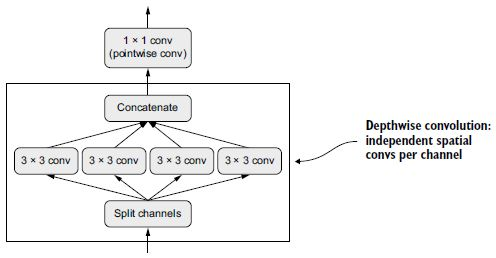

# **9. Haladó mély tanulás a gépi látáshoz**

Ez a fejezet ezekkel foglalkozik:
* A gépi látás különböző ágai: képosztályozás, képszegmentálás, tárgydetektálás
* Modern convnet architektúra minták: maradék kapcsolatok, köteg normalizálás, mélységben szétválasztható konvolúciók
* Technikák a convnet által tanultak megjelenítésére és értelmezésére

Az előző fejezetben először bemutattuk a gépi látás mély tanulását egyszerű modelleken (`Conv2D` és `MaxPooling2D` rétegek halmaza) és egy egyszerű használati eseten (bináris képosztályozás) keresztül. De a gépi látás többről szól, mint a képbesorolás! Ez a fejezet mélyebben belemerül a változatosabb alkalmazásokba és a legjobb haladó gyakorlatokba.

## 9.1 A három alapvető (számítógépes) gépi látási feladat

Eddig a képbesorolási modellekre koncentráltunk: egy kép bemegy, egy címke jön ki. „Ez a kép valószínűleg egy macskát tartalmaz; ezen a másikon valószínűleg egy kutya van." A képosztályozás azonban csak egy a gépi látás lehetséges mélytanulási alkalmazásai közül. Általában három alapvető gépi látási feladatot kell ismernie:
* _Képosztályozás_ – Ahol a cél egy vagy több címke hozzárendelése egy képhez. Ez lehet egycímkés besorolás (egy kép csak egy kategóriába tartozhat, a többit nem vesszük figyelembe), vagy többcímkés besorolás (minden kategória felcímkézése, amelyhez egy kép tartozik, amint az a 9.1. ábrán látható). Például, amikor kulcsszóra keresünk a Google Fotók alkalmazásban, a kulisszák mögött egy nagyon nagy, többcímkés osztályozási modellt kérdezünk le – egy olyan modellt, amely több mint 20 000 különböző osztályt tartalmaz, amelyek több millió képpel vannak betanítva.
* _Képszegmentálás_ – ahol a cél egy kép „szegmentálása” vagy „felosztása” különböző területekre, ahol minden terület általában egy kategóriát képvisel (amint a 9.1. ábrán látható). Például amikor a Zoom vagy a Google Meet egyéni hátteret jelenít meg mögötted egy videohívásban, akkor egy képszegmentációs modellt használ, hogy pixel pontossággal meg tudja különböztetni az arcot aattól ami mögötte van.
* _Tárgyérzékelés_ – A cél az, hogy téglalapokat (úgynevezett határolókereteket) rajzoljunk a kép érdekes objektumai köré, és minden téglalapot társítsunk egy osztályhoz. Egy önvezető autó objektumérzékelő modellt használhat például az autók, a gyalogosok és a táblák megfigyelésére a kameráinak a látképei alapján.


**9.1. ábra:** A gépi látás három fő feladata: osztályozás, szegmentálás, észlelés

A gépi látás mély tanulása ezen a háromon kívül számos, némileg szűkebb feladatot is magában foglal, mint például a képhasonlósági pontozás (a két kép vizuális hasonlóságának becslése), a kulcspontok felismerése (a képen az érdeklődésre számot tartó attribútumok, például az arcvonások meghatározása), pózbecslés, 3D mesh becslés stb. Kezdetben azonban a képosztályozás, a képszegmentálás és az objektumészlelés jelenti azt az alapot, amelyet minden gépi tanulási mérnöknek ismernie kell. A legtöbb gépilátási alkalmazás e három egyikére csapódik le.

Az előző fejezetben már láttuk a képbesorolást működés közben. Ezután merüljünk el a képszegmentálásban. Ez egy nagyon hasznos és sokoldalú technika, és egyenesen meg lehet közelíteni az eddig tanultakkal.

Ne feledje, hogy nem térünk ki az objektumészlelésre, mert az túl speciális és túl bonyolult lenne egy bevezető könyvhöz. Azonban megtekintheti a RetinaNet példáját a keras.io webhelyen, amely bemutatja, hogyan lehet objektumészlelési modellt felépíteni a semmiből és betanítani a Kerasban körülbelül 450 kódsorral (https://keras.io/examples/vision/retinanet/ ).

## 9.2 Példa a képszegmentálásra

A képszegmentálás mély tanulással azt jelenti, hogy egy modell segítségével osztályt rendelünk a kép minden pixeléhez, így a képet különböző zónákra felosztva (például „háttér” és „előtér” vagy „út”, „autó” és „ járda"). A technikák ezen általános kategóriája számos hasznos alkalmazás működtetésére használható a kép- és videószerkesztésben, az önvezetésben, a robotikában, az orvosi képalkotásban és így tovább.

A képszegmentálásnak két különböző változata van, amelyekről tudnunk kell:
* _Szemantikai szegmentálás_, ahol minden képpont egymástól függetlenül egy jelentéstani kategóriába van besorolva, például „macska”. Ha két macska van a képen, a megfelelő pixelek ugyanahhoz az általános „macska” kategóriához vannak hozzárendelve (lásd a 9.2. ábrát).
* _Példányszegmentálás_, amely nem csak a képpixelek kategóriák szerinti osztályozására törekszik, hanem az egyes objektumpéldányok elemzésére is. Egy két macskát tartalmazó képen a példányszegmentálás az „1. macska”-t és a „2. macska”-t a pixelek két külön osztályaként kezelné (lásd a 9.2. ábrát).

Ebben a példában a szemantikai szegmentációra összpontosítunk: ismét macskák és kutyák képeit nézzük, és ezúttal megtanuljuk, hogyan lehet megkülönböztetni a fő témát és annak hátterét.

Az Oxford-IIIT Pets adatkészlettel (www.robots.ox.ac.uk/~vgg/data/pets/) fogunk dolgozni, amely 7390 képet tartalmaz különböző fajtájú macskákról és kutyákról, valamint előtér-háttér _szegmentáló maszkokat_ minden egyes képhez. A szegmentációs maszk a címke képszegmentálási megfelelője: ez egy olyan kép, amely megegyezik a bemeneti képpel, de csak egyetlen színcsatornával, ahol minden egész érték a bemeneti kép megfelelő pixel osztályának felel meg. Esetünkben a szegmentációs maszkjaink képpontjai a következő három egész érték valamelyikét vehetik fel:
* 1 (előtér)
* 2 (háttér)
* 3 (kontúr)
​


**9.2. ábra:** Szemantikus szegmentálás kontra példányszegmentálás

Kezdjük adatkészletünk letöltésével és kibontásával a wget és tar shell segédprogramok használatával:
```
!wget http:/ /www.robots.ox.ac.uk/~vgg/data/pets/data/images.tar.gz
!wget http://www.robots.ox.ac.uk/~vgg/data/pets/data/annotations.tar.gz
!tar -xf images.tar.gz
!tar -xf annotations.tar.gz
```
A bemeneti képek JPG fájlokként kerülnek tárolásra az images/ mappában (például images/Abyssinian_1.jpg), a megfelelő szegmentációs maszk pedig azonos nevű PNG-fájlként az annotations/trimaps/ mappában (például annotations/ trimaps/Abyssinian_1.png).

Készítsük el a bemeneti fájl útvonalak listáját, valamint a megfelelő maszkfájl útvonalak listáját:


```python
import os

input_dir = "images/"
target_dir = "annotations/trimaps/"

input_img_paths = sorted(
    [os.path.join(input_dir, fname)
     for fname in os.listdir(input_dir)
     if fname.endswith(".jpg")])

target_paths = sorted(
    [os.path.join(target_dir, fname)
     for fname in os.listdir(target_dir)
     if fname.endswith(".png") and not fname.startswith(".")])
```

Most hogyan néz ki az egyik ilyen bemenet és a maszkja? Vessünk rá egy gyors pillantást. Íme egy mintakép (lásd a 9.3. ábrát):


**9.3. ábra:** Egy példakép


```python
import matplotlib.pyplot as plt
from tensorflow.keras.utils import load_img, img_to_array

plt.axis("off")
plt.imshow(load_img(input_img_paths[9]))    #<--- A 9-es számú bemeneti kép megjelenítése.

def display_target(target_array):
    normalized_array = (target_array.astype("uint8") - 1) * 127 #<--- Az eredeti címkék 1, 2 és 3. Kivonunk 1-et,
                                                                #     hogy a címkék 0 és 2 között legyenek,
                                                                #     majd megszorozzuk 127-tel, így a címkék 0-ra (fekete),
                                                                #     127-re (szürke), 254-re (majdnem fehérre) váltanak.
    plt.axis("off")
    plt.imshow(normalized_array[:, :, 0])

img = img_to_array(load_img(target_paths[9], color_mode="grayscale")) #<--- A color_mode="grayscale"-t használjuk, így
                                                                      #     a betöltött képet egyetlen színcsatornaként kezeljük.
display_target(img)
```

És itt van a megfelelő cél (lásd a 9.4. ábrát):


**9.4. ábra:** A megfelelő célmaszk

Ezután töltsük be a bemeneteinket és a célokat két NumPy tömbbe, és osszuk fel a tömböket egy képzési és egy érvényesítési halmazra. Mivel az adatkészlet nagyon kicsi, mindent be tudunk tölteni a memóriába:


```python
import numpy as np
import random

img_size = (200, 200)           #<--- Mindent átméretezünk 200 × 200-ra.
num_imgs = len(input_img_paths) #<--- Az adatokban szereplő minták teljes száma

random.Random(1337).shuffle(input_img_paths)  #<--- Keverje meg a fájl elérési útját (eredetileg fajták szerint rendezték őket).
random.Random(1337).shuffle(target_paths)     #     Mindkét utasításban ugyanazt a magot (1337) használjuk annak biztosítására,
                                              #     hogy a bemeneti útvonalak és a cél útvonalak ugyanabban a sorrendben maradjanak.
def path_to_input_image(path):
    return img_to_array(load_img(path, target_size=img_size))

def path_to_target(path):
    img = img_to_array(
        load_img(path, target_size=img_size, color_mode="grayscale"))
    img = img.astype("uint8") - 1             #<--- Vonjunk ki 1-et, hogy a címkéink 0, 1 és 2 legyenek.
    return img

input_imgs = np.zeros((num_imgs,) + img_size + (3,), dtype="float32") #<--- Töltse be az input_imgs float32 tömbben található
targets = np.zeros((num_imgs,) + img_size + (1,), dtype="uint8")      #     összes képet és a maszkjaikat a targets uint8 tömbbe
for i in range(num_imgs):                                             #     (ugyanabban a sorrendben). A bemeneteknek három
    input_imgs[i] = path_to_input_image(input_img_paths[i])           #     csatornájuk van (RBG értékek), a célpontoknak pedig
    targets[i] = path_to_target(target_paths[i])                      #     egyetlen csatornájuk van (amely egész számokat tartalmaz).

num_val_samples = 1000                            #<--- Tartson fenn 1000 mintát az érvényesítéshez.
train_input_imgs = input_imgs[:-num_val_samples]  #<--- Ossza fel az adatokat egy képzési
train_targets = targets[:-num_val_samples]        #     és egy érvényesítési halmazra.
val_input_imgs = input_imgs[-num_val_samples:]    #
val_targets = targets[-num_val_samples:]          #
```

Most itt az ideje, hogy definiáljuk a modellünket:


```python
from tensorflow import keras
from tensorflow.keras import layers

def get_model(img_size, num_classes):
    inputs = keras.Input(shape=img_size + (3,))
    x = layers.Rescaling(1./255)(inputs)        #<--- Ne felejtse el átméretezni a bemeneti képeket [0-1] tartományra.

    x = layers.Conv2D(64, 3, strides=2, activation="relu", padding="same")(x) #<--- Jegyezze meg, hogy mindenhol a
                                                                              #     padding="same"-et használjuk, hogy
                                                                              #     elkerüljüka szegélyek kitöltésének
                                                                              #     hatását a jellemzőtérkép méretére.
    x = layers.Conv2D(64, 3, activation="relu", padding="same")(x)
    x = layers.Conv2D(128, 3, strides=2, activation="relu", padding="same")(x)
    x = layers.Conv2D(128, 3, activation="relu", padding="same")(x)
    x = layers.Conv2D(256, 3, strides=2, padding="same", activation="relu")(x)
    x = layers.Conv2D(256, 3, activation="relu", padding="same")(x)

    x = layers.Conv2DTranspose(256, 3, activation="relu", padding="same")(x)
    x = layers.Conv2DTranspose(
        256, 3, activation="relu", padding="same", strides=2)(x)
    x = layers.Conv2DTranspose(128, 3, activation="relu", padding="same")(x)
    x = layers.Conv2DTranspose(
        128, 3, activation="relu", padding="same", strides=2)(x)
    x = layers.Conv2DTranspose(64, 3, activation="relu", padding="same")(x)
    x = layers.Conv2DTranspose(
        64, 3, activation="relu", padding="same", strides=2)(x)

    outputs = layers.Conv2D(num_classes, 3, activation="softmax",   #<--- A modellt egy pixelenkénti háromutas softmax-szal
     padding="same")(x)                                             #     zárjuk, hogy minden kimeneti pixelt a három kategória
                                                                    #     valamelyikébe soroljunk.
    model = keras.Model(inputs, outputs)
    return model

model = get_model(img_size=img_size, num_classes=3)
model.summary()
```

Íme a `model.summary()` hívás kimenete:

```
Model: "model"
_________________________________________________________________
Layer (type)                 Output Shape              Param #
=================================================================
input_1 (InputLayer)         [(None, 200, 200, 3)]     0
_________________________________________________________________
rescaling (Rescaling)        (None, 200, 200, 3)       0
_________________________________________________________________
conv2d (Conv2D)              (None, 100, 100, 64)      1792
_________________________________________________________________
conv2d_1 (Conv2D)            (None, 100, 100, 64)      36928
_________________________________________________________________
conv2d_2 (Conv2D)            (None, 50, 50, 128)       73856
_________________________________________________________________
conv2d_3 (Conv2D)            (None, 50, 50, 128)       147584
_________________________________________________________________
conv2d_4 (Conv2D)            (None, 25, 25, 256)       295168
_________________________________________________________________
conv2d_5 (Conv2D)            (None, 25, 25, 256)       590080
_________________________________________________________________
conv2d_transpose (Conv2DTran (None, 25, 25, 256)       590080
_________________________________________________________________
conv2d_transpose_1 (Conv2DTr (None, 50, 50, 256)       590080
_________________________________________________________________
conv2d_transpose_2 (Conv2DTr (None, 50, 50, 128)       295040
_________________________________________________________________
conv2d_transpose_3 (Conv2DTr (None, 100, 100, 128)     147584
_________________________________________________________________
conv2d_transpose_4 (Conv2DTr (None, 100, 100, 64)      73792
_________________________________________________________________
conv2d_transpose_5 (Conv2DTr (None, 200, 200, 64)      36928
_________________________________________________________________
conv2d_6 (Conv2D)            (None, 200, 200, 3)       1731
=================================================================
Total params: 2,880,643
Trainable params: 2,880,643
Non-trainable params: 0
_________________________________________________________________
```

A modell első fele nagyon hasonlít a képosztályozáshoz használt convnethez: `Conv2D` rétegek halmaza, fokozatosan növekvő szűrőmérettel. A képeinkből háromszor, egyenként kétszeres mintát veszünk, aminek eredményeként a `(25, 25, 256)` méret aktiválódik. Ennek az első félnek az a célja, hogy a képeket kisebb jellemzőtérképekre kódolja, ahol minden egyes térbeli hely (vagy pixel) az eredeti kép egy nagy térbeli darabjáról tartalmaz információt. Felfoghatod egyfajta tömörítésként is.

Az egyik fontos különbség ennek a modellnek az első fele és a korábban látott osztályozási modellek között a lemintavételezés módja: az utolsó fejezet osztályozási convnetjeiben `MaxPooling2D` rétegeket használtunk a jellemzőtérképek mintavételezésére. Itt a mintavételt úgy végezzük, hogy minden második konvolúciós réteghez _lépésközöket_ adunk (ha nem emlékszik a konvolúciós lépésközök működésének részleteire, lásd a 8.1.1. szakasz „A konvolúciós lépésköz értelmezése” című részt). Ezt azért tesszük, mert a képszegmentálásnál nagyon fontosnak tartjuk az információ _térbeli elhelyezkedését_ a képen, hiszen a modell kimeneteként pixelenkénti célmaszkokat kell készítenünk. Ha 2 × 2 max poolingot hajt végre, akkor teljesen megsemmisíti a helyinformációkat az egyes gyűjtőablakon belül: ablakonként egy skaláris értéket ad vissza, anélkül, hogy az ablakok négy helye közül melyikről származik az érték. Tehát bár a max pooling rétegek jól teljesítenek az osztályozási feladatoknál, egy szegmentálási feladatnál igencsak ártanak nekünk. Eközben a lépésközös konvolúciók jobb munkát végeznek a jellemzőtérképek mintavételezésében, miközben megtartják a helyinformációkat. Fel fog tűnni, hogy ebben a könyvben hajlamosak vagyunk a lépésköz használatára a maximális összevonás helyett minden olyan modellben, amely törődik a jellemzők elhelyezkedésével, például a 12. fejezetben található generatív modelleknél.

A modell második fele a `Conv2DTranspose` rétegek halma. Mik azok? Nos, a modell első felének kimenete egy `(25, 25, 256)` alakú térkép, de azt szeretnénk, hogy a végső kimenetünk a célmaszkokéval megegyező `(200, 200, 3)` alakú legyen. Ezért az eddig alkalmazott transzformációk egyfajta _inverzét_ kell alkalmaznunk – olyasvalamit, amely _felfelé mintavételezi_ a jellemzőtérképeket, ahelyett, hogy lefelé mintavételezné azokat. Ez a `Conv2DTranspose` réteg célja: egyfajta konvolúciós rétegként fogható fel, amely megtanulja a felmintavételezést. Ha van egy `(100, 100, 64)` alakú bemenetünk, és átfuttatjuk a `Conv2D(128, 3, strides=2, padding="same")` rétegen, akkor egy `(50, 50, 128)` alakú kimenetet kapunk. Ha ezt a kimenetet a `Conv2DTranspose(64, 3, strides=2, padding="same")` rétegen futtatja, visszakapja az eredetivel megegyező `(100, 100, 64)` alakú kimenetet. Tehát miután a bemeneteinket `(25, 25, 256)` alakú térképekké tömörítettük egy halom `Conv2D` rétegen keresztül, egyszerűen alkalmazhatjuk a megfelelő `Conv2DTranspose` rétegsorozatot, hogy visszatérjünk a `(200, 200, 3)` alakú képekhez.

Most már össze tudjuk állítani és illeszteni a modellünket:


```python
model.compile(optimizer="rmsprop", loss="sparse_categorical_crossentropy")

callbacks = [
    keras.callbacks.ModelCheckpoint("oxford_segmentation.keras",
                                    save_best_only=True)
]

history = model.fit(train_input_imgs, train_targets,
                    epochs=50,
                    callbacks=callbacks,
                    batch_size=64,
                    validation_data=(val_input_imgs, val_targets))
```

Rajzoljuk fel a betanítási és érvényesítési veszteségünket (lásd a 9.5. ábrát):


**9.5. ábra:** Betanítási és érvényesítési veszteséggörbék megjelenítése


```python
epochs = range(1, len(history.history["loss"]) + 1)
loss = history.history["loss"]
val_loss = history.history["val_loss"]
plt.figure()
plt.plot(epochs, loss, "bo", label="Training loss")
plt.plot(epochs, val_loss, "b", label="Validation loss")
plt.title("Training and validation loss")
plt.legend()
```

Látható, hogy félúton kezdjük a túlillesztést, a 25. tanítási szakasz környékén. Töltsük újra a legjobban teljesítő modellünket az érvényesítési veszteségnek megfelelően, és mutassuk be, hogyan használjuk a szegmentációs maszk előrejelzésére (lásd a 9.6. ábrát):


```python
from tensorflow.keras.utils import array_to_img

model = keras.models.load_model("oxford_segmentation.keras")

i = 4
test_image = val_input_imgs[i]
plt.axis("off")
plt.imshow(array_to_img(test_image))

mask = model.predict(np.expand_dims(test_image, 0))[0]

def display_mask(pred):               #<--- Segédprogram a modell előrejelzésének megjelenítéséhez
    mask = np.argmax(pred, axis=-1)
    mask *= 127
    plt.axis("off")
    plt.imshow(mask)

display_mask(mask)
```


**9.6. ábra:** Egy tesztkép és a hozzá tartozó szegmentációs maszk

Az előrejelzett maszkunkban van néhány apró melléktermék, amelyeket az előtérben és a háttérben lévő geometriai alakzatok okoznak. Ennek ellenére úgy tűnik, hogy a modellünk jól működik.

Ekkorra már a 8. fejezetben és a 9. fejezet elején megtanultad a képosztályozás és képszegmentálás alapjait: már sok mindent képes vagy elérni azzal, amit tudsz. A tapasztalt mérnökök által a valós problémák megoldására kifejlesztett convnetek azonban nem olyan egyszerűek, mint azok, amelyeket eddigi bemutatóink során használtunk. Még mindig hiányoznak az alapvető mentális modellek és gondolkodási folyamatok, amelyek lehetővé teszik a szakértők számára, hogy gyors és pontos döntéseket hozzanak a legmodernebb modellek összeállításával kapcsolatban. E szakadék áthidalásához meg kell tanulnunk a _szerkezeti mintákat_. Merüljünk bele.

## 9.3 Modern convnet architektúra minták

A modell „architektúrája” a létrehozásához szükséges választási lehetőségek összessége: mely rétegeket használjuk, hogyan konfiguráljuk őket, és milyen elrendezésben kapcsoljuk össze őket. Ezek a választások határozzák meg a modell _hipotézisterét_: a lehetséges függvények terét, amelyen a gradiens ereszkedés kereshet, a modell súlyaival paraméterezve. A jellemzőtervezéshez hasonlóan a jó hipotézistér az adott problémával és annak megoldásával kapcsolatos _előzetes tudást_ kódolja. Például a konvolúciós rétegek használata azt jelenti, hogy előre tudja, hogy a bemeneti képekben található fontos minták fordításinvariánsak. Ahhoz, hogy hatékonyan tanulhasson az adatokból, feltételezéseket kell készítenie arról, hogy mit keres.

A modellarchitektúra gyakran a különbség a siker és a kudarc között. Ha nem megfelelő architektúrát választ, előfordulhat, hogy a modell elakad a szuboptimális mérőszámoknál, és semmilyen betanítási adat sem fogja megmenteni. Ezzel szemben a jó modellarchitektúra felgyorsítja a tanulást, és lehetővé teszi, hogy a modell hatékonyan használja fel a rendelkezésre álló betanítási adatokat, csökkentve a nagy adathalmazok szükségességét. A jó modellarchitektúra az, amely _csökkenti a keresési terület méretét_, vagy más módon _megkönnyíti a keresési tér egy jó pontjához való konvergálást_. Csakúgy, mint a jellemzőtervezés és az adatkezelés, a modellarchitektúra is arról szól, hogy _egyszerűbbé tegye a problémát_ a gradiensereszkedés megoldásához. És ne feledje, hogy a gradiens süllyedés meglehetősen ostoba keresési folyamat, ezért minden segítségre szüksége van.

A modellépítészet inkább művészet, mint tudomány. A tapasztalt gépi tanulási mérnökök már első próbálkozásukra képesek intuitív módon összeállítani a nagy teljesítményű modelleket, míg a kezdőknek gyakran nehézséget okoz, hogy olyan modellt alkossanak, amely egyáltalán edz. A kulcsszó itt az _intuitív_: senki sem tud egyértelmű magyarázatot adni arra, hogy mi működik és mi nem. A szakértők a mintaillesztésre hagyatkoznak, amely képességre kiterjedt gyakorlati tapasztalat révén sajátítanak el. Ebben a könyvben fejlesztheti saját intuícióját. Azonban nem _minden_ az intuíción múlik – a tényleges tudománynak nincs sok módja, de mint minden mérnöki tudományágban, itt is vannak bevált gyakorlatok.

A következő szakaszokban áttekintünk néhány a gyakorlatban bevált alapvető convnet architektúrát: különösen a maradék kapcsolatokat, a kötegelt normalizálást és az elválasztható konvolúciókat. Miután elsajátította a használatukat, képes lesz rendkívül hatékony képmodelleket készíteni. Alkalmazni is fogjuk ezeket a macska vs. kutya osztályozási problémánkra. {249.o->:}

Kezdjük madártávlatból: a modularitás-hierarchia-újrafelhasználás (MHR) képletével a rendszerarchitektúrához.

### 9.3.1 Modularitás, hierarchia és újrafelhasználás

Ha egyszerűbbé szeretne tenni egy összetett rendszert, van egy univerzális recept, amelyet alkalmazhat: egyszerűen strukturálja _modulokba_ a komplexitás amorf levesét, rendezze a modulokat _hierarchiába_, és kezdje el _újra felhasználni_ ugyanazokat a modulokat több helyen is (az "újrafelhasználás" egy másik szó az _absztrakcióra_ ebben az összefüggésben). Ez az MHR képlet (modularity-hierarchy-reuse), és ez alapozza meg a rendszerarchitektúrát szinte minden olyan tartományban, ahol az „architektúra” kifejezést használják. Bármilyen értelmes komplexitású rendszer szervezetének középpontjában áll, legyen az egy katedrális, a saját tested, az amerikai haditengerészet vagy a Keras kódbázis (lásd a 9.7. ábrát).


**9.7. ábra:** Az összetett rendszerek hierarchikus struktúrát követnek, és különálló modulokba vannak szervezve, amelyeket többször is felhasználnak (például a négy végtag, amelyek mind ugyanannak a tervnek a változatai, vagy a 20 „ujjad”).

Ha ön szoftvermérnök, akkor már nagyon jól ismeri ezeket az alapelveket: a hatékony kódbázis az, amely moduláris, hierarchikus, és ahol nem hajtja végre ugyanazt a dolgot kétszer, hanem az újrafelhasználható osztályokra és függvényekre hagyatkozik. Ha ezeket az elveket követve szemléli a kódot, akkor azt mondhatja, hogy „szoftverarchitektúrát” csinál.

Maga a mélytanulás egyszerűen ennek a receptnek az alkalmazása a folyamatos optimalizálásra gradiensereszkedés útján: egy klasszikus optimalizálási technikát használ (gradiens süllyedés egy folytonos függvénytéren), és a keresési teret modulokba (rétegekbe) strukturálja, mély hierarchiába rendezve (ami gyakran csak egy verem, a hierarchia legegyszerűbb fajtája), ahol bármit újra felhasználhat (például a konvolúciók ugyanazt az információt különböző térbeli helyeken újra felhasználják).

Hasonlóképpen, a mély tanulási modell-architektúra elsősorban a modularitás, a hierarchia és az újrahasználat okos felhasználásáról szól. Észre fogja venni, hogy az összes népszerű convnet architektúra nem csak rétegekbe, hanem ismétlődő rétegcsoportokba (ezek „blokkok” vagy „modulok”) vannak strukturálva. Például az előző fejezetben használt népszerű VGG16 architektúra ismétlődő „conv, conv, max pooling” blokkokból áll (lásd a 9.8. ábrát).

Ezenkívül a legtöbb convnet gyakran piramisszerű struktúrákat (szolgáltatáshierarchiákat) tartalmaz. Emlékezzünk vissza például az előző fejezetben felépített első convnetben használt konvolúciós szűrők számának alakulására: 32, 64, 128. A szűrők száma a rétegmélységgel nő, míg a jellemzőtérképek mérete ennek megfelelően csökken. Ugyanezt a mintát láthatja a VGG16 modell blokkjaiban (lásd a 9.8. ábrát).


**9.8 ábra:** A VGG16 architektúra: vegye észre az ismétlődő rétegblokkokat és a jellemzőtérképek piramisszerű szerkezetét

A mélyebb hierarchiák alapvetően jók, mert ösztönzik a funkciók újrafelhasználását, és ezáltal az absztrakciót. Általánosságban elmondható, hogy a keskeny rétegekből álló mély halom jobban teljesít, mint a nagy rétegek sekély halmaza. Az eltűnő színátmenetek problémája miatt azonban korlátozottak a rétegek egymásra halmozásának mélységei. Ez elvezet bennünket az első lényeges modellarchitektúránkhoz: a maradék kapcsolatokhoz.

---

**Az ablációs vizsgálatok fontosságáról a mély tanulás kutatásában**

A mélytanulási architektúrák gyakran inkább _kifejlődtek_, minthogy megtervezték volna – úgy fejlesztették ki őket, hogy többször próbáltak dolgokat, és kiválasztották azt, ami működni látszott. A biológiai rendszerekhez hasonlóan, ha bármilyen bonyolult kísérleti mélytanulási beállítást választ, nagy eséllyel eltávolíthat néhány modult (vagy néhány betanított funkciót véletlenszerűre cserélhet) anélkül, hogy veszítene a teljesítményéből.

Ezt tovább rontják azok az ösztönzők, amelyekkel a mély tanulással foglalkozó kutatók szembesülnek: ha egy rendszert a szükségesnél bonyolultabbá tesznek, érdekesebbé vagy újszerűbbé tehetik azt, és így növelhetik az esélyeiket, hogy a szakértői értékelési folyamaton átjussanak. Ha sok mélyreható tanulmányt elolvas, észre fogja venni, hogy azok gyakran vannak optimalizálva szakértői értékeléshez mind stílusban, mind tartalomban oly módon, hogy az aktívan sérti a magyarázatok egyértelműségét és az eredmények megbízhatóságát. Például a matematikát a mélytanulási dolgozatokban ritkán használják fogalmak egyértelmű formába öntésére vagy nem nyilvánvaló eredmények levezetésére – inkább a _komolyság jelzéseként_ használják, mint a drága öltönyt az eladón.

A kutatás célja ne pusztán publikálás legyen, hanem megbízható tudás létrehozása. Létfontosságú, hogy az ok-okozati összefüggések megértése a rendszerben a legegyszerűbb módja a megbízható tudás létrehozásának. És van egy nagyon kevés erőfeszítést igénylő módszer az ok-okozati összefüggés vizsgálatára: az _ablációs_ vizsgálatok. Az ablációs vizsgálatok abból állnak, hogy szisztematikusan megpróbálják eltávolítani a rendszer egyes részeit – ezzel egyszerűbbé téve azt – annak azonosítására, hogy honnan származik a teljesítménye. Ha úgy találja, hogy az X + Y + Z jó eredményeket ad, próbálkozzon X, Y, Z, X + Y, X + Z és Y + Z esettel is, és nézze meg, mi történik.

Ha mélytanulás-kutató lesz, vágja le a kutatási folyamat zaját: végezzen ablációs vizsgálatokat modelljeihez. Mindig kérdezze meg: „Létezhet-e egyszerűbb magyarázat? Valóban szükséges ez a megnövelt bonyolultság? Miért?"

---

### 9.3.2 Maradék összefüggés

Valószínűleg ismeri a Telephone játékot, amelyet az Egyesült Királyságban kínai suttogásnak, Franciaországban pedig téléphone arabe-nak is neveznek, ahol a kezdeti üzenetet az egyik játékos fülébe suttogják, aki aztán a következő játékos fülébe súgja, és így tovább. Az utolsó üzenet végül alig hasonlít az eredeti verzióhoz. Ez egy szórakoztató metafora a zajos csatornán keresztüli szekvenciális átvitel során fellépő kumulatív hibákra.

Ahogy megtörténik, a szekvenciális mély tanulási modellben a visszaterjesztés, az nagyon hasonlít a Telefonos játékhoz. Van egy függvényláncunk, például ez:
```
y = f4(f3(f2(f1(x))))
```
A játék neve a lánc egyes függvényei paramétereinek beállítása az f4 kimenetén rögzített hiba (a modell vesztesége) alapján. Az f1 beállításához a hibainformációknak az f2-n, az f3-on és az f4-en keresztül kell átadnia. Mindazonáltal a láncban minden egymást követő függvény bizonyos mennyiségű zajt hoz be. Ha a függvénylánc túl hosszú, ez a zaj elkezdi elnyomni a gradiens információkat, és a visszaterjesztés leáll. A modelled egyáltalán nem fog tanulni. Ez az _eltűnő gradiensek_ problémája.

A javítás egyszerű: csak kényszerítse rá a lánc mindegyik függvényét, hogy legyen roncsolásmentes – hogy megőrizze az előző bemenetben található információ zajtalan változatát. Ennek legegyszerűbb módja a _maradék kapcsolat_ használata. Ez nagyon egyszerű: csak adja hozzá egy réteg vagy rétegblokk bemenetét a kimenethez (lásd a 9.9. ábrát). A maradék kapcsolat _információ gyorsításként_ működik a destruktív vagy zajos blokkok (például a `relu`-aktiválást vagy kihagyási rétegeket tartalmazó blokkok) körül, lehetővé téve a korai rétegekből származó hibagradiens információinak zajtalan terjedését egy mély hálózaton. Ezt a technikát 2015-ben vezették be a ResNet modellcsaláddal (amelyet He et al. fejlesztett ki a Microsoftnál).[1]

---

[1] Kaiming He et al., “Deep Residual Learning for Image Recognition,” Conference on Computer Vision and Pattern Recognition (2015), https://arxiv.org/abs/1512.03385 .


**9.9. ábra:** Egy feldolgozási blokk körüli maradék kapcsolat

A gyakorlatban a maradék kapcsolatot a következőképpen valósíthatjuk meg.

**9.1 lista: A maradék kapcsolat pszeudokódban**


```python
x = ...                 #<--- Valami bemeneti tenzor
residual = x            #<--- Mentsen el egy mutatót az eredeti bemenetre. Ezt hívjuk maradéknak.
x = block(x)            #<--- Ez a számítási blokk potenciálisan romboló vagy zajos lehet, és ez rendben van.
x = add([x, residual])  #<--- Hozzáadja az eredeti bemenetet a réteg kimenetéhez:
                        #     a végső kimenet így mindig megőrzi a teljes információt az eredeti bemenetről.
```

Vegye észre, hogy a bemenet hozzáadása egy blokk kimenetéhez azt jelenti, hogy a kimenetnek ugyanolyan alakúnak kell lennie, mint a bemenetnek. Ez azonban nem így van, ha a blokk konvolúciós rétegeket tartalmaz megnövelt számú szűrővel, vagy max pooling réteget. Ilyen esetekben használjon 1 × 1 `Conv2D` réteget aktiválás nélkül, hogy a maradékot lineárisan a kívánt kimeneti alakra vetítse (lásd a 9.2 listát). Általában a `padding=` `"same"` értéket használunk a célblokk konvolúciós rétegeiben, hogy elkerüljük a kitöltés miatti térbeli lemintavételezést, a maradék vetítésben pedig a lépésköz használatával illeszkedünk a max pooling réteg által okozott lemintavételhez (lásd a 9.3 listát).

**9.2 lista: Maradék blokk, ahol a szűrők száma változik**


```python
from tensorflow import keras
from tensorflow.keras import layers

inputs = keras.Input(shape=(32, 32, 3))
x = layers.Conv2D(32, 3, activation="relu")(inputs)
residual = x                                #<--- Tegyük félre a maradékot.
x = layers.Conv2D(64, 3, activation="relu", padding="same")(x)  #<--- Ez az a réteg, amely körül maradék kapcsolatot hozunk létre:
                                                                #     ez 32-ről 64-re növeli a kimeneti file-ok számát.
                                                                #     Vegye figyelembe, hogy a padding="same"-t használjuk,
                                                                #     hogy elkerüljük a padding miatti lemintavételezést.
residual = layers.Conv2D(64, 1)(residual)   #<--- A maradéknak csak 32 szűrője volt, ezért 1 × 1-es Conv2D-t használunk
                                            #     a megfelelő formára vetítéséhez.
x = layers.add([x, residual])               #<--- Most a blokk kimenete és a maradék azonos alakú, és összeadható.
```

**9.3 lista: Az az eset, amikor a célblokk max pooling réteget tartalmaz**


```python
inputs = keras.Input(shape=(32, 32, 3))
x = layers.Conv2D(32, 3, activation="relu")(inputs)
residual = x                                #<--- Tegyük félre a maradékot.
x = layers.Conv2D(64, 3, activation="relu", padding="same")(x)  #<--- Ez az a két rétegből álló blokk, amely körül maradék kapcsolatot
x = layers.MaxPooling2D(2, padding="same")(x)                   #     hozunk létre: tartalmaz egy 2 × 2 max. pooling réteget.
                                                                #     Vegye figyelembe, hogy mind a konvolúciós rétegben,
                                                                #     mind a max pooling rétegben a padding="same" értéket használjuk,
                                                                #     hogy elkerüljük a padding miatti lemintavételezést.
residual = layers.Conv2D(64, 1, strides=2)(residual)            #<--- A maradék vetületben strides=2-t használunk, hogy megfeleljen a
                                                                #     max pooling réteg által létrehozott lemintavételezésnek.
x = layers.add([x, residual])               #<--- Most a blokk kimenete és a maradék azonos alakú, és összeadható.
```

Hogy konkrétabbá tegyük ezeket az elképzeléseket, íme egy példa egy egyszerű convnet-re, amely egy sor blokkból áll, amelyek mindegyike két konvolúciós rétegből és egy opcionális max pooling rétegből áll, mindegyik blokk körül egy maradék kapcsolattal:


```python
inputs = keras.Input(shape=(32, 32, 3))
x = layers.Rescaling(1./255)(inputs)

def residual_block(x, filters, pooling=False):    #<--- Segédfüggvény a konvolúciós blokk alkalmazásához maradék kapcsolattal,
                                                  #     max pooling hozzáadásának lehetőségével
    residual = x
    x = layers.Conv2D(filters, 3, activation="relu", padding="same")(x)
    x = layers.Conv2D(filters, 3, activation="relu", padding="same")(x)
    if pooling:
        x = layers.MaxPooling2D(2, padding="same")(x)
        residual = layers.Conv2D(filters, 1, strides=2)(residual) #<--- Ha max poolingot használunk, akkor lépésközös konvolúciót
                                                                  #     adunk hozzá, hogy a maradékot a kívánt alakra vetítsük.
    elif filters != residual.shape[-1]:
        residual = layers.Conv2D(filters, 1)(residual)  #<--- Ha nem használunk max poolingot, akkor
                                                        #     csak akkor vetítjük ki a maradékot, ha a csatornák száma megváltozott.
    x = layers.add([x, residual])
    return x

x = residual_block(x, filters=32, pooling=True)     #<--- Első blokk
x = residual_block(x, filters=64, pooling=True)     #<--- Második blokk; vegye észre a növekvő szűrőszámot mindegyik blokkban.
x = residual_block(x, filters=128, pooling=False)   #<--- Az utolsó blokkhoz nincs szükség max pooling rétegre,
                                                    #     mivel közvetlenül utána alkalmazzuk a globális átlag poolingot.

x = layers.GlobalAveragePooling2D()(x)
outputs = layers.Dense(1, activation="sigmoid")(x)
model = keras.Model(inputs=inputs, outputs=outputs)
model.summary()
```

Ez a modell összefoglalója, amit kapunk:

```
Model: "model"
__________________________________________________________________________________________________
Layer (type)                    Output Shape         Param #     Connected to
==================================================================================================
input_1 (InputLayer)            [(None, 32, 32, 3)]  0
__________________________________________________________________________________________________
rescaling (Rescaling)           (None, 32, 32, 3)    0           input_1[0][0]
__________________________________________________________________________________________________
conv2d (Conv2D)                 (None, 32, 32, 32)   896         rescaling[0][0]
__________________________________________________________________________________________________
conv2d_1 (Conv2D)               (None, 32, 32, 32)   9248        conv2d[0][0]
__________________________________________________________________________________________________
max_pooling2d (MaxPooling2D)    (None, 16, 16, 32)   0           conv2d_1[0][0]
__________________________________________________________________________________________________
conv2d_2 (Conv2D)               (None, 16, 16, 32)   128         rescaling[0][0]
__________________________________________________________________________________________________
add (Add)                       (None, 16, 16, 32)   0           max_pooling2d[0][0]
                                                                 conv2d_2[0][0]
__________________________________________________________________________________________________
conv2d_3 (Conv2D)               (None, 16, 16, 64)   18496       add[0][0]
__________________________________________________________________________________________________
conv2d_4 (Conv2D)               (None, 16, 16, 64)   36928       conv2d_3[0][0]
__________________________________________________________________________________________________
max_pooling2d_1 (MaxPooling2D)  (None, 8, 8, 64)     0           conv2d_4[0][0]
__________________________________________________________________________________________________
conv2d_5 (Conv2D)               (None, 8, 8, 64)     2112        add[0][0]
__________________________________________________________________________________________________
add_1 (Add)                     (None, 8, 8, 64)     0           max_pooling2d_1[0][0]
                                                                 conv2d_5[0][0]
__________________________________________________________________________________________________
conv2d_6 (Conv2D)               (None, 8, 8, 128)    73856       add_1[0][0]
__________________________________________________________________________________________________
conv2d_7 (Conv2D)               (None, 8, 8, 128)    147584      conv2d_6[0][0]
__________________________________________________________________________________________________
conv2d_8 (Conv2D)               (None, 8, 8, 128)    8320        add_1[0][0]
__________________________________________________________________________________________________
add_2 (Add)                     (None, 8, 8, 128)    0           conv2d_7[0][0]
                                                                 conv2d_8[0][0]
__________________________________________________________________________________________________
global_average_pooling2d (Globa (None, 128)          0           add_2[0][0]
__________________________________________________________________________________________________
dense (Dense)                   (None, 1)            129         global_average_pooling2d[0][0]
==================================================================================================
Total params: 297,697
Trainable params: 297,697
Non-trainable params: 0
__________________________________________________________________________________________________
```
A maradék kapcsolatokkal tetszőleges mélységű hálózatokat építhetünk ki anélkül, hogy aggódni kellene az eltűnő gradiensek miatt.

Most térjünk át a következő alapvető convnet architektúra mintára: a _köteg(elt) normalizálásra_.

### 9.3.3 Kötegelt normalizálás

A _normalizálás_ azon módszerek tág kategóriája, amelyek arra törekszenek, hogy a gépi tanulási modellnek megmutatott különböző minták jobban hasonlítsanak egymásra, ami segít a modellnek megtanulni és jól általánosítani az új adatokat. Az adatnormalizálás legáltalánosabb formája az, amelyet ebben a könyvben már többször is láthattunk: az adatok nullára való központosítása úgy, hogy az átlagot kivonjuk az adatokból, és egységnyi szórást adunk az adatokhoz úgy, hogy az adatokat elosztjuk a szórással. Valójában ez azt feltételezi, hogy az adatok normál (vagy Gauss-) eloszlást követnek, és biztosítja, hogy ez az eloszlás legyen központosítva a 0-ra és átméretezve az egységnyi szórásra:
```
normalized_data = (data - np.mean(data, axis=...)) / np.std(data, axis=...)
```
A könyv korábbi példái normalizálták az adatokat, mielőtt betáplálták őket a modellekbe. Az adatok normalizálása azonban érdekes lehet minden hálózat által végrehajtott átalakítás után: még ha a `Dense` vagy `Conv2D` hálózatba belépő adatok 0 átlaggal és egységnyi szórással rendelkeznek is, nem lehet eleve elvárni, hogy ez az kiérkező adatok esetében is így legyen. A köztes aktiválások normalizálása segíthet?

A kötegelt normalizálás éppen ezt teszi. Ez is egyfajta réteg (a `BatchNormalization` a Kerasban), amelyet 2015-ben vezetett be az Ioffe és Szegedy;[2] ez képes adaptívan normalizálni az adatokat, még akkor is, ha az átlag és a variancia idővel változik a tanítás során. A betanítás során az aktuális adatköteg átlagát és szórását használja a minták normalizálására, a következtetés során pedig (amikor esetleg nem áll rendelkezésre elég nagy köteg reprezentatív adatokból) a képzés során látott adatok kötegenkénti átlagának és szórásának exponenciális mozgóátlagát használja. {256.o:->}

---

[2] Sergey Ioffe and Christian Szegedy, “Batch Normalization: Accelerating Deep Network Training by Reducing Internal Covariate Shift,” Proceedings of the 32nd International Conference on Machine Learning (2015), https://arxiv.org/abs/1502.03167.

Bár az eredeti dokumentum azt állította, hogy a kötegelt normalizálás a „belső kovariáns eltolódás csökkentésével” működik, senki sem tudja biztosan, miért segít a kötegelt normalizálás. Vannak különféle hipotézisek, de nincsenek bizonyosságok. Meg fogod tapasztalni, hogy ez sok mindenre igaz a mély tanulásban – a mélytanulás nem egzakt tudomány, hanem állandóan változó, empirikusan levezetett bevált mérnöki gyakorlatok halmaza, amelyeket megbízhatatlan narratívák fűznek össze. Néha úgy fogod érezni, hogy a kezedben lévő könyv megmondja, _hogyan_ kell csinálni valamit, de nem mondja meg kielégítően, hogy _miért_ működik: ez azért van, mert tudjuk, hogyan kell, de nem tudjuk, hogy miért. Ha megbízható magyarázat áll rendelkezésre, mindenképpen megemlítem. A kötegelt normalizálás nem tartozik ezek közé az esetek közé.

A gyakorlatban úgy tűnik, hogy a kötegelt normalizálás fő hatása az, hogy segíti a gradiens terjedését – hasonlóan a maradék kapcsolatokhoz –, és így mélyebb hálózatokat tesz lehetővé. Egyes nagyon mély hálózatokat csak akkor lehet betanítani, ha több `BatchNormalization` réteget tartalmaznak. A kötegelt normalizálást például bőségesen használják a Kerashoz csomagolt fejlett convnet architektúrákban, mint például a ResNet50, az EfficientNet és az Xception.

A `BatchNormalization` réteg bármely réteg után használható – `Dense, Conv2D` stb.:
```
x = ...
x = layers.Conv2D(32, 3, use_bias=False)(x) #<--- Mivel a Conv2D réteg kimenete normalizálódik,
                                            #     a rétegnek nincs szüksége saját torzítási vektorra.
x = layers.BatchNormalization()(x)
```

MEGJEGYZÉS
>Mind a `Dense`, mind a `Conv2D` tartalmaz torzítási (eltolási) vektort, egy tanult változót, amelynek az a célja, hogy a réteget affinná, nem pedig tisztán lineárissá tegye. Például a `Conv2D` vázlatosan az `y = conv(x, kernel) + bias`-t adja vissza, a `Dense` pedig az `y = pont(x, kernel) + bias`-t. Mivel a normalizálási lépés gondoskodik arról, hogy a réteg kimenet központja nullára kerüljön, az eltolási vektorra már nincs szükség `BatchNormalization` használatakor, és a réteg nélküle is létrehozható a `use_bias=False` paraméterrel. Ettől a réteg kissé karcsúbb lesz.

Fontos, hogy általában azt javaslom, hogy az előző réteg aktiválását a kötegelt normalizálási réteg után helyezze el (bár ez még mindig vita tárgya). Tehát ahelyett, hogy azt tenné, ami a 9.4-es listában látható, inkább a 9.5-ös listában leírtakat tegye.

**9.4. lista: Hogyan ne használjuk a kötegelt normalizálást**


```python
x = layers.Conv2D(32, 3, activation="relu")(x)
x = layers.BatchNormalization()(x)
```

**9.5. lista: Így használjuk a kötegelt normalizálást: az aktiválás az utolsó**


```python
x = layers.Conv2D(32, 3, use_bias=False)(x)   #<--- Vegye észre az aktiválás hiányát.
x = layers.BatchNormalization()(x)
x = layers.Activation("relu")(x)    #<--- Az aktiválást a BatchNormalization réteg után helyezzük el.
```

Ennek a megközelítésnek az intuitív oka, hogy a kötegelt normalizálás a bemeneteket nullára állítja, míg a `relu` aktiválása nullát használ az aktivált csatornák megtartásához vagy eldobásához: az aktiválás előtti normalizálás maximalizálja a `relu` kihasználását. Ennek ellenére ez a sorrendre bevált gyakorlat nem éppen kritikus, így ha konvolúciót, majd aktiválást, majd kötegelt normalizálást végez, a modell továbbra is betanítható, és nem feltétlenül fog rosszabb eredményeket kapni.

---

**A kötegelt normalizálásról és finomhangolásról**

>A kötegelt normalizálásnak számos furcsasága van. Az egyik fő ilyen a finomhangoláshoz kapcsolódik: `BatchNormalization` rétegeket tartalmazó modell finomhangolásakor azt javaslom, hogy ezeket a rétegeket hagyjuk befagyasztva (a `trainable` attribútumot állítsuk `False` értékre). Ellenkező esetben folyamatosan frissítik belső átlagukat és szórásukat, ami megzavarhatja a környező `Conv2D` rétegekre alkalmazott nagyon kis frissítéseket.

---

Most pedig vessünk egy pillantást sorozatunk utolsó szerkezeti mintájára: a mélységben szétválasztható konvolúcióra.

### 9.3.4 Mélységben szétválasztható konvolúciók

Mi lenne, ha azt mondanám, hogy van egy réteg, amelyet a `Conv2D` helyettesítőjeként használhatsz, és amely kisebbé (kevesebb betanítható súlyparaméter) és karcsúbbá (kevesebb lebegőpontos művelet) teszi a modelledet, és néhány százalékponttal jobban teljesíti a feladatát? Pontosan ezt teszi a _mélységben szétválasztható konvolúciós_ réteg (a `SeparableConv2D` a Kerasban). Ez a réteg minden bemeneti csatornán térbeli konvolúciót hajt végre, függetlenül, mielőtt a kimeneti csatornákat pontszerű konvolúcióval (1 × 1 konvolúcióval) összekeverné, amint az a 9.10. ábrán látható.



**9.10. ábra:** Mélységben szétválasztható konvolúció: mélységi konvolúció, majd pontszerű konvolúció

Ez egyenértékű a térbeli jellemzők tanulásának és a csatorna szerinti jellemzők tanulásának szétválasztásával. Ugyanúgy, ahogy a konvolúció arra a feltételezésre támaszkodik, hogy a képek mintái nincsenek meghatározott helyekhez kötve, a mélységben szétválasztható konvolúció azon a feltételezésen alapul, hogy a közbenső aktiválások _térbeli elhelyezkedése_ _erősen korrelál_, de a _különböző csatornák_ _nagymértékben függetlenek_. Mivel ez a feltevés általában igaz a mély neurális hálózatok által tanult képreprezentációkra, hasznos előzetesként szolgál, amely segít a modellnek a betanítási adatok hatékonyabb felhasználásában. Az a modell, amely erősebb prioritásokkal rendelkezik a feldolgozandó információ szerkezetére vonatkozóan, jobb modell – mindaddig, amíg a korábbiak pontosak.

A mélységben szétválasztható konvolúció lényegesen kevesebb paramétert és kevesebb számítást igényel a reguláris konvolúcióhoz képest, miközben összehasonlítható reprezentációs ereje van. Kisebb modelleket eredményez, amelyek gyorsabban konvergálnak, és kevésbé hajlamosak a túltanulásra. Ezek az előnyök különösen akkor válnak fontossá, ha kis modelleket oktatunk a semmiből, korlátozott adatokon.

Ha nagyobb méretű modellekről van szó, a mélységben szétválasztható konvolúciók képezik az Xception architektúra alapját, amely egy olyan nagy teljesítményű convnet, amely a Keras csomaggal érkezik. A mélységben szétválasztható konvolúciók és az Xception elméleti megalapozásáról az „Xception: Deep Learning with Depthwise Separable Convolutions”[3] című cikkben olvashat bővebben.

---

[3] François Chollet, “Xception: Deep Learning with Depthwise Separable Convolutions,” Conference on Computer
Vision and Pattern Recognition (2017), https://arxiv.org/abs/1610.02357.

---

**Hardverek, szoftverek és algoritmusok együttes fejlődése**

>Vegyünk egy szabályos konvolúciós műveletet 3 × 3 ablakkal, 64 bemeneti csatornával és 64 kimeneti csatornával. 3\*3\*64\*64 = 36 864 betanítható paramétert használ, és amikor egy képre alkalmazza, számos lebegőpontos műveletet futtat, amelyek arányosak ezzel a paraméterszámmal. Eközben vegyünk egy ekvivalens mélységben szétválasztható konvolúciót: csak 3\*3\*64 + 64\*64 = 4672 betanítható paramétert és arányosan kevesebb lebegőpontos műveletet tartalmaz. Ez a hatékonyságnövekedés csak a szűrők számának vagy a konvolúciós ablakok méretének növekedésével nő.

>Ennek eredményeként azt várná, hogy a mélységben szétválasztható konvolúciók drámaian gyorsabbak legyenek, igaz? Kitartás. Ez igaz lenne, ha ezeknek az algoritmusoknak az egyszerű CUDA- vagy C-megvalósításait írnád – valójában jelentős felgyorsulást tapasztalsz, ha CPU-n futsz, ahol az alapul szolgáló implementáció párhuzamos C. A gyakorlatban azonban valószínűleg GPU-t használsz, és amit futtatsz rajta, az messze nem egy „egyszerű” CUDA-megvalósítás: ez egy _cuDNN kernel_, egy rendkívül optimalizált kódrészlet, egészen az egyes gépi utasításokig. Minden bizonnyal érdemes sok erőfeszítést tenni ennek a kódnak a optimalizálására, mivel az NVIDIA hardverén lévő cuDNN konvolúciók felelősek a napi sok exaFLOPS számításért. Ennek az extrém mikrooptimalizálásnak azonban az a mellékhatása, hogy az alternatív megközelítéseknek kevés esélyük van versenyezni a teljesítményben – még olyan megközelítéseknek is, amelyek jelentős belső előnyökkel rendelkeznek, mint például a mélységben szétválasztható konvolúciók. {259.o:->}

>Az NVIDIA-hoz intézett ismételt kérések ellenére a mélységben szétválasztható konvolúciók nem részesültek közel sem olyan szintű szoftver- és hardveroptimalizálásból, mint a hagyományos konvolúciók, és ennek eredményeként csak körülbelül olyan gyorsak maradnak, mint a szokásos konvolúciók, annak ellenére, hogy négyzetesen kevesebb paramétert és lebegőpontos műveletet használnak. Megjegyzendő azonban, hogy a mélységben szétválasztható konvolúciók használata akkor is jó ötlet, ha az nem eredményez gyorsulást: kevesebb paraméterszámuk azt jelenti, hogy kisebb a túltanulás kockázata, és az a feltételezésük, hogy a csatornáknak nem kell korrelálniuk, gyorsabb modellkonvergenciát és robusztusabb megjelenést eredményez.

>Ami ebben az esetben enyhe kényelmetlenséget jelent, az más helyzetekben áthatolhatatlan falat jelenthet: mivel a mélytanulás teljes hardver- és szoftver-ökoszisztémáját mikrooptimalizálták egy nagyon specifikus algoritmuskészletre (különösen a visszaterjesztéssel betanított convnetekre), rendkívül nagy költséget jelent a kitaposott útról való letérés. Ha alternatív algoritmusokkal kísérleteznél, mint például a gradiensmentes optimalizálás vagy a spiking neurális hálózatok, az első néhány párhuzamos C++ vagy CUDA implementáció nagyságrendekkel lassabb lenne, mint egy jó öreg convnet, bármilyen ügyes és hatékony ötleteid voltak is. Más kutatókat meggyőzni, hogy alkalmazzák a módszeredet; nehéz lenne eladni, még akkor is, ha egyszerűen csak jobb lenne.

>Mondhatnánk, hogy a modern mélytanulás a hardver, a szoftver és az algoritmusok koevolúciós folyamatának eredménye: az NVIDIA GPU-k és a CUDA elérhetősége a visszaterjesztéssel kiképzett convnetek korai sikeréhez vezetett, ami arra késztette az NVIDIA-t, hogy optimalizálja hardverét és szoftverét ezekhez az algoritmusokhoz, ami viszont a módszerek mögött álló kutatói közösség megszilárdulásához vezetett. Ezen a ponton egy másik út kitalálásához az egész ökoszisztéma többéves újratervezésére lenne szükség.

---

### 9.3.5 Összeállítás: Egy mini Xception-szerű modell

Emlékeztetőül, itt vannak a convnet architektúra alapelvei, amelyeket eddig megtanult:
* A modelljét ismétlődő _rétegblokkokba_ kell rendezni, amelyek általában több konvolúciós rétegből és egy max-összevonási rétegből állnak.
* A rétegekben lévő szűrők számának növekednie kell, ahogy a térbeli jellemzőtérképek mérete csökken.
* A mély és a keskeny jobb, mint a széles és sekély.
* A rétegblokkok körüli maradék kapcsolatok bevezetése segít mélyebb hálózatok képzésében.
* Előnyös lehet kötegelt normalizálási rétegek bevezetése a konvolúciós rétegek után.
* Előnyös lehet a `Conv2D` rétegek lecserélése `SeparableConv2D` rétegekre, amelyek paraméter-hatékonyabbak.

Foglaljuk össze ezeket az ötleteket egyetlen modellben. Architektúrája az Xception kisebb verziójához fog hasonlítani, és alkalmazzuk is az utolsó fejezetben szereplő kutyák vs. macskák feladatra. Az adatok betöltéséhez és a modell betanításához egyszerűen újra felhasználjuk a 8.2.5 szakaszban használt beállítást, de a modelldefiníciót a következő convnetre cseréljük:


```python
inputs = keras.Input(shape=(180, 180, 3))
x = data_augmentation(inputs)             #<--- Ugyanazt az adatkiegészítési konfigurációt használjuk, mint korábban.

x = layers.Rescaling(1./255)(x)           #<--- Ne felejtse el a bemenet átméretezését!
x = layers.Conv2D(filters=32, kernel_size=5, use_bias=False)(x) #<--- Vegye észre, hogy az elválasztható konvolúció
                                                                #     alapjául szolgáló feltevés, miszerint
                                                                #     „a szolgáltatáscsatornák nagymértékben függetlenek”,
                                                                #     az RGB-képek esetében nem érvényesül!
                                                                #     A piros, zöld és kék színcsatornák valójában
                                                                #     erősen korrelálnak a természetes képeken. Mint ilyen,
                                                                #     modellünk első rétege egy normál Conv2D réteg.
                                                                #     Ezt követően kezdjük el használni a SeparableConv2D-t.

for size in [32, 64, 128, 256, 512]:      #<--- Egy sor konvolúciós blokkot alkalmazunk növekvő jellemzőmélységgel.
                                          #     Minden blokk két szakaszosan normalizált, mélységben szétválasztható
                                          #     konvolúciós rétegből és egy max pooling rétegből áll,
                                          #     maradék kapcsolattal a teljes blokk körül.
    residual = x

    x = layers.BatchNormalization()(x)
    x = layers.Activation("relu")(x)
    x = layers.SeparableConv2D(size, 3, padding="same", use_bias=False)(x)

    x = layers.BatchNormalization()(x)
    x = layers.Activation("relu")(x)
    x = layers.SeparableConv2D(size, 3, padding="same", use_bias=False)(x)

    x = layers.MaxPooling2D(3, strides=2, padding="same")(x)

    residual = layers.Conv2D(
        size, 1, strides=2, padding="same", use_bias=False)(residual)
    x = layers.add([x, residual])

x = layers.GlobalAveragePooling2D()(x)    #<--- Az eredeti modellben egy Flatten réteget használtunk a sűrű réteg előtt.
                                          #     Itt egy GlobalAveragePooling2D réteget használunk.
x = layers.Dropout(0.5)(x)                #<--- Az eredeti modellhez hasonlóan a szabályozás miatt hozzáadunk egy kiejtő réteget.
outputs = layers.Dense(1, activation="sigmoid")(x)
model = keras.Model(inputs=inputs, outputs=outputs)
```

Ennek a convnetnek 721 857 betanítható paramétere van, valamivel kevesebb, mint az eredeti modell 991 041 tanítható paramétere, de még mindig ugyanazon a pályán. A 9.11. ábra mutatja a betanítási és érvényesítési görbéit.


**9.11. ábra:** Betanítási és érvényesítési mérőszámok Xception-szerű architektúránál

Látni fogja, hogy új modellünk 90,8%-os tesztpontosságot ér el, szemben az előző fejezet naiv modelljének 83,5%-ával. Mint látható, az architektúra bevált szokásainak követése azonnali, jelentős hatással van a modell teljesítményére!

Ezen a ponton, ha tovább szeretné javítani a teljesítményt, el kell kezdenie szisztematikusan hangolni az architektúrája hiperparamétereit – ezt a témát a 13. fejezetben részletesen fogjuk tárgyalni. Itt még nem mentünk végig ezen a lépésen, így az előző modell pusztán az általunk már megvitatott legjobb gyakorlatokon alapul, plusz, ha a modell méretének méréséről van szó, egy kis intuíción alapul.

Vegye figyelembe, hogy ezek a bevált architektúra-gyakorlatok általában a gépi látásra vonatkoznak, nem csak a képosztályozásra. Például az Xceptiont szabványos konvolúciós alapként használják a DeepLabV3-ban, amely egy népszerű és korszerű képszegmentációs megoldás.[4]

Ezzel el is értünk a legfontosabb convnet architektúrák bevált gyakorlatainak végéhez. Ezekkel az elvekkel a kézben tud majd nagyobb teljesítményű modelleket fejleszteni a gépi látási feladatok széles körében. Jó úton halad afelé, hogy gyakorlott gépi látást végző szakemberré váljon. Szakértelmének további elmélyítéséhez még egy fontos témát kell érintenünk: annak megfejtését, hogy egy modell hogyan jut el az előrejelzésekhez.

---

[4] Liang-Chieh Chen et al., “Encoder-Decoder with Atrous Separable Convolution for Semantic Image Segmentation,” ECCV (2018), https://arxiv.org/abs/1802.02611.

## 9.4 A convnet által tanultak értelmezése

A gépi látási alkalmazás elkészítésekor alapvető probléma az értelmezhetőség: miért gondolta az osztályozója, hogy egy adott képen hűtőszekrény található, miközben csak egy teherautót lát? Ez különösen fontos olyan felhasználási esetekben, amikor a mély tanulást az emberi szakértelem kiegészítésére használják, például az orvosi képalkotó felhasználási esetekben. Ezt a fejezetet azzal zárjuk, hogy megismertetjük önnel a különböző technikák széles skáláját, amelyek segítségével megjelenítheti, mit tanulnak a convnet-ek, és képes lesz megérteni az általuk hozott döntéseket.

Gyakran mondják, hogy a mély tanulási modellek „fekete dobozok”: olyan reprezentációkat tanulnak meg, amelyeket nehéz kinyerni és ember által olvasható formában bemutatni. Bár ez részben igaz a mély tanulási modellek bizonyos típusaira, határozottan nem igaz a convnetekre. A convnetek által megtanult reprezentációk nagyon alkalmasak a vizualizációra, nagyrészt azért, mert vizuális fogalmak reprezentációi. 2013 óta technikák széles skáláját fejlesztették ki e reprezentációk megjelenítésére és értelmezésére. Nem fogjuk mindegyiket felmérni, de a három legelérhetőbb és leghasznosabbat ismertetjük:
* _Köztes convnet kimenetek (köztes aktiválások) megjelenítése_ – Hasznos annak megértéséhez, hogy az egymást követő convnet rétegek hogyan alakítják át bemenetüket, és hogy első képet kapjunk az egyes convnet szűrők jelentéséről
* _Convnet szűrők megjelenítése_ – Hasznos annak pontos megértéséhez, hogy a convnet egyes szűrői milyen vizuális mintára vagy koncepcióra képesek.
* _Osztályaktiválás hőtérképeinek megjelenítése egy képen_ – Hasznos annak megértéséhez, hogy a kép mely részeit azonosították egy adott osztályhoz tartozóként, így lehetővé teszi az objektumok lokalizálását a képeken

Az első módszerhez – az aktiválási vizualizációhoz – azt a kis konvnetet fogjuk használni, amelyet a 8.2-es szakaszban a kutyák kontra macskák osztályozási problémájára a semmiből képeztünk ki. A következő két módszerhez egy előre betanított Xception modellt fogunk használni.

### 9.4.1 Közbenső aktiválások megjelenítése

A közbenső aktiválások megjelenítése abból áll, hogy egy modellben megjelenítjük a különböző konvolúciós és pooling rétegek által visszaadott értékeket egy bizonyos bemenet mellett (egy réteg kimenetét gyakran hívják _aktiválásnak_, az aktiválási függvény kimenetének). Ez képet ad arról, hogy egy bemenet hogyan bomlik fel a hálózat által megtanult különböző szűrőkre. Három dimenzióval szeretnénk megjeleníteni a tereptárgytérképeket: szélesség, magasság és mélység (csatornák). Mindegyik csatorna viszonylag független jellemzőket kódol, ezért ezeknek a jellemzőtérképeknek a megfelelő módja az, hogy minden csatorna tartalmát egymástól függetlenül ábrázoljuk 2D-s képként. Kezdjük a 8.2 szakaszban mentett modell betöltésével:

```
>>> from tensorflow import keras
>>> model = keras.models.load_model(
    "convnet_from_scratch_with_augmentation.keras")
>>> model.summary()
```

```
Model: "model_1"
_________________________________________________________________
Layer (type)                 Output Shape              Param #
=================================================================
input_2 (InputLayer)         [(None, 180, 180, 3)]     0
_________________________________________________________________
sequential (Sequential)      (None, 180, 180, 3)       0
_________________________________________________________________
rescaling_1 (Rescaling)      (None, 180, 180, 3)       0
_________________________________________________________________
conv2d_5 (Conv2D)            (None, 178, 178, 32)      896
_________________________________________________________________
max_pooling2d_4 (MaxPooling2 (None, 89, 89, 32)        0
_________________________________________________________________
conv2d_6 (Conv2D)            (None, 87, 87, 64)        18496
_________________________________________________________________
max_pooling2d_5 (MaxPooling2 (None, 43, 43, 64)        0
_________________________________________________________________
conv2d_7 (Conv2D)            (None, 41, 41, 128)       73856
_________________________________________________________________
max_pooling2d_6 (MaxPooling2 (None, 20, 20, 128)       0
_________________________________________________________________
conv2d_8 (Conv2D)            (None, 18, 18, 256)       295168
_________________________________________________________________
max_pooling2d_7 (MaxPooling2 (None, 9, 9, 256)         0
_________________________________________________________________
conv2d_9 (Conv2D)            (None, 7, 7, 256)         590080
_________________________________________________________________
flatten_1 (Flatten)          (None, 12544)             0
_________________________________________________________________
dropout (Dropout)            (None, 12544)             0
_________________________________________________________________
dense_1 (Dense)              (None, 1)                 12545
=================================================================
Total params: 991,041
Trainable params: 991,041
Non-trainable params: 0
_________________________________________________________________
```

Ezután egy bemeneti képet kapunk – egy macskáról készült képet, nem pedig azoknak a képeknek a részét, amelyekre a hálózatot betanították.

**9.6 lista: Egyetlen kép előfeldolgozása**


```python
from tensorflow import keras
import numpy as np

img_path = keras.utils.get_file(                            #<--- Letöltünk egy tesztképet.
    fname="cat.jpg",                                        #
    origin="https://img-datasets.s3.amazonaws.com/cat.jpg") #

def get_img_array(img_path, target_size):
    img = keras.utils.load_img(                             #<--- Nyissuk meg a képfájlt, és méretezzük át.
        img_path, target_size=target_size)                  #
    array = keras.utils.img_to_array(img)                   #<--- Alakítsuk át a képet egy (180, 180, 3)
                                                            #     alakú float32 NumPy tömbbé.
    array = np.expand_dims(array, axis=0)                   #<--- Adjunk hozzá egy dimenziót, hogy a tömböt egyetlen minta
                                                            #     „kötegévé” alakítsuk. Az alakja most (1, 180, 180, 3).
    return array

img_tensor = get_img_array(img_path, target_size=(180, 180))
```

Jelenítsük meg a képet (lásd a 9.12. ábrát).

**9.7 lista: A tesztkép megjelenítése**


```python
import matplotlib.pyplot as plt
plt.axis("off")
plt.imshow(img_tensor[0].astype("uint8"))
plt.show()
```

A megtekinteni kívánt jellemzőtérképek kinyerése érdekében létrehozunk egy Keras-modellt, amely képek kötegeit veszi át bemenetként, és amely kiadja az összes konvolúciós és gyűjtőréteg aktiválását. {264.o:->}


**9.12. ábra:** A teszt macskakép

**9.8 lista: Rétegaktiválásokat visszaadó modell példányosítása**


```python
from tensorflow.keras import layers

layer_outputs = []
layer_names = []
for layer in model.layers:                                      #<--- Bontsuk ki az összes Conv2D és MaxPooling2D réteg kimenetét,
    if isinstance(layer, (layers.Conv2D, layers.MaxPooling2D)): #     és helyezze őket egy listába.
        layer_outputs.append(layer.output)                      #
        layer_names.append(layer.name)                                    #<--- Mentsük el a rétegneveket későbbre.
activation_model = keras.Model(inputs=model.input, outputs=layer_outputs) #<--- Hozzunk létre egy modellt, amely visszaadja ezeket
                                                                          #     a kimeneteket a modell bemenetének függvényében.
```

Amikor képbemenettel tápláljuk, ez a modell listaként adja vissza az eredeti modellben szereplő rétegaktiválások értékeit. Ez az első alkalom, hogy a gyakorlatban találkozott több kimenetes modellel ebben a könyvben, mióta a 7. fejezetben megismerte őket; eddig az ön által látott modellek pontosan egy bemenettel és egy kimenettel rendelkeztek. Ennek egy bemenete és kilenc kimenete van: rétegaktiválásonként egy kimenet.

**9.9 lista: A modell használata rétegaktiválások kiszámítására**


```python
activations = activation_model.predict(img_tensor)  #<--- Kilenc NumPy tömbből álló lista visszaadása:
                                                    #     rétegaktiválásonként egy tömb.
```

Például ez az első konvolúciós réteg aktiválása a macskakép bemenethez:

```
>>> first_layer_activation = activations[0]
>>> print(first_layer_activation.shape)
(1, 178, 178, 32)
```
Ez egy 178 × 178-as jellemzőtérkép 32 csatornával. Próbáljuk meg felrajzolni az eredeti modell első rétege aktiválásának ötödik csatornáját (lásd a 9.13. ábrát).

**9.10 lista: Az ötödik csatorna megjelenítése**


```python
import matplotlib.pyplot as plt
plt.matshow(first_layer_activation[0, :, :, 5], cmap="viridis")
```


**9.13. ábra:** Az első réteg aktiválásának ötödik csatornája a teszt macskaképen

Úgy tűnik, hogy ez a csatorna egy átlós élérzékelőt kódol, de vegye figyelembe, hogy a saját csatornái változhatnak, mivel a konvolúciós rétegek által megtanult szűrők nem determinisztikusak.

Most rajzoljuk meg a hálózat összes aktiválásának teljes megjelenítését (lásd a 9.14. ábrát). Minden egyes rétegaktiválásnál kibontjuk és ábrázoljuk az összes csatornát, az eredményeket pedig egy nagy rácsba halmozzuk, a csatornákat pedig egymás mellé rakjuk.

**9.11 lista: Minden csatorna megjelenítése minden közbenső aktiválásban**


```python
images_per_row = 16
for layer_name, layer_activation in zip(layer_names, activations):  #<--- Iteráljunk az aktiválásokon (és a megfelelő rétegek nevein).
    n_features = layer_activation.shape[-1]                         #<--- A rétegaktiválás alakja (1, size, size, n_features).
    size = layer_activation.shape[1]                                #
    n_cols = n_features // images_per_row
    display_grid = np.zeros(((size + 1) * n_cols - 1,           #<--- Készítsünk elő egy üres rácsot az összes csatorna
                             images_per_row * (size + 1) - 1))  #     megjelenítéséhez ebben az aktiválásban.
    for col in range(n_cols):
        for row in range(images_per_row):
            channel_index = col * images_per_row + row
            channel_image = layer_activation[0, :, :, channel_index].copy() #<--- Ez egyetlen csatorna (vagy jellemző).
            if channel_image.sum() != 0:                                    #<--- A csatornaértékek normalizálása
                channel_image -= channel_image.mean()                       #     a [0, 255] tartományon belül.
                channel_image /= channel_image.std()                        #     Az összes nulla csatorna nullán marad.
                channel_image *= 64                                         #
                channel_image += 128                                        #
            channel_image = np.clip(channel_image, 0, 255).astype("uint8")  #
            display_grid[
                col * (size + 1): (col + 1) * size + col,                   #<--- Helyezze a csatornamátrixot
                row * (size + 1) : (row + 1) * size + row] = channel_image  #     az általunk készített üres rácsba.
    scale = 1. / size                                         #<--- Jelenítse meg a réteg rácsát.
    plt.figure(figsize=(scale * display_grid.shape[1],        #
                        scale * display_grid.shape[0]))       #
    plt.title(layer_name)                                     #
    plt.grid(False)                                           #
    plt.axis("off")                                           #
    plt.imshow(display_grid, aspect="auto", cmap="viridis")   #
```


**9.14. ábra:** Minden rétegaktiválás minden csatornája a teszt macskaképen

Itt érdemes megjegyezni néhány dolgot:
* Az első réteg különböző élérzékelők gyűjteményeként működik. Ebben a szakaszban az aktiválások szinte az összes információt megőrzik, amely a kezdeti képen található.
* Ahogy mélyebbre megyünk, az aktiválások egyre elvontabbá és vizuálisan kevésbé értelmezhetőbvé válnak. Elkezdik kódolni az olyan magasabb szintű fogalmakat, mint a „macskafül” és a „macskaszem”. A mélyebb bemutatók egyre kevesebb információt hordoznak a kép vizuális tartalmáról, és egyre több a kép osztályához kapcsolódó információ.
* Az aktiválások ritkasága a réteg mélységével növekszik: az első rétegben szinte minden szűrőt aktivál a bemeneti kép, de a következő rétegekben egyre több szűrő üres. Ez azt jelenti, hogy a szűrő által kódolt minta nem található a bemeneti képen.

Az imént igazoltuk a mély neurális hálózatok által tanult megjelenések egy fontos univerzális jellemzőjét: a rétegek által kinyert jellemzők a réteg mélységével egyre absztraktabbá válnak. A magasabb rétegek aktiválásai egyre kevesebb információt hordoznak a látott konkrét bemenetről, és egyre több információt a célról (jelen esetben a kép osztályáról: macska vagy kutya). A mély neurális hálózat hatékonyan működik _információdesztilláló csővezetékként_, ahol a nyers adatok (jelen esetben RGB-képek) mennek be, és ismételten átalakulnak, így kiszűrik a nem fontos információkat (például a kép sajátos vizuális megjelenését), és a hasznos információkat felnagyítja illetve finomítja (például a kép osztályát).

Ez analóg azzal, ahogyan az emberek és az állatok érzékelik a világot: egy jelenet néhány másodperces megfigyelése után az ember emlékszik, hogy milyen absztrakt tárgyak voltak benne (bicikli, fa), de nem emlékszik ezeknek a tárgyaknak a konkrét megjelenésére. Valójában, ha megpróbált emlékezetből lerajzolni egy általános kerékpárt, nagy valószínűséggel még távolról sem tudta helyesen megcsinálni, pedig több ezer kerékpárt látott már élete során (lásd például a 9.15. ábrát). Próbáld ki most: ez a hatás teljesen valódi. Az agy megtanulta teljesen absztrahálni a vizuális bemenetet – magas szintű vizuális fogalmakká alakítani, miközben kiszűri a nem fontos vizuális részleteket –, ami rendkívül nehézzé teszi a körülötted lévő dolgok kinézetére való emlékezést.


**9.15. ábra:** Balra: az emlékezetből megrajzolni próbált kerékpár. Jobbra: amilyennek egy sematikus kerékpárnak lennie kell.

### 9.4.2 Convnet szűrők megjelenítése

A convnets által megtanult szűrők ellenőrzésének másik egyszerű módja annak a vizuális mintának a megjelenítése, amelyre az egyes szűrőknek reagálniuk kell. Ez megtehető _gradiens emelkedéssel a bemeneti térben_: _gradiens ereszkedés_ alkalmazása a convnet bemeneti képének értékére, hogy _maximalizálja_ egy adott szűrő válaszát, egy üres bemeneti képből kiindulva. Az eredményül kapott bemeneti kép olyan lesz, amelyre a kiválasztott szűrő maximálisan reagál.

Próbáljuk meg ezt az Xception modell ImageNeten előképzett szűrőivel. A folyamat egyszerű: felállítunk egy veszteségfüggvényt, amely maximalizálja egy adott szűrő értékét egy adott konvolúciós rétegben, majd sztochasztikus gradiens süllyedés segítségével állítsuk be a bemeneti kép értékeit úgy, hogy maximalizáljuk ezt az aktiválási értéket. Ez lesz a második példánk a `GradientTape` objektumot kihasználó alacsony szintű gradiens süllyedési hurokra (az első a 2. fejezetben volt).

Először is példányosítsunk egy olyan Xception-modellt, amely az ImageNet adatkészleten előképzett súlyokkal van "megterhelve".

**9.12 lista: Az Xception konvolúciós alap példányosítása**


```python
model = keras.applications.xception.Xception(
    weights="imagenet",
    include_top=False)    #<--- Az osztályozási rétegek ebben a felhasználási esetben nem fontosak,
                          #     ezért a modell legfelső szakaszát nem vesszük figyelembe.
```

A modell konvolúciós rétegei érdekelnek bennünket – a `Conv2D` és a `SeparableConv2D` rétegek. Tudnunk kell a nevüket, hogy visszakereshessük a kimeneteiket. Nyomtassuk ki a nevüket, mélységi sorrendben.

**9.13 lista: Az Xception modell összes konvolúciós rétege nevének kinyomtatása**


```python
for layer in model.layers:
    if isinstance(layer, (keras.layers.Conv2D, keras.layers.SeparableConv2D)):
        print(layer.name)
```

Észre fogja venni, hogy az itt található `SeparableConv2D` rétegek elnevezése pl. `block6_sepconv1`, `block7_sepconv2` stb. Az Xception blokkokra épül, amelyek mindegyike több konvolúciós réteget tartalmaz.

Most pedig hozzunk létre egy második modellt, amely egy adott réteg kimenetét adja vissza – egy _jellemzőkivonó_ modellt. Mivel a modellünk egy Funkcionális API-modell, megvizsgálható: le tudjuk kérdezni az egyik rétegének _kimenetét_, és újra felhasználhatjuk egy új modellben. Nem kell átmásolni a teljes Xception kódot. {269.o:->}

**9.14 lista: A jellemzőkivonó modell létrehozása**


```python
layer_name = "block3_sepconv1"    #<--- Ezt lecserélheti az Xception konvolúciós alapban lévő bármely réteg nevére.
layer = model.get_layer(name=layer_name)    #<--- Ez az a rétegobjektum, amely minket érdekel.
feature_extractor = keras.Model(inputs=model.input, outputs=layer.output) #<--- A model.input és a layer.output segítségével
                                                                          #     olyan modellt hozunk létre, amely
                                                                          #     egy bemeneti kép alapján a célrétegünk
                                                                          #     kimenetét adja vissza.
```

Ennek a modellnek a használatához egyszerűen hívja meg azt néhány bemeneti adattal (megjegyzendő, hogy az Xception elvárja a bemenetek előfeldolgozását a `keras.applications.xception.preprocess_input` függvényen keresztül).

**9.15 lista: A jellemzőkivonó használata**


```python
activation = feature_extractor(
    keras.applications.xception.preprocess_input(img_tensor)
)
```

Használjuk a jellemzőkivonó modellünket egy olyan függvény definiálására, amely skaláris értéket ad vissza, amely számszerűsíti, hogy egy adott bemeneti kép mennyire „aktiválja” az adott szűrőt a rétegben. Ez a „veszteség függvény”, amelyet maximalizálunk a gradiens emelkedési folyamat során:


```python
import tensorflow as tf

def compute_loss(image, filter_index):    #<--- A veszteségfüggvény átvesz egy képtenzort
                                          #     és a vizsgált szűrő indexét (egy egész számot).
    activation = feature_extractor(image)
    filter_activation = activation[:, 2:-2, 2:-2, filter_index] #<--- Ne feledje: hogy elkerüljük a szegély hibafoltjait,
                                                                #     csak a nem-szegély képpontokat vonjuk be a veszteségbe;
                                                                #     eldobjuk az első két pixelt az aktiválás oldalai mentén.
    return tf.reduce_mean(filter_activation)    #<--- Visszaadjuk a szűrő aktiválási értékeinek átlagát.
```

---

**A `model.predict(x)` és a `model(x)` közötti különbség**

Az előző fejezetben a `predict(x)`-et használtuk a jellemzők kinyerésére. Itt a `model(x)`-et használjuk. Mi az oka?

Mind az `y = model.predict(x)`, mind az `y = modell(x)` (ahol `x` a bemeneti adatok tömbje) azt jelenti, hogy „futtassa le a modellt `x`-re, és kérje le az `y` kimenetet”. Mégsem teljesen ugyanazok.

A `predict()` ciklusok kötegenként haladnak át az adatokon (sőt, a köteg méretét a `predict(x, batch_size=64)` paranccsal meg is adhatjuk), és ez kivonja a kimenetek NumPy értékét. Sematikusan ezzel egyenértékű:


```python
def predict(x):
    y_batches = []
    for x_batch in get_batches(x):
        y_batch = model(x).numpy()
        y_batches.append(y_batch)
    return np.concatenate(y_batches)
```

Ez azt jelenti, hogy a `predict()` hívások nagyon nagy tömbökre skálázhatók. Eközben a `model(x)` a memóriában fut le, és nem méreteződik. Másrészt, a `predict()` nem differenciálható: a gradiensét nem lehet lekérni, ha `GradientTape` hatókörben hívjuk meg.

Használja a `model(x)`-et, ha a modellhívás gradienseit kell lekérnie, és használja a `predict()`-et, ha csak a kimeneti értékre van szüksége. Más szóval, mindig használja a `predict()` függvényt, kivéve, ha éppen egy alacsony szintű gradiens ereszkedési ciklust ír (mint most).

---

Állítsuk be a gradiens emelkedési lépés függvényt a `GradientTape` segítségével. Jegyezze meg, hogy a `@tf.function` dekorátort fogjuk használni a gyorsításához.

Egy nem nyilvánvaló trükk a gradiens ereszkedés folyamatának zökkenőmentes lebonyolítására az, hogy normalizáljuk a gradiens tenzort úgy, hogy elosztjuk az L2 normájával (a tenzorban lévő értékek négyzetes átlagának négyzetgyökével). Ez biztosítja, hogy a bemeneti képen végrehajtott frissítések nagysága mindig ugyanabban a tartományban legyen.

**9.16. lista: Veszteségmaximalizálás sztochasztikus gradiens emelkedés révén**


```python
@tf.function
def gradient_ascent_step(image, filter_index, learning_rate):
    with tf.GradientTape() as tape:
        tape.watch(image)                         #<--- Kifejezetten ügyeljen a kép tenzorára, mivel az nem
                                                  #     egy TensorFlow változó (csak a változókat figyeli
                                                  #     a rendszer automatikusan a gradiens szalagon).
        loss = compute_loss(image, filter_index)  #<--- Kiszámítja a veszteség skalárt, jelezve,
                                                  #     hogy a jelenenlegi kép mennyire aktiválja a szűrőt.
    grads = tape.gradient(loss, image)            #<--- Számítsa ki a képre vonatkozó veszteség gradienseit.
    grads = tf.math.l2_normalize(grads)           #<--- Alkalmazza a „gradiens normalizálási trükköt”.
    image += learning_rate * grads                #<--- Mozgatja a képet egy kicsit olyan irányba,
                                                  #     amely erősebben aktiválja a célszűrőnket.
    return image                                  #<--- Visszaadjuk a frissített képet,
                                                  #     hogy a step függvényt ciklusban tudjuk futtatni.
```

Most megvan az összes darab. Állítsuk össze őket egy Python-függvénnyel, amely bemenetként egy rétegnevet és egy szűrőindexet vesz át, és egy olyan tenzort ad vissza, amely azt a mintát reprezentálja, amely maximalizálja a megadott szűrő aktiválását.

**9.17 lista: Függvény a szűrővizualizációk generálására**


```python
img_width = 200
img_height = 200

def generate_filter_pattern(filter_index):
    iterations = 30                           #<--- Az alkalmazni kívánt gradiens emelkedési lépések száma
    learning_rate = 10.                       #<--- Egyetlen lépés amplitúdója
    image = tf.random.uniform(
        minval=0.4,
        maxval=0.6,
        shape=(1, img_width, img_height, 3))  #<--- Inicializálunk egy képtenzort véletlenszerű értékekkel
                                              #     (az Xception modell a [0, 1] tartományban várja a bemeneti értékeket,
                                              #     ezért itt egy 0.5-ös középpontú tartományt választunk).
    for i in range(iterations):                                           #<--- Ismételten frissítjük a képtenzor értékeit,
        image = gradient_ascent_step(image, filter_index, learning_rate)  #     hogy maximalizáljuk a veszteségfüggvényünket.
    return image[0].numpy()
```

Az eredményül kapott képtenzor egy (200, 200, 3) alakú lebegőpontos tömb, amelynek értékei nem lehetnek [0, 255]-ön belüli egészek. Ezért ezt a tenzort utólag kell feldolgoznunk, hogy megjeleníthető képpé alakítsuk. Ezt a következő egyszerű segédfüggvénnyel tesszük.

**9.18 lista: Segédfüggvény a tenzor érvényes képpé konvertálásához**


```python
def deprocess_image(image):
    image -= image.mean()                           #<--- Normalizáljuk a képértékeket a [0, 255] tartományon belülre.
    image /= image.std()                            #
    image *= 64                                     #
    image += 128                                    #
    image = np.clip(image, 0, 255).astype("uint8")  #
    image = image[25:-25, 25:-25, :]                #<--- Levágjuk a széleit, hogy elkerüljük a szegély hibafoltjait.
    return image
```

Próbáljuk ki (lásd a 9.16. ábrát):

```
>>> plt.axis("off")
>>> plt.imshow(deprocess_image(generate_filter_pattern(filter_index=2)))
```


**9.16. ábra:** Minta, amelyre a `block3_sepconv1` réteg második csatornája maximálisan reagál

Úgy tűnik, hogy a `block3_sepconv1` réteg 0-s szűrője olyan vízszintes vonalmintázatra reagál, ami kissé vízszerű vagy szőrmeszerű.
Most jön a mókás rész: elkezdhetjük megjeleníteni a réteg minden szűrőjét, sőt a modell minden rétegében lévő összes szűrőt is.

**9.19 lista: Rács létrehozása az összes szűrő válaszmintájáról egy rétegben**


```python
all_images = []                                 #<--- A réteg első 64 szűrője vizualizációinak létrehozása és mentése.
for filter_index in range(64):
    print(f"Processing filter {filter_index}")
    image = deprocess_image(
        generate_filter_pattern(filter_index)
    )
    all_images.append(image)

margin = 5      #<--- Előkészítünk egy üres vásznat, amelyre beilleszthetjük a szűrővizualizációkat.
n = 8
cropped_width = img_width - 25 * 2
cropped_height = img_height - 25 * 2
width = n * cropped_width + (n - 1) * margin
height = n * cropped_height + (n - 1) * margin
stitched_filters = np.zeros((width, height, 3))

for i in range(n):          #<--- Töltsük ki a képet az elmentett szűrőkkel.
    for j in range(n):
        image = all_images[i * n + j]
        stitched_filters[
            row_start = (cropped_width + margin) * i
            row_end = (cropped_width + margin) * i + cropped_width
            column_start = (cropped_height + margin) * j
            column_end = (cropped_height + margin) * j + cropped_height

            stitched_filters[
                row_start: row_end,
                column_start: column_end, :] = image
keras.utils.save_img(                                         #<--- Mentsük a vásznat a lemezre.
    f"filters_for_layer_{layer_name}.png", stitched_filters)
```

Ezek a szűrővizualizációk (lásd a 9.17. ábrát) sokat elárulnak arról, hogy a convnet rétegek hogyan látják a világot: a convnet minden rétege megtanulja a szűrők gyűjteményét, így a bemeneteiket a szűrők kombinációjaként lehet kifejezni. Ez hasonló ahhoz, ahogy a Fourier-transzformáció a jeleket koszinuszfüggvények sorozatára bontja. Ezekben a convnet szűrősorokban lévő szűrők egyre bonyolultabbá és finomabbá válnak, ahogy egyre mélyebbre megyünk a modellben:
* A modell első rétegeiből származó szűrők egyszerű irányított éleket és színeket kódolnak (vagy bizonyos esetekben színes éleket).
* A halomban kicsit feljebb lévő rétegekből származó szűrők, mint például a `block4_sepconv1`, egyszerű textúrákat kódolnak, amelyek élek és színek kombinációjából készülnek.
* A magasabb (a fordító megj.: a kimenethez közelebb lévő) rétegekben lévő szűrők kezdenek hasonlítani a természetes képeken található textúrákhoz: tollak, szemek, levelek stb.


**9.17. ábra:** Néhány szűrőminta a `block2_sepconv1, block4_sepconv1` és `block8_sepconv1` rétegekhez

###9.4.3 Az osztály aktiválás hőtérképeinek megjelenítése

Bemutatunk még egy vizualizációs technikát – egy olyan technikát, amely hasznos annak megértéséhez, hogy egy adott kép mely részei vezettek a convnet végső osztályozási döntéséhez. Ez hasznos a convnet döntési folyamatának „hibakeresésében”, különösen osztályozási hiba esetén (ez a _modell értelmezhetőségének_ nevezett problématartomány). Ez azt is lehetővé teheti, hogy meghatározott objektumokat keressünk a képen.

A technikák ezen általános kategóriáját _osztályaktivációs térkép_ (CAM = class activation map) megjelenítésnek nevezik, és az osztályaktiválás hőtérképeinek a bemeneti képeken való létrehozásából áll. Az osztályaktiválási hőtérkép egy adott kimeneti osztályhoz tartozó pontszámok 2D-s rácsa, amely bármely bemeneti kép minden helyére kiszámításra kerül, jelezve, hogy az egyes helyek mennyire fontosak az adott osztály szempontjából. Például egy kutya-macskák convnetbe betáplált kép esetén a CAM-vizualizáció lehetővé teszi, hogy hőtérképet hozzon létre a „macska” osztály számára, jelezve, hogy a kép különböző részei mennyire macskaszerűek, valamint egy hőtérképet a „kutya” osztály számára, jelezve, hogy a képnek mennyire vannak kutyaszerű részei.

Az általunk használt konkrét megvalósítás a „Grad-CAM: Vizuális magyarázatok mély hálózatokról gradiens alapú lokalizáción keresztül” című cikkben található.[5]

---

[5] Ramprasaath R. Selvaraju et al., arXiv (2017), https://arxiv.org/abs/1610.02391.

A Grad-CAM abból áll, hogy felveszi egy konvolúciós réteg kimeneti jellemzőtérképét egy bemeneti képpel kapcsolatban, és az adott jellemzőtérképen lévő minden csatornát az osztály csatornához viszonyított gradiensével súlyozza. Ezen trükk intuitív módon való megértésének egyik módja az, ha elképzeljük, hogy azt a térbeli térképet, hogy „a bemeneti kép milyen intenzíven aktiválja a különböző csatornákat” azzal súlyozzuk, hogy „mennyire fontosak az egyes csatornák az osztály szempontjából”, ennek egy olyan térbeli térkép lesz az eredménye, hogy "milyen intenzíven aktiválja a bemeneti kép az osztályt."

Mutassuk be ezt a technikát az előre betanított Xception modell segítségével.

**9.20 lista: Az Xception hálózat előképzett súlyokkal való betöltése**


```python
model = keras.applications.xception.Xception(weights="imagenet")  #<--- Ne feledje, hogy a sűrűn kapcsolt osztályozót
                                                                  #     a tetejére helyezzük; minden korábbi esetben elvetettük.
```

Tekintsük a 9.18. ábrán látható két afrikai elefánt képét, esetleg egy anyát és a borjút, amint a szavannán sétálnak. Alakítsuk át ezt a képet olyasvalamivé, amit az Xception modell is tud olvasni: a modellt 299 × 299 méretű képekre képezték, amelyeket néhány olyan szabály szerint előfeldolgoztak, amelyek a `keras.applications.xception.preprocess_input` segédprogramba vannak becsomagolva. Tehát be kell töltenünk a képet, át kell méreteznünk 299 × 299-re, át kell alakítanunk NumPy `float32` tenzorrá, és alkalmazni kell ezeket az előfeldolgozási szabályokat.

**9.21 lista: Bemeneti kép előfeldolgozása az Xception számára**


```python
img_path = keras.utils.get_file(
    fname="elephant.jpg",
    origin="https://img-datasets.s3.amazonaws.com/elephant.jpg")  #<--- Töltse le a képet, és tárolja helyben az
                                                                  #     img_path elérési útvonalon.
def get_img_array(img_path, target_size):
    img = keras.utils.load_img(img_path, target_size=target_size) #<--- 299 × 299 méretű Python Imaging Library (PIL)
                                                                  #     képet adjon vissza.
    array = keras.utils.img_to_array(img)                         #<--- Adjon vissza egy (299, 299, 3) alakú float32 NumPy tömböt.
    array = np.expand_dims(array, axis=0)                         #<--- Adjon hozzá egy dimenziót a tömb (1, 299, 299, 3)
                                                                  #     méretű köteggé alakítása végett.
    array = keras.applications.xception.preprocess_input(array)   #<--- A köteg előfeldolgozása
                                                                  #     (ez csatorna szerinti színnormalizálást végez).
    return array

img_array = get_img_array(img_path, target_size=(299, 299))
```


**9.18. ábra:** Tesztkép afrikai elefántokról

Most már futtathatja az előre betanított hálózatot a képen, és visszafejtheti a predikciós vektort egy ember által olvasható formátumba:

```
>>> preds = model.predict(img_array)
>>> print(keras.applications.xception.decode_predictions(preds, top=3)[0])
[("n02504458", "African_elephant", 0.8699266),
 ("n01871265", "tusker", 0.076968715),
 ("n02504013", "Indian_elephant", 0.02353728)]
```

A képhez előre jelzett három legjobb osztály a következő:
* Afrikai elefánt (87%-os valószínűséggel)
* Tusker (7%-os valószínűséggel)
* Indiai elefánt (2%-os valószínűséggel)

A hálózat felismerte, hogy a kép meghatározatlan mennyiségű afrikai elefántot tartalmaz. A predikciós vektor maximálisan aktivált bejegyzése az „afrikai elefánt” osztálynak felel meg a 386-os indexnél:

```
>>> np.argmax(preds[0])
386
```
Annak megjelenítéséhez, hogy a kép mely részei a leginkább afrikai elefántszerűek, állítsuk be a Grad-CAM folyamatot.
Először létrehozunk egy modellt, amely a bemeneti képet leképezi az utolsó konvolúciós réteg aktiválásaira.

**9.22 lista: Az utolsó konvolúciós kimenetet visszaadó modell beállítása**


```python
last_conv_layer_name = "block14_sepconv2_act"
classifier_layer_names = [
    "avg_pool",
    "predictions",
]
last_conv_layer = model.get_layer(last_conv_layer_name)
last_conv_layer_model = keras.Model(model.inputs, last_conv_layer.output)
```

Másodszor, létrehozunk egy modellt, amely leképezi az utolsó konvolúciós réteg aktiválásait a végső osztály-előrejelzésekre.

**9.23. lista: Az osztályozó újbóli alkalmazása az utolsó konvolúciós kimenet tetején**


```python
classifier_input = keras.Input(shape=last_conv_layer.output.shape[1:])
x = classifier_input
for layer_name in classifier_layer_names:
    x = model.get_layer(layer_name)(x)
classifier_model = keras.Model(classifier_input, x)
```

Ezután kiszámítjuk a bemeneti képünk legfelső előrejelzett osztályának gradiensét az utolsó konvolúciós réteg aktiválásaihoz képest.

**9.24. lista: A legjobb előrejelzett osztály gradienseinek lekérése**


```python
import tensorflow as tf

with tf.GradientTape() as tape:
    last_conv_layer_output = last_conv_layer_model(img_array)   #<--- Számítsa ki az utolsó konv. réteg aktiválásait,
    tape.watch(last_conv_layer_output)                          #     és nézzessük meg a szalaggal.
    preds = classifier_model(last_conv_layer_output)            #<--- Keressük ki a legjobb előre jelzett osztálynak
                                                                #     megfelelő aktiválási csatornát.
    top_pred_index = tf.argmax(preds[0])                        #
    top_class_channel = preds[:, top_pred_index]                #

grads = tape.gradient(top_class_channel, last_conv_layer_output)  #<--- Ez a legjobb előre jelzett osztály gradiense az utolsó
                                                                  #     konvolúciós réteg kimeneti jellemzőtérképét tekintve.
```

Most a gradienstenzorra összevonást és fontossági súlyozást alkalmazunk, hogy megkapjuk az osztályaktiválás hőtérképét.

**9.25 lista: Gradiens pooling és csatorna-fontossági súlyozás**


```python
pooled_grads = tf.reduce_mean(grads, axis=(0, 1, 2)).numpy()  #<--- Ez egy olyan vektor, ahol minden egyes bejegyzés
                                                              #     egy adott csatorna gradiensének átlagos intenzitása.
                                                              #     Számszerűsíti az egyes csatornák fontosságát
                                                              #     a legjobb előre jelzett osztály tekintetében.
last_conv_layer_output = last_conv_layer_output.numpy()[0]
for i in range(pooled_grads.shape[-1]):                       #<--- Az utolsó konvolúciós réteg kimenetének minden csatornáját
    last_conv_layer_output[:, :, i] *= pooled_grads[i]        #     megszorozzuk azzal, hogy „mennyire fontos ez a csatorna”.
heatmap = np.mean(last_conv_layer_output, axis=-1)            #<--- A kapott jellemzőtérkép csatorna szerinti átlaga
                                                              #     az osztályaktiválás hőtérképe.
```

Vizualizálás céljából a hőtérképet is normalizáljuk 0 és 1 között. Az eredményt a 9.19. ábra mutatja.

**9.26 lista: Hőtérkép utófeldolgozás**


```python
heatmap = np.maximum(heatmap, 0)
heatmap /= np.max(heatmap)
plt.matshow(heatmap)
```


**9.19. ábra:** Különálló osztályaktiválási hőtérkép

Végül készítsünk egy képet, amely az eredeti képet az imént kapott hőtérképre helyezi (lásd a 9.20. ábrát).

**9.27 lista: A hőtérkép rárakása az eredeti képre**


```python
import matplotlib.cm as cm

img = keras.utils.load_img(img_path)    #<--- Töltse be az eredeti képet.
img = keras.utils.img_to_array(img)     #

heatmap = np.uint8(255 * heatmap)       #<--- Méretezze át a hőtérképet 0–255 tartományra.

jet = cm.get_cmap("jet")                #<--- A hőtérkép újraszínezéséhez használja a "jet" színtérképet.
jet_colors = jet(np.arange(256))[:, :3] #
jet_heatmap = jet_colors[heatmap]       #

jet_heatmap = keras.utils.array_to_img(jet_heatmap)           #<--- Hozzon létre egy képet,
jet_heatmap = jet_heatmap.resize((img.shape[1], img.shape[0]))#     amely tartalmazza az újraszínezett hőtérképet.
jet_heatmap = keras.utils.img_to_array(jet_heatmap)           #

superimposed_img = jet_heatmap * 0.4 + img                    #<--- Rakja egymásra a hőtérképet és az eredeti képet úgy,
superimposed_img = keras.utils.array_to_img(superimposed_img) #     hogy a hőtérképnek 40%-os átlátszatlansága legyen.

save_path = "elephant_cam.jpg"          #<--- Mentse el az egymásra helyezett képet.
superimposed_img.save(save_path)        #
```


**9.20. ábra:** Afrikai elefánt osztály aktiválási hőtérképe a tesztkép felett

Ez a vizualizációs technika két fontos kérdésre ad választ:
* Miért gondolta a hálózat, hogy ezen a képen afrikai elefánt van?
* Hol található a képen látható afrikai elefánt?

Különösen érdekes megjegyezni, hogy az elefántborjú fülei erősen aktiválódnak: valószínűleg így tud a hálózat különbséget tenni az afrikai és az indiai elefántok között.

##**Összegzés**

* Három alapvető gépi látási feladatot tudunk elvégezni a mélytanulás során: képosztályozás, képszegmentálás és tárgyészlelés.
* A modern convnet architektúra bevált gyakorlatainak követése segít a legtöbbet kihozni a modellekből. A legjobb gyakorlatok közé tartozik a maradék kapcsolatok használata, a kötegelt normalizálás és a mélységben szétválasztható konvolúciók.
* A convnetek által megtanult reprezentációk könnyen ellenőrizhetők – a convnet a fekete dobozok ellentéte!
* Létrehozhatja a convnetjei által megtanult szűrők vizualizációit, valamint az osztályaktiválásékenység hőtérképét.


```python

```
